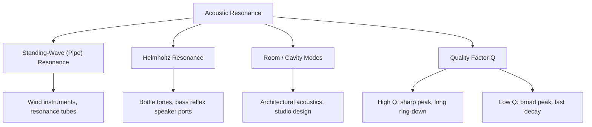

## Acoustic Resonance

### Overview

Acoustic resonance occurs when a sound-producing or sound-transmitting system is driven at, or naturally oscillates at, one of its characteristic natural frequencies, resulting in a dramatic amplification of vibration amplitude. This phenomenon governs the tonal behavior of musical instruments, the design of architectural acoustic spaces, and a wide range of engineering applications, and it provides the physical foundation for understanding how bounded acoustic systems selectively reinforce specific frequencies while suppressing others.

### The Physics of Resonance

#### Natural Frequencies and Driven Oscillation

Every bounded acoustic system — an air column, a stretched membrane, a solid resonant cavity — possesses a discrete set of natural (resonant) frequencies determined by its geometry, boundary conditions, and the speed of sound within it (or, for solids, the relevant elastic wave speed). When an external periodic driving force (a vibrating reed, a plucked string, ambient noise) contains energy at or near one of these natural frequencies, the system responds with a greatly amplified oscillation — this amplification is the defining signature of resonance.

#### Driven Damped Harmonic Oscillator Model

The general mathematical framework for resonance, applicable to a single acoustic mode, is the driven damped harmonic oscillator:

$$m\ddot{x} + b\dot{x} + kx = F_0\cos(\omega t)$$

with steady-state amplitude:

$$A(\omega) = \frac{F_0}{\sqrt{m^2(\omega_0^2-\omega^2)^2 + b^2\omega^2}}$$

where $\omega_0 = \sqrt{k/m}$ is the natural (undamped) angular frequency. This amplitude is maximized when the driving frequency $\omega$ is close to $\omega_0$, and the sharpness of this peak is governed by the damping coefficient $b$.

### Quality Factor (Q)

#### Definition

The quality factor $Q$ quantifies how sharply peaked (and how long-lived) a resonance is:

$$Q = \frac{\omega_0}{\Delta\omega}$$

where $\Delta\omega$ is the full width at half maximum (FWHM) of the resonance peak in the power (or intensity) response. Equivalently, $Q$ can be expressed in terms of energy:

$$Q = 2\pi \frac{\text{energy stored}}{\text{energy lost per cycle}}$$

#### Physical Interpretation

- **High $Q$** (light damping): a sharp, narrow resonance peak, slow energy decay, and many oscillation cycles before the amplitude decays substantially (e.g., a well-made bell or tuning fork, which "rings" for a long time after being struck)
- **Low $Q$** (heavy damping): a broad, shallow resonance peak, rapid energy dissipation, and few oscillations before decay (e.g., a padded or heavily damped surface, which produces a dull "thud" rather than a ringing tone)

#### Decay Envelope

For a high-$Q$ system left to oscillate freely after being excited (no continued driving), the amplitude decays exponentially:

$$A(t) = A_0 e^{-t/\tau}, \qquad \tau \approx \frac{2Q}{\omega_0}$$

giving a direct, testable relationship between $Q$ and the observed "ring-down time" of a resonant acoustic system.

### Illustrative Diagram: Resonance Curve for Different Q Values (svg_diagram)

<svg xmlns="http://www.w3.org/2000/svg" viewBox="0 0 460 280">
<rect width="460" height="280" fill="#ffffff" />
<text x="230" y="20" font-size="14" text-anchor="middle" font-family="sans-serif" font-weight="bold">Resonance Curves: Amplitude vs Driving Frequency (svg_diagram)</text>
<line x1="50" y1="230" x2="430" y2="230" stroke="#333" stroke-width="1.5" />
<line x1="240" y1="230" x2="240" y2="40" stroke="#333" stroke-width="1.5" />
<text x="240" y="250" font-size="11" text-anchor="middle" font-family="sans-serif">ω₀ (resonant freq)</text>
<text x="20" y="135" font-size="11" font-family="sans-serif" transform="rotate(-90 20 135)">Amplitude</text>
<path d="M 60 225 Q 200 220, 240 60 Q 280 220, 420 225" fill="none" stroke="#1a5fb4" stroke-width="2.5" />
<text x="330" y="90" font-size="10" font-family="sans-serif" fill="#1a5fb4">High Q</text>
<path d="M 60 225 Q 180 190, 240 120 Q 300 190, 420 225" fill="none" stroke="#2ec27e" stroke-width="2.5" />
<text x="330" y="150" font-size="10" font-family="sans-serif" fill="#2ec27e">Medium Q</text>
<path d="M 60 225 Q 150 205, 240 175 Q 330 205, 420 225" fill="none" stroke="#c64600" stroke-width="2.5" />
<text x="330" y="200" font-size="10" font-family="sans-serif" fill="#c64600">Low Q</text>
</svg>

### Resonance in Air Columns

#### Open and Closed Pipe Resonances

As established under standing waves, air columns support resonance at frequencies determined by their length and end conditions:

$$f_n = \frac{nv}{2L} \ (\text{open-open, all } n), \qquad f_n = \frac{nv}{4L}\ (\text{closed-open, odd } n \text{ only})$$

A resonance tube experiment — where a tuning fork of known frequency is held above a water-filled tube of adjustable air-column length — directly demonstrates acoustic resonance: as the air column length is varied, sound intensity dramatically increases at specific lengths corresponding to $L = \lambda/4, 3\lambda/4, 5\lambda/4, \dots$, allowing an experimental determination of the wavelength (and hence, given the known frequency, the speed of sound).

#### Worked Example: Resonance Tube Determination of Sound Speed

**Setup**: A tuning fork of $f = 512\ \text{Hz}$ produces successive resonances (loud points) in an adjustable closed-open air column at lengths $L_1 = 16.2\ \text{cm}$ and $L_2 = 49.5\ \text{cm}$.

**Identifying successive resonances**: For a closed-open tube, successive resonant lengths differ by $\lambda/2$ (moving from the $n$-th to $(n+2)$-th odd harmonic):

$$L_2 - L_1 = \frac{\lambda}{2} \implies \lambda = 2(L_2-L_1) = 2(49.5-16.2) = 66.6\ \text{cm} = 0.666\ \text{m}$$

**Determining sound speed**:

$$v = f\lambda = (512)(0.666) \approx 341\ \text{m/s}$$

This value is consistent with the expected speed of sound in air near room temperature, illustrating a classic laboratory application of acoustic resonance for precision measurement — and notably, this method does not require knowing the exact end-correction offset, since it relies only on the *difference* between successive resonant lengths.

### Helmholtz Resonance

#### Physical Setup

A Helmholtz resonator consists of a rigid cavity of volume $V$ connected to the outside air via a narrow neck of length $L$ and cross-sectional area $S$. Unlike the standing-wave pipe resonances above, the Helmholtz resonance treats the air in the neck as a lumped oscillating mass, and the air in the cavity as a lumped compressible "spring," analogous to a simple mass-spring oscillator.

#### Resonant Frequency

Modeling the neck's air plug as mass $m = \rho S L$ (with $\rho$ the air density) oscillating against the effective spring constant of the compressed cavity air, the resonant frequency is:

$$f_H = \frac{v}{2\pi}\sqrt{\frac{S}{VL}}$$

where $v$ is the speed of sound. [Inference] Practical implementations often use an effective neck length $L_{\text{eff}} = L + \Delta L$ that includes an end correction (typically $\Delta L \approx 1.7r$ for a neck of radius $r$, accounting for air motion just outside the physical neck opening) for improved accuracy, though the exact correction factor varies somewhat between different reference treatments.

#### Everyday Examples

The characteristic low-pitched tone produced by blowing across the top of an empty bottle is a direct demonstration of Helmholtz resonance, with the bottle's body acting as the cavity and its neck as the oscillating air plug; similarly, this principle underlies bass reflex ports in loudspeaker cabinet design, where a tuned port reinforces low-frequency output by resonating at a frequency chosen to complement the speaker driver's natural response.

### Resonance in Room and Architectural Acoustics

#### Room Modes

An enclosed room behaves as a three-dimensional resonant cavity, supporting standing-wave "room modes" at frequencies determined by its dimensions $(L_x, L_y, L_z)$:

$$f_{n_x,n_y,n_z} = \frac{v}{2}\sqrt{\left(\frac{n_x}{L_x}\right)^2 + \left(\frac{n_y}{L_y}\right)^2 + \left(\frac{n_z}{L_z}\right)^2}$$

These modes can cause uneven bass response (certain frequencies reinforced at specific locations, others attenuated) in small rooms such as recording studios and home theaters, a phenomenon of significant practical concern in acoustic design.

#### Reverberation and Absorption

[Inference] While closely related to resonance, reverberation time (how long sound persists in a room after the source stops) is governed by a more complex combination of room volume, total absorptive surface area, and the absorption coefficients of room materials (commonly estimated via the Sabine equation in standard architectural acoustics treatments), rather than by a single resonant $Q$ value; nonetheless, the same underlying physics of energy storage versus energy dissipation connects both concepts.

### Resonance in Musical Instruments

#### Wind Instruments

Brass and woodwind instruments rely fundamentally on acoustic resonance in their air columns: the player's reed or lip vibration excites a broad range of frequencies, but the instrument's bore geometry (effectively an air column with specific boundary conditions, often modified by tone holes and bell shape) selectively reinforces frequencies matching its resonant modes, producing the characteristic pitch and timbre.

#### String Instrument Resonating Bodies

While the string itself produces the fundamental oscillation (governed by string standing-wave physics, not acoustic air-column resonance), the hollow body of instruments like guitars and violins acts as an **acoustic resonating chamber**, with its own set of resonant air-cavity and structural-panel modes that shape and amplify the radiated sound, contributing significantly to an instrument's characteristic tonal color ("timbre").

#### Vocal Tract Resonance (Formants)

The human vocal tract acts as a variable-geometry acoustic resonator: vocal fold vibration produces a harmonically rich source signal, and the vocal tract's resonant frequencies (called **formants**) selectively reinforce certain harmonics over others, and the specific formant pattern (shaped by tongue, jaw, and lip position) is what distinguishes different vowel sounds — the physical basis discussed earlier in connection with the "helium voice" effect.

### Diagram: Acoustic Resonance Types Overview

### Destructive and Structural Resonance (Broader Context)

#### Beyond Purely Acoustic Systems

While this entry focuses on acoustic (sound-related) resonance, the same underlying physics of driven oscillation applies to mechanical structural resonance — famously implicated in incidents such as the 1940 Tacoma Narrows Bridge collapse, though [Inference] the precise mechanism of that particular collapse (aeroelastic flutter versus simple forced resonance) has been the subject of some technical debate among engineers and physicists, with aeroelastic flutter now generally considered the more accurate description by structural engineering specialists rather than simple resonant amplification alone. The core resonance concept (amplified response near a natural frequency) nonetheless remains directly relevant and pedagogically connected to the acoustic cases discussed above.

### Common Pitfalls

- **Assuming resonance always requires an external driving force at exactly the natural frequency**: while peak amplification occurs precisely at $\omega = \omega_0$, significant amplification still occurs for driving frequencies reasonably close to $\omega_0$, with the exact bandwidth of significant response determined by $Q$.
- **Confusing pipe resonance with Helmholtz resonance**: pipe resonance involves distributed standing waves along the pipe's length (requiring $L$ comparable to $\lambda$), while Helmholtz resonance treats the system as a lumped mass-spring oscillator (valid when the cavity dimensions are much smaller than the relevant wavelength) — these are distinct physical regimes with different governing formulas.
- **Neglecting end corrections in pipe resonance calculations**: as with standing waves generally, the effective acoustic length of an open pipe end exceeds its physical length, introducing systematic error if ignored in precision calculations (though, as shown in the resonance-tube worked example, measuring the *difference* between successive resonances elegantly sidesteps this issue).
- **Assuming all "resonance" phenomena in engineering are acoustic**: resonance is a general wave/oscillator phenomenon; structural, electrical (LC circuit), and mechanical resonance all share the same mathematical framework but involve entirely different physical energy-storage mechanisms.

### Related Topics

- Standing waves and harmonics
- The mechanical wave equation
- Driven and damped harmonic oscillators
- Quality factor and bandwidth in oscillatory systems
- Helmholtz resonators and their engineering applications
- Room acoustics and the Sabine reverberation equation
- Musical instrument acoustics and timbre
- Formants and vocal tract resonance in speech production