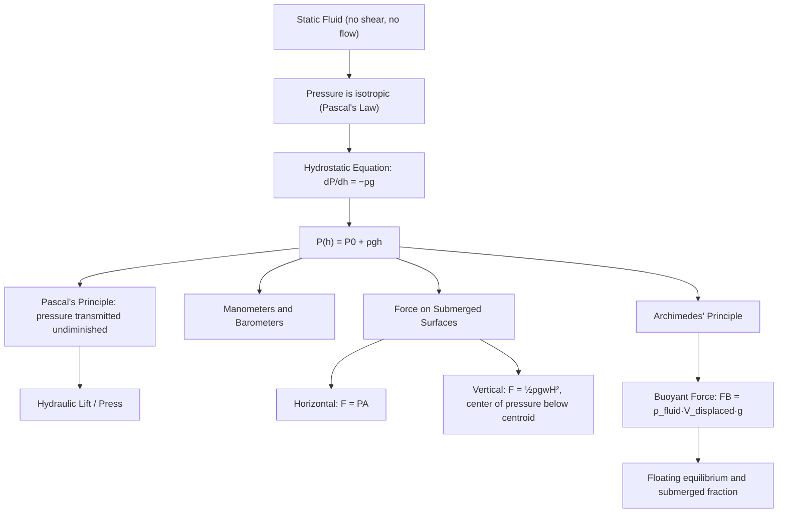

## Fluid Statics and Pressure

### Overview

Fluid statics is the study of fluids at rest, in which no shear stresses exist and pressure — a scalar quantity representing force per unit area — is the sole mechanism of internal stress transmission. This field establishes the foundational principles governing pressure distribution within static fluids, buoyancy, and the forces fluids exert on submerged and immersed surfaces, forming the basis for understanding hydraulics, barometry, ship stability, and dam design.

### The Concept of Pressure

#### Definition

Pressure is defined as the magnitude of the normal force exerted per unit area:

$$P = \frac{F}{A}$$

with SI units of pascals ($1\ \text{Pa} = 1\ \text{N/m}^2$). At a point within a static fluid, pressure is defined via the limiting ratio as the area shrinks to a point:

$$P = \lim_{\Delta A \to 0} \frac{\Delta F}{\Delta A}$$

#### Pascal's Law: Isotropy of Pressure

A fundamental result of fluid statics is that pressure at any point in a static fluid is **isotropic** — it acts equally in all directions, independent of the orientation of the surface on which it is measured. This can be demonstrated by considering the force balance on an infinitesimal fluid wedge (a small triangular prism element) in equilibrium: applying Newton's second law to this element and taking the limit as its dimensions shrink to zero eliminates the (higher-order, vanishing) weight term, leaving the direct result $P_x = P_y = P_z$ for the pressures on each face, confirming isotropy regardless of orientation.

### Pressure Variation with Depth

#### Derivation for an Incompressible Fluid

Consider a static fluid of uniform density $\rho$ in a uniform gravitational field $g$. Analyzing the vertical force balance on a thin horizontal fluid slab of thickness $dz$ and cross-sectional area $A$, located at depth $z$ below the surface:

$$P(z+dz)A - P(z)A - \rho A\, dz \, g = 0$$

(pressure from below pushes up, pressure from above and weight push down). This simplifies to the fundamental hydrostatic differential equation:

$$\frac{dP}{dz} = \rho g$$

(taking $z$ as depth, increasing downward) or equivalently, in terms of height $h$ measured upward:

$$\frac{dP}{dh} = -\rho g$$

#### Integrated Form for Constant Density

For an incompressible fluid ($\rho = \text{constant}$), direct integration gives:

$$P(h) = P_0 + \rho g h$$

where $P_0$ is the pressure at the reference surface (e.g., atmospheric pressure at a liquid's free surface) and $h$ is the depth below that reference. This is the standard **hydrostatic pressure equation**, showing that pressure increases linearly with depth, independent of the container's shape or cross-sectional area — a result sometimes called the **hydrostatic paradox**, since the total force on a container's base can differ dramatically from its weight of contained fluid despite depth-pressure being shape-independent.

### Illustrative Diagram: Hydrostatic Pressure with Depth (svg_diagram)

<svg xmlns="http://www.w3.org/2000/svg" viewBox="0 0 420 300">
<rect width="420" height="300" fill="#ffffff" />
<text x="210" y="20" font-size="14" text-anchor="middle" font-family="sans-serif" font-weight="bold">Hydrostatic Pressure vs Depth (svg_diagram)</text>
<rect x="60" y="50" width="140" height="200" fill="#cfe8ff" stroke="#1a5fb4" stroke-width="1.5" />
<line x1="60" y1="50" x2="200" y2="50" stroke="#1a5fb4" stroke-width="2" />
<text x="130" y="42" font-size="10" text-anchor="middle" font-family="sans-serif">surface (P₀)</text>
<line x1="130" y1="50" x2="130" y2="250" stroke="#c64600" stroke-width="1" stroke-dasharray="3,3" />
<line x1="70" y1="100" x2="190" y2="100" stroke="#2ec27e" stroke-width="1.5" />
<line x1="70" y1="180" x2="190" y2="180" stroke="#e5a50a" stroke-width="1.5" />
<text x="205" y="100" font-size="10" font-family="sans-serif">P = P₀ + ρg(h₁)</text>
<text x="205" y="180" font-size="10" font-family="sans-serif">P = P₀ + ρg(h₂)</text>
<line x1="250" y1="50" x2="250" y2="250" stroke="#333" stroke-width="1" />
<path d="M 250 50 L 380 250" stroke="#c64600" stroke-width="2.5" fill="none" />
<text x="340" y="70" font-size="10" font-family="sans-serif">P(depth)</text>
<text x="230" y="270" font-size="10" font-family="sans-serif">depth →</text>
<text x="210" y="290" font-size="11" text-anchor="middle" font-family="sans-serif" fill="#555">Pressure depends only on depth, not container shape (hydrostatic paradox)</text>
</svg>

### Gauge Pressure vs. Absolute Pressure

#### Definitions

- **Absolute pressure**: pressure measured relative to a perfect vacuum, $P_{\text{abs}} = P_0 + \rho g h$
- **Gauge pressure**: pressure measured relative to local atmospheric pressure, $P_{\text{gauge}} = P_{\text{abs}} - P_{\text{atm}}$

Most everyday pressure gauges (tire gauges, blood pressure monitors) read gauge pressure, since they are referenced against the ambient atmosphere rather than vacuum. Standard atmospheric pressure is $P_{\text{atm}} \approx 101{,}325\ \text{Pa} = 101.325\ \text{kPa} \approx 1\ \text{atm}$.

### Pascal's Principle

#### Statement

Pascal's principle states that a pressure change applied to an enclosed, incompressible fluid is transmitted undiminished to every point of the fluid and to the walls of its container. This follows directly from the hydrostatic pressure relation: if $P_0$ (the reference pressure, e.g., applied externally at a piston) increases by $\Delta P_0$, then $P(h) = P_0 + \rho g h$ increases by exactly the same $\Delta P_0$ at every depth $h$, since $\rho g h$ is unaffected.

#### Application: The Hydraulic Lift

For a hydraulic system with two connected pistons of cross-sectional areas $A_1$ (small) and $A_2$ (large), applying force $F_1$ to the small piston produces pressure $P = F_1/A_1$, which is transmitted undiminished to the large piston, producing output force:

$$F_2 = P \cdot A_2 = F_1 \frac{A_2}{A_1}$$

This provides substantial mechanical advantage ($F_2 \gg F_1$ when $A_2 \gg A_1$) — the operating principle behind hydraulic car jacks, hydraulic brakes, and industrial hydraulic presses. Notably, this mechanical advantage does not violate energy conservation: the small piston must move a proportionally larger distance ($d_1 = d_2 \cdot A_2/A_1$) to conserve the incompressible fluid's volume, so $F_1 d_1 = F_2 d_2$ (work input equals work output, in the idealized frictionless case).

### Measuring Pressure: Manometers and Barometers

#### The Mercury Barometer

A simple mercury barometer consists of an inverted, mercury-filled tube with its open end submerged in a mercury reservoir, sealed at the top (with a near-vacuum, "Torricellian vacuum," above the mercury column). The height of the mercury column directly measures atmospheric pressure:

$$P_{\text{atm}} = \rho_{\text{Hg}} g h$$

At standard atmospheric pressure, $h \approx 0.760\ \text{m} = 760\ \text{mm}$, giving rise to the traditional pressure unit "mmHg" (millimeters of mercury), with $1\ \text{atm} = 760\ \text{mmHg}$.

#### The U-Tube Manometer

A U-tube manometer measures gauge pressure by connecting one side to the pressure source and leaving the other side open to atmosphere, with the height difference $\Delta h$ between the two liquid columns giving:

$$P_{\text{gauge}} = \rho g \Delta h$$

This provides a simple, direct mechanical method for pressure measurement widely used in laboratory and industrial settings.

### Worked Example: Pressure at Ocean Depth

**Setup**: Find the absolute pressure at a depth of $h = 200\ \text{m}$ in seawater ($\rho_{\text{seawater}} \approx 1025\ \text{kg/m}^3$), given $P_0 = P_{\text{atm}} = 101{,}325\ \text{Pa}$ and $g = 9.81\ \text{m/s}^2$.

**Calculation**:

$$P = P_0 + \rho g h = 101{,}325 + (1025)(9.81)(200)$$

$$P = 101{,}325 + 2{,}011{,}050 = 2{,}112{,}375\ \text{Pa} \approx 2.11\ \text{MPa} \approx 20.9\ \text{atm}$$

This roughly 21-fold increase over atmospheric pressure at just 200 m depth illustrates why deep-sea engineering (submersibles, underwater habitats) requires substantial structural reinforcement even at moderate ocean depths.

### Buoyancy and Archimedes' Principle

#### Statement

Archimedes' principle states that a body fully or partially submerged in a fluid experiences an upward buoyant force equal to the weight of the fluid displaced by the body:

$$F_B = \rho_{\text{fluid}} \, V_{\text{displaced}} \, g$$

#### Derivation from Pressure Distribution

This result follows directly from integrating the (depth-dependent) hydrostatic pressure over the entire submerged surface of the body: since pressure increases with depth, the upward force on the bottom surface of a submerged object exceeds the downward force on its top surface, and the net imbalance — computed via the divergence theorem applied to the pressure field — yields exactly $\rho_{\text{fluid}} V_{\text{displaced}} g$, directed vertically upward, regardless of the object's shape.

#### Floating Equilibrium

For a floating object in equilibrium, the buoyant force exactly balances gravity:

$$\rho_{\text{fluid}} V_{\text{displaced}} g = \rho_{\text{object}} V_{\text{object}} g \implies \frac{V_{\text{displaced}}}{V_{\text{object}}} = \frac{\rho_{\text{object}}}{\rho_{\text{fluid}}}$$

This ratio directly determines the fraction of an object's volume submerged — for example, ice ($\rho \approx 917\ \text{kg/m}^3$) floating in seawater ($\rho \approx 1025\ \text{kg/m}^3$) has approximately $917/1025 \approx 89.5\%$ of its volume submerged, the well-known basis of the "tip of the iceberg" phenomenon.

### Worked Example: Buoyancy Calculation

**Setup**: A solid block of volume $V = 0.05\ \text{m}^3$ and density $\rho_{\text{block}} = 700\ \text{kg/m}^3$ is fully submerged in water ($\rho_{\text{water}} = 1000\ \text{kg/m}^3$).

**Buoyant force**:

$$F_B = \rho_{\text{water}} V g = (1000)(0.05)(9.81) = 490.5\ \text{N}$$

**Weight of the block**:

$$W = \rho_{\text{block}} V g = (700)(0.05)(9.81) = 343.35\ \text{N}$$

**Net force** (upward, since $F_B > W$):

$$F_{\text{net}} = F_B - W = 490.5 - 343.35 = 147.15\ \text{N (upward)}$$

Since buoyancy exceeds weight, the block accelerates upward and will rise to float partially above the surface, consistent with its density being less than that of water.

### Force on Submerged Surfaces

#### Force on a Horizontal Submerged Surface

For a flat horizontal surface at uniform depth $h$, pressure is uniform across the surface, so total force is simply:

$$F = PA = (P_0 + \rho g h)A$$

#### Force on a Vertical Submerged Surface (e.g., a Dam Wall)

For a vertical surface, pressure varies with depth across the surface, requiring integration. For a vertical rectangular surface of width $w$ extending from the free surface ($h=0$) down to depth $H$:

$$F = \int_0^H \rho g h \cdot w\, dh = \frac{1}{2}\rho g w H^2$$

(using gauge pressure, i.e., ignoring the uniform atmospheric contribution which acts on both sides and cancels for many practical dam/wall calculations). This quadratic dependence on depth $H$ is a critical design consideration in dam engineering — doubling the water depth quadruples the total hydrostatic force on a retaining wall.

#### Center of Pressure

Because pressure increases with depth, the resultant force on a vertical surface acts not at the geometric centroid but at a **center of pressure** located below the centroid, at a depth of $\frac{2}{3}H$ for the simple rectangular case above (found by taking the moment of the pressure distribution about the surface and dividing by total force) — an important consideration for correctly modeling the overturning torque on retaining structures.

### Diagram: Fluid Statics Concept Map

### Fluid Statics in a Non-Uniform Gravitational or Accelerating Frame

#### Accelerating Fluid Container

[Inference] For a fluid in a container undergoing uniform linear acceleration $a$ (a standard extension topic), the free surface tilts to a constant angle satisfying $\tan\theta = a/g$, and the effective hydrostatic pressure gradient becomes $\nabla P = \rho(\mathbf{g} - \mathbf{a})$; this generalization is a standard technique in engineering fluid statics courses for analyzing fluids in accelerating vehicles or rotating containers (the latter producing a paraboloidal free surface), though the specific surface shape and pressure distribution depend on the particular acceleration profile involved.

### Common Pitfalls

- **Assuming pressure depends on the shape or volume of the container**: the hydrostatic paradox demonstrates that pressure at a given depth depends only on depth and fluid density, not on the container's shape, cross-sectional area, or total fluid volume.
- **Confusing gauge pressure and absolute pressure**: forgetting to add (or inappropriately adding) atmospheric pressure is a very common source of numerical error; the distinction must be tracked carefully based on what a given instrument or problem actually specifies.
- **Applying the buoyancy formula using the object's density instead of the fluid's density**: the buoyant force depends on the density of the **displaced fluid**, not the submerged object's own density (which instead determines the object's weight).
- **Treating force on a vertical surface as simply (pressure at the centroid) × area without accounting for center of pressure location**: while this often correctly gives the *total force* (since pressure varies linearly and the centroid captures the average), the *point of application* (needed for torque/moment calculations) is generally different from the centroid and must be computed separately.

### Related Topics

- Archimedes' principle and buoyancy
- Pascal's principle and hydraulic systems
- Fluid dynamics and the continuity equation
- Bernoulli's equation and energy conservation in flowing fluids
- Surface tension and capillary action
- Atmospheric pressure and barometric formula (variable-density case)
- Center of pressure and structural design of dams/tanks
- Stability of floating bodies (metacentric height)