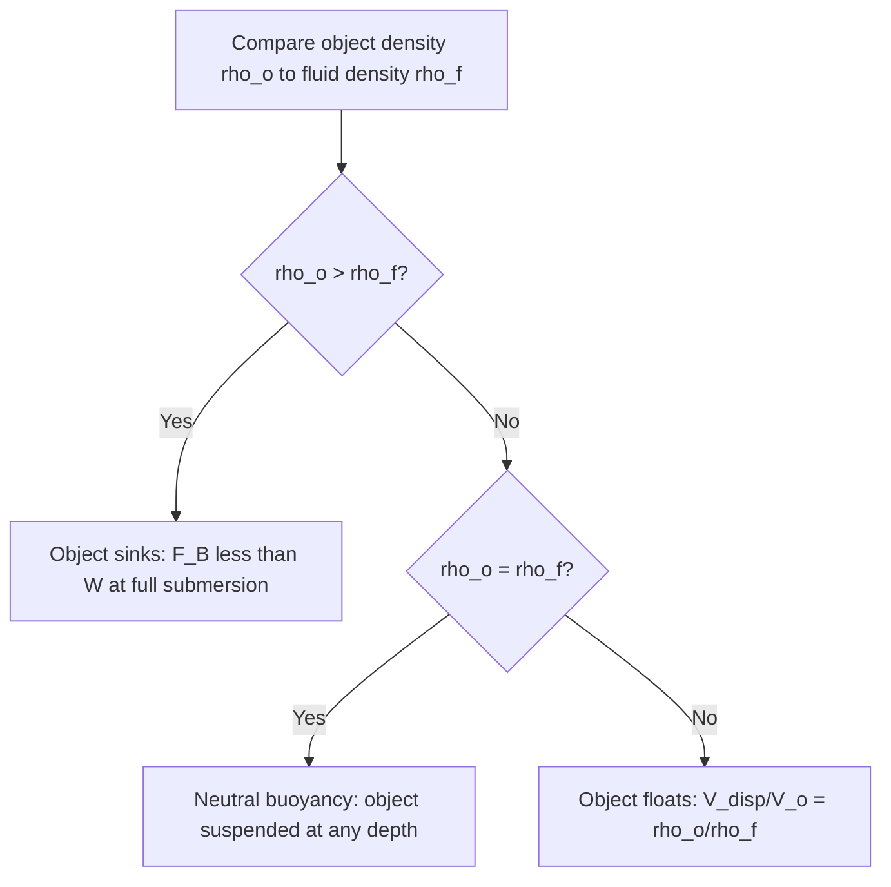

## Buoyancy and Archimedes' Principle

### Definition and Physical Basis

Buoyancy is the upward force exerted by a fluid on a submerged or partially submerged object, arising from the pressure difference between the bottom and top surfaces of the object. Because hydrostatic pressure increases with depth, the fluid pushes upward on the bottom of an object with more force than it pushes downward on the top, producing a net upward force.

Archimedes' Principle states that the buoyant force on an object submerged (fully or partially) in a fluid equals the weight of the fluid displaced by that object.

$$F_B = \rho_f V_{disp} g$$

where:

- $F_B$ = buoyant force (N)
- $\rho_f$ = density of the fluid (kg/m³)
- $V_{disp}$ = volume of fluid displaced (m³)
- $g$ = acceleration due to gravity (9.81 m/s²)

### Derivation from Hydrostatic Pressure

Consider a rectangular block of height $h$ and cross-sectional area $A$ fully submerged in a fluid of density $\rho_f$, with its top face at depth $h_1$ and bottom face at depth $h_2 = h_1 + h$.

Pressure at the top face:

$$P_1 = \rho_f g h_1$$

Pressure at the bottom face:

$$P_2 = \rho_f g h_2$$

Force on top face (downward):

$$F_1 = P_1 A = \rho_f g h_1 A$$

Force on bottom face (upward):

$$F_2 = P_2 A = \rho_f g h_2 A$$

Net upward force:

$$F_B = F_2 - F_1 = \rho_f g A (h_2 - h_1) = \rho_f g A h = \rho_f g V$$

Since $V = Ah$ is the volume of the block (equal to the displaced fluid volume), this confirms $F_B = \rho_f V g$. The horizontal pressure forces on the side faces cancel by symmetry, leaving only the vertical net force.

### Floating, Sinking, and Suspension Conditions

The behavior of an object in a fluid depends on the relationship between its average density $\rho_o$ and the fluid density $\rho_f$:

- **Sinks**: $\rho_o > \rho_f$ — weight exceeds the maximum possible buoyant force (object fully submerged).
- **Floats (partially submerged)**: $\rho_o < \rho_f$ — object rises until displaced weight equals object weight, achieving equilibrium.
- **Neutrally buoyant (suspended)**: $\rho_o = \rho_f$ — object remains suspended at any depth, since buoyant force equals weight everywhere in the fluid.

For a floating object, equilibrium requires:

$$\rho_o V_o g = \rho_f V_{disp} g$$

$$V_{disp} = \frac{\rho_o}{\rho_f} V_o$$

The fraction of the object's volume submerged equals the ratio of densities:

$$\frac{V_{disp}}{V_o} = \frac{\rho_o}{\rho_f}$$

**Example**: Ice ($\rho_o \approx 917 \text{ kg/m}^3$) floating in seawater ($\rho_f \approx 1025 \text{ kg/m}^3$):

$$\frac{V_{disp}}{V_o} = \frac{917}{1025} \approx 0.895$$

Approximately 89.5% of the iceberg's volume is submerged, leaving about 10.5% visible above the surface.

### Apparent Weight

The apparent weight of an object submerged in a fluid is its true weight minus the buoyant force:

$$W_{apparent} = W_{true} - F_B = m g - \rho_f V_{disp} g$$

This is the basis for measuring density via the Archimedes' method: an object weighed in air and then weighed while submerged in a fluid of known density yields:

$$\rho_o = \frac{W_{air}}{W_{air} - W_{submerged}} \rho_f$$

**Example calculation**: A metal object weighs 50 N in air and 44 N when fully submerged in water ($\rho_f = 1000 \text{ kg/m}^3$).

Buoyant force: $F_B = 50 - 44 = 6\text{ N}$

Displaced volume: $V_{disp} = \dfrac{F_B}{\rho_f g} = \dfrac{6}{1000 \times 9.81} \approx 6.116 \times 10^{-4}\text{ m}^3$

Object density: $\rho_o = \dfrac{W_{air}}{F_B}\rho_f = \dfrac{50}{6}\times 1000 \approx 8333\text{ kg/m}^3$

This value is consistent with a metal such as steel or brass alloy [Inference — exact match depends on precise composition and temperature].

### Stability of Floating Bodies

Floating stability depends on the relative positions of the **center of gravity (G)** and the **center of buoyancy (B)**, which is the centroid of the displaced fluid volume.

- If the object tilts, the center of buoyancy shifts as the submerged shape changes.
- The **metacenter (M)** is the point where the line of action of the buoyant force intersects the object's original vertical axis after a small tilt.
- **Stable equilibrium**: M is above G (metacentric height $GM > 0$) — a restoring torque returns the object to equilibrium.
- **Unstable equilibrium**: M is below G ($GM < 0$) — the tilt torque increases, capsizing the object.
- **Neutral equilibrium**: M coincides with G.

This principle governs the design of ship hulls, where a low center of gravity and wide beam increase the metacentric height and improve stability.

### Diagram: Force Balance on a Submerged/Floating Object (svg_diagram)

<svg xmlns="http://www.w3.org/2000/svg" viewBox="0 0 500 320">
<text x="250" y="25" font-size="16" text-anchor="middle" font-weight="bold">Buoyancy Force Balance (svg_diagram)</text>
<rect x="0" y="120" width="500" height="180" fill="#cfe8f7" opacity="0.6" />
<line x1="0" y1="120" x2="500" y2="120" stroke="#2a6f97" stroke-width="2" />
<text x="10" y="115" font-size="12" fill="#2a6f97">Fluid surface</text>
<rect x="200" y="150" width="100" height="100" fill="#8d6e63" stroke="#3e2723" stroke-width="2" />
<text x="250" y="205" font-size="12" text-anchor="middle" fill="#fff">Object</text>
<line x1="250" y1="150" x2="250" y2="80" stroke="black" stroke-width="2" marker-end="url(#arrow)" />
<text x="260" y="100" font-size="13">W (weight, mg)</text>
<line x1="250" y1="250" x2="250" y2="320" stroke="black" stroke-width="2" />
<line x1="180" y1="250" x2="180" y2="180" stroke="#0077b6" stroke-width="2" marker-end="url(#arrow)" />
<text x="110" y="200" font-size="13" fill="#0077b6">F_B (buoyant force)</text>
<text x="250" y="290" font-size="11" text-anchor="middle">Equilibrium: F_B = W</text>
</svg>

### Diagram: Density Regime Decision Flow

### Applications

- **Hydrometers**: measure fluid density by observing the submersion depth of a calibrated floating device; calibrated using $\rho_f = \dfrac{m}{V_{disp}}$.
- **Submarines**: control buoyancy by adjusting ballast tank water volume to change average density relative to seawater, enabling controlled ascent, descent, or neutral hover.
- **Hot air balloons**: apply an analogous principle in a fluid (air) rather than a liquid; buoyant force equals the weight of air displaced by the balloon envelope, with lift generated when heated (less dense) air inside displaces cooler ambient air.
- **Hulls and ship design**: naval architecture relies on metacentric height calculations to ensure stability under load distribution and wave-induced tilting.
- **Cartesian divers and density-based separation**: used in fluid density experiments and industrial mineral/material sorting (float-sink separation).

### Common Misconceptions

- Buoyant force depends on the density and volume of the *fluid displaced*, not on the object's mass or shape directly (shape only matters insofar as it determines displaced volume).
- An object does not need to be denser than a fluid to experience buoyant force — buoyant force acts on any submerged or partially submerged object, even one that is less dense and floats.
- Archimedes' Principle applies to gases as well as liquids; the same equation form holds using the gas's density, though ambient buoyant effects are typically negligible for dense solids in air.

**Related Topics**:

- Hydrostatic pressure and Pascal's Principle
- Fluid statics and pressure-depth relationships
- Bernoulli's Principle and fluid dynamics
- Center of mass and rotational equilibrium
- Metacentric height and naval architecture stability analysis
- Surface tension and capillary effects (secondary forces in partial submersion)