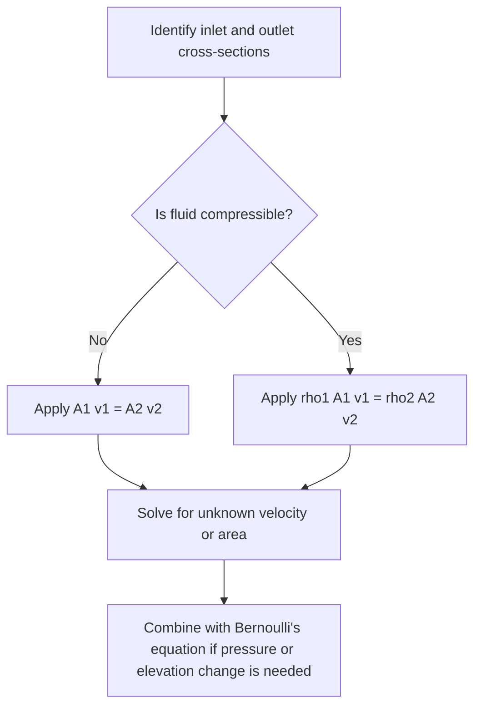

## The Continuity Equation

### Definition and Physical Basis

The continuity equation is a mathematical statement of the conservation of mass applied to fluid flow. For fluid moving through a conduit (such as a pipe) with no sources or sinks, mass entering a control volume per unit time must equal mass leaving it, assuming no accumulation. This principle links a fluid's velocity to the cross-sectional area through which it flows.

### General Form (Compressible Flow)

For a fluid of varying density $\rho$ flowing through a pipe of varying cross-sectional area $A$:

$$\rho_1 A_1 v_1 = \rho_2 A_2 v_2$$

where:

- $\rho$ = fluid density (kg/m³)
- $A$ = cross-sectional area (m²)
- $v$ = flow velocity (m/s)

The product $\rho A v$ represents the mass flow rate $\dot{m}$ (kg/s), which remains constant along the flow path:

$$\dot{m} = \rho A v = \text{constant}$$

### Simplified Form (Incompressible Flow)

For incompressible fluids (most liquids under normal conditions, where $\rho$ is treated as constant), the density terms cancel, yielding the volumetric continuity equation:

$$A_1 v_1 = A_2 v_2$$

This states that the volumetric flow rate $Q = Av$ (m³/s) is constant throughout the pipe:

$$Q = A_1 v_1 = A_2 v_2 = \text{constant}$$

This is the most commonly applied form in introductory fluid mechanics and is valid for liquids at typical flow speeds, where compressibility effects are negligible.

### Derivation from Mass Conservation

Consider a fluid element moving through a pipe segment between two cross-sections, area $A_1$ (inlet) and $A_2$ (outlet), over a small time interval $\Delta t$.

Volume entering at section 1:

$$\Delta V_1 = A_1 v_1 \Delta t$$

Volume leaving at section 2:

$$\Delta V_2 = A_2 v_2 \Delta t$$

Mass entering:

$$\Delta m_1 = \rho_1 A_1 v_1 \Delta t$$

Mass leaving:

$$\Delta m_2 = \rho_2 A_2 v_2 \Delta t$$

For steady flow with no mass accumulation within the control volume, $\Delta m_1 = \Delta m_2$, giving:

$$\rho_1 A_1 v_1 \Delta t = \rho_2 A_2 v_2 \Delta t$$

$$\rho_1 A_1 v_1 = \rho_2 A_2 v_2$$

Dividing both sides by constant $\rho$ (incompressible case) recovers $A_1 v_1 = A_2 v_2$.

### Differential Form (General 3D Flow)

For a general, unsteady, compressible flow field, mass conservation is expressed via the continuity partial differential equation, derived from the divergence theorem applied to an infinitesimal control volume:

$$\frac{\partial \rho}{\partial t} + \nabla \cdot (\rho \vec{v}) = 0$$

where $\nabla \cdot (\rho \vec{v})$ is the divergence of the mass flux vector field. For steady, incompressible flow, $\dfrac{\partial \rho}{\partial t} = 0$ and $\rho$ is constant, reducing this to:

$$\nabla \cdot \vec{v} = 0$$

This is the divergence-free (solenoidal) velocity field condition used extensively in incompressible fluid dynamics, including Navier–Stokes formulations.

### Example Calculation

Water flows through a pipe that narrows from a radius of 5 cm to a radius of 2 cm. If the velocity in the wider section is 1.5 m/s, find the velocity in the narrower section.

Cross-sectional areas:

$$A_1 = \pi r_1^2 = \pi (0.05)^2 \approx 7.854 \times 10^{-3}\text{ m}^2$$

$$A_2 = \pi r_2^2 = \pi (0.02)^2 \approx 1.257 \times 10^{-3}\text{ m}^2$$

Applying continuity:

$$v_2 = \frac{A_1 v_1}{A_2} = \frac{7.854 \times 10^{-3} \times 1.5}{1.257 \times 10^{-3}} \approx 9.375\text{ m/s}$$

The fluid speeds up by a factor equal to the ratio of the areas ($(r_1/r_2)^2 = 6.25$), demonstrating that flow velocity is inversely proportional to cross-sectional area.

### Relationship to Bernoulli's Equation

The continuity equation is typically paired with Bernoulli's equation to solve fluid flow problems fully: continuity determines how velocity changes with area, while Bernoulli's equation relates velocity, pressure, and elevation changes along a streamline. Together they allow computation of pressure differences caused by velocity changes (e.g., in a Venturi meter).

### Diagram: Pipe Narrowing and Velocity Change (svg_diagram)

<svg xmlns="http://www.w3.org/2000/svg" viewBox="0 0 500 220">
<text x="250" y="25" font-size="16" text-anchor="middle" font-weight="bold">Continuity Equation (svg_diagram)</text>
<path d="M20,80 L200,80 L280,120 L480,120 L480,170 L280,170 L200,190 L20,190 Z" fill="#cfe8f7" stroke="#2a6f97" stroke-width="2" />
<line x1="60" y1="100" x2="140" y2="100" stroke="black" stroke-width="2" marker-end="url(#arrow2)" />
<text x="60" y="90" font-size="13">v1 (slow)</text>
<text x="60" y="170" font-size="12">A1 (large area)</text>
<line x1="340" y1="135" x2="420" y2="135" stroke="black" stroke-width="2" marker-end="url(#arrow2)" />
<text x="340" y="125" font-size="13">v2 (fast)</text>
<text x="340" y="160" font-size="12">A2 (small area)</text>
<text x="250" y="210" font-size="12" text-anchor="middle">A1 v1 = A2 v2 (incompressible flow)</text>
</svg>

### Diagram: Continuity Equation Application Flow

### Applications

- **Venturi meters and flow measurement**: narrowing a pipe increases velocity, which (via Bernoulli's equation) decreases pressure, allowing flow rate measurement from pressure differentials.
- **Cardiovascular physiology**: blood flow through narrowing or widening vessels follows continuity principles, relevant to modeling stenosis (arterial narrowing) effects on flow velocity.
- **HVAC and ducting design**: duct cross-sections are sized using continuity to control airflow velocity and static pressure throughout a system.
- **Hydraulic engineering**: channel and pipeline design (e.g., spillways, penstocks) relies on continuity to predict flow behavior at transitions.
- **Nozzle and diffuser design**: continuity underlies the velocity changes in converging (nozzle) and diverging (diffuser) sections, foundational to compressible flow analysis in aerodynamics.

### Common Misconceptions

- The simplified form $A_1v_1 = A_2v_2$ is valid only for incompressible flow; for gases at high speed (approaching or exceeding the speed of sound), density changes become significant and the full compressible form must be used.
- Continuity does not by itself determine pressure; pressure changes require combining continuity with an energy or momentum equation (e.g., Bernoulli's equation).
- A larger pipe area does not imply higher flow rate — flow rate $Q$ is constant along a single pipe; area determines velocity, not the mass or volume flow rate itself.

**Related Topics**:

- Bernoulli's Equation and energy conservation in fluids
- Venturi effect and flow measurement devices
- Navier–Stokes equations and viscous flow
- Reynolds number and laminar vs. turbulent flow regimes
- Compressible flow and the effects of Mach number
- Conservation laws in fluid dynamics (mass, momentum, energy)