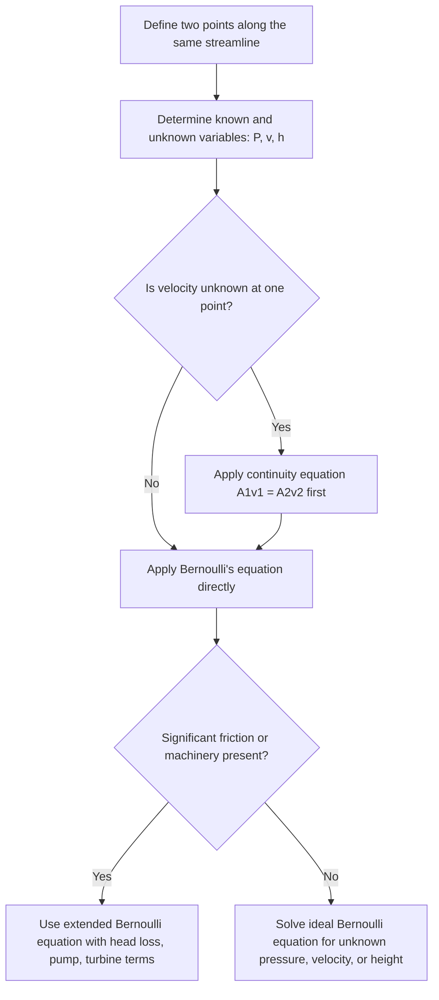

## Bernoulli's Equation

### Definition and Physical Basis

Bernoulli's Equation is a statement of the conservation of energy applied to fluid flow along a streamline. It relates a fluid's pressure, velocity, and elevation, showing that an increase in fluid speed occurs simultaneously with a decrease in pressure or elevation (or both), provided energy is conserved and no external work or heat transfer occurs.

### General Form

For steady, incompressible, non-viscous (inviscid) flow along a streamline:

$$P + \frac{1}{2}\rho v^2 + \rho g h = \text{constant}$$

Between two points along the same streamline:

$$P_1 + \frac{1}{2}\rho v_1^2 + \rho g h_1 = P_2 + \frac{1}{2}\rho v_2^2 + \rho g h_2$$

where:

- $P$ = static pressure (Pa)
- $\rho$ = fluid density (kg/m³, constant for incompressible flow)
- $v$ = flow velocity (m/s)
- $g$ = acceleration due to gravity (9.81 m/s²)
- $h$ = elevation above a reference datum (m)

Each term has units of pressure (Pa) and represents an energy density (energy per unit volume):

- $P$ — **static pressure energy**
- $\frac{1}{2}\rho v^2$ — **dynamic pressure** (kinetic energy per unit volume)
- $\rho g h$ — **hydrostatic pressure** (potential energy per unit volume)

### Derivation from Work-Energy Theorem

Consider a fluid element moving through a streamtube from point 1 (area $A_1$, pressure $P_1$, velocity $v_1$, height $h_1$) to point 2 (area $A_2$, pressure $P_2$, velocity $v_2$, height $h_2$), over a time interval $\Delta t$.

**Work done by pressure forces**:

Work done on the fluid at the inlet (positive, pushing fluid in):

$$W_1 = P_1 A_1 (v_1 \Delta t)$$

Work done by the fluid at the outlet (negative, fluid pushing outward):

$$W_2 = -P_2 A_2 (v_2 \Delta t)$$

By continuity, $A_1 v_1 \Delta t = A_2 v_2 \Delta t = \Delta V$ (equal volume displaced), so net work by pressure:

$$W_{net} = (P_1 - P_2)\Delta V$$

**Change in kinetic energy** of the fluid element of mass $\Delta m = \rho \Delta V$:

$$\Delta KE = \frac{1}{2}\Delta m\, v_2^2 - \frac{1}{2}\Delta m\, v_1^2 = \frac{1}{2}\rho \Delta V (v_2^2 - v_1^2)$$

**Change in potential energy**:

$$\Delta PE = \Delta m\, g h_2 - \Delta m\, g h_1 = \rho \Delta V\, g(h_2 - h_1)$$

By the work-energy theorem, $W_{net} = \Delta KE + \Delta PE$:

$$(P_1 - P_2)\Delta V = \frac{1}{2}\rho \Delta V(v_2^2 - v_1^2) + \rho \Delta V\, g(h_2 - h_1)$$

Dividing through by $\Delta V$ and rearranging:

$$P_1 + \frac{1}{2}\rho v_1^2 + \rho g h_1 = P_2 + \frac{1}{2}\rho v_2^2 + \rho g h_2$$

### Assumptions and Limitations

Bernoulli's Equation, in its standard form, requires:

- **Steady flow**: velocity at any point does not change with time.
- **Incompressible flow**: density $\rho$ is constant (valid for liquids and low-speed gas flow, typically Mach < 0.3).
- **Inviscid flow**: no viscosity (no energy loss to friction or turbulence).
- **Flow along a single streamline**: the equation strictly applies between two points on the same streamline (though for irrotational flow, the constant is the same across all streamlines).
- **No external work or heat addition**: no pumps, turbines, or heat exchangers between the two points.

[Unverified] Real fluids exhibit viscous losses, so applying the ideal Bernoulli equation to systems with significant friction (e.g., long pipes, viscous fluids) introduces error unless a head-loss term is added, as in the extended (engineering) Bernoulli equation.

### Extended Form with Losses (Engineering Bernoulli Equation)

For real systems with friction and mechanical devices, an extended form is used:

$$\frac{P_1}{\rho g} + \frac{v_1^2}{2g} + h_1 + h_{pump} = \frac{P_2}{\rho g} + \frac{v_2^2}{2g} + h_2 + h_{turbine} + h_{loss}$$

Each term is expressed in units of length (head), where:

- $h_{pump}$ = head added by a pump
- $h_{turbine}$ = head extracted by a turbine
- $h_{loss}$ = head lost to friction and fittings (from the Darcy-Weisbach equation or minor loss coefficients)

### Example Calculation

Water flows through a horizontal pipe that narrows from a cross-sectional area of $0.02\text{ m}^2$ to $0.01\text{ m}^2$. The velocity in the wider section is 2 m/s and the pressure there is 150,000 Pa. Find the pressure in the narrower section. ($\rho_{water} = 1000\text{ kg/m}^3$)

**Step 1 — Apply continuity to find $v_2$**:

$$v_2 = \frac{A_1 v_1}{A_2} = \frac{0.02 \times 2}{0.01} = 4\text{ m/s}$$

**Step 2 — Apply Bernoulli's equation (horizontal pipe, $h_1 = h_2$)**:

$$P_1 + \frac{1}{2}\rho v_1^2 = P_2 + \frac{1}{2}\rho v_2^2$$

$$150{,}000 + \frac{1}{2}(1000)(2)^2 = P_2 + \frac{1}{2}(1000)(4)^2$$

$$150{,}000 + 2{,}000 = P_2 + 8{,}000$$

$$P_2 = 152{,}000 - 8{,}000 = 144{,}000\text{ Pa}$$

The pressure drops by 6,000 Pa as the fluid accelerates through the constriction, consistent with the inverse relationship between velocity and pressure.

### Diagram: Bernoulli Effect in a Venturi Constriction (svg_diagram)

<svg xmlns="http://www.w3.org/2000/svg" viewBox="0 0 520 240">
<text x="260" y="25" font-size="16" text-anchor="middle" font-weight="bold">Bernoulli's Equation (svg_diagram)</text>
<path d="M30,90 L210,90 L290,130 L490,130 L490,180 L290,180 L210,200 L30,200 Z" fill="#cfe8f7" stroke="#2a6f97" stroke-width="2" />
<text x="60" y="80" font-size="12">P1 (high), v1 (low)</text>
<text x="330" y="120" font-size="12">P2 (low), v2 (high)</text>
<line x1="380" y1="70" x2="380" y2="30" stroke="#c0392b" stroke-width="2" />
<rect x="365" y="30" width="30" height="10" fill="#c0392b" />
<text x="410" y="45" font-size="11" fill="#c0392b">manometer: lower reading</text>
<line x1="120" y1="70" x2="120" y2="30" stroke="#c0392b" stroke-width="2" />
<rect x="105" y="30" width="30" height="10" fill="#c0392b" />
<text x="145" y="45" font-size="11" fill="#c0392b">manometer: higher reading</text>
<text x="260" y="225" font-size="12" text-anchor="middle">P + 1/2 rho v^2 + rho g h = constant</text>
</svg>

### Diagram: Bernoulli Problem-Solving Flow

### Applications

- **Airfoil lift** [Inference — the full explanation of lift also involves circulation and Newtonian reaction forces, not purely Bernoulli's principle]: faster airflow over a curved wing surface is associated with lower pressure above the wing relative to below, contributing to lift.
- **Venturi meters and carburetors**: constricted flow sections create pressure drops used for flow measurement or fuel-air mixing.
- **Pitot tubes**: measure the difference between static and stagnation (total) pressure to determine fluid velocity, widely used in aircraft airspeed indicators.
- **Atomizers and spray bottles**: fast airflow over a tube opening lowers pressure, drawing liquid upward via the pressure differential.
- **Blood flow physiology**: pressure and velocity relationships in narrowed arteries can be approximated using Bernoulli-type reasoning, though viscous and pulsatile effects require more complex models.

### Common Misconceptions

- Bernoulli's equation does not state that "faster flow always means lower pressure" universally — this holds only along a streamline under the stated assumptions (steady, incompressible, inviscid, no external work).
- The equation is not a statement of Newton's laws directly; it is a form of the energy conservation principle applied to fluids.
- Bernoulli's principle explaining lift is an incomplete picture on its own; equal transit time arguments are a common but flawed simplification, and full lift theory also requires circulation theory and Newton's third law considerations. [Unverified — this is a debated pedagogical point rather than a settled quantitative claim within basic Bernoulli treatment]

**Related Topics**:

- Continuity Equation and mass conservation in flow
- Pitot-static systems and airspeed measurement
- Head loss and the Darcy-Weisbach equation
- Viscosity and laminar vs. turbulent flow
- Lift, drag, and airfoil aerodynamics
- Energy grade line and hydraulic grade line in pipe systems