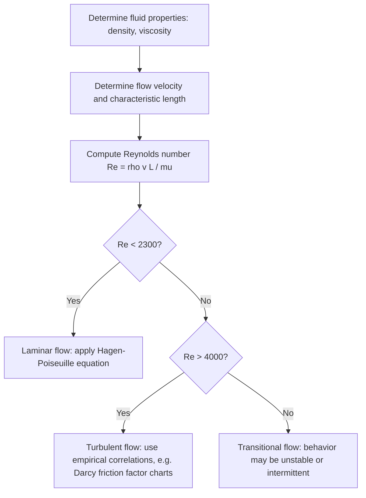

## Viscosity and Laminar Flow

### Viscosity: Definition and Physical Basis

Viscosity is a measure of a fluid's internal resistance to deformation or flow, arising from intermolecular friction between adjacent fluid layers moving at different velocities. It quantifies the fluid's resistance to shear stress.

### Newton's Law of Viscosity

For many common fluids (Newtonian fluids), shear stress is directly proportional to the velocity gradient (shear rate) perpendicular to the flow direction:

$$\tau = \mu \frac{dv}{dy}$$

where:

- $\tau$ = shear stress (Pa)
- $\mu$ = dynamic viscosity (Pa·s, or kg/(m·s))
- $\dfrac{dv}{dy}$ = velocity gradient perpendicular to flow (s⁻¹), also called shear rate

**Physical interpretation**: Consider two parallel plates with fluid between them, the lower plate fixed and the upper plate moving at velocity $v$. The fluid layer in contact with each plate takes on that plate's velocity (no-slip condition), producing a linear velocity gradient across the gap for simple Couette flow. The force required to maintain the upper plate's motion is proportional to $\mu$, the plate area, and the velocity gradient.

### Dynamic vs. Kinematic Viscosity

**Dynamic viscosity** ($\mu$): as defined above, relates shear stress to shear rate directly. Common units: Pa·s or poise (1 P = 0.1 Pa·s).

**Kinematic viscosity** ($\nu$): the ratio of dynamic viscosity to density, describing how momentum diffuses through a fluid independent of applied force:

$$\nu = \frac{\mu}{\rho}$$

Units: m²/s or stokes (1 St = $10^{-4}$ m²/s). Kinematic viscosity is often more directly relevant in flow analysis because it appears naturally in the Navier-Stokes equations and the Reynolds number.

**Reference values at 20°C** [Unverified — precise values vary with temperature and measurement conditions]:

- Water: $\mu \approx 1.0 \times 10^{-3}\text{ Pa·s}$
- Air: $\mu \approx 1.8 \times 10^{-5}\text{ Pa·s}$
- Motor oil (SAE 30): $\mu \approx 0.2\text{ Pa·s}$
- Honey: $\mu \approx 2$–$10\text{ Pa·s}$

### Newtonian vs. Non-Newtonian Fluids

- **Newtonian fluids**: viscosity is constant regardless of applied shear rate (e.g., water, air, most simple gases and light oils). The stress-strain rate relationship is linear.
- **Non-Newtonian fluids**: viscosity varies with shear rate. Subtypes include:
  - **Shear-thinning (pseudoplastic)**: viscosity decreases with increasing shear rate (e.g., ketchup, blood, paint).
  - **Shear-thickening (dilatant)**: viscosity increases with increasing shear rate (e.g., cornstarch-water suspensions).
  - **Bingham plastics**: behave as a solid until a yield stress is exceeded, then flow like a viscous fluid (e.g., toothpaste, mud).
  - **Thixotropic/rheopectic fluids**: viscosity changes with duration of applied stress, not just its magnitude.

### Laminar Flow: Definition and Characteristics

Laminar flow is a flow regime characterized by smooth, orderly fluid motion in parallel layers (laminae) with minimal mixing between layers. Momentum transfer between layers occurs primarily through molecular diffusion (viscous shear) rather than through macroscopic mixing.

**Key characteristics**:

- Streamlines are smooth and predictable, remaining parallel to the flow direction.
- Velocity profile in a pipe is parabolic (Poiseuille flow).
- Occurs at relatively low velocities, high viscosities, or small characteristic length scales.
- Flow is deterministic; disturbances tend to be damped out by viscous forces.

### Reynolds Number: Laminar vs. Turbulent Transition

The Reynolds number is a dimensionless quantity that predicts flow regime by comparing inertial forces to viscous forces:

$$Re = \frac{\rho v L}{\mu} = \frac{vL}{\nu}$$

where:

- $\rho$ = fluid density
- $v$ = characteristic flow velocity
- $L$ = characteristic length (e.g., pipe diameter)
- $\mu$ = dynamic viscosity
- $\nu$ = kinematic viscosity

**Flow regime thresholds (for flow in a circular pipe)** [Inference — exact transition values vary with pipe roughness, entrance conditions, and disturbance levels; ranges below are standard textbook approximations]:

- $Re < 2300$: laminar flow
- $2300 < Re < 4000$: transitional flow
- $Re > 4000$: turbulent flow

A low Reynolds number indicates viscous forces dominate (favoring laminar flow); a high Reynolds number indicates inertial forces dominate (favoring turbulent flow).

### Hagen-Poiseuille Equation (Laminar Pipe Flow)

For fully developed laminar flow of an incompressible Newtonian fluid through a circular pipe, the volumetric flow rate is given by:

$$Q = \frac{\pi r^4 \Delta P}{8 \mu L}$$

where:

- $Q$ = volumetric flow rate (m³/s)
- $r$ = pipe radius (m)
- $\Delta P$ = pressure drop across the pipe length (Pa)
- $\mu$ = dynamic viscosity (Pa·s)
- $L$ = pipe length (m)

The velocity profile across the pipe cross-section is parabolic:

$$v(r_d) = v_{max}\left(1 - \frac{r_d^2}{r^2}\right)$$

where $r_d$ is the radial distance from the pipe's centerline and $v_{max}$ is the maximum (centerline) velocity, related to the average velocity by $v_{avg} = v_{max}/2$.

**Key implications of the Hagen-Poiseuille relationship**:

- Flow rate is proportional to the fourth power of radius ($Q \propto r^4$), meaning small changes in pipe diameter produce large changes in flow rate.
- Flow rate is inversely proportional to viscosity and pipe length.

### Example Calculation

Find the volumetric flow rate of oil ($\mu = 0.1\text{ Pa·s}$) through a horizontal pipe of radius 0.01 m and length 5 m, with a pressure drop of 2000 Pa across its length.

$$Q = \frac{\pi r^4 \Delta P}{8\mu L} = \frac{\pi (0.01)^4 (2000)}{8(0.1)(5)}$$

$$Q = \frac{\pi \times 10^{-8} \times 2000}{4} = \frac{6.283 \times 10^{-5}}{4} \approx 1.571 \times 10^{-5}\text{ m}^3/\text{s}$$

**Verify flow regime** using average velocity $v_{avg} = Q/A$:

$$A = \pi r^2 = \pi (0.01)^2 \approx 3.1416 \times 10^{-4}\text{ m}^2$$

$$v_{avg} = \frac{1.571\times 10^{-5}}{3.1416\times 10^{-4}} \approx 0.05\text{ m/s}$$

Assuming oil density $\rho \approx 900\text{ kg/m}^3$:

$$Re = \frac{\rho v L_{char}}{\mu} = \frac{900 \times 0.05 \times 0.02}{0.1} = 9$$

(using pipe diameter $L_{char} = 0.02\text{ m}$ as the characteristic length). Since $Re = 9 \ll 2300$, the flow is confirmed laminar, validating the use of the Hagen-Poiseuille equation.

### Diagram: Laminar Flow Velocity Profile in a Pipe (svg_diagram)

<svg xmlns="http://www.w3.org/2000/svg" viewBox="0 0 480 220">
<text x="240" y="25" font-size="16" text-anchor="middle" font-weight="bold">Laminar Flow Profile (svg_diagram)</text>
<rect x="40" y="60" width="380" height="120" fill="none" stroke="#2a6f97" stroke-width="2" />
<line x1="40" y1="120" x2="420" y2="120" stroke="#999" stroke-dasharray="4" />
<path d="M40,60 C 160,90 300,90 420,60" fill="none" stroke="#0077b6" stroke-width="2" />
<path d="M40,180 C 160,150 300,150 420,180" fill="none" stroke="#0077b6" stroke-width="2" />
<line x1="60" y1="70" x2="140" y2="70" stroke="black" marker-end="url(#arrowL)" />
<line x1="60" y1="120" x2="220" y2="120" stroke="black" marker-end="url(#arrowL)" />
<line x1="60" y1="170" x2="140" y2="170" stroke="black" marker-end="url(#arrowL)" />
<text x="230" y="115" font-size="11">v_max (centerline)</text>
<text x="150" y="65" font-size="10">v (near wall, low)</text>
</svg>

### Diagram: Viscosity and Flow Regime Analysis

### Applications

- **Pipeline and hydraulic system design**: predicting pressure drops and pump sizing requires knowing whether flow is laminar or turbulent, since head loss correlations differ substantially between regimes.
- **Blood flow and biomedical engineering**: blood exhibits non-Newtonian (shear-thinning) behavior, relevant to modeling flow in small vessels and medical devices.
- **Lubrication engineering**: viscosity governs the load-bearing capacity and friction reduction of lubricating films in bearings and engines.
- **Microfluidics**: at small length scales, Reynolds numbers are typically very low, so flows are almost always laminar, simplifying device design (e.g., lab-on-a-chip systems).
- **Aerodynamics and boundary layer theory**: viscosity, though often negligible far from surfaces, dominates behavior within the thin boundary layer near a solid surface, governing drag and flow separation.

### Common Misconceptions

- Viscosity is not the same as density; a fluid can be dense but have low viscosity (e.g., mercury: high density, moderate viscosity) or vice versa.
- Laminar flow is not synonymous with "slow flow" in an absolute sense — the Reynolds number, which incorporates geometry and fluid properties along with velocity, determines the regime, not velocity alone.
- A high Reynolds number does not guarantee fully turbulent flow immediately; the transitional zone can exhibit intermittent laminar-turbulent bursts depending on disturbances and pipe entrance conditions. [Inference — precise transitional behavior is sensitive to experimental conditions and is not fully deterministic from Re alone]

**Related Topics**:

- Reynolds Number and flow regime transition criteria
- Turbulent Flow and the Darcy-Weisbach friction factor
- Boundary Layer Theory and flow separation
- Non-Newtonian fluid rheology
- Navier-Stokes Equations
- Poiseuille Flow and microfluidic device design