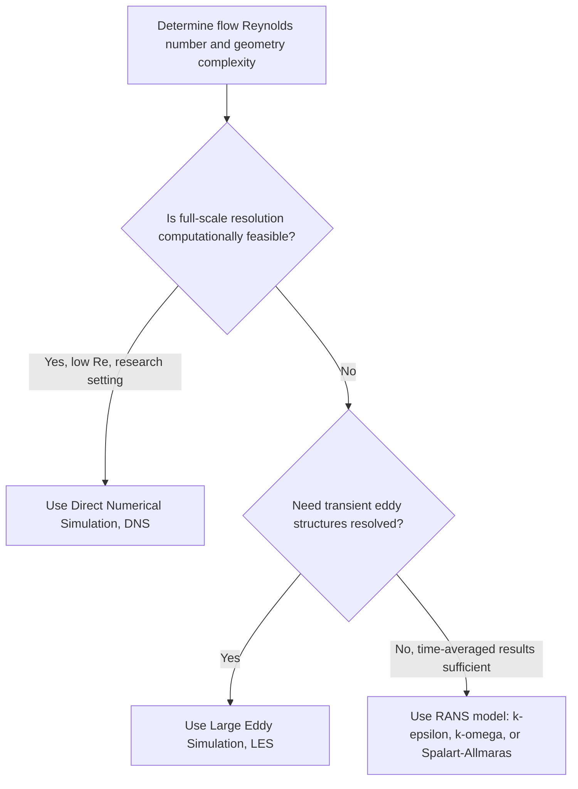

## Turbulence

### Definition and Physical Basis

Turbulence is a flow regime characterized by chaotic, irregular fluid motion with fluctuating velocity, pressure, and vorticity fields. Unlike laminar flow, turbulent flow involves three-dimensional, unsteady eddies of varying sizes that enhance mixing, momentum transfer, and energy dissipation. Turbulence arises when inertial forces dominate over viscous forces, typically at high Reynolds numbers.

### Key Characteristics of Turbulent Flow

- **Irregularity/randomness**: velocity fields fluctuate unpredictably in time and space, though statistically the flow can exhibit repeatable average behavior.
- **Diffusivity**: turbulence greatly enhances the mixing of momentum, heat, and mass compared to molecular diffusion alone.
- **Three-dimensionality and rotationality**: turbulent flows are inherently three-dimensional and characterized by vorticity (rotational fluid motion) even when the mean flow appears two-dimensional.
- **Dissipation**: turbulent kinetic energy is continuously converted to heat via viscous action at the smallest scales, requiring continuous energy input to sustain the turbulence.
- **Wide range of length and time scales**: turbulence involves a cascade of eddies from large, energy-containing scales down to small, dissipative scales.

### Reynolds Decomposition

Turbulent flow variables are commonly analyzed by decomposing instantaneous quantities into a mean component and a fluctuating component (Reynolds decomposition):

$$u(t) = \bar{u} + u'(t)$$

where:

- $u(t)$ = instantaneous velocity component
- $\bar{u}$ = time-averaged (mean) velocity
- $u'(t)$ = fluctuating (turbulent) velocity component, with $\overline{u'} = 0$ by definition

Applying this decomposition to the Navier-Stokes equations produces the **Reynolds-Averaged Navier-Stokes (RANS) equations**, introducing additional unknown terms called **Reynolds stresses**:

$$-\rho \overline{u_i' u_j'}$$

These represent the apparent additional stress caused by turbulent momentum transfer, and their presence creates the **closure problem**: the RANS equations have more unknowns than equations, requiring a turbulence model to approximate the Reynolds stress terms.

### Energy Cascade and the Kolmogorov Theory

Turbulent kinetic energy is introduced at large scales (comparable to the geometry of the flow, e.g., pipe diameter) and transferred progressively to smaller eddies through a process called the **energy cascade**, until it is dissipated as heat at the smallest scales by viscosity.

**Kolmogorov's theory of local isotropy** (1941) describes this cascade statistically:

- **Integral length scale** ($L$): the scale of the largest, energy-containing eddies, comparable to the characteristic dimension of the flow.
- **Kolmogorov microscale** ($\eta$): the smallest scale at which viscous dissipation dominates, given by:

$$\eta = \left(\frac{\nu^3}{\varepsilon}\right)^{1/4}$$

where $\nu$ is kinematic viscosity and $\varepsilon$ is the turbulent kinetic energy dissipation rate per unit mass.

The energy spectrum in the inertial subrange (between the largest and smallest scales) follows the well-known **Kolmogorov $-5/3$ power law**:

$$E(k) = C \varepsilon^{2/3} k^{-5/3}$$

where $E(k)$ is the energy spectral density, $k$ is the wavenumber, and $C$ is a universal constant (approximately 1.5) [Unverified — the precise value and universality of $C$ remain subjects of ongoing turbulence research].

### Onset of Turbulence: Transition from Laminar Flow

Turbulence typically develops through a transition process as the Reynolds number increases:

1. **Laminar flow**: smooth, ordered layers.
2. **Instability growth**: small disturbances (e.g., Tollmien-Schlichting waves in boundary layers) begin to amplify.
3. **Transitional flow**: intermittent turbulent "spots" appear and grow.
4. **Fully turbulent flow**: chaotic motion dominates throughout the flow field.

The critical Reynolds number for transition depends strongly on geometry, surface roughness, and disturbance levels. In pipe flow, transition is commonly cited to begin around $Re \approx 2300$, though transition can be delayed to much higher $Re$ in carefully controlled, low-disturbance experiments. [Inference — precise transition thresholds are sensitive to experimental conditions and are not a fixed universal constant]

### Turbulence Modeling Approaches

Because directly solving the full time-dependent, three-dimensional Navier-Stokes equations for turbulent flow (Direct Numerical Simulation, DNS) is computationally prohibitive for most practical engineering flows, several modeling approaches are used:

- **Direct Numerical Simulation (DNS)**: resolves all scales of turbulence directly without modeling; extremely computationally expensive, limited to low-Reynolds-number research flows.
- **Large Eddy Simulation (LES)**: directly resolves large, energy-containing eddies while modeling the effects of smaller, more universal sub-grid scales.
- **Reynolds-Averaged Navier-Stokes (RANS)**: solves for time-averaged flow quantities, modeling all turbulent fluctuations via a turbulence model. Common RANS models include:
  - **k-ε model**: solves transport equations for turbulent kinetic energy ($k$) and its dissipation rate ($\varepsilon$).
  - **k-ω model**: solves for turbulent kinetic energy ($k$) and specific dissipation rate ($\omega$), often more accurate near walls.
  - **Spalart-Allmaras model**: a one-equation model commonly used in aerospace applications for attached boundary layer flows.

### Turbulent Velocity Profile vs. Laminar

In pipe flow, the turbulent time-averaged velocity profile is flatter across most of the pipe cross-section compared to the parabolic laminar profile, with a steep velocity gradient confined to a thin near-wall region. This is because turbulent mixing efficiently transports momentum across the cross-section, in contrast to the purely diffusive momentum transfer in laminar flow.

The turbulent mean velocity profile near a wall is often described by the **law of the wall**:

$$u^+ = \frac{1}{\kappa}\ln(y^+) + B$$

where $u^+$ and $y^+$ are dimensionless velocity and wall distance, $\kappa \approx 0.41$ is the von Kármán constant, and $B \approx 5.0$ is an empirical constant. [Unverified — these constants are widely used empirical values with known variation across flow conditions]

### Example: Estimating Flow Regime and Turbulence Scales

Water ($\rho = 1000\text{ kg/m}^3$, $\mu = 1.0 \times 10^{-3}\text{ Pa·s}$) flows through a pipe of diameter 0.1 m at an average velocity of 2 m/s.

**Reynolds number**:

$$Re = \frac{\rho v D}{\mu} = \frac{1000 \times 2 \times 0.1}{1.0\times 10^{-3}} = 200{,}000$$

Since $Re \gg 4000$, the flow is strongly turbulent.

**Kolmogorov microscale estimate** (assuming dissipation rate $\varepsilon \approx 0.1\text{ m}^2/\text{s}^3$, a representative order-of-magnitude value [Inference — actual $\varepsilon$ depends on specific flow geometry and must generally be measured or computed]):

$$\nu = \frac{\mu}{\rho} = 1.0\times 10^{-6}\text{ m}^2/\text{s}$$

$$\eta = \left(\frac{\nu^3}{\varepsilon}\right)^{1/4} = \left(\frac{(10^{-6})^3}{0.1}\right)^{1/4} = (10^{-17})^{1/4} \approx 1.78\times 10^{-5}\text{ m} \approx 18\ \mu\text{m}$$

This illustrates the vast scale separation in turbulence: eddies ranging from the pipe diameter (0.1 m) down to micrometer-scale dissipative eddies.

### Diagram: Energy Cascade in Turbulent Flow (svg_diagram)

<svg xmlns="http://www.w3.org/2000/svg" viewBox="0 0 500 260">
<text x="250" y="25" font-size="16" text-anchor="middle" font-weight="bold">Turbulent Energy Cascade (svg_diagram)</text>
<circle cx="100" cy="130" r="60" fill="none" stroke="#2a6f97" stroke-width="3" />
<circle cx="230" cy="130" r="35" fill="none" stroke="#0077b6" stroke-width="2" />
<circle cx="320" cy="110" r="18" fill="none" stroke="#48cae4" stroke-width="2" />
<circle cx="360" cy="150" r="9" fill="none" stroke="#90e0ef" stroke-width="2" />
<circle cx="400" cy="130" r="4" fill="#023e8a" />
<line x1="160" y1="130" x2="195" y2="130" stroke="black" marker-end="url(#arrowT)" />
<line x1="265" y1="130" x2="302" y2="118" stroke="black" marker-end="url(#arrowT)" />
<line x1="338" y1="118" x2="351" y2="140" stroke="black" marker-end="url(#arrowT)" />
<line x1="369" y1="150" x2="392" y2="135" stroke="black" marker-end="url(#arrowT)" />
<text x="100" y="215" font-size="11" text-anchor="middle">Integral scale (L)</text>
<text x="400" y="215" font-size="11" text-anchor="middle">Kolmogorov scale (eta)</text>
<text x="250" y="245" font-size="12" text-anchor="middle">Energy transferred large -&gt; small eddies -&gt; dissipated as heat</text>
</svg>

### Diagram: Turbulence Modeling Decision Flow

### Applications

- **Aerodynamics**: turbulence affects drag, lift, and boundary layer separation on aircraft, vehicles, and structures, making turbulence modeling essential to CFD-based design.
- **Weather and atmospheric modeling**: atmospheric turbulence governs pollutant dispersion, wind loading, and boundary layer meteorology.
- **Combustion engineering**: turbulent mixing enhances fuel-air mixing rates in engines and industrial burners, directly affecting combustion efficiency and emissions.
- **Chemical and process engineering**: turbulent mixing in reactors and pipelines enhances heat and mass transfer rates compared to laminar conditions.
- **Oceanography and geophysical flows**: turbulence governs mixing of heat, salinity, and nutrients in oceanic and atmospheric boundary layers.

### Common Misconceptions

- Turbulence is not simply "fast flow" — it is defined by the dominance of inertial over viscous forces (high Reynolds number) combined with instability mechanisms, not velocity magnitude alone.
- Turbulent flow is not entirely random or unpredictable; it exhibits statistically well-defined structure (e.g., mean velocity profiles, energy spectra) even though instantaneous fluctuations are chaotic.
- RANS turbulence models do not solve turbulence exactly; they are empirical/semi-empirical closures whose accuracy is flow-dependent, and results should be validated against experimental or DNS/LES data where possible. [Inference — model performance varies significantly by flow type and cannot be assumed accurate without validation]

**Related Topics**:

- Reynolds Number and laminar-turbulent transition
- Navier-Stokes Equations and the closure problem
- Boundary Layer Theory and flow separation
- Computational Fluid Dynamics (CFD) methods
- Vorticity and rotational flow
- Turbulent heat and mass transfer