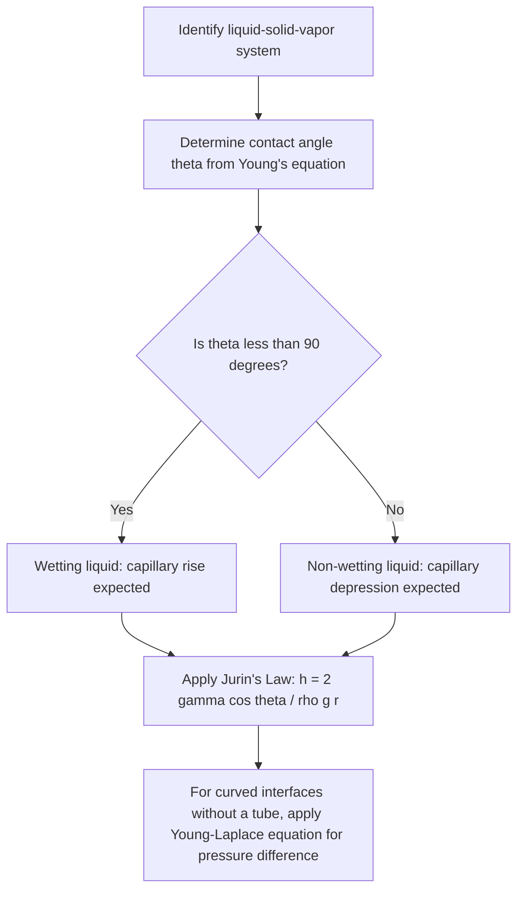

## Surface Tension and Capillarity

### Surface Tension: Definition and Physical Basis

Surface tension is the tendency of a fluid's surface to minimize its surface area, arising from cohesive intermolecular forces. Molecules within the bulk of a liquid experience balanced attractive forces from surrounding molecules in all directions. Molecules at the surface, however, lack neighbors above them and experience a net inward pull, creating a state of tension along the surface that behaves like a stretched elastic membrane.

### Mathematical Definition

Surface tension $\gamma$ (also denoted $\sigma$) is defined as the force per unit length acting along a line on the surface, or equivalently, the energy required per unit area to increase the surface:

$$\gamma = \frac{F}{L}$$

where:

- $F$ = force acting tangentially along the surface (N)
- $L$ = length of the line along which the force acts (m)

Units: N/m, equivalently J/m² (energy per unit area), since increasing surface area requires work against cohesive forces.

**Reference values at 20°C** [Unverified — precise values are temperature- and purity-dependent]:

- Water: $\gamma \approx 0.0728\text{ N/m}$
- Mercury: $\gamma \approx 0.485\text{ N/m}$
- Ethanol: $\gamma \approx 0.022\text{ N/m}$
- Soap solution: $\gamma \approx 0.025\text{ N/m}$

Surface tension decreases with increasing temperature, as increased thermal motion weakens intermolecular cohesion, and vanishes at the critical temperature.

### Young-Laplace Equation

The pressure difference across a curved liquid interface, caused by surface tension, is described by the Young-Laplace equation. For a spherical interface (such as a droplet or bubble surface) of radius $r$:

$$\Delta P = \frac{2\gamma}{r}$$

For a soap bubble, which has two surfaces (inner and outer liquid film interfaces), the pressure difference doubles:

$$\Delta P = \frac{4\gamma}{r}$$

For a general curved surface with two principal radii of curvature $r_1$ and $r_2$:

$$\Delta P = \gamma\left(\frac{1}{r_1} + \frac{1}{r_2}\right)$$

This shows that smaller droplets/bubbles experience greater internal pressure than larger ones, since $\Delta P \propto 1/r$.

**Example calculation**: Find the excess pressure inside a water droplet of radius 1 mm ($\gamma_{water} = 0.0728\text{ N/m}$).

$$\Delta P = \frac{2\gamma}{r} = \frac{2(0.0728)}{0.001} = 145.6\text{ Pa}$$

For a much smaller droplet, radius 1 μm:

$$\Delta P = \frac{2(0.0728)}{10^{-6}} = 145{,}600\text{ Pa} \approx 1.44\text{ atm}$$

This illustrates why surface tension effects become dominant at small length scales.

### Contact Angle and Wettability

When a liquid surface meets a solid boundary, the **contact angle** $\theta$ describes the angle between the liquid-solid interface and the liquid-vapor interface, measured through the liquid. It results from the balance of three interfacial tensions at the contact line, described by **Young's equation**:

$$\gamma_{SV} = \gamma_{SL} + \gamma_{LV}\cos\theta$$

where:

- $\gamma_{SV}$ = solid-vapor interfacial tension
- $\gamma_{SL}$ = solid-liquid interfacial tension
- $\gamma_{LV}$ = liquid-vapor interfacial tension (the liquid's surface tension)

**Wettability classification**:

- $\theta < 90°$: liquid **wets** the surface (hydrophilic for water); liquid spreads readily.
- $\theta > 90°$: liquid **does not wet** the surface (hydrophobic for water); liquid beads up.
- $\theta \approx 0°$: complete wetting.
- $\theta \approx 180°$: complete non-wetting (e.g., superhydrophobic surfaces, lotus-effect coatings).

### Capillarity: Definition and Physical Basis

Capillarity (capillary action) is the ability of a liquid to flow in narrow spaces (such as thin tubes, porous media, or between closely spaced plates) without external force, driven by the interplay of surface tension, adhesion (liquid-solid attraction), and cohesion (liquid-liquid attraction).

- If **adhesive forces exceed cohesive forces** (wetting liquid, $\theta < 90°$), the liquid rises in a capillary tube (e.g., water in glass).
- If **cohesive forces exceed adhesive forces** (non-wetting liquid, $\theta > 90°$), the liquid is depressed below the surrounding level (e.g., mercury in glass).

### Jurin's Law (Capillary Rise Equation)

The height of capillary rise (or depression) in a narrow tube is given by Jurin's Law, derived by balancing the vertical component of the surface tension force against the weight of the raised liquid column:

$$h = \frac{2\gamma\cos\theta}{\rho g r}$$

where:

- $h$ = height of capillary rise (m); negative for depression
- $\gamma$ = surface tension of the liquid (N/m)
- $\theta$ = contact angle
- $\rho$ = liquid density (kg/m³)
- $g$ = acceleration due to gravity (9.81 m/s²)
- $r$ = radius of the capillary tube (m)

### Derivation

The upward force from surface tension acting along the circumference of the tube's inner wall, at contact angle $\theta$:

$$F_{tension} = \gamma \cos\theta \times (2\pi r)$$

This force supports the weight of the liquid column of height $h$ and cross-sectional area $\pi r^2$:

$$W = \rho g (\pi r^2 h)$$

Setting these equal at equilibrium:

$$\gamma \cos\theta (2\pi r) = \rho g \pi r^2 h$$

Solving for $h$:

$$h = \frac{2\gamma\cos\theta}{\rho g r}$$

### Example Calculation

Find the capillary rise of water in a glass tube of radius 0.2 mm, assuming complete wetting ($\theta \approx 0°$, $\cos\theta = 1$), $\gamma_{water} = 0.0728\text{ N/m}$, $\rho_{water} = 1000\text{ kg/m}^3$.

$$h = \frac{2(0.0728)(1)}{(1000)(9.81)(0.0002)} = \frac{0.1456}{1.962} \approx 0.0742\text{ m} \approx 7.42\text{ cm}$$

For mercury in the same tube (non-wetting, $\theta \approx 140°$, $\gamma_{mercury} = 0.485\text{ N/m}$, $\rho_{mercury} = 13{,}600\text{ kg/m}^3$):

$$\cos(140°) \approx -0.766$$

$$h = \frac{2(0.485)(-0.766)}{(13{,}600)(9.81)(0.0002)} = \frac{-0.743}{26.68} \approx -0.0279\text{ m} \approx -2.79\text{ cm}$$

The negative sign confirms mercury is depressed below the reservoir level rather than rising, consistent with its non-wetting behavior on glass.

### Diagram: Capillary Rise vs. Depression (svg_diagram)

<svg xmlns="http://www.w3.org/2000/svg" viewBox="0 0 480 260">
<text x="240" y="25" font-size="16" text-anchor="middle" font-weight="bold">Capillary Action (svg_diagram)</text>
<rect x="30" y="150" width="180" height="80" fill="#cfe8f7" stroke="#2a6f97" stroke-width="1" />
<rect x="100" y="80" width="20" height="150" fill="none" stroke="black" stroke-width="2" />
<rect x="103" y="100" width="14" height="130" fill="#48cae4" />
<text x="110" y="90" font-size="11" text-anchor="middle">rise</text>
<text x="110" y="245" font-size="12" text-anchor="middle">Water (wetting, theta &lt; 90)</text>
<rect x="270" y="150" width="180" height="80" fill="#f7e0cf" stroke="#a65a2a" stroke-width="1" />
<rect x="340" y="80" width="20" height="150" fill="none" stroke="black" stroke-width="2" />
<rect x="343" y="170" width="14" height="60" fill="#c0c0c0" />
<text x="350" y="165" font-size="11" text-anchor="middle">depression</text>
<text x="350" y="245" font-size="12" text-anchor="middle">Mercury (non-wetting, theta &gt; 90)</text>
</svg>

### Diagram: Surface Tension and Capillarity Analysis Flow

### Applications

- **Plant water transport**: capillary action, combined with transpiration pull and cohesion-tension mechanisms, contributes to water movement through xylem in plants.
- **Inkjet printing and microfluidics**: surface tension governs droplet formation, wetting behavior on substrates, and fluid movement in capillary-driven microchannels.
- **Porous media and soil science**: capillary rise governs water retention and movement through soil pores, relevant to irrigation and groundwater studies.
- **Textiles and paper towels**: capillary wicking enables liquid absorption in fibrous materials.
- **Manometry and fluid measurement**: capillary effects must be corrected for in precision pressure measurements using narrow-bore manometers.
- **Surfactants and detergents**: surfactants reduce surface tension, enhancing wetting and cleaning performance by allowing water to penetrate fabric fibers and dislodge soils.

### Common Misconceptions

- Surface tension is not a bulk material property like density; it is specifically an interfacial phenomenon dependent on the two (or three) phases in contact (e.g., water's surface tension differs against air versus against oil).
- Capillary rise height depends inversely on tube radius ($h \propto 1/r$) — narrower tubes produce greater rise, not the reverse.
- Contact angle is not solely a property of the liquid; it depends on the specific liquid-solid-vapor combination and surface conditions (e.g., cleanliness, roughness, coatings), so the same liquid can exhibit different contact angles on different solids.

**Related Topics**:

- Young-Laplace Equation and curved interface pressure
- Wetting, Adhesion, and Cohesion phenomena
- Surfactants and interfacial chemistry
- Porous Media Flow and capillary pressure in reservoirs
- Droplet Dynamics and microfluidic device design
- Plant Physiology: Xylem Transport Mechanisms