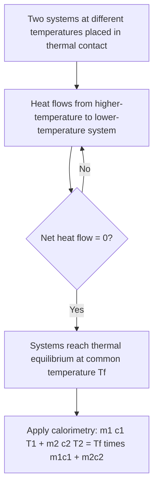

## Temperature and Thermal Equilibrium

### Definition and Physical Basis

Temperature is a measure of the average kinetic energy of the particles (atoms or molecules) constituting a substance, reflecting the intensity of random microscopic motion (translational, rotational, and vibrational). It is a scalar, intensive property that determines the direction of net heat flow between systems: heat flows spontaneously from regions of higher temperature to regions of lower temperature.

Thermal equilibrium is the state in which two or more systems in thermal contact have no net heat flow between them, meaning they have reached the same temperature.

### The Zeroth Law of Thermodynamics

The Zeroth Law establishes temperature as a well-defined, measurable property and underlies the operation of all thermometers:

**If system A is in thermal equilibrium with system C, and system B is also in thermal equilibrium with system C, then system A is in thermal equilibrium with system B.**

This law justifies the use of a third reference body (a thermometer) to compare the temperatures of two systems without placing them in direct thermal contact with each other. It is termed the "zeroth" law because it is logically foundational to the first and second laws, though it was formalized after them historically.

### Temperature Scales

**Celsius scale ($°C$)**: defined with 0°C at the freezing point of water and 100°C at the boiling point of water at standard atmospheric pressure (historically; the modern definition ties it to the Kelvin scale).

**Kelvin scale ($K$)**: the SI absolute temperature scale, with 0 K defined as absolute zero — the theoretical temperature at which particle motion (translational kinetic energy) reaches its quantum-mechanical minimum. The Kelvin scale has the same increment size as Celsius:

$$T(K) = T(°C) + 273.15$$

**Fahrenheit scale ($°F$)**: commonly used in the United States, related to Celsius by:

$$T(°F) = \frac{9}{5}T(°C) + 32$$

$$T(°C) = \frac{5}{9}\left(T(°F) - 32\right)$$

**Rankine scale ($°R$)**: an absolute scale using Fahrenheit-sized degrees, used occasionally in engineering (particularly in the US customary system):

$$T(°R) = T(°F) + 459.67$$

### Absolute Zero

Absolute zero (0 K = −273.15°C) is the temperature at which a system's thermal energy is at its theoretical minimum. Approaching absolute zero is governed by the **third law of thermodynamics**, which states that absolute zero cannot be reached through any finite number of physical processes, though temperatures within nanokelvins of it have been achieved in laboratory settings via techniques such as laser cooling and evaporative cooling. [Unverified — closest experimentally achieved temperatures and specific record values are dependent on ongoing research and are not fixed textbook facts]

### Thermometry: Measuring Temperature

Common thermometric properties (physical properties that vary measurably and predictably with temperature) include:

- **Thermal expansion of liquids** (mercury or alcohol thermometers): volume changes linearly with temperature over a working range.
- **Electrical resistance** (resistance temperature detectors, RTDs, and thermistors): resistance varies with temperature, often following near-linear (RTD) or exponential (thermistor) relationships.
- **Thermoelectric effect** (thermocouples): a voltage is generated at the junction of two dissimilar metals, proportional to temperature difference (Seebeck effect).
- **Blackbody radiation** (pyrometers): the intensity and spectral distribution of emitted electromagnetic radiation is used to infer temperature remotely, based on the Stefan-Boltzmann law and Wien's displacement law.
- **Gas thermometers**: the pressure or volume of a fixed quantity of gas varies with temperature, forming the basis of the ideal gas temperature scale, which closely approximates the thermodynamic (Kelvin) scale at low pressures.

### Thermal Equilibrium and Heat Transfer

When two systems at different temperatures are placed in thermal contact, energy transfers spontaneously (as heat) from the higher-temperature system to the lower-temperature system until both reach a common final equilibrium temperature. For two bodies with masses $m_1, m_2$, specific heat capacities $c_1, c_2$, and initial temperatures $T_1, T_2$ (assuming no heat loss to the environment, i.e., an isolated system), conservation of energy gives:

$$m_1 c_1 (T_f - T_1) = -m_2 c_2 (T_f - T_2)$$

Solving for the final equilibrium temperature $T_f$:

$$T_f = \frac{m_1 c_1 T_1 + m_2 c_2 T_2}{m_1 c_1 + m_2 c_2}$$

This is the principle underlying **calorimetry**, used to determine unknown specific heat capacities or final mixture temperatures.

### Example Calculation

500 g of water at 80°C is mixed with 300 g of water at 20°C in an insulated container. Find the final equilibrium temperature. ($c_{water} = 4186\text{ J/(kg·K)}$, same for both since it is the same substance)

$$T_f = \frac{(0.5)(4186)(80) + (0.3)(4186)(20)}{(0.5)(4186) + (0.3)(4186)}$$

Since $c$ is identical for both, it cancels:

$$T_f = \frac{(0.5)(80) + (0.3)(20)}{0.5 + 0.3} = \frac{40 + 6}{0.8} = \frac{46}{0.8} = 57.5°C$$

**Example with different materials**: A 200 g aluminum block ($c_{Al} = 900\text{ J/(kg·K)}$) at 150°C is dropped into 500 g of water ($c_{water} = 4186\text{ J/(kg·K)}$) at 25°C.

$$T_f = \frac{(0.2)(900)(150) + (0.5)(4186)(25)}{(0.2)(900) + (0.5)(4186)}$$

$$T_f = \frac{27{,}000 + 52{,}325}{180 + 2093} = \frac{79{,}325}{2273} \approx 34.9°C$$

The much larger thermal mass ($mc$) of the water compared to the aluminum results in a final temperature much closer to the water's initial temperature.

### Diagram: Thermal Equilibrium via Zeroth Law (svg_diagram)

<svg xmlns="http://www.w3.org/2000/svg" viewBox="0 0 480 240">
<text x="240" y="25" font-size="16" text-anchor="middle" font-weight="bold">Zeroth Law of Thermodynamics (svg_diagram)</text>
<circle cx="100" cy="130" r="50" fill="#f7c59f" stroke="#333" stroke-width="2" />
<text x="100" y="135" font-size="14" text-anchor="middle">A</text>
<circle cx="380" cy="130" r="50" fill="#f7c59f" stroke="#333" stroke-width="2" />
<text x="380" y="135" font-size="14" text-anchor="middle">B</text>
<circle cx="240" cy="130" r="40" fill="#cfe8f7" stroke="#2a6f97" stroke-width="2" />
<text x="240" y="135" font-size="14" text-anchor="middle">C</text>
<line x1="150" y1="130" x2="200" y2="130" stroke="black" stroke-dasharray="5" marker-end="url(#eqarrow)" />
<line x1="280" y1="130" x2="330" y2="130" stroke="black" stroke-dasharray="5" marker-end="url(#eqarrow)" />
<text x="175" y="115" font-size="10" text-anchor="middle">thermal eq.</text>
<text x="305" y="115" font-size="10" text-anchor="middle">thermal eq.</text>
<text x="240" y="210" font-size="12" text-anchor="middle">Therefore: A is in thermal equilibrium with B</text>
</svg>

### Diagram: Temperature Measurement and Equilibrium Process

### Applications

- **Calorimetry**: determining specific heat capacities of unknown materials by measuring equilibrium temperatures in controlled mixing experiments.
- **HVAC and building thermal design**: predicting equilibrium temperatures and heat flow between building materials and ambient environments.
- **Industrial process control**: temperature sensors (thermocouples, RTDs) enable feedback control loops in manufacturing, chemical processing, and food safety.
- **Climate science**: radiative thermal equilibrium concepts underlie basic energy balance models of planetary temperature.
- **Medical thermometry**: clinical thermometers rely on rapid thermal equilibration with the body to provide accurate temperature readings.

### Common Misconceptions

- Temperature is not the same as heat; temperature is a state property indicating thermal intensity, while heat is energy in transit between systems due to a temperature difference.
- Two objects at the same temperature do not necessarily contain the same amount of thermal energy — thermal energy content also depends on mass and specific heat capacity (heat capacity).
- Thermal equilibrium does not require identical materials or masses — it only requires equal temperature and zero net heat flow, regardless of substance or size differences.
- A thermometer reading assumes it has reached thermal equilibrium with the object being measured; a thermometer removed too quickly may report an inaccurate value if the equilibrium is incomplete.

**Related Topics**:

- Heat, Work, and the First Law of Thermodynamics
- Specific Heat Capacity and Calorimetry
- Thermal Expansion of Solids, Liquids, and Gases
- Kinetic Theory of Gases
- Heat Transfer Mechanisms: Conduction, Convection, Radiation
- Third Law of Thermodynamics and Absolute Zero