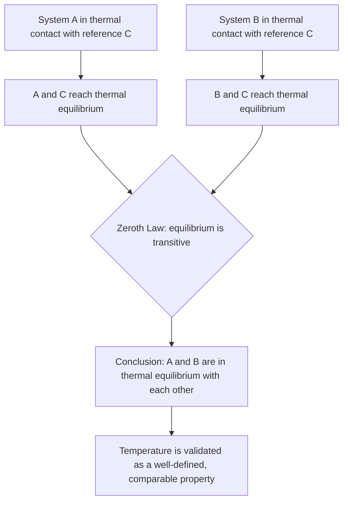

## The Zeroth Law of Thermodynamics

### Definition and Statement

The Zeroth Law of Thermodynamics establishes the logical and physical foundation for the concept of temperature as a measurable, transitive property. It is formally stated as:

**If two systems, A and B, are each in thermal equilibrium with a third system, C, then A and B are in thermal equilibrium with each other.**

This law confirms that thermal equilibrium is a transitive relation, permitting the use of a reference system (a thermometer) to compare temperatures of other systems without requiring them to be placed in direct physical contact.

### Historical Context and Naming

The Zeroth Law was formulated after the First and Second Laws of Thermodynamics had already been established and named. However, because the concept of temperature — and the validity of measuring it — is logically prerequisite to stating the other laws (which reference temperature explicitly), physicist Ralph Fowler proposed calling it the "Zeroth" Law in the 1930s, placing it conceptually before the First Law in the logical hierarchy. [Unverified — specific historical attribution details are commonly cited in textbooks but exact dates and precedence claims vary by source]

### Physical Basis: Thermal Equilibrium

Two systems are said to be in **thermal equilibrium** when they are in thermal contact (i.e., energy can transfer between them, typically as heat) and no net heat flows between them. This condition occurs when both systems have reached the same temperature.

When two systems at different temperatures are placed in thermal contact:

1. Heat flows spontaneously from the higher-temperature system to the lower-temperature system.
2. This flow continues until both systems reach a common temperature.
3. At that point, no further net energy transfer occurs, and the systems are in thermal equilibrium.

The Zeroth Law asserts that this equilibrium state is transitive across systems mediated by a common reference, which is what makes temperature a well-defined, comparable, and universally referenceable property (unlike, for example, a purely relative comparison that would only be meaningful between two directly-contacted bodies).

### Why the Zeroth Law Is Necessary

Without the Zeroth Law, there would be no rigorous logical basis for constructing a temperature scale or using thermometers as reliable measurement tools. The law justifies two related conclusions:

1. **Existence of a well-defined temperature function**: it implies that all systems in mutual thermal equilibrium share a common physical property (temperature), and systems not in equilibrium have differing temperatures.
2. **Validity of indirect comparison via thermometer**: to compare the temperatures of two systems A and B, a thermometer C is placed in contact with A until equilibrium is reached (giving a reading), then with B until equilibrium is reached. If both readings match, the Zeroth Law guarantees A and B are in equilibrium with each other, even though A and B were never in direct contact.

### Formal/Mathematical Interpretation

Thermal equilibrium is formalized using an empirical temperature function $\theta$, such that two systems are in equilibrium if and only if their temperature values are equal:

$$\theta_A = \theta_C \quad \text{and} \quad \theta_B = \theta_C \implies \theta_A = \theta_B$$

This establishes thermal equilibrium as an **equivalence relation**, satisfying:

- **Reflexivity**: a system is always in thermal equilibrium with itself (trivially, $\theta_A = \theta_A$).
- **Symmetry**: if A is in equilibrium with B, then B is in equilibrium with A.
- **Transitivity**: as directly stated by the Zeroth Law — if A ~ C and B ~ C, then A ~ B.

The existence of an equivalence relation partitions all possible states of matter into equivalence classes, each corresponding to a distinct temperature value. This mathematical structure is what allows the assignment of a numerical temperature scale (Celsius, Kelvin, Fahrenheit) to physical systems in a consistent, well-ordered way.

### Application: How Thermometers Work

A practical thermometer relies directly on the Zeroth Law:

1. The thermometer (system C) contains a working substance with a measurable thermometric property (e.g., mercury column height, electrical resistance, or thermocouple voltage) that varies predictably and reproducibly with temperature.
2. The thermometer is placed in contact with the system to be measured (system A) and allowed to reach thermal equilibrium with it.
3. At equilibrium, the thermometer's thermometric property stabilizes, and its reading corresponds to the (equal) temperature of both the thermometer and system A.
4. Because thermal equilibrium is transitive (Zeroth Law), if the same thermometer later reads the same value when placed in contact with system B, then A and B must be at the same temperature — without A and B ever having been in contact.

This is the principle that allows temperature scales to be calibrated using fixed reference points (e.g., the triple point of water) and then applied consistently to compare arbitrary systems.

### Example: Conceptual Illustration

Consider three objects: a metal rod (A), a beaker of water (B), and a mercury thermometer (C).

- The thermometer C is placed in the metal rod A. After a short time, the mercury level stabilizes, reading 45°C — indicating A and C are now in thermal equilibrium.
- The same thermometer C is then placed in the water B. The mercury level stabilizes again at 45°C — indicating B and C are also in thermal equilibrium.
- By the Zeroth Law, since A ~ C and B ~ C, it follows that A ~ B: the metal rod and the water are at the same temperature (45°C), even though the rod and the water beaker were never placed in direct contact with each other.

This is the everyday justification for trusting a single thermometer to compare the temperatures of multiple objects sequentially.

### Diagram: Zeroth Law Transitivity (svg_diagram)

<svg xmlns="http://www.w3.org/2000/svg" viewBox="0 0 480 260">
<text x="240" y="25" font-size="16" text-anchor="middle" font-weight="bold">Zeroth Law Transitivity (svg_diagram)</text>
<rect x="40" y="90" width="100" height="80" fill="#f7c59f" stroke="#333" stroke-width="2" />
<text x="90" y="135" font-size="14" text-anchor="middle">System A</text>
<rect x="340" y="90" width="100" height="80" fill="#f7c59f" stroke="#333" stroke-width="2" />
<text x="390" y="135" font-size="14" text-anchor="middle">System B</text>
<circle cx="240" cy="130" r="45" fill="#cfe8f7" stroke="#2a6f97" stroke-width="2" />
<text x="240" y="135" font-size="13" text-anchor="middle">Thermometer C</text>
<line x1="140" y1="130" x2="195" y2="130" stroke="black" stroke-dasharray="4" marker-end="url(#zarrow)" />
<line x1="285" y1="130" x2="340" y2="130" stroke="black" stroke-dasharray="4" marker-end="url(#zarrow)" />
<text x="167" y="115" font-size="10" text-anchor="middle">contact 1</text>
<text x="312" y="115" font-size="10" text-anchor="middle">contact 2</text>
<path d="M90,90 Q240,-10 390,90" fill="none" stroke="#c0392b" stroke-width="2" marker-end="url(#zarrow)" />
<text x="240" y="220" font-size="12" text-anchor="middle">Both reach equilibrium with C at same reading -&gt; A and B are in equilibrium</text>
</svg>

### Diagram: Logical Structure of the Zeroth Law

### Relationship to the Other Laws of Thermodynamics

- **Zeroth Law**: establishes temperature as a valid, measurable, and comparable property (foundational prerequisite).
- **First Law**: conservation of energy, incorporating heat and work, which requires a well-defined notion of temperature to describe heat flow direction.
- **Second Law**: establishes the direction of spontaneous processes (entropy increase) and the impossibility of certain heat engines, again relying on temperature as a meaningful state variable.
- **Third Law**: describes the behavior of entropy as temperature approaches absolute zero, presupposing the temperature scale established via the Zeroth Law framework.

### Common Misconceptions

- The Zeroth Law is not merely a "trivial" or "obvious" statement; it provides the necessary logical justification for treating temperature as an objective, transitive physical quantity rather than a purely relative or context-dependent comparison.
- Thermal equilibrium does not imply that two systems have identical total internal energy — it only implies they share the same temperature, which is unrelated to differences in mass, material, or specific heat capacity.
- The Zeroth Law does not itself define a numerical temperature scale (e.g., Celsius or Kelvin); it only establishes that a consistent temperature function can exist. The actual numerical scale is a separate empirical/conventional choice built on this foundation.

**Related Topics**:

- Temperature and Thermal Equilibrium
- Thermometry and Temperature Scale Calibration
- First Law of Thermodynamics
- Second Law of Thermodynamics and Entropy
- Third Law of Thermodynamics and Absolute Zero
- Kinetic Theory of Gases