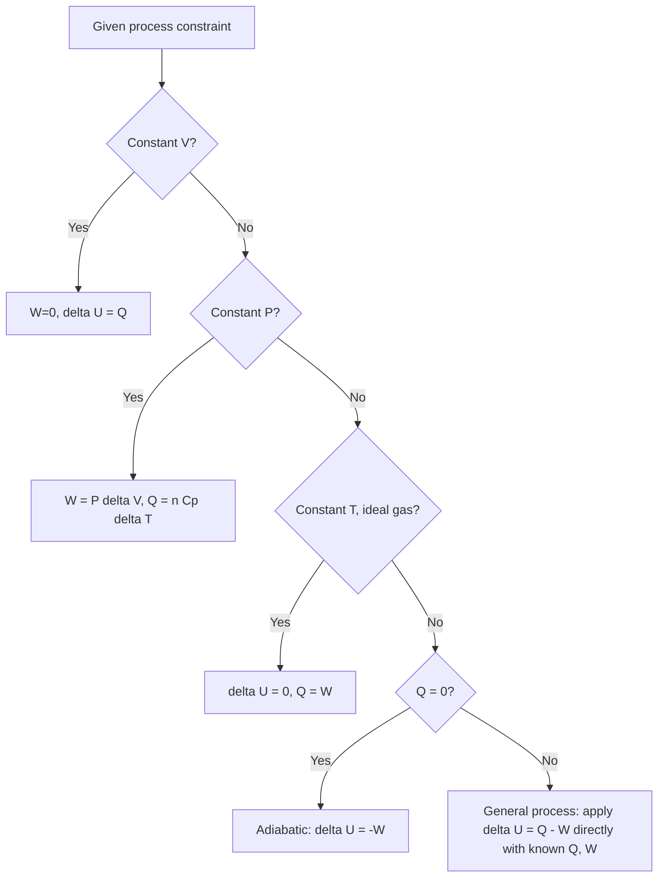

## The First Law of Thermodynamics

### Definition and Statement

The First Law of Thermodynamics is a statement of the conservation of energy applied specifically to thermodynamic systems. It asserts that energy cannot be created or destroyed, only transferred between a system and its surroundings as heat and work, or converted between internal energy and these transfer forms.

**Formal statement**: The change in a system's internal energy equals the heat added to the system minus the work done by the system on its surroundings.

$$\Delta U = Q - W$$

(physics sign convention, where $W$ is work done **by** the system)

Equivalently, in the engineering convention (where $W$ is defined as work done **on** the system):

$$\Delta U = Q + W$$

where:

- $\Delta U$ = change in internal energy of the system (J)
- $Q$ = net heat added to the system (J)
- $W$ = work done (J), sign depending on convention

### Sign Conventions

**Physics convention** (used above):

- $Q > 0$: heat absorbed by the system
- $Q < 0$: heat released by the system
- $W > 0$: work done by the system (expansion)
- $W < 0$: work done on the system (compression)

**Engineering/chemistry convention**:

- Same sign for $Q$
- $W > 0$: work done on the system (compression)
- $W < 0$: work done by the system (expansion)

[Unverified — sign convention choice is a notational/pedagogical matter and both are in wide use; the underlying physics is identical regardless of convention, provided it is applied consistently]

### Physical Interpretation

The First Law formalizes the idea that a thermodynamic system's internal energy — the total microscopic kinetic and potential energy of its constituent particles — can only change through two mechanisms:

1. **Heat transfer** ($Q$): energy transfer due to a temperature difference between the system and its surroundings.
2. **Work** ($W$): energy transfer due to a macroscopic force acting through a displacement (most commonly, pressure-volume work from expansion or compression).

Because internal energy $U$ is a **state function** (depending only on the current state, not the history of the system), while $Q$ and $W$ are **path functions** (depending on the specific process), the First Law implies that although $Q$ and $W$ individually vary between different processes connecting the same two states, their difference $Q - W$ (equal to $\Delta U$) remains the same for any path between those two states.

### Differential Form

For an infinitesimal (quasi-static) process:

$$dU = \delta Q - \delta W$$

The use of $\delta$ (rather than $d$) for heat and work denotes that these are **inexact differentials** — their values depend on the path of integration, unlike $dU$, which is an exact differential of the state function $U$.

For a quasi-static process involving only pressure-volume work:

$$dU = \delta Q - P\,dV$$

### Applying the First Law to Ideal Gas Processes

**Isochoric (constant volume)**: $dV = 0 \Rightarrow W = 0$

$$\Delta U = Q = nC_v\Delta T$$

**Isobaric (constant pressure)**:

$$W = P\Delta V = nR\Delta T$$

$$\Delta U = Q - nR\Delta T = nC_v\Delta T$$

$$Q = nC_p\Delta T \quad \text{(using } C_p = C_v + R\text{)}$$

**Isothermal (constant temperature, ideal gas)**: $\Delta U = 0$ since $U = nC_vT$ depends only on $T$.

$$Q = W = nRT\ln\left(\frac{V_2}{V_1}\right)$$

**Adiabatic** ($Q = 0$):

$$\Delta U = -W$$

$$nC_v\Delta T = -W$$

### Cyclic Processes and the First Law

For any complete thermodynamic cycle (where the system returns to its initial state), $\Delta U_{cycle} = 0$ since internal energy is a state function. This gives:

$$Q_{net} = W_{net}$$

This is the foundational principle behind heat engines: over a complete cycle, the net heat absorbed from all sources equals the net work output. This underlies the analysis of engine cycles such as the Carnot, Otto, Diesel, and Rankine cycles.

### Example Calculation

A gas in a cylinder absorbs 500 J of heat while performing 200 J of work on a piston (expansion). Find the change in internal energy. (Physics convention)

$$\Delta U = Q - W = 500 - 200 = 300\text{ J}$$

The internal energy of the gas increases by 300 J: of the 500 J of heat absorbed, 200 J is converted to work output, and the remaining 300 J increases the gas's internal energy (and typically its temperature).

**Example (compression)**: 300 J of work is done *on* a gas (compressing it), while the gas releases 100 J of heat to its surroundings. Find $\Delta U$.

Using physics convention, work done on the system is negative work done by the system: $W = -300\text{ J}$. Heat released means $Q = -100\text{ J}$.

$$\Delta U = Q - W = -100 - (-300) = -100 + 300 = 200\text{ J}$$

The internal energy increases by 200 J, consistent with compression adding more energy (300 J of work) than is lost as heat (100 J).

### Enthalpy as a Related State Function

For constant-pressure processes (common in chemistry and engineering), it is convenient to define **enthalpy**:

$$H = U + PV$$

Under constant pressure, the change in enthalpy equals the heat exchanged:

$$\Delta H = Q_p$$

This follows directly from the First Law: $\Delta U = Q_p - P\Delta V \Rightarrow Q_p = \Delta U + P\Delta V = \Delta(U + PV) = \Delta H$ (at constant $P$).

### Diagram: First Law Energy Conservation (svg_diagram)

<svg xmlns="http://www.w3.org/2000/svg" viewBox="0 0 500 260">
<text x="250" y="25" font-size="16" text-anchor="middle" font-weight="bold">First Law of Thermodynamics (svg_diagram)</text>
<rect x="170" y="90" width="160" height="100" fill="#cfe8f7" stroke="#2a6f97" stroke-width="2" />
<text x="250" y="135" font-size="13" text-anchor="middle">System</text>
<text x="250" y="155" font-size="12" text-anchor="middle">Delta U</text>
<line x1="60" y1="110" x2="165" y2="110" stroke="#c0392b" stroke-width="3" marker-end="url(#farrow)" />
<text x="110" y="100" font-size="12" fill="#c0392b">Q in</text>
<line x1="335" y1="170" x2="440" y2="170" stroke="#2980b9" stroke-width="3" marker-end="url(#farrow)" />
<text x="385" y="195" font-size="12" fill="#2980b9">W out</text>
<text x="250" y="230" font-size="14" text-anchor="middle">Delta U = Q - W</text>
</svg>

### Diagram: First Law Applied Across Process Types

### Applications

- **Heat engine analysis**: the First Law underlies the energy balance of every thermodynamic cycle, from internal combustion engines to steam power plants, establishing that net work output cannot exceed net heat input.
- **Chemical thermodynamics**: enthalpy changes (derived from the First Law at constant pressure) are used extensively to quantify heat of reaction, combustion, and phase changes.
- **Refrigeration cycles**: the First Law governs the energy balance across compressors, condensers, and evaporators in vapor-compression refrigeration systems.
- **Meteorology**: adiabatic processes (First Law with $Q=0$) explain temperature changes in rising or descending air parcels, fundamental to lapse rate and cloud formation models.
- **Biological energetics**: metabolic energy balance in organisms is analyzed using First Law principles, tracking chemical energy input, heat release, and work output (e.g., muscular work).

### Common Misconceptions

- The First Law does not state that heat and work are interchangeable in all circumstances without restriction — while both are forms of energy transfer, the Second Law imposes additional constraints on the efficiency and directionality of converting heat into work (e.g., no heat engine can convert 100% of absorbed heat into work).
- $\Delta U = 0$ over a cycle does not mean no heat or work occurred during the cycle — it means the net heat equals the net work over the complete cycle, while individual heat and work exchanges occur throughout the various stages.
- The First Law alone cannot predict the direction of a spontaneous process — it only accounts for energy conservation; the Second Law introduces entropy to determine which processes occur spontaneously.
- Work is not restricted to mechanical piston-cylinder systems — the general First Law formulation applies to any energy transfer via macroscopic, ordered force interactions, including electrical work, magnetic work, and surface tension work, though $P\,dV$ work is the most common introductory case.

**Related Topics**:

- Heat, Work, and Internal Energy
- Zeroth Law of Thermodynamics and Temperature
- Second Law of Thermodynamics and Entropy
- Enthalpy and Thermochemistry
- Thermodynamic Cycles: Carnot, Otto, Diesel, Rankine
- Specific Heat Capacities ($C_p$ and $C_v$) of Ideal Gases