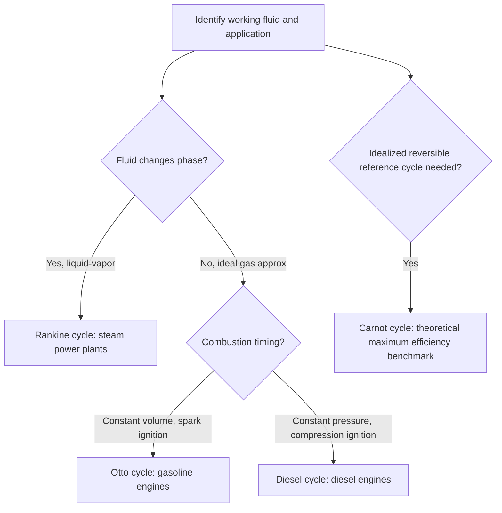

## Thermodynamic Processes and Cycles

### Definition and Physical Basis

A thermodynamic process describes the path by which a system changes from one equilibrium state to another, characterized by changes in state variables such as pressure ($P$), volume ($V$), and temperature ($T$). A thermodynamic cycle is a sequence of processes that returns the system to its original state, such that all state functions (including internal energy $U$ and entropy $S$) return to their initial values, while path-dependent quantities (heat $Q$ and work $W$) generally do not sum to zero.

### Quasi-Static and Reversible Processes

A **quasi-static process** proceeds through a continuous series of equilibrium states, slowly enough that the system remains arbitrarily close to internal equilibrium at every instant. This idealization allows state variables (like pressure) to be well-defined throughout the process, enabling analysis via equations of state.

A **reversible process** is a quasi-static process that can be reversed without leaving any net change in the system or surroundings — requiring the absence of dissipative effects such as friction, unrestrained expansion, or finite temperature differences during heat transfer. Real processes are always somewhat irreversible; reversibility is an idealized limiting case used to establish maximum theoretical efficiency bounds.

### The Four Fundamental Ideal Gas Processes

**Isochoric (constant volume) process**:

$$W = 0, \quad Q = \Delta U = nC_v\Delta T$$

On a $P$-$V$ diagram, represented as a vertical line. Since $V$ is constant, pressure and temperature vary proportionally (from the ideal gas law, $P \propto T$).

**Isobaric (constant pressure) process**:

$$W = P\Delta V = nR\Delta T, \quad Q = nC_p\Delta T, \quad \Delta U = nC_v\Delta T$$

Represented as a horizontal line on a $P$-$V$ diagram. Volume and temperature vary proportionally ($V \propto T$).

**Isothermal (constant temperature) process**:

$$\Delta U = 0, \quad Q = W = nRT\ln\left(\frac{V_2}{V_1}\right)$$

Represented as a hyperbolic curve ($PV = \text{constant}$) on a $P$-$V$ diagram.

**Adiabatic process** ($Q = 0$):

$$\Delta U = -W$$

$$PV^\gamma = \text{constant}, \quad \gamma = \frac{C_p}{C_v}$$

Represented as a steeper hyperbolic-like curve than the isothermal curve on a $P$-$V$ diagram, since $\gamma > 1$.

### Polytropic Processes (General Form)

Many real processes can be approximated by a general polytropic relation:

$$PV^n = \text{constant}$$

where $n$ is the polytropic index. Special cases:

- $n = 0$: isobaric process ($P$ = constant)
- $n = 1$: isothermal process (for ideal gas, since $PV = nRT$ = constant at fixed $T$)
- $n = \gamma$: adiabatic (isentropic) process
- $n \to \infty$: isochoric process (approached in the limit)

The work done in a polytropic process (for $n \neq 1$):

$$W = \frac{P_1V_1 - P_2V_2}{n - 1}$$

### Thermodynamic Cycles: General Concept

In a complete cycle, since $U$ is a state function:

$$\Delta U_{cycle} = 0 \implies Q_{net} = W_{net}$$

The net work done over a cycle corresponds to the enclosed area on a $P$-$V$ diagram. A **clockwise** cycle on a $P$-$V$ diagram represents a **heat engine** (net positive work output from net heat input), while a **counterclockwise** cycle represents a **refrigerator or heat pump** (net work input required to move heat from a cold to a hot reservoir).

### The Carnot Cycle

The Carnot cycle is an idealized, fully reversible cycle consisting of four processes, representing the theoretical maximum efficiency achievable between two temperature reservoirs:

1. **Isothermal expansion** at hot reservoir temperature $T_H$: heat $Q_H$ absorbed.
2. **Adiabatic expansion**: temperature drops from $T_H$ to $T_C$.
3. **Isothermal compression** at cold reservoir temperature $T_C$: heat $Q_C$ released.
4. **Adiabatic compression**: temperature rises back from $T_C$ to $T_H$.

**Carnot efficiency** (maximum possible efficiency between two reservoirs):

$$\eta_{Carnot} = 1 - \frac{T_C}{T_H}$$

where temperatures must be in Kelvin. This represents an upper bound on efficiency for any heat engine operating between these two temperatures, as established by the Second Law of Thermodynamics; no real engine can exceed this efficiency due to unavoidable irreversibilities. [Unverified — the Carnot limit is a rigorously derived theoretical bound, but claims about the achievable efficiency of specific real engines relative to this bound depend on engineering specifics]

### The Otto Cycle (Idealized Gasoline Engine)

The Otto cycle approximates the spark-ignition internal combustion engine, consisting of:

1. Isentropic (adiabatic reversible) compression
2. Isochoric heat addition (combustion, approximated as instantaneous)
3. Isentropic expansion (power stroke)
4. Isochoric heat rejection (exhaust)

**Otto cycle efficiency**:

$$\eta_{Otto} = 1 - \frac{1}{r^{\gamma - 1}}$$

where $r = V_1/V_2$ is the compression ratio.

### The Diesel Cycle

The Diesel cycle approximates compression-ignition engines, differing from the Otto cycle by modeling heat addition as occurring at **constant pressure** rather than constant volume (reflecting the more gradual combustion process in diesel engines):

1. Isentropic compression
2. Isobaric heat addition
3. Isentropic expansion
4. Isochoric heat rejection

**Diesel cycle efficiency**:

$$\eta_{Diesel} = 1 - \frac{1}{r^{\gamma-1}}\cdot\frac{r_c^\gamma - 1}{\gamma(r_c - 1)}$$

where $r$ is the compression ratio and $r_c$ is the cutoff ratio (ratio of volumes before and after heat addition).

### The Rankine Cycle (Steam Power Plants)

The Rankine cycle models the working fluid undergoing phase change (liquid-vapor), used in steam power plants:

1. Isentropic compression (feedwater pump)
2. Isobaric heat addition (boiler, including phase change to steam)
3. Isentropic expansion (turbine)
4. Isobaric heat rejection (condenser, phase change back to liquid)

Unlike the Otto and Diesel cycles, the Rankine cycle explicitly involves the working fluid changing phase, requiring analysis via steam tables or Mollier ($h$-$s$) diagrams rather than the ideal gas law alone.

### Example Calculation (Carnot Efficiency)

A Carnot engine operates between a hot reservoir at 500 K and a cold reservoir at 300 K. Find the maximum theoretical efficiency and the work output per cycle if 1000 J of heat is absorbed from the hot reservoir.

$$\eta_{Carnot} = 1 - \frac{T_C}{T_H} = 1 - \frac{300}{500} = 1 - 0.6 = 0.4 = 40\%$$

$$W = \eta \times Q_H = 0.4 \times 1000 = 400\text{ J}$$

$$Q_C = Q_H - W = 1000 - 400 = 600\text{ J}$$

The engine converts 400 J of the absorbed heat into work, while 600 J is necessarily rejected to the cold reservoir — no reversible engine operating between these two temperatures can do better.

**Example (Otto cycle)**: An Otto cycle engine has a compression ratio of 8, with air as the working fluid ($\gamma = 1.4$).

$$\eta_{Otto} = 1 - \frac{1}{8^{1.4-1}} = 1 - \frac{1}{8^{0.4}} = 1 - \frac{1}{2.297} \approx 1 - 0.435 = 0.565 = 56.5\%$$

[Inference — this is the idealized air-standard efficiency; real engines achieve substantially lower efficiency due to friction, heat losses, incomplete combustion, and non-ideal gas behavior]

### Diagram: P-V Diagram of a Carnot Cycle (svg_diagram)

<svg xmlns="http://www.w3.org/2000/svg" viewBox="0 0 480 300">
<text x="240" y="25" font-size="16" text-anchor="middle" font-weight="bold">Carnot Cycle P-V Diagram (svg_diagram)</text>
<line x1="60" y1="260" x2="60" y2="50" stroke="black" stroke-width="1.5" />
<line x1="60" y1="260" x2="440" y2="260" stroke="black" stroke-width="1.5" />
<text x="30" y="55" font-size="12">P</text>
<text x="430" y="280" font-size="12">V</text>
<path d="M100,80 C 150,90 200,110 260,140" fill="none" stroke="#c0392b" stroke-width="2" />
<text x="150" y="75" font-size="10" fill="#c0392b">1-2: isothermal exp (TH)</text>
<path d="M260,140 C 300,160 340,195 370,230" fill="none" stroke="#2980b9" stroke-width="2" />
<text x="330" y="170" font-size="10" fill="#2980b9">2-3: adiabatic exp</text>
<path d="M370,230 C 330,225 280,220 230,215" fill="none" stroke="#27ae60" stroke-width="2" />
<text x="250" y="245" font-size="10" fill="#27ae60">3-4: isothermal comp (TC)</text>
<path d="M230,215 C 190,190 140,140 100,80" fill="none" stroke="#8e44ad" stroke-width="2" />
<text x="120" y="160" font-size="10" fill="#8e44ad">4-1: adiabatic comp</text>
</svg>

### Diagram: Cycle Type Classification

### Applications

- **Internal combustion engine design**: Otto and Diesel cycle analysis guides compression ratio selection, balancing efficiency against practical constraints like knocking (Otto) or peak pressure limits (Diesel).
- **Power plant engineering**: Rankine cycle analysis (with reheat and regeneration variations) underlies the design of coal, nuclear, and combined-cycle power plants.
- **Refrigeration and air conditioning**: reversed Rankine-type cycles (vapor-compression refrigeration cycles) are analyzed using the same state-function principles, with a compressor providing net work input.
- **Efficiency benchmarking**: Carnot efficiency provides the theoretical upper bound against which all real heat engines and refrigeration cycles are compared, informing engineering targets and thermodynamic feasibility limits.
- **Gas turbine and jet engine analysis**: the Brayton cycle (not detailed above but structurally related) models gas turbine operation, using the same fundamental process-based framework.

### Common Misconceptions

- A cyclic process having $\Delta U_{cycle} = 0$ does not mean no net energy transfer occurs — it means net heat input equals net work output over the complete cycle, while individual stages within the cycle involve nonzero heat and work exchanges.
- The Carnot efficiency formula applies only to a reversible engine operating between exactly two constant-temperature reservoirs; it should not be applied directly to compute the efficiency of real engines with heat addition/rejection at varying temperatures (such as internal combustion engines), which use their own idealized cycle models (Otto, Diesel) instead.
- A higher compression ratio does not indefinitely increase efficiency in real engines — while the ideal Otto cycle efficiency increases with compression ratio, practical limits (engine knock, material stress, thermal losses) constrain achievable compression ratios in real designs. [Inference — practical constraints and their severity are engineering-specific and depend on fuel type, engine design, and operating conditions]
- Reversible and quasi-static are related but not strictly identical concepts — a quasi-static process can still be irreversible if dissipative effects (e.g., friction) are present, even though it proceeds through a sequence of near-equilibrium states.

**Related Topics**:

- First Law of Thermodynamics
- Second Law of Thermodynamics and Entropy
- Carnot's Theorem and Maximum Efficiency Limits
- Specific Heat Capacities and the Heat Capacity Ratio (gamma)
- Refrigeration Cycles and Coefficient of Performance
- Brayton Cycle and Gas Turbine Analysis