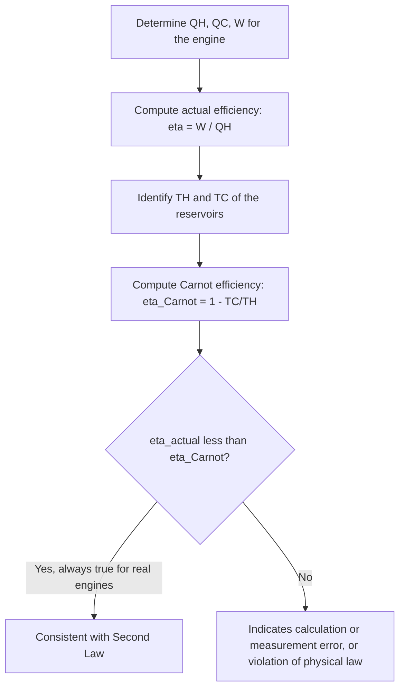

## Heat Engines and Efficiency

### Definition and Physical Basis

A heat engine is a device that converts thermal energy (heat) into mechanical work by operating cyclically between a high-temperature reservoir (heat source) and a low-temperature reservoir (heat sink). Because the working substance returns to its initial state after each cycle, the engine can operate continuously, repeatedly absorbing heat, performing work, and rejecting waste heat.

All heat engines operate under the constraints of both the First and Second Laws of Thermodynamics:

- **First Law**: energy is conserved — net work output equals net heat input over a complete cycle.
- **Second Law**: no heat engine can convert 100% of absorbed heat into work; some heat must always be rejected to a lower-temperature reservoir.

### General Heat Engine Model

A heat engine absorbs heat $Q_H$ from a hot reservoir at temperature $T_H$, converts a portion into net work $W$, and rejects the remaining heat $Q_C$ to a cold reservoir at temperature $T_C$.

By the First Law, applied over a complete cycle ($\Delta U_{cycle} = 0$):

$$W = Q_H - Q_C$$

### Thermal Efficiency

The **thermal efficiency** of a heat engine is defined as the ratio of net work output to heat input:

$$\eta = \frac{W}{Q_H} = \frac{Q_H - Q_C}{Q_H} = 1 - \frac{Q_C}{Q_H}$$

Efficiency is dimensionless, typically expressed as a percentage, and is always less than 1 (100%) for any real heat engine, since $Q_C > 0$ is unavoidable per the Second Law.

### The Second Law and the Impossibility of Perfect Engines

The **Kelvin-Planck statement** of the Second Law of Thermodynamics directly addresses heat engines:

**"It is impossible to construct a device that operates in a cycle and produces no effect other than the extraction of heat from a single reservoir and the performance of an equivalent amount of work."**

This rules out a hypothetical "perfect" heat engine ($\eta = 100\%$, or $Q_C = 0$), establishing that some heat rejection to a colder reservoir is an unavoidable consequence of cyclic operation, regardless of engineering improvements.

### Carnot's Theorem and Maximum Efficiency

**Carnot's theorem** states that no heat engine operating between two given temperature reservoirs can be more efficient than a reversible (Carnot) engine operating between the same two reservoirs, and all reversible engines operating between the same two reservoirs have identical efficiency, regardless of the working substance.

$$\eta_{Carnot} = 1 - \frac{T_C}{T_H}$$

(temperatures in Kelvin)

This represents the theoretical upper bound on efficiency for any heat engine operating between $T_H$ and $T_C$. Real engines, due to irreversibilities such as friction, non-quasi-static processes, and heat transfer across finite temperature differences, always achieve efficiencies below this Carnot limit.

$$\eta_{real} < \eta_{Carnot}$$

### Why Real Engines Fall Short of Carnot Efficiency

Sources of irreversibility that reduce real engine efficiency below the Carnot limit include:

- **Friction**: mechanical losses between moving parts convert useful work into waste heat.
- **Finite-rate heat transfer**: heat transfer across a finite temperature difference (rather than the idealized infinitesimal difference assumed in reversible processes) is inherently irreversible.
- **Throttling and unrestrained expansion**: rapid, non-quasi-static volume changes generate entropy without producing useful work.
- **Combustion irreversibility**: in internal combustion engines, the chemical reaction of combustion itself is a highly irreversible process.
- **Heat losses to the environment**: uninsulated components lose heat to surroundings that could otherwise contribute to useful work.

[Inference — the relative magnitude of each loss mechanism is engine- and application-specific and cannot be generalized without specific engineering data]

### Efficiency of Specific Cycle-Based Engines

**Otto cycle** (idealized spark-ignition engine):

$$\eta_{Otto} = 1 - \frac{1}{r^{\gamma-1}}$$

where $r$ is the compression ratio and $\gamma = C_p/C_v$.

**Diesel cycle** (idealized compression-ignition engine):

$$\eta_{Diesel} = 1 - \frac{1}{r^{\gamma-1}}\cdot\frac{r_c^\gamma - 1}{\gamma(r_c-1)}$$

where $r_c$ is the cutoff ratio.

**Rankine cycle** (steam power plant): efficiency is typically computed from enthalpy differences at each stage using steam tables, since the working fluid undergoes a phase change:

$$\eta_{Rankine} = \frac{W_{turbine} - W_{pump}}{Q_{boiler}} = \frac{(h_1 - h_2) - (h_4 - h_3)}{h_1 - h_4}$$

where subscripts refer to enthalpy states at the turbine inlet/outlet and pump inlet/outlet.

### Coefficient of Performance (Reversed Cycles)

For refrigerators and heat pumps (heat engines operating in reverse, requiring work input to move heat from cold to hot), efficiency is instead expressed as a **coefficient of performance (COP)**, which can exceed 1:

**Refrigerator COP** (goal: remove heat $Q_C$ from the cold space using work $W$):

$$COP_{ref} = \frac{Q_C}{W} = \frac{Q_C}{Q_H - Q_C}$$

**Heat pump COP** (goal: deliver heat $Q_H$ to the warm space using work $W$):

$$COP_{HP} = \frac{Q_H}{W} = \frac{Q_H}{Q_H - Q_C}$$

For a Carnot (reversible) refrigerator or heat pump:

$$COP_{Carnot,ref} = \frac{T_C}{T_H - T_C}, \quad COP_{Carnot,HP} = \frac{T_H}{T_H - T_C}$$

### Example Calculation

A heat engine absorbs 800 J of heat from a hot reservoir and rejects 500 J to a cold reservoir. Find the work output and thermal efficiency.

$$W = Q_H - Q_C = 800 - 500 = 300\text{ J}$$

$$\eta = \frac{W}{Q_H} = \frac{300}{800} = 0.375 = 37.5\%$$

**Example (Carnot comparison)**: The engine above operates between reservoirs at $T_H = 600\text{ K}$ and $T_C = 350\text{ K}$. Find the Carnot efficiency and compare.

$$\eta_{Carnot} = 1 - \frac{350}{600} = 1 - 0.583 = 0.417 = 41.7\%$$

Since $37.5\% < 41.7\%$, the real engine operates below the Carnot limit, as required by the Second Law — the difference (4.2 percentage points) reflects irreversibilities in the real engine's operation.

**Example (COP calculation)**: A refrigerator removes 400 J of heat from its interior using 150 J of work input. Find its COP and compare to the Carnot refrigerator limit if $T_C = 270\text{ K}$ and $T_H = 300\text{ K}$.

$$COP_{ref} = \frac{Q_C}{W} = \frac{400}{150} \approx 2.67$$

$$COP_{Carnot,ref} = \frac{T_C}{T_H - T_C} = \frac{270}{30} = 9.0$$

The real refrigerator's COP (2.67) is well below the theoretical Carnot maximum (9.0), indicating substantial room for efficiency improvement, though practical refrigerants and compressor designs impose real limitations not captured by the ideal reversible model. [Inference — the specific gap between real and Carnot COP varies significantly by refrigerant, compressor technology, and operating conditions]

### Diagram: Heat Engine Energy Flow (svg_diagram)

<svg xmlns="http://www.w3.org/2000/svg" viewBox="0 0 480 320">
<text x="240" y="25" font-size="16" text-anchor="middle" font-weight="bold">Heat Engine Energy Flow (svg_diagram)</text>
<rect x="150" y="30" width="180" height="50" fill="#e74c3c" opacity="0.7" />
<text x="240" y="60" font-size="13" text-anchor="middle" fill="white">Hot Reservoir (TH)</text>
<rect x="150" y="240" width="180" height="50" fill="#3498db" opacity="0.7" />
<text x="240" y="270" font-size="13" text-anchor="middle" fill="white">Cold Reservoir (TC)</text>
<circle cx="240" cy="160" r="55" fill="#f1c40f" opacity="0.8" stroke="#333" stroke-width="2" />
<text x="240" y="165" font-size="13" text-anchor="middle">Engine</text>
<line x1="240" y1="80" x2="240" y2="105" stroke="black" stroke-width="2" marker-end="url(#earrow)" />
<text x="270" y="95" font-size="11">QH</text>
<line x1="240" y1="215" x2="240" y2="240" stroke="black" stroke-width="2" marker-end="url(#earrow)" />
<text x="270" y="230" font-size="11">QC</text>
<line x1="295" y1="160" x2="380" y2="160" stroke="black" stroke-width="2" marker-end="url(#earrow)" />
<text x="340" y="150" font-size="11">W</text>
</svg>

### Diagram: Heat Engine Efficiency Evaluation Flow

### Applications

- **Automotive engineering**: internal combustion engine design targets improved thermal efficiency through higher compression ratios, turbocharging, and reduced friction, all bounded by Otto/Diesel cycle theoretical limits.
- **Power plant design**: thermal power plants (coal, nuclear, natural gas) are evaluated using Rankine cycle efficiency, with techniques like reheat and regeneration used to push efficiency closer to the Carnot limit.
- **HVAC and refrigeration**: coefficient of performance (COP) is the standard efficiency metric for air conditioners, refrigerators, and heat pumps, directly informing energy consumption and cost.
- **Combined-cycle power generation**: pairing a gas turbine (Brayton cycle) with a steam turbine (Rankine cycle) using waste heat recovery increases overall system efficiency beyond what either cycle alone achieves.
- **Renewable energy and waste heat recovery**: organic Rankine cycle (ORC) systems use heat engine principles to convert low-grade waste heat (e.g., geothermal, industrial waste heat) into usable electricity.

### Common Misconceptions

- Higher heat input ($Q_H$) alone does not guarantee higher efficiency — efficiency depends on the *ratio* of work output to heat input, and on the temperature difference between reservoirs, not on the absolute magnitude of heat supplied.
- A coefficient of performance (COP) greater than 1 for refrigerators and heat pumps does not violate the First Law — COP relates useful heat transfer to work input, and heat pumps/refrigerators move existing thermal energy rather than creating energy; the moved heat plus the work input together satisfy energy conservation.
- The Carnot efficiency formula is a theoretical maximum, not a design target achievable in practice — real engines cannot reach Carnot efficiency due to unavoidable irreversibilities, and it should be used only for comparative and theoretical bounding purposes, not as an expected real-world value.
- Efficiency and power output are distinct concepts — a highly efficient engine is not necessarily a high-power engine, and engineering designs often trade off some efficiency for greater power density or other practical constraints. [Inference — the specific trade-off magnitude depends on the particular application and design constraints]

**Related Topics**:

- Thermodynamic Processes and Cycles (Carnot, Otto, Diesel, Rankine)
- Second Law of Thermodynamics and Entropy
- Refrigeration Cycles and Coefficient of Performance
- Carnot's Theorem and Reversibility
- Exergy and Availability Analysis
- Combined Cycle and Cogeneration Systems