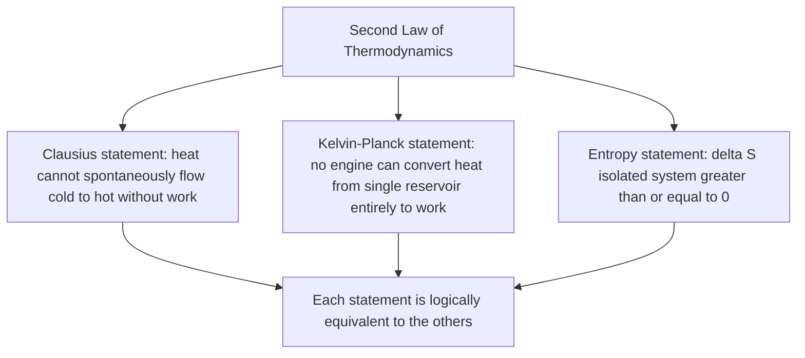

## The Second Law of Thermodynamics

### Definition and Physical Basis

The Second Law of Thermodynamics establishes the directionality of spontaneous physical processes, asserting that certain energy transformations are fundamentally irreversible in isolated systems. While the First Law governs energy conservation without restricting the direction of processes, the Second Law introduces the concept of **entropy** to explain why some processes occur spontaneously in one direction but never spontaneously reverse (e.g., heat flows from hot to cold, never spontaneously from cold to hot).

### Entropy: Definition

Entropy ($S$) is a state function that quantifies the degree of disorder, randomness, or the number of accessible microscopic configurations (microstates) consistent with a system's macroscopic state. For a reversible process, the infinitesimal change in entropy is defined as:

$$dS = \frac{\delta Q_{rev}}{T}$$

where $\delta Q_{rev}$ is the heat transferred reversibly and $T$ is the absolute temperature at which the transfer occurs. For a finite reversible process:

$$\Delta S = \int \frac{\delta Q_{rev}}{T}$$

Because entropy is a state function, $\Delta S$ between two states is path-independent, even though the equation above uses a specific reversible path to calculate it — the actual process connecting the states may be irreversible, but $\Delta S$ can still be computed using any convenient reversible path between the same two states.

### Statistical Interpretation (Boltzmann's Formula)

From statistical mechanics, entropy relates to the number of microscopic arrangements ($\Omega$) corresponding to a given macroscopic state:

$$S = k_B \ln \Omega$$

where $k_B$ is the Boltzmann constant ($1.380649 \times 10^{-23}\text{ J/K}$). This formulation reveals entropy as a measure of the multiplicity of microstates: systems spontaneously evolve toward macrostates with a greater number of accessible microstates, since such macrostates are overwhelmingly more probable.

### Statements of the Second Law

The Second Law has several equivalent formulations, each highlighting a different aspect of the same underlying principle:

**Clausius statement**: Heat cannot spontaneously flow from a colder body to a hotter body without external work being performed on the system.

**Kelvin-Planck statement**: It is impossible to construct a device operating in a cycle that produces no effect other than extracting heat from a single reservoir and converting it entirely into work.

**Entropy statement**: The total entropy of an isolated system can never decrease over time; it either increases (for irreversible processes) or remains constant (for idealized reversible processes):

$$\Delta S_{isolated} \geq 0$$

These statements can each be shown to be logically equivalent — a violation of one implies a violation of the others.

### Entropy Change in Reversible vs. Irreversible Processes

For an isolated system (no heat or matter exchange with surroundings):

- **Reversible process**: $\Delta S_{isolated} = 0$ (entropy remains constant)
- **Irreversible (real) process**: $\Delta S_{isolated} > 0$ (entropy strictly increases)

For a system exchanging heat with its surroundings, the total entropy change of the **universe** (system + surroundings) must satisfy:

$$\Delta S_{universe} = \Delta S_{system} + \Delta S_{surroundings} \geq 0$$

A system's own entropy can decrease (e.g., water freezing into ice, a highly ordered structure), but only if the entropy increase of the surroundings compensates, resulting in a non-negative total entropy change.

### Entropy Change Calculations for Common Processes

**Isothermal process** (ideal gas, reversible):

$$\Delta S = nR\ln\left(\frac{V_2}{V_1}\right)$$

**Constant volume heating/cooling**:

$$\Delta S = nC_v\ln\left(\frac{T_2}{T_1}\right)$$

**Constant pressure heating/cooling**:

$$\Delta S = nC_p\ln\left(\frac{T_2}{T_1}\right)$$

**Phase change at constant temperature** (e.g., melting, vaporization):

$$\Delta S = \frac{Q}{T} = \frac{mL}{T}$$

where $L$ is the latent heat of the phase transition.

**Heat transfer between two bodies** (irreversible, finite temperature difference): the total entropy change of both bodies combined is always positive, reflecting the irreversibility of heat flow across a finite temperature gradient.

### Example Calculation

1 kg of ice at 0°C (273.15 K) melts completely into water at the same temperature. Find the entropy change. ($L_{fusion} = 334{,}000\text{ J/kg}$)

$$\Delta S = \frac{Q}{T} = \frac{mL}{T} = \frac{(1)(334{,}000)}{273.15} \approx 1222.7\text{ J/K}$$

The entropy of the ice-water system increases as the highly ordered ice crystal structure transitions into the less ordered liquid state.

**Example (heat transfer between two bodies)**: 1000 J of heat flows from a hot reservoir at 400 K to a cold reservoir at 300 K (irreversibly, across a finite temperature difference). Find the total entropy change of the universe.

Entropy lost by hot reservoir:

$$\Delta S_H = \frac{-Q}{T_H} = \frac{-1000}{400} = -2.5\text{ J/K}$$

Entropy gained by cold reservoir:

$$\Delta S_C = \frac{Q}{T_C} = \frac{1000}{300} \approx 3.33\text{ J/K}$$

Total entropy change:

$$\Delta S_{total} = -2.5 + 3.33 = 0.83\text{ J/K} > 0$$

The positive total entropy change confirms the process is irreversible, consistent with the Second Law — heat flowing spontaneously between reservoirs at different temperatures always increases total entropy.

### Second Law Constraints on Heat Engines and Refrigerators

The Second Law directly implies the **Carnot efficiency limit** for heat engines:

$$\eta \leq \eta_{Carnot} = 1 - \frac{T_C}{T_H}$$

and the corresponding limit on coefficient of performance for refrigerators and heat pumps. These limits arise because any engine or refrigerator exceeding the Carnot bound would require a net decrease in total entropy, violating $\Delta S_{universe} \geq 0$.

### Entropy and the Arrow of Time

The Second Law is often cited as providing a physical basis for the perceived directionality of time (the "arrow of time"), since entropy-increasing processes define a preferred temporal direction at the macroscopic scale, even though the underlying microscopic laws of mechanics (Newtonian or quantum) are time-reversible. [Speculation — the precise relationship between thermodynamic entropy and the fundamental nature of time remains a subject of ongoing philosophical and physical discussion, and interpretations vary]

### Diagram: Entropy and Heat Flow Directionality (svg_diagram)

<svg xmlns="http://www.w3.org/2000/svg" viewBox="0 0 480 260">
<text x="240" y="25" font-size="16" text-anchor="middle" font-weight="bold">Second Law: Entropy and Heat Flow (svg_diagram)</text>
<rect x="60" y="60" width="140" height="90" fill="#e74c3c" opacity="0.7" />
<text x="130" y="110" font-size="13" text-anchor="middle" fill="white">Hot (TH)</text>
<rect x="280" y="60" width="140" height="90" fill="#3498db" opacity="0.7" />
<text x="350" y="110" font-size="13" text-anchor="middle" fill="white">Cold (TC)</text>
<line x1="205" y1="105" x2="275" y2="105" stroke="black" stroke-width="3" marker-end="url(#sarrow)" />
<text x="240" y="95" font-size="12">Q (spontaneous)</text>
<line x1="275" y1="140" x2="205" y2="140" stroke="#c0392b" stroke-width="2" stroke-dasharray="5" marker-end="url(#sarrow)" />
<text x="240" y="160" font-size="11" fill="#c0392b">Never spontaneous</text>
<text x="240" y="220" font-size="12" text-anchor="middle">Delta S_universe &gt;= 0 for all real processes</text>
</svg>

### Diagram: Second Law Statement Equivalence

### Applications

- **Heat engine and refrigeration efficiency limits**: the Second Law establishes the Carnot efficiency and COP bounds that define maximum achievable performance for all real thermal systems.
- **Chemical thermodynamics and spontaneity**: entropy considerations, combined with enthalpy via Gibbs free energy ($\Delta G = \Delta H - T\Delta S$), determine whether chemical reactions proceed spontaneously.
- **Information theory**: Claude Shannon's definition of information entropy is mathematically analogous to thermodynamic entropy, influencing fields from data compression to statistical inference. [Unverified — the depth and physical significance of this analogy versus a purely mathematical parallel is a matter of ongoing interpretation in the literature]
- **Cosmology**: entropy considerations underlie discussions of the thermodynamic evolution of the universe, including the concept of "heat death" as a theoretical long-term entropy-maximized state. [Speculation — this is a theoretical extrapolation based on current cosmological models, not an empirically confirmed outcome]
- **Materials science and phase transitions**: entropy changes govern the thermodynamics of phase transitions, alloy formation, and mixing processes.

### Common Misconceptions

- The Second Law does not forbid a *local* decrease in entropy — a system's entropy can decrease (e.g., refrigeration, biological organization, crystallization) provided the entropy of its surroundings increases by at least as much, keeping total (universe) entropy non-decreasing.
- "Disorder" is a useful but imprecise colloquial description of entropy; the more precise statistical definition relates to the number of accessible microstates consistent with a given macrostate, which does not always align intuitively with everyday notions of visual disorder.
- The Second Law does not imply that entropy increases at a constant or uniform rate — the rate and magnitude of entropy production depend entirely on the specific irreversibilities present in a given process.
- Living organisms do not violate the Second Law by maintaining internal order — organisms are open systems that export entropy to their surroundings (e.g., via heat dissipation and waste), consistent with $\Delta S_{universe} \geq 0$ overall.

**Related Topics**:

- First Law of Thermodynamics
- Heat Engines and Efficiency (Carnot's Theorem)
- Gibbs Free Energy and Chemical Spontaneity
- Statistical Mechanics and the Boltzmann Distribution
- Third Law of Thermodynamics
- Entropy and Information Theory