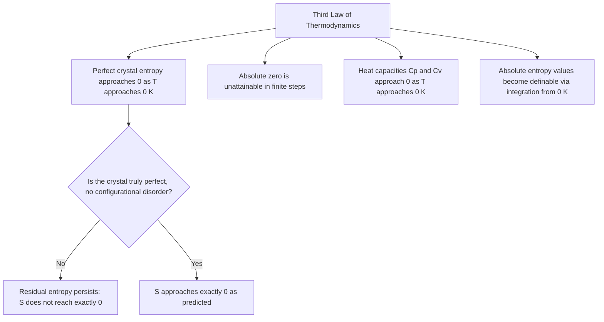

## The Third Law of Thermodynamics

### Definition and Statement

The Third Law of Thermodynamics establishes the behavior of entropy as a system's temperature approaches absolute zero. It is most commonly stated as:

**The entropy of a perfect crystalline substance approaches zero as its absolute temperature approaches zero.**

$$\lim_{T \to 0} S = 0 \quad \text{(for a perfect crystal)}$$

An equivalent and often more practically useful formulation, due to Walther Nernst (sometimes called the **Nernst heat theorem**), states:

**It is impossible for any process, no matter how idealized, to reduce the entropy of a system to its absolute-zero value in a finite number of steps or in finite time.**

This second formulation implies that absolute zero itself is unattainable through any real physical process, though temperatures extremely close to it can be approached.

### Physical Basis

At absolute zero (0 K), a system in its ground state has no thermal energy available for random molecular motion. For a **perfect crystal** — one with a completely ordered, unique atomic arrangement — there is only a single possible microscopic configuration ($\Omega = 1$) consistent with this state. Applying the Boltzmann statistical definition of entropy:

$$S = k_B \ln \Omega = k_B \ln(1) = 0$$

This provides the statistical mechanical justification for the Third Law: a perfectly ordered crystal at 0 K has zero entropy because there is exactly one way to arrange its constituent particles.

### Residual Entropy: An Important Exception

Real substances do not always reach exactly zero entropy as $T \to 0$, particularly if they possess some form of structural or configurational disorder that persists even in the limit of zero temperature. This is called **residual entropy**.

**Example**: Carbon monoxide (CO) crystals can exhibit residual entropy because the nearly symmetric CO molecule can orient in either of two nearly equivalent directions within the crystal lattice, leading to a frozen-in disorder that does not vanish even at very low temperatures. [Unverified — the precise magnitude of residual entropy in specific substances is measured experimentally and varies by material; CO is a commonly cited illustrative example in thermodynamics texts]

Residual entropy does not violate the Third Law in its strict sense — it simply reflects that the substance in question is not a truly "perfect" crystal in the idealized sense the law describes, since perfect crystalline order (a single, unique ground-state configuration) is not achieved.

### Consequences of the Third Law

**1. Unattainability of absolute zero**: As a system's temperature approaches 0 K, extracting further entropy (heat) becomes progressively more difficult, requiring an increasing (in the limit, infinite) number of steps or amount of work. This is why absolute zero serves as an asymptotic limit rather than a reachable endpoint.

**2. Vanishing heat capacities at low temperature**: The Third Law implies that heat capacities ($C_p$ and $C_v$) must approach zero as $T \to 0$:

$$\lim_{T\to 0} C_p = 0, \quad \lim_{T\to 0} C_v = 0$$

This follows because $C = T\left(\frac{\partial S}{\partial T}\right)$, and if $S$ approaches a finite (or zero) value smoothly as $T \to 0$, the derivative $\partial S/\partial T$ must not diverge faster than $1/T$, constraining the low-temperature behavior of heat capacity. This prediction has been experimentally confirmed for numerous materials at low temperatures. [Unverified — while this behavior is well established for many materials, precise low-temperature heat capacity behavior can be complex and system-dependent, particularly near phase transitions or in materials with unusual quantum properties]

**3. Absolute entropy values**: Because the Third Law provides a natural zero-point reference ($S = 0$ at $T = 0$ for a perfect crystal), it becomes possible to define **absolute entropy** values for substances at any temperature, calculated by integrating heat capacity data from 0 K up to the temperature of interest:

$$S(T) = \int_0^T \frac{C_p(T')}{T'}dT'$$

This is in contrast to internal energy or enthalpy, which are typically defined only relative to an arbitrary reference state, since no natural absolute zero-point exists for those quantities.

### Approaching Absolute Zero: Experimental Techniques

Laboratory techniques used to cool systems to extremely low temperatures (though never reaching exactly 0 K) include:

- **Evaporative cooling**: removing the highest-energy particles from a sample, lowering the average energy (and thus temperature) of the remainder.
- **Laser cooling**: using carefully tuned laser light to slow atomic motion via momentum transfer from photon absorption/emission cycles.
- **Adiabatic demagnetization**: exploiting the temperature change of certain paramagnetic materials when an external magnetic field is removed adiabatically.
- **Dilution refrigeration**: using the mixing entropy of helium-3/helium-4 mixtures to achieve millikelvin temperatures.

[Unverified — specific record-low temperatures achieved in physics research change as experimental techniques advance and are not fixed facts suitable for a stable reference]

### Diagram: Entropy Approaching Zero at Absolute Zero (svg_diagram)

<svg xmlns="http://www.w3.org/2000/svg" viewBox="0 0 480 280">
<text x="240" y="25" font-size="16" text-anchor="middle" font-weight="bold">Third Law: Entropy vs Temperature (svg_diagram)</text>
<line x1="60" y1="240" x2="60" y2="50" stroke="black" stroke-width="1.5" />
<line x1="60" y1="240" x2="440" y2="240" stroke="black" stroke-width="1.5" />
<text x="30" y="55" font-size="12">S</text>
<text x="430" y="260" font-size="12">T</text>
<path d="M60,220 C 120,200 200,140 300,90 C 350,65 400,55 430,50" fill="none" stroke="#2980b9" stroke-width="2" />
<text x="250" y="70" font-size="11" fill="#2980b9">Perfect crystal: S -&gt; 0 as T -&gt; 0</text>
<path d="M60,190 C 120,175 200,120 300,80 C 350,58 400,48 430,45" fill="none" stroke="#c0392b" stroke-width="2" stroke-dasharray="5" />
<text x="130" y="165" font-size="11" fill="#c0392b">Residual entropy: S -&gt; S0 &gt; 0</text>
<circle cx="60" cy="220" r="4" fill="#2980b9" />
<circle cx="60" cy="190" r="4" fill="#c0392b" />
<text x="65" y="235" font-size="10">0 K</text>
</svg>

### Diagram: Third Law Implications

### Applications

- **Cryogenics and low-temperature physics research**: understanding the Third Law's implications guides experimental design for reaching ultra-low temperatures, including techniques like adiabatic demagnetization and dilution refrigeration.
- **Thermochemistry and standard entropy tables**: the Third Law enables the tabulation of absolute standard molar entropies for chemical substances, essential for calculating reaction entropy changes and Gibbs free energy in chemical thermodynamics.
- **Materials science**: residual entropy measurements provide insight into structural disorder, glass transitions, and non-equilibrium configurations frozen into materials during rapid cooling.
- **Quantum computing and condensed matter physics**: many quantum computing platforms (e.g., superconducting qubits) require operation at temperatures approaching absolute zero to minimize thermal noise and preserve quantum coherence, directly motivated by Third Law-related low-temperature behavior.
- **Superconductivity and superfluidity research**: study of quantum phenomena that emerge only at extremely low temperatures relies on the experimental techniques developed to approach (but never reach) absolute zero.

### Common Misconceptions

- The Third Law does not state that all substances have exactly zero entropy at very low temperatures — it applies strictly to idealized *perfect* crystals; real materials with structural disorder can retain nonzero residual entropy even as $T \to 0$.
- Absolute zero (0 K) is not simply "very cold" — it represents a theoretical limit that is fundamentally unattainable through any finite physical process, not merely a practically difficult temperature to reach with current technology.
- The Third Law is distinct from (though related to) the general statement that entropy tends to increase (Second Law); the Third Law specifically concerns the *absolute reference point* of entropy at 0 K, not the direction of entropy change in ordinary spontaneous processes.
- Reaching temperatures very close to absolute zero in laboratory settings does not mean absolute zero itself has been reached or is close to being reached in a physically meaningful sense — the asymptotic unattainability described by the Third Law remains a fundamental physical constraint regardless of experimental precision.

**Related Topics**:

- Second Law of Thermodynamics and Entropy
- Statistical Mechanics and the Boltzmann Distribution
- Absolute Entropy and Standard Thermodynamic Tables
- Cryogenics and Low-Temperature Physics Techniques
- Heat Capacity and the Debye Model of Solids
- Superconductivity and Superfluidity