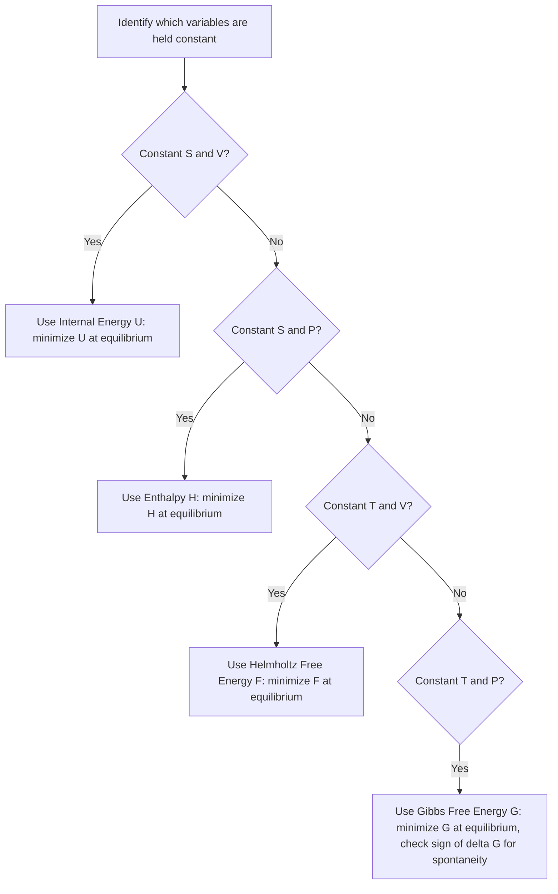

## Thermodynamic Potentials and Free Energy

### Definition and Physical Basis

Thermodynamic potentials are state functions that represent the energy of a system available for conversion into useful work under specific constraints (constant volume, pressure, temperature, or entropy). Each potential is constructed via a Legendre transformation of internal energy, exchanging one natural variable for its conjugate to make the potential more convenient for analyzing processes under particular experimental conditions. The four principal thermodynamic potentials are internal energy, enthalpy, Helmholtz free energy, and Gibbs free energy.

### Internal Energy (U)

Internal energy is the fundamental thermodynamic potential, with natural variables entropy $S$ and volume $V$:

$$dU = TdS - PdV$$

$$U = U(S, V)$$

From this differential, the following relations follow directly:

$$T = \left(\frac{\partial U}{\partial S}\right)_V, \quad P = -\left(\frac{\partial U}{\partial V}\right)_S$$

Internal energy is most naturally suited to analyzing isolated or constant-entropy, constant-volume systems.

### Enthalpy (H)

Enthalpy is defined via a Legendre transform of $U$, exchanging volume for pressure as the natural variable:

$$H = U + PV$$

$$dH = TdS + VdP$$

$$H = H(S, P)$$

Enthalpy is most useful for processes at **constant pressure**, common in chemistry and engineering (open beakers, atmospheric-pressure reactions, flow processes). At constant pressure:

$$\Delta H = Q_p$$

meaning the enthalpy change directly equals the heat absorbed or released during a constant-pressure process — the basis for using enthalpy in calorimetry and reaction thermochemistry.

### Helmholtz Free Energy (F or A)

The Helmholtz free energy is defined via a Legendre transform exchanging entropy for temperature:

$$F = U - TS$$

$$dF = -SdT - PdV$$

$$F = F(T, V)$$

Helmholtz free energy represents the maximum work extractable from a system at **constant temperature and volume**:

$$W_{max} = -\Delta F \quad \text{(at constant T, V)}$$

It is particularly useful in statistical mechanics and for systems held at constant volume (e.g., processes in rigid, sealed containers) and constant temperature (in contact with a thermal reservoir).

### Gibbs Free Energy (G)

The Gibbs free energy is defined by a further Legendre transform, exchanging both entropy for temperature and volume for pressure:

$$G = H - TS = U + PV - TS$$

$$dG = -SdT + VdP$$

$$G = G(T, P)$$

Gibbs free energy is the most widely used thermodynamic potential in chemistry, since most laboratory and industrial processes occur at **constant temperature and pressure**. The change in Gibbs free energy determines the spontaneity of a process under these conditions:

$$\Delta G = \Delta H - T\Delta S$$

- $\Delta G < 0$: process is spontaneous (exergonic)
- $\Delta G > 0$: process is non-spontaneous (endergonic) under the given conditions
- $\Delta G = 0$: system is at equilibrium

The maximum non-expansion (e.g., electrical or chemical) work obtainable from a process at constant $T$, $P$ equals $-\Delta G$.

### Summary Table of Thermodynamic Potentials

| Potential | Definition | Natural Variables | Differential | Minimized/Useful At |
| --- | --- | --- | --- | --- |
| Internal Energy ($U$) | — | $S, V$ | $dU = TdS - PdV$ | Constant $S, V$ |
| Enthalpy ($H$) | $U + PV$ | $S, P$ | $dH = TdS + VdP$ | Constant $S, P$ |
| Helmholtz ($F$) | $U - TS$ | $T, V$ | $dF = -SdT - PdV$ | Constant $T, V$ |
| Gibbs ($G$) | $H - TS$ | $T, P$ | $dG = -SdT + VdP$ | Constant $T, P$ |

### The Maxwell Relations

Because each thermodynamic potential is an exact differential (as a state function), the equality of mixed second partial derivatives yields the **Maxwell relations** — a set of relationships connecting seemingly unrelated partial derivatives of state variables, useful for expressing hard-to-measure quantities (like entropy derivatives) in terms of measurable ones (like $P$, $V$, $T$):

$$\left(\frac{\partial T}{\partial V}\right)_S = -\left(\frac{\partial P}{\partial S}\right)_V \quad \text{(from } U\text{)}$$

$$\left(\frac{\partial T}{\partial P}\right)_S = \left(\frac{\partial V}{\partial S}\right)_P \quad \text{(from } H\text{)}$$

$$\left(\frac{\partial S}{\partial V}\right)_T = \left(\frac{\partial P}{\partial T}\right)_V \quad \text{(from } F\text{)}$$

$$\left(\frac{\partial S}{\partial P}\right)_T = -\left(\frac{\partial V}{\partial T}\right)_P \quad \text{(from } G\text{)}$$

### Spontaneity and Equilibrium Criteria

Each thermodynamic potential provides a minimization criterion for equilibrium under its respective constant natural variables, derived from the Second Law:

- At constant $S, V$: a system spontaneously evolves to minimize $U$.
- At constant $S, P$: a system spontaneously evolves to minimize $H$.
- At constant $T, V$: a system spontaneously evolves to minimize $F$.
- At constant $T, P$: a system spontaneously evolves to minimize $G$.

At equilibrium under the relevant constraints, the corresponding potential reaches a minimum value, and further spontaneous change ceases.

### Example Calculation

A chemical reaction has $\Delta H = -150\text{ kJ/mol}$ and $\Delta S = -60\text{ J/(mol·K)}$ at 298 K. Determine if the reaction is spontaneous at this temperature.

$$\Delta G = \Delta H - T\Delta S = -150{,}000 - (298)(-60)$$

$$\Delta G = -150{,}000 + 17{,}880 = -132{,}120\text{ J/mol} = -132.12\text{ kJ/mol}$$

Since $\Delta G < 0$, the reaction is spontaneous at 298 K, despite the unfavorable (negative) entropy change — the large negative enthalpy change dominates.

**Example (temperature-dependent spontaneity)**: Find the temperature above which the same reaction becomes non-spontaneous.

At the crossover point, $\Delta G = 0$:

$$0 = \Delta H - T\Delta S \implies T = \frac{\Delta H}{\Delta S} = \frac{-150{,}000}{-60} = 2500\text{ K}$$

Since both $\Delta H$ and $\Delta S$ are negative, the reaction remains spontaneous ($\Delta G < 0$) at all temperatures below 2500 K, and becomes non-spontaneous above this temperature — because at high $T$, the $-T\Delta S$ term (positive, since $\Delta S < 0$) grows large enough to outweigh the favorable (negative) enthalpy term.

**Example (Helmholtz free energy, maximum work)**: An isothermal process at 300 K has $\Delta U = -500\text{ J}$ and $\Delta S = -1.2\text{ J/K}$ for the system. Find the maximum work extractable at constant $T, V$.

$$\Delta F = \Delta U - T\Delta S = -500 - (300)(-1.2) = -500 + 360 = -140\text{ J}$$

$$W_{max} = -\Delta F = 140\text{ J}$$

### Diagram: Thermodynamic Potential Relationships (svg_diagram)

<svg xmlns="http://www.w3.org/2000/svg" viewBox="0 0 480 320">
<text x="240" y="25" font-size="16" text-anchor="middle" font-weight="bold">Thermodynamic Potentials (svg_diagram)</text>
<rect x="180" y="50" width="120" height="50" fill="#cfe8f7" stroke="#2a6f97" stroke-width="2" />
<text x="240" y="80" font-size="13" text-anchor="middle">U(S,V)</text>
<rect x="40" y="150" width="120" height="50" fill="#f7c59f" stroke="#333" stroke-width="2" />
<text x="100" y="180" font-size="13" text-anchor="middle">H(S,P)</text>
<rect x="320" y="150" width="120" height="50" fill="#c9e4ca" stroke="#333" stroke-width="2" />
<text x="380" y="180" font-size="13" text-anchor="middle">F(T,V)</text>
<rect x="180" y="250" width="120" height="50" fill="#e8c9e4" stroke="#333" stroke-width="2" />
<text x="240" y="280" font-size="13" text-anchor="middle">G(T,P)</text>
<line x1="220" y1="100" x2="130" y2="150" stroke="black" marker-end="url(#tarrow)" />
<text x="150" y="120" font-size="9">+PV</text>
<line x1="260" y1="100" x2="360" y2="150" stroke="black" marker-end="url(#tarrow)" />
<text x="320" y="120" font-size="9">-TS</text>
<line x1="120" y1="200" x2="210" y2="250" stroke="black" marker-end="url(#tarrow)" />
<text x="140" y="230" font-size="9">-TS</text>
<line x1="360" y1="200" x2="270" y2="250" stroke="black" marker-end="url(#tarrow)" />
<text x="300" y="230" font-size="9">+PV</text>
</svg>

### Diagram: Choosing the Correct Potential

### Applications

- **Chemical reaction spontaneity and equilibrium**: Gibbs free energy is the standard criterion used throughout chemistry to predict whether reactions proceed spontaneously and to calculate equilibrium constants ($\Delta G° = -RT\ln K$).
- **Phase equilibrium and phase diagrams**: Gibbs free energy differences between phases determine phase transition conditions (melting points, boiling points) and are fundamental to constructing phase diagrams.
- **Electrochemistry**: Gibbs free energy directly relates to cell potential in electrochemical cells ($\Delta G = -nFE$), foundational to battery and fuel cell design.
- **Statistical mechanics and condensed matter physics**: Helmholtz free energy is the natural potential connecting microscopic partition functions to macroscopic thermodynamic properties in canonical ensemble theory.
- **Materials science**: free energy minimization principles govern phase transformations, alloy phase diagrams, and the stability of crystal structures.

### Common Misconceptions

- A negative $\Delta H$ (exothermic reaction) does not guarantee spontaneity — spontaneity depends on $\Delta G$, which incorporates both enthalpy and entropy contributions; some exothermic reactions can be non-spontaneous if $\Delta S$ is sufficiently negative and $T$ is high enough.
- Gibbs free energy and Helmholtz free energy are not interchangeable — Gibbs free energy applies to constant temperature and pressure conditions, while Helmholtz free energy applies to constant temperature and volume; using the wrong potential for a given set of constraints leads to incorrect spontaneity or work predictions.
- $\Delta G = 0$ does not mean "nothing is happening" — it specifically indicates the system is at equilibrium under the given constant $T, P$ conditions, where forward and reverse process rates are balanced (in a dynamic equilibrium sense), not that all molecular activity has ceased.
- The "maximum work" interpretation of free energy changes represents a theoretical upper bound achievable only under reversible conditions; real processes extract less useful work due to irreversibilities. [Inference — the specific gap between theoretical maximum and real extracted work is process- and system-dependent]

**Related Topics**:

- Second Law of Thermodynamics and Entropy
- First Law of Thermodynamics and Enthalpy
- Chemical Equilibrium and the Equilibrium Constant
- Maxwell Relations and Thermodynamic Derivatives
- Statistical Mechanics and Partition Functions
- Electrochemistry and Cell Potentials