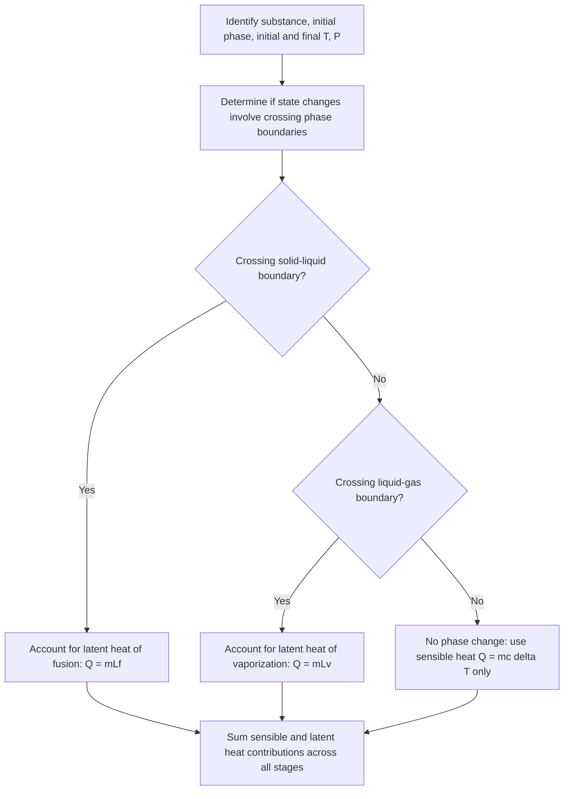

## Phase Transitions and Phase Diagrams

### Definition and Physical Basis

A phase transition is a transformation of a substance from one state of matter (phase) to another — such as solid, liquid, gas, or plasma — occurring at specific conditions of temperature and pressure. Phase transitions involve discontinuous or singular changes in one or more thermodynamic properties (such as density, entropy, or heat capacity) and are governed by the underlying free energy landscape of the substance, with the stable phase at any given condition being the one with the lowest Gibbs free energy.

### Common Phase Transitions

- **Melting (fusion)**: solid → liquid
- **Freezing (solidification)**: liquid → solid
- **Vaporization (boiling/evaporation)**: liquid → gas
- **Condensation**: gas → liquid
- **Sublimation**: solid → gas (directly, without passing through liquid phase)
- **Deposition**: gas → solid (directly)

### Latent Heat

Phase transitions at constant temperature and pressure involve the absorption or release of **latent heat** — energy associated with breaking or forming intermolecular bonds, without a change in temperature during the transition itself:

$$Q = mL$$

where $L$ is the specific latent heat (J/kg) for the specific transition (fusion, vaporization, or sublimation), and $m$ is the mass undergoing the transition.

**Representative values** [Unverified — precise values depend on pressure and purity; these are commonly cited reference figures]:

- Water, latent heat of fusion: $L_f \approx 334{,}000\text{ J/kg}$
- Water, latent heat of vaporization: $L_v \approx 2{,}260{,}000\text{ J/kg}$

During a phase transition, added or removed heat goes entirely into changing the internal potential energy associated with molecular bonding/spacing, rather than increasing kinetic energy (temperature), which is why temperature remains constant throughout the transition despite continued heat flow.

### Heating Curves

A heating curve plots temperature versus heat added at constant pressure, illustrating the distinct stages of heating a substance through phase changes:

1. **Solid heating**: temperature rises as $Q = mc_{solid}\Delta T$ (sensible heat)
2. **Melting plateau**: temperature constant at melting point while $Q = mL_f$ is absorbed
3. **Liquid heating**: temperature rises as $Q = mc_{liquid}\Delta T$
4. **Vaporization plateau**: temperature constant at boiling point while $Q = mL_v$ is absorbed
5. **Gas heating**: temperature rises as $Q = mc_{gas}\Delta T$

### Phase Diagrams: Structure and Regions

A phase diagram is a graphical representation of the stable phase(s) of a substance as a function of temperature ($T$) and pressure ($P$), divided into distinct regions corresponding to solid, liquid, and gas phases, separated by phase boundary curves.

**Key features**:

- **Solid-liquid boundary (fusion curve)**: represents conditions where solid and liquid phases coexist in equilibrium.
- **Liquid-gas boundary (vaporization curve)**: represents conditions where liquid and gas phases coexist in equilibrium; this curve terminates at the **critical point**.
- **Solid-gas boundary (sublimation curve)**: represents conditions where solid and gas phases coexist directly in equilibrium.
- **Triple point**: the unique combination of temperature and pressure at which all three phases (solid, liquid, gas) coexist simultaneously in equilibrium. For water, the triple point occurs at $T = 273.16\text{ K}$ ($0.01°C$) and $P \approx 611.657\text{ Pa}$ [Unverified — this specific value is a defined reference point in some temperature scale conventions and its exact status may depend on the specific metrological definitions in use].
- **Critical point**: the temperature and pressure beyond which the distinction between liquid and gas phases disappears, and the substance exists as a single, continuous **supercritical fluid** phase. For water, the critical point occurs at approximately $T_c \approx 647\text{ K}$ ($374°C$) and $P_c \approx 22.1\text{ MPa}$. [Unverified — precise critical point values are measured experimentally and specific figures are best confirmed against current reference data for the exact substance in question]

### The Clausius-Clapeyron Equation

The slope of a phase boundary curve on a $P$-$T$ diagram is described by the Clausius-Clapeyron equation, derived from the requirement that Gibbs free energy be continuous (equal) across the phase boundary at equilibrium:

$$\frac{dP}{dT} = \frac{L}{T\Delta V}$$

where $L$ is the latent heat of the transition and $\Delta V$ is the volume change between phases.

For liquid-gas and solid-gas transitions, assuming the gas phase behaves ideally and $V_{gas} \gg V_{liquid/solid}$, this simplifies to the **integrated Clausius-Clapeyron equation**:

$$\ln\left(\frac{P_2}{P_1}\right) = -\frac{L}{R}\left(\frac{1}{T_2} - \frac{1}{T_1}\right)$$

This equation allows prediction of how boiling or sublimation points shift with pressure (e.g., why water boils at a lower temperature at high altitude, where atmospheric pressure is reduced).

### Water's Anomalous Fusion Curve

Water is notable among common substances because its solid-liquid (fusion) boundary has a **negative slope** on the $P$-$T$ diagram — meaning increasing pressure *lowers* the melting point of ice. This occurs because ice is less dense than liquid water ($\Delta V < 0$ upon melting), an unusual property among most substances (which typically become denser upon freezing, giving a positive fusion curve slope). This anomaly explains phenomena such as pressure-induced melting of ice under high localized pressure (e.g., beneath ice skate blades, though the primary mechanism for ice skating's low friction is now understood to involve additional factors beyond pressure melting alone). [Unverified — the relative contribution of pressure melting versus other frictional-heating mechanisms in ice skating is a topic with evolving scientific understanding, and citing pressure melting as the sole explanation is now considered an oversimplification in some contemporary treatments]

### Example Calculation

Find the total heat required to convert 0.2 kg of ice at −10°C into steam at 120°C. ($c_{ice} = 2100\text{ J/(kg·K)}$, $c_{water} = 4186\text{ J/(kg·K)}$, $c_{steam} = 2000\text{ J/(kg·K)}$, $L_f = 334{,}000\text{ J/kg}$, $L_v = 2{,}260{,}000\text{ J/kg}$)

**Stage 1 — Heat ice from −10°C to 0°C**:

$$Q_1 = mc_{ice}\Delta T = (0.2)(2100)(10) = 4200\text{ J}$$

**Stage 2 — Melt ice at 0°C**:

$$Q_2 = mL_f = (0.2)(334{,}000) = 66{,}800\text{ J}$$

**Stage 3 — Heat water from 0°C to 100°C**:

$$Q_3 = mc_{water}\Delta T = (0.2)(4186)(100) = 83{,}720\text{ J}$$

**Stage 4 — Vaporize water at 100°C**:

$$Q_4 = mL_v = (0.2)(2{,}260{,}000) = 452{,}000\text{ J}$$

**Stage 5 — Heat steam from 100°C to 120°C**:

$$Q_5 = mc_{steam}\Delta T = (0.2)(2000)(20) = 8000\text{ J}$$

**Total heat required**:

$$Q_{total} = 4200 + 66{,}800 + 83{,}720 + 452{,}000 + 8000 = 614{,}720\text{ J} \approx 614.7\text{ kJ}$$

This example illustrates that vaporization (Stage 4) requires by far the largest energy input, consistent with the much larger latent heat of vaporization compared to fusion.

### Diagram: Generic Phase Diagram (svg_diagram)

<svg xmlns="http://www.w3.org/2000/svg" viewBox="0 0 480 320">
<text x="240" y="25" font-size="16" text-anchor="middle" font-weight="bold">Phase Diagram (svg_diagram)</text>
<line x1="60" y1="280" x2="60" y2="50" stroke="black" stroke-width="1.5" />
<line x1="60" y1="280" x2="440" y2="280" stroke="black" stroke-width="1.5" />
<text x="30" y="55" font-size="12">P</text>
<text x="430" y="300" font-size="12">T</text>
<path d="M120,280 C 140,200 160,120 180,60" fill="none" stroke="#2980b9" stroke-width="2" />
<text x="90" y="150" font-size="10" fill="#2980b9">fusion curve</text>
<path d="M180,60 C 250,120 320,180 380,230" fill="none" stroke="#c0392b" stroke-width="2" />
<text x="300" y="140" font-size="10" fill="#c0392b">vaporization curve</text>
<path d="M120,280 C 150,260 165,220 180,60" fill="none" stroke="#27ae60" stroke-width="2" stroke-dasharray="4" />
<text x="95" y="230" font-size="10" fill="#27ae60">sublimation curve</text>
<circle cx="180" cy="60" r="4" fill="black" />
<text x="190" y="55" font-size="10">Triple Point</text>
<circle cx="380" cy="230" r="4" fill="black" />
<text x="330" y="210" font-size="10">Critical Point</text>
<text x="100" y="100" font-size="12">Solid</text>
<text x="280" y="100" font-size="12">Liquid</text>
<text x="360" y="260" font-size="12">Gas</text>
</svg>

### Diagram: Phase Transition Analysis Flow

### Applications

- **Meteorology and climate science**: phase transitions of water (evaporation, condensation, freezing) drive weather phenomena, cloud formation, and the hydrological cycle.
- **Refrigeration and HVAC engineering**: vapor-compression refrigeration cycles rely on controlled phase transitions of refrigerants to absorb and reject heat efficiently.
- **Metallurgy and materials processing**: phase diagrams of metal alloys (e.g., iron-carbon phase diagram for steel) guide heat treatment processes to achieve desired microstructures and mechanical properties.
- **Food science and preservation**: freeze-drying (lyophilization) exploits sublimation under reduced pressure to remove water from food products while minimizing structural damage.
- **Supercritical fluid technology**: supercritical CO2 is used as a solvent in decaffeination processes and other extraction applications, exploiting its unique properties beyond the critical point.

### Common Misconceptions

- Temperature does not change during a phase transition at constant pressure, even though heat continues to be absorbed or released — this energy goes into changing molecular bonding/spacing (latent heat), not kinetic energy.
- A substance does not need to pass through the liquid phase to change from solid to gas (or vice versa) — sublimation and deposition are direct transitions that bypass the liquid phase entirely, occurring under specific pressure and temperature conditions (typically below the triple point pressure).
- Boiling point is not a fixed, universal property of a substance — it depends on the surrounding pressure, as described by the Clausius-Clapeyron equation, which is why water boils at a lower temperature at high altitudes.
- Beyond the critical point, there is no distinction between "liquid" and "gas" — the substance exists as a single supercritical fluid phase with properties intermediate between typical liquid and gas states, and no phase transition (with associated latent heat) occurs when crossing from a state above the critical temperature/pressure region back through what would otherwise be the liquid-gas boundary at lower conditions.

**Related Topics**:

- Latent Heat and Calorimetry
- Clausius-Clapeyron Equation and Vapor Pressure
- Gibbs Free Energy and Phase Equilibrium
- Critical Phenomena and Supercritical Fluids
- Entropy Changes During Phase Transitions
- Alloy Phase Diagrams and Metallurgy