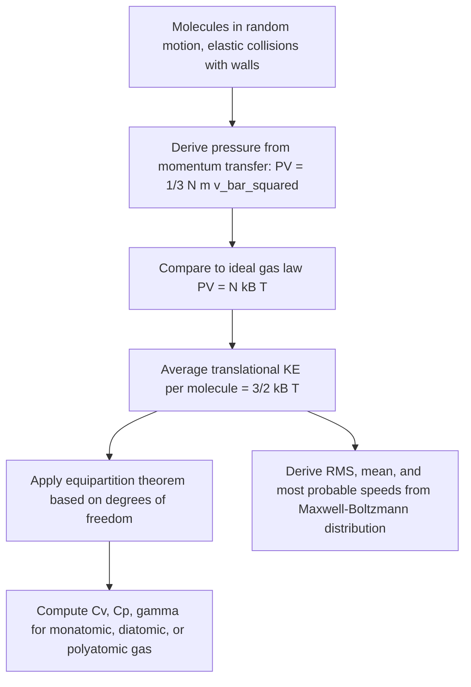

## Kinetic Theory of Gases

### Definition and Physical Basis

The kinetic theory of gases is a microscopic model that explains the macroscopic properties of gases (pressure, temperature, volume) in terms of the motion of their constituent particles (atoms or molecules). It bridges statistical mechanics and classical thermodynamics by deriving bulk gas behavior from the statistical treatment of a large number of particles undergoing continuous, random motion and collisions.

### Fundamental Assumptions of the Ideal Gas Model

The kinetic theory of an ideal gas rests on the following idealized assumptions:

1. A gas consists of a very large number of identical molecules in continuous, random motion.
2. The volume of individual molecules is negligible compared to the total volume of the container.
3. Molecules exert no forces on each other except during brief, elastic collisions (no long-range intermolecular attraction or repulsion).
4. Collisions between molecules, and between molecules and container walls, are perfectly elastic (no kinetic energy is lost).
5. The time duration of collisions is negligible compared to the time between collisions.
6. Newtonian mechanics governs the motion of individual molecules between collisions.

### Derivation of Pressure from Molecular Motion

Consider $N$ molecules of mass $m$ in a cubical container of side length $L$ (volume $V = L^3$). Focusing on one molecule with velocity component $v_x$ perpendicular to one wall:

**Momentum change per collision** with the wall (elastic collision, velocity reverses):

$$\Delta p = 2mv_x$$

**Time between successive collisions** with the same wall (molecule travels distance $2L$ between collisions):

$$\Delta t = \frac{2L}{v_x}$$

**Average force from one molecule** on the wall:

$$F = \frac{\Delta p}{\Delta t} = \frac{2mv_x}{2L/v_x} = \frac{mv_x^2}{L}$$

**Total force from all $N$ molecules** (summing over all molecules and using the mean square velocity component $\overline{v_x^2}$):

$$F_{total} = \frac{Nm\overline{v_x^2}}{L}$$

Since molecular motion is isotropic (no preferred direction), $\overline{v_x^2} = \overline{v_y^2} = \overline{v_z^2} = \frac{1}{3}\overline{v^2}$, where $\overline{v^2}$ is the mean square speed.

**Pressure** (force per unit area, $A = L^2$):

$$P = \frac{F_{total}}{L^2} = \frac{Nm\overline{v_x^2}}{L^3} = \frac{Nm\overline{v^2}}{3V}$$

Rearranging:

$$PV = \frac{1}{3}Nm\overline{v^2}$$

This is the fundamental result of the kinetic theory of gases, directly connecting the macroscopic quantity $PV$ to the microscopic mean square speed of gas molecules.

### Connecting Kinetic Theory to Temperature

Comparing the kinetic theory result to the ideal gas law $PV = Nk_BT$ (using $N$ as the number of molecules and $k_B$ as the Boltzmann constant):

$$\frac{1}{3}Nm\overline{v^2} = Nk_BT$$

$$\frac{1}{2}m\overline{v^2} = \frac{3}{2}k_BT$$

This shows that the **average translational kinetic energy per molecule** is directly proportional to absolute temperature:

$$\overline{KE} = \frac{1}{2}m\overline{v^2} = \frac{3}{2}k_BT$$

This is a profound result: temperature, a macroscopic thermodynamic quantity, is shown to be a direct measure of the average microscopic translational kinetic energy of gas molecules.

**Total translational kinetic energy** of $n$ moles of gas ($N = nN_A$, $k_BN_A = R$):

$$KE_{total} = \frac{3}{2}Nk_BT = \frac{3}{2}nRT$$

### Root-Mean-Square (RMS) Speed

From $\frac{1}{2}m\overline{v^2} = \frac{3}{2}k_BT$, the root-mean-square speed of gas molecules is:

$$v_{rms} = \sqrt{\overline{v^2}} = \sqrt{\frac{3k_BT}{m}} = \sqrt{\frac{3RT}{M}}$$

where $M$ is the molar mass (kg/mol). This shows that lighter molecules move faster on average at a given temperature, and that RMS speed increases with the square root of absolute temperature.

### The Maxwell-Boltzmann Speed Distribution

Not all molecules in a gas move at the same speed; the distribution of molecular speeds at thermal equilibrium follows the **Maxwell-Boltzmann distribution**:

$$f(v) = 4\pi n\left(\frac{m}{2\pi k_BT}\right)^{3/2}v^2 \exp\left(-\frac{mv^2}{2k_BT}\right)$$

This distribution yields three characteristic speeds:

**Most probable speed** (peak of the distribution):

$$v_p = \sqrt{\frac{2k_BT}{m}} = \sqrt{\frac{2RT}{M}}$$

**Average (mean) speed**:

$$\bar{v} = \sqrt{\frac{8k_BT}{\pi m}} = \sqrt{\frac{8RT}{\pi M}}$$

**Root-mean-square speed**:

$$v_{rms} = \sqrt{\frac{3k_BT}{m}} = \sqrt{\frac{3RT}{M}}$$

These three characteristic speeds satisfy the relationship $v_p < \bar{v} < v_{rms}$, reflecting the asymmetric (right-skewed) shape of the Maxwell-Boltzmann distribution.

### Degrees of Freedom and the Equipartition Theorem

The **equipartition theorem** states that, at thermal equilibrium, energy is distributed equally among all available quadratic degrees of freedom, with each contributing $\frac{1}{2}k_BT$ of energy per molecule (or $\frac{1}{2}RT$ per mole).

- **Monatomic gases** (e.g., He, Ne, Ar): 3 translational degrees of freedom only.

  $$U = \frac{3}{2}nRT, \quad C_v = \frac{3}{2}R, \quad C_p = \frac{5}{2}R, \quad \gamma = \frac{5}{3}$$
- **Diatomic gases** (e.g., N₂, O₂), at moderate temperatures: 3 translational + 2 rotational degrees of freedom (vibrational modes typically not thermally activated at moderate temperatures).

  $$U = \frac{5}{2}nRT, \quad C_v = \frac{5}{2}R, \quad C_p = \frac{7}{2}R, \quad \gamma = \frac{7}{5} = 1.4$$
- **Polyatomic (nonlinear) gases**: 3 translational + 3 rotational degrees of freedom (approximately).

  $$U \approx 3nRT, \quad C_v \approx 3R, \quad C_p \approx 4R, \quad \gamma \approx \frac{4}{3}$$

[Unverified — at sufficiently high temperatures, vibrational degrees of freedom become thermally activated and contribute additional heat capacity, requiring quantum statistical treatment (via the Einstein or Debye models) rather than simple classical equipartition for accurate predictions]

### Mean Free Path

The **mean free path** ($\lambda$) is the average distance a molecule travels between successive collisions:

$$\lambda = \frac{k_BT}{\sqrt{2}\pi d^2 P}$$

where $d$ is the effective molecular diameter. This quantity is important in determining transport properties such as diffusion, viscosity, and thermal conductivity in gases, and in assessing whether continuum fluid mechanics assumptions remain valid (e.g., in low-pressure or micro/nano-scale flows).

### Example Calculation

Find the RMS speed of nitrogen gas ($N_2$, $M = 0.028\text{ kg/mol}$) molecules at 300 K. ($R = 8.314\text{ J/(mol·K)}$)

$$v_{rms} = \sqrt{\frac{3RT}{M}} = \sqrt{\frac{3(8.314)(300)}{0.028}} = \sqrt{\frac{7482.6}{0.028}} = \sqrt{267{,}235.7}$$

$$v_{rms} \approx 517\text{ m/s}$$

**Example (average translational kinetic energy)**: Find the average translational kinetic energy per molecule of any ideal gas at 400 K.

$$\overline{KE} = \frac{3}{2}k_BT = \frac{3}{2}(1.380649\times 10^{-23})(400) \approx 8.28\times 10^{-21}\text{ J}$$

Note this value is independent of the gas's molar mass — all ideal gas molecules at the same temperature have the same average translational kinetic energy, though lighter molecules must move faster to achieve this same energy.

**Example (heat capacity of diatomic gas)**: Find the internal energy of 2 moles of oxygen gas ($O_2$, diatomic) at 350 K.

$$U = \frac{5}{2}nRT = \frac{5}{2}(2)(8.314)(350) \approx 14{,}550\text{ J}$$

### Diagram: Maxwell-Boltzmann Speed Distribution (svg_diagram)

<svg xmlns="http://www.w3.org/2000/svg" viewBox="0 0 480 260">
<text x="240" y="25" font-size="16" text-anchor="middle" font-weight="bold">Maxwell-Boltzmann Distribution (svg_diagram)</text>
<line x1="50" y1="220" x2="50" y2="50" stroke="black" stroke-width="1.5" />
<line x1="50" y1="220" x2="440" y2="220" stroke="black" stroke-width="1.5" />
<text x="20" y="55" font-size="12">f(v)</text>
<text x="430" y="240" font-size="12">v</text>
<path d="M50,220 C 100,215 130,60 180,60 C 230,60 260,150 310,190 C 350,210 400,218 440,220" fill="none" stroke="#2980b9" stroke-width="2.5" />
<line x1="180" y1="220" x2="180" y2="60" stroke="#c0392b" stroke-dasharray="3" stroke-width="1" />
<text x="150" y="235" font-size="10" fill="#c0392b">v_p</text>
<line x1="220" y1="220" x2="220" y2="130" stroke="#27ae60" stroke-dasharray="3" stroke-width="1" />
<text x="215" y="235" font-size="10" fill="#27ae60">v_bar</text>
<line x1="255" y1="220" x2="255" y2="165" stroke="#8e44ad" stroke-dasharray="3" stroke-width="1" />
<text x="250" y="235" font-size="10" fill="#8e44ad">v_rms</text>
</svg>

### Diagram: Kinetic Theory Conceptual Flow

### Applications

- **Gas transport properties**: kinetic theory underlies the calculation of viscosity, thermal conductivity, and diffusion coefficients in gases, essential for engineering fluid and heat transfer calculations.
- **Vacuum technology**: mean free path calculations determine the transition between continuum and rarefied (molecular) flow regimes, critical for vacuum system and semiconductor fabrication equipment design.
- **Atmospheric science**: kinetic theory explains atmospheric escape mechanisms (e.g., why lighter gases like hydrogen and helium escape Earth's atmosphere more readily than heavier gases like nitrogen and oxygen).
- **Plasma physics**: kinetic theory concepts extend to plasma physics, where charged particle velocity distributions govern plasma behavior in fusion research and astrophysical contexts.
- **Chemical kinetics**: reaction rate theory (e.g., collision theory) draws directly on kinetic theory concepts of molecular speed distributions and collision frequency.

### Common Misconceptions

- Not all gas molecules move at the same speed at a given temperature — there is a distribution of speeds (Maxwell-Boltzmann distribution), with temperature determining the distribution's characteristic width and peak, not a single uniform speed for all molecules.
- Average translational kinetic energy depends only on temperature, not on molecular mass — however, RMS speed does depend on mass (lighter molecules move faster on average to achieve the same kinetic energy).
- The kinetic theory's elastic collision assumption does not mean gas molecules never lose energy in any real sense — it is an idealization; real molecular collisions can involve energy transfer between translational, rotational, and vibrational modes, which is precisely how thermal equilibrium among these modes is established.
- Higher temperature does not mean higher pressure in all cases — pressure depends on the product of temperature and number density ($n/V$) via $PV = Nk_BT$; a gas can be heated while pressure stays constant if volume is allowed to expand proportionally (isobaric process).

**Related Topics**:

- Ideal Gas Law and Equations of State
- Maxwell-Boltzmann Distribution and Statistical Mechanics
- Specific Heat Capacities and Degrees of Freedom
- Mean Free Path and Transport Phenomena
- Boltzmann Distribution and Statistical Ensembles
- Real Gas Behavior and the Van der Waals Equation