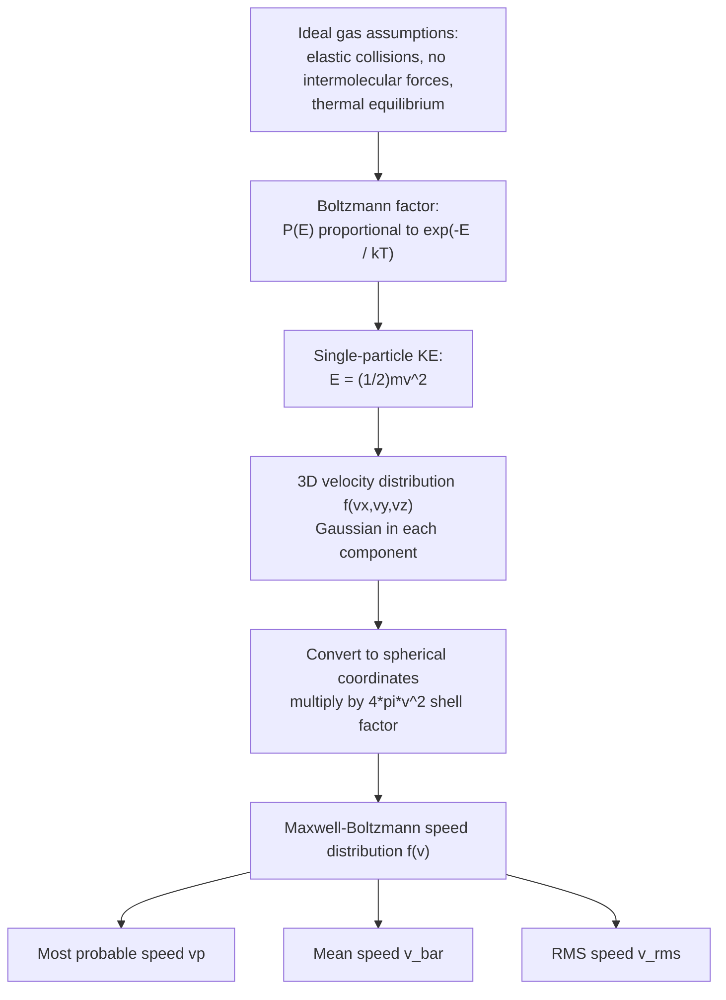

## The Maxwell-Boltzmann Distribution

### Overview

The Maxwell-Boltzmann distribution describes the statistical distribution of molecular speeds (or velocities, or kinetic energies) in a classical ideal gas at thermal equilibrium. Derived independently by James Clerk Maxwell (1860) and later generalized by Ludwig Boltzmann, it forms the cornerstone of classical kinetic theory, linking microscopic particle motion to macroscopic thermodynamic quantities like temperature and pressure.

The distribution applies to a system of a large number of non-interacting (or weakly interacting) particles that are distinguishable classical objects, obeying Newtonian mechanics, with no upper bound on occupation of any energy state.

### Physical Assumptions

**Key Points**

- Particles are treated as point masses or rigid spheres with negligible volume compared to the container.
- Collisions between particles are perfectly elastic (kinetic energy is conserved).
- No intermolecular forces act except during instantaneous collisions.
- The gas is in thermal equilibrium — velocity distribution does not change with time.
- Particle motion is isotropic (no preferred direction in space).
- Quantum effects (indistinguishability, Pauli exclusion) are negligible — valid when the gas is dilute and temperature is not extremely low.

### Derivation of the Velocity Distribution

#### Maxwell's Statistical Argument

Maxwell assumed the probability distribution for each velocity component ($v_x$, $v_y$, $v_z$) is independent and isotropic. Let $f(v_x, v_y, v_z)$ be the joint probability density function. Isotropy requires that it depends only on the speed:

$$f(v_x, v_y, v_z) = f(v_x)f(v_y)f(v_z) = \phi(v_x^2 + v_y^2 + v_z^2)$$

The only functional form satisfying both the product structure and dependence solely on $v^2 = v_x^2+v_y^2+v_z^2$ is a Gaussian:

$$f(v_i) = A e^{-\alpha v_i^2}$$

for each component $i = x, y, z$, where $A$ and $\alpha$ are constants determined by normalization and the equipartition theorem.

#### Boltzmann's Statistical Mechanics Argument

Boltzmann derived the same result from the general principle that, in thermal equilibrium, the probability of a microstate with energy $E$ is proportional to the Boltzmann factor:

$$P(E) \propto e^{-E/k_BT}$$

For a single particle of mass $m$ with translational kinetic energy $E = \frac{1}{2}mv^2$, this gives:

$$f(\mathbf{v}) \propto e^{-mv^2/2k_BT}$$

where $k_B$ is the Boltzmann constant and $T$ is absolute temperature. This is consistent with Maxwell's Gaussian form and generalizes to any degree of freedom with a quadratic energy dependence (equipartition theorem).

### The Velocity Distribution Function

Normalizing over all three velocity components, the full 3D velocity probability density function is:

$$f(v_x, v_y, v_z) = \left(\frac{m}{2\pi k_BT}\right)^{3/2} e^{-m(v_x^2+v_y^2+v_z^2)/2k_BT}$$

This gives the probability density of finding a particle with velocity components in the ranges $[v_x, v_x+dv_x]$, $[v_y, v_y+dv_y]$, $[v_z, v_z+dv_z]$.

### The Speed Distribution Function

Because we are usually interested in the magnitude of velocity (speed) rather than direction, we convert to spherical coordinates in velocity space. The volume element becomes $4\pi v^2\, dv$ (the surface area of a sphere of radius $v$ in velocity space), giving the **Maxwell-Boltzmann speed distribution**:

$$f(v) = 4\pi \left(\frac{m}{2\pi k_BT}\right)^{3/2} v^2 e^{-mv^2/2k_BT}$$

This $f(v)\,dv$ gives the fraction of molecules with speeds between $v$ and $v+dv$.

**Key Points**

- The $v^2$ factor arises from the increasing volume of the spherical shell in velocity space as $v$ grows.
- The exponential factor suppresses high-speed molecules.
- The competition between these two factors produces the characteristic asymmetric peaked curve.

### Shape of the Distribution (SVG Diagram)

<svg xmlns="http://www.w3.org/2000/svg" viewBox="0 0 600 380">
<text x="300" y="24" text-anchor="middle" font-size="16" font-family="sans-serif" font-weight="bold">Maxwell-Boltzmann Speed Distribution (svg_diagram)</text>

<line x1="60" y1="320" x2="560" y2="320" stroke="black" stroke-width="2" />
<line x1="60" y1="320" x2="60" y2="50" stroke="black" stroke-width="2" />
<text x="560" y="345" text-anchor="end" font-size="14" font-family="sans-serif">Speed (v)</text>
<text x="30" y="60" text-anchor="middle" font-size="14" font-family="sans-serif" transform="rotate(-90 30 180)">f(v)</text>

<path d="M 60,320 C 120,320 130,120 180,100 C 230,90 280,180 340,260 C 400,300 480,318 560,320" fill="none" stroke="`#2266cc`" stroke-width="2.5" />

<text x="185" y="90" font-size="12" fill="`#2266cc`" font-family="sans-serif">Low T</text>

<path d="M 60,320 C 150,320 170,200 230,170 C 290,150 340,190 420,250 C 480,285 520,305 560,315" fill="none" stroke="`#22aa55`" stroke-width="2.5" />

<text x="300" y="150" font-size="12" fill="`#22aa55`" font-family="sans-serif">Medium T</text>

<path d="M 60,320 C 200,320 240,250 300,230 C 360,215 420,225 480,260 C 520,285 545,300 560,308" fill="none" stroke="`#cc3333`" stroke-width="2.5" />

<text x="400" y="205" font-size="12" fill="`#cc3333`" font-family="sans-serif">High T</text>

<circle cx="180" cy="100" r="3" fill="#2266cc" />
<circle cx="230" cy="170" r="3" fill="#22aa55" />
<circle cx="300" cy="230" r="3" fill="#cc3333" />

<text x="60" y="335" font-size="11" font-family="sans-serif" text-anchor="middle">0</text>

</svg>

As temperature increases: the peak shifts to higher speeds, the curve broadens, and the peak height decreases (total area under the curve remains 1, since it is a normalized probability density).

### Characteristic Speeds

Three important characteristic speeds are derived from $f(v)$:

#### 1. Most Probable Speed ($v_p$)

The speed at which $f(v)$ is maximum, found by setting $\frac{df(v)}{dv} = 0$:

$$v_p = \sqrt{\frac{2k_BT}{m}} = \sqrt{\frac{2RT}{M}}$$

where $R$ is the universal gas constant and $M$ is the molar mass.

#### 2. Mean (Average) Speed ($\bar{v}$)

$$\bar{v} = \int_0^\infty v f(v)\, dv = \sqrt{\frac{8k_BT}{\pi m}} = \sqrt{\frac{8RT}{\pi M}}$$

#### 3. Root-Mean-Square Speed ($v_{rms}$)

$$v_{rms} = \sqrt{\langle v^2 \rangle} = \sqrt{\frac{3k_BT}{m}} = \sqrt{\frac{3RT}{M}}$$

This follows directly from equipartition: $\frac{1}{2}m\langle v^2\rangle = \frac{3}{2}k_BT$.

#### Ordering of Speeds

For any temperature:

$$v_p < \bar{v} < v_{rms}$$

Numerically, the ratio is:

$$v_p : \bar{v} : v_{rms} = \sqrt{2} : \sqrt{\frac{8}{\pi}} : \sqrt{3} \approx 1.000 : 1.128 : 1.225$$

### Energy Distribution

Substituting $E = \frac{1}{2}mv^2$ into $f(v)$, the distribution of molecular **kinetic energies** is:

$$f(E) = \frac{2}{\sqrt{\pi}} (k_BT)^{-3/2} \sqrt{E}\, e^{-E/k_BT}$$

**Key Points**

- The mean kinetic energy per molecule is $\langle E \rangle = \frac{3}{2}k_BT$, consistent with equipartition (3 translational degrees of freedom).
- This is independent of the particle's mass — lighter and heavier gas molecules at the same temperature have the same average kinetic energy, but different average speeds.

### Mermaid Diagram: Conceptual Flow from Assumptions to Distribution

### Dependence on Mass and Temperature

**Example**

Consider $N_2$ (M ≈ 28 g/mol) and $He$ (M ≈ 4 g/mol) at the same temperature $T = 300\text{ K}$:

$$v_{rms}(\text{He}) = \sqrt{\frac{3RT}{M_{He}}} = \sqrt{\frac{3(8.314)(300)}{0.004}} \approx 1367\ \text{m/s}$$

$$v_{rms}(N_2) = \sqrt{\frac{3RT}{M_{N_2}}} = \sqrt{\frac{3(8.314)(300)}{0.028}} \approx 517\ \text{m/s}$$

Lighter molecules move significantly faster on average at the same temperature — this is why light gases like hydrogen and helium escape planetary atmospheres more readily (related to Jeans escape).

### Relation to Macroscopic Quantities

The Maxwell-Boltzmann distribution underlies several macroscopic results in kinetic theory:

- **Pressure**: Derived from the momentum transfer of molecules colliding with container walls, integrated over the speed distribution, yielding $PV = Nk_BT$ (ideal gas law).
- **Effusion rate (Graham's Law)**: The rate of gas effusion through a small hole is proportional to $\bar{v}$, hence inversely proportional to $\sqrt{M}$.
- **Mean free path**: Combined with collision cross-section $\sigma$, the mean free path is $\lambda = \frac{k_BT}{\sqrt{2}\pi d^2 P}$, using $\bar{v}$ and $\sqrt{2}\bar{v}$ for relative speed between colliding molecules.
- **Transport coefficients**: Viscosity, thermal conductivity, and diffusion coefficients in kinetic theory are computed using moments of $f(v)$.

### Generalized Maxwell-Boltzmann Statistics

In statistical mechanics, the Maxwell-Boltzmann distribution generalizes beyond translational speed to describe occupation of any discrete energy state $\epsilon_i$ in a system of distinguishable, non-interacting particles:

$$n_i = \frac{N}{Z} g_i e^{-\epsilon_i/k_BT}$$

where $g_i$ is the degeneracy of state $i$, and $Z = \sum_i g_i e^{-\epsilon_i/k_BT}$ is the **partition function**. This is the classical limit of both Bose-Einstein and Fermi-Dirac statistics, valid when quantum degeneracy effects are negligible (high temperature, low density).

### Validity and Limitations

**Key Points**

- Breaks down at very low temperatures or high densities, where quantum statistics (Bose-Einstein for bosons, Fermi-Dirac for fermions) must be used instead.
- Assumes classical, non-relativistic particles; requires modification for relativistic gases (Maxwell-Jüttner distribution).
- Strictly applies to dilute gases where the mean free path is much larger than the particle size.
- [Inference] Real gases show deviations at high pressure due to intermolecular forces and finite molecular volume, better modeled by corrections such as the van der Waals equation combined with modified statistical treatments.

### Experimental Verification

Historically confirmed by molecular beam experiments — notably the Stern experiment (1920) and the Miller-Kusch experiment (1955), which directly measured the speed distribution of effusing gas molecules and matched the theoretical $f(v)$ curve closely, accounting for the effusion bias which weights the observed distribution by an extra factor of $v$ relative to the bulk gas distribution.

### Conclusion

The Maxwell-Boltzmann distribution provides the statistical foundation connecting microscopic particle kinetics to macroscopic thermodynamic behavior in classical ideal gases. It explains why gas molecules exhibit a spread of speeds rather than a single value, quantifies how temperature and molecular mass shape that spread, and underlies core results in kinetic theory including pressure, effusion, diffusion, and transport phenomena.

**Related Topics**

- Equipartition Theorem
- Boltzmann Factor and Partition Functions
- Mean Free Path and Collision Theory
- Effusion and Graham's Law
- Kinetic Theory Derivation of Ideal Gas Law
- Bose-Einstein and Fermi-Dirac Statistics (Quantum Distributions)
- Maxwell-Jüttner Distribution (Relativistic Generalization)
- Transport Phenomena: Viscosity, Diffusion, Thermal Conductivity
- Entropy and the Boltzmann H-Theorem