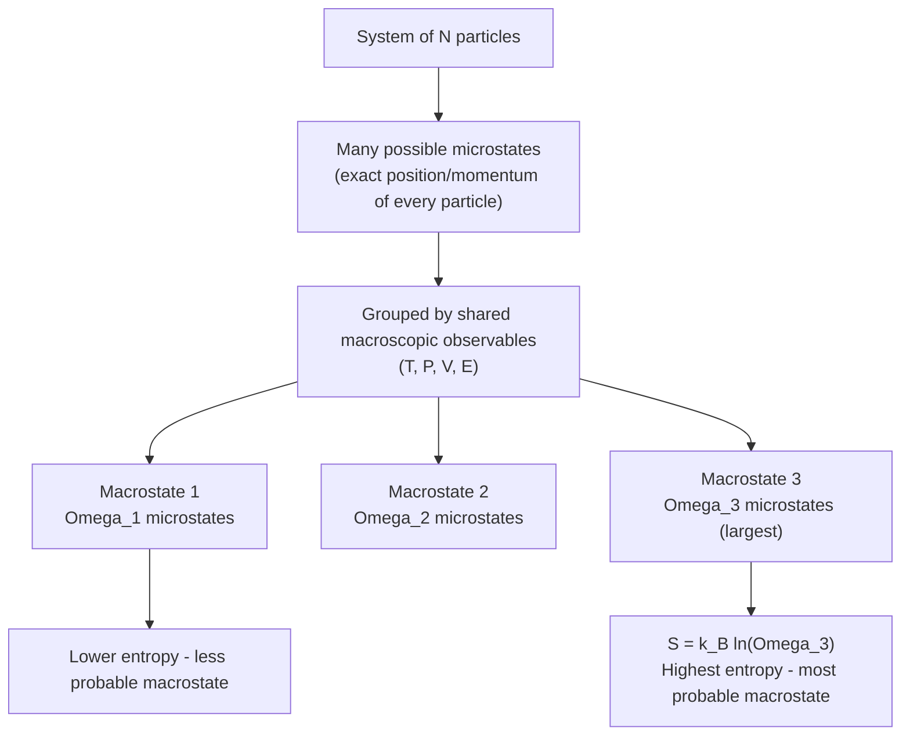

## Microstates, Macrostates, and Entropy

### Overview

Statistical mechanics connects the microscopic behavior of individual particles to the macroscopic thermodynamic properties of a system through the concepts of microstates and macrostates. Entropy, defined statistically by Boltzmann, quantifies the number of microscopic configurations consistent with a given macroscopic description, providing the bridge between mechanics (deterministic particle motion) and thermodynamics (statistical, irreversible behavior).

### Microstates

#### Definition

A **microstate** is a complete, detailed specification of a system's configuration at the microscopic level — for a classical gas, this means specifying the exact position and momentum of every single particle: $(\mathbf{r}_1, \mathbf{p}_1, \mathbf{r}_2, \mathbf{p}_2, \ldots, \mathbf{r}_N, \mathbf{p}_N)$.

In quantum systems, a microstate corresponds to a specific quantum state of the entire system, described by a complete set of quantum numbers for every particle.

**Key Points**

- Microstates are the finest-grained description physically meaningful for the system.
- Two microstates are distinct even if they produce identical macroscopic observables (pressure, temperature, volume).
- The number of microstates is typically astronomically large (order $10^{23}$ or more, related to Avogadro's number).

#### Phase Space Representation

For a system of $N$ classical particles in three dimensions, a microstate corresponds to a single point in a $6N$-dimensional **phase space**, with 3 position and 3 momentum coordinates per particle. The system's time evolution traces a trajectory through this phase space, governed by Hamilton's equations.

### Macrostates

#### Definition

A **macrostate** is a description of the system in terms of a small number of bulk, measurable thermodynamic variables — such as temperature $T$, pressure $P$, volume $V$, total energy $E$, or particle number $N$ — that do not specify the exact configuration of individual particles.

**Key Points**

- A single macrostate is compatible with an enormous number of distinct microstates.
- Macrostates are what we observe and measure experimentally; microstates are the underlying (usually inaccessible) microscopic reality.
- The relationship between a macrostate and its constituent microstates is the foundation of statistical mechanics.

#### Example: Coin Flips as an Analogy

**Example**

Consider flipping 4 coins. A macrostate might be "2 heads and 2 tails." The microstates consistent with this macrostate are all distinct orderings:

HHTT, HTHT, HTTH, THHT, THTH, TTHH

This macrostate has $\binom{4}{2} = 6$ microstates. Compare this to the macrostate "4 heads," which has only $\binom{4}{4} = 1$ microstate (HHHH). The macrostate with 2 heads and 2 tails is vastly more probable simply because it corresponds to more microstates — this is the essential logic behind the Second Law of Thermodynamics.

### Multiplicity (Statistical Weight)

The **multiplicity** $\Omega$ (also called statistical weight or thermodynamic probability) of a macrostate is the number of microstates consistent with it. For a system of $N$ particles distributed among energy levels, $\Omega$ can be computed via combinatorics.

#### Example: Ideal Gas in Two Halves of a Container

For $N$ distinguishable gas molecules that can be in either the left or right half of a box, if $n$ molecules are in the left half:

$$\Omega(n) = \binom{N}{n} = \frac{N!}{n!(N-n)!}$$

This is maximized at $n = N/2$ (equal distribution), and the multiplicity for that macrostate vastly exceeds the multiplicity for extreme configurations like all molecules in one half.

### Boltzmann Entropy Formula

Boltzmann's foundational insight was that thermodynamic entropy $S$ is directly related to the multiplicity of the corresponding macrostate:

$$S = k_B \ln \Omega$$

where $k_B \approx 1.380649 \times 10^{-23}\ \text{J/K}$ is the Boltzmann constant. This equation is inscribed on Boltzmann's tombstone in Vienna and stands as one of the most significant results in physics, unifying thermodynamics with statistical mechanics.

**Key Points**

- $\Omega$ is dimensionless (a pure count), so $S$ has units of J/K, matching the thermodynamic (Clausius) definition of entropy.
- The logarithm ensures entropy is **extensive**: for two independent systems, $\Omega_{total} = \Omega_1 \Omega_2$, so $S_{total} = k_B\ln(\Omega_1\Omega_2) = k_B\ln\Omega_1 + k_B\ln\Omega_2 = S_1 + S_2$.
- Higher multiplicity (more accessible microstates) means higher entropy.

### Why Systems Evolve Toward Higher Entropy

**Key Points**

- A system left to evolve freely will, with overwhelming statistical likelihood, move toward macrostates of higher multiplicity, simply because there are vastly more microstates corresponding to them.
- This is not a deterministic law but a statement of overwhelming probability — technically, a decrease in entropy is not impossible, only fantastically improbable for macroscopic systems (order $10^{23}$ particles).
- This statistical interpretation resolves the apparent paradox between time-reversible microscopic laws (Newtonian or quantum mechanics) and the observed time-irreversibility of macroscopic thermodynamic processes (the "arrow of time").

### Mermaid Diagram: Microstate-Macrostate Relationship

### Entropy Illustration (SVG Diagram)

<svg xmlns="http://www.w3.org/2000/svg" viewBox="0 0 600 340">
<text x="300" y="24" text-anchor="middle" font-size="16" font-family="sans-serif" font-weight="bold">Multiplicity vs. Macrostate (svg_diagram)</text>

<line x1="60" y1="290" x2="560" y2="290" stroke="black" stroke-width="2" />
<line x1="60" y1="290" x2="60" y2="50" stroke="black" stroke-width="2" />
<text x="560" y="315" text-anchor="end" font-size="13" font-family="sans-serif">n (particles in left half)</text>
<text x="20" y="170" text-anchor="middle" font-size="13" font-family="sans-serif" transform="rotate(-90 20 170)">Omega(n)</text>

<rect x="80" y="270" width="30" height="20" fill="#88aadd" />
<rect x="130" y="230" width="30" height="60" fill="#88aadd" />
<rect x="180" y="180" width="30" height="110" fill="#6699cc" />
<rect x="230" y="130" width="30" height="160" fill="#5588bb" />
<rect x="280" y="80" width="30" height="210" fill="#3366aa" />
<rect x="330" y="130" width="30" height="160" fill="#5588bb" />
<rect x="380" y="180" width="30" height="110" fill="#6699cc" />
<rect x="430" y="230" width="30" height="60" fill="#88aadd" />
<rect x="480" y="270" width="30" height="20" fill="#88aadd" />

<text x="295" y="70" text-anchor="middle" font-size="12" font-family="sans-serif" font-weight="bold">n = N/2</text>

<text x="295" y="300" text-anchor="middle" font-size="11" font-family="sans-serif">Max entropy macrostate</text>

<text x="85" y="305" text-anchor="middle" font-size="10" font-family="sans-serif">n=0</text>

<text x="495" y="305" text-anchor="middle" font-size="10" font-family="sans-serif">n=N</text>

</svg>

### Entropy in Terms of Probability

An equivalent formulation, useful when microstates are not equally probable, is the **Gibbs entropy**:

$$S = -k_B \sum_i p_i \ln p_i$$

where $p_i$ is the probability of the system being in microstate $i$. This reduces to Boltzmann's formula in the special case of equal a priori probabilities ($p_i = 1/\Omega$ for all accessible microstates):

$$S = -k_B \sum_{i=1}^{\Omega} \frac{1}{\Omega}\ln\frac{1}{\Omega} = -k_B \cdot \Omega \cdot \frac{1}{\Omega}\ln\frac{1}{\Omega} = k_B\ln\Omega$$

This form generalizes naturally to Shannon information entropy in information theory, revealing a deep connection between thermodynamic entropy and information content.

### Second Law of Thermodynamics: Statistical Interpretation

**Key Points**

- The Second Law states that the entropy of an isolated system never decreases over time.
- Statistically, this arises because isolated systems evolve toward macrostates with larger multiplicity, and the overwhelming majority of accessible microstates correspond to the maximum-entropy (equilibrium) macrostate.
- At equilibrium, the system fluctuates among the many microstates of the maximum-entropy macrostate, but macroscopic observables remain effectively constant due to the sheer number of ways this macrostate can be realized.
- [Inference] For systems with very small particle numbers, entropy fluctuations become statistically significant and the Second Law is only approximately valid rather than an exact statement — this is the basis for fluctuation theorems in modern statistical mechanics.

### Worked Example: Free Expansion of a Gas

**Example**

Consider $N$ gas molecules initially confined to the left half of a box, then allowed to expand into the full volume $V$ (double the original volume $V_0$).

Initial multiplicity (all $N$ molecules in $V_0$): $\Omega_i \propto V_0^N$

Final multiplicity (all $N$ molecules free to occupy volume $V = 2V_0$): $\Omega_f \propto (2V_0)^N$

The entropy change is:

$$\Delta S = k_B \ln\left(\frac{\Omega_f}{\Omega_i}\right) = k_B \ln\left(\frac{(2V_0)^N}{V_0^N}\right) = Nk_B\ln 2$$

This positive entropy change reflects the irreversibility of free expansion — the reverse process (all molecules spontaneously returning to the left half) is not forbidden by mechanics but is statistically negligible, with probability $\sim (1/2)^N$, vanishingly small for macroscopic $N$.

### Entropy and Information: Landauer's Principle

**Key Points**

- Erasing one bit of information in a physical system requires a minimum entropy increase of $k_B\ln 2$, dissipated as heat, establishing a direct physical cost to information processing.
- This connects statistical mechanics to computation and information theory, reinforcing that entropy is fundamentally a measure of missing information about the microstate given only macrostate knowledge.

### Distinguishability and the Gibbs Paradox

**Key Points**

- Treating identical particles as distinguishable (as in naive combinatorial counting) leads to the **Gibbs paradox**: entropy of mixing appears even when mixing identical gases, which is unphysical.
- The resolution requires dividing the classical phase space volume by $N!$ to account for particle indistinguishability, yielding the corrected (extensive) entropy formula consistent with the Sackur-Tetrode equation for an ideal gas.
- This correction is a classical approximation to the deeper quantum mechanical principle that identical particles are fundamentally indistinguishable.

### Conclusion

Microstates and macrostates provide the conceptual scaffolding of statistical mechanics: a macrostate is what we observe, while microstates are the underlying configurations compatible with that observation. Entropy, via $S = k_B\ln\Omega$, quantifies this multiplicity, explaining thermodynamic irreversibility, the Second Law, and the statistical arrow of time as consequences of overwhelming probability rather than absolute mechanical necessity.

**Related Topics**

- The Boltzmann Distribution and Partition Function
- Second Law of Thermodynamics and Entropy
- Gibbs Entropy and Statistical Ensembles (Microcanonical, Canonical, Grand Canonical)
- Sackur-Tetrode Equation
- Gibbs Paradox and Particle Indistinguishability
- Information Theory: Shannon Entropy and Landauer's Principle
- Fluctuation Theorems and Small-System Thermodynamics
- Free Energy (Helmholtz and Gibbs) and Thermodynamic Potentials