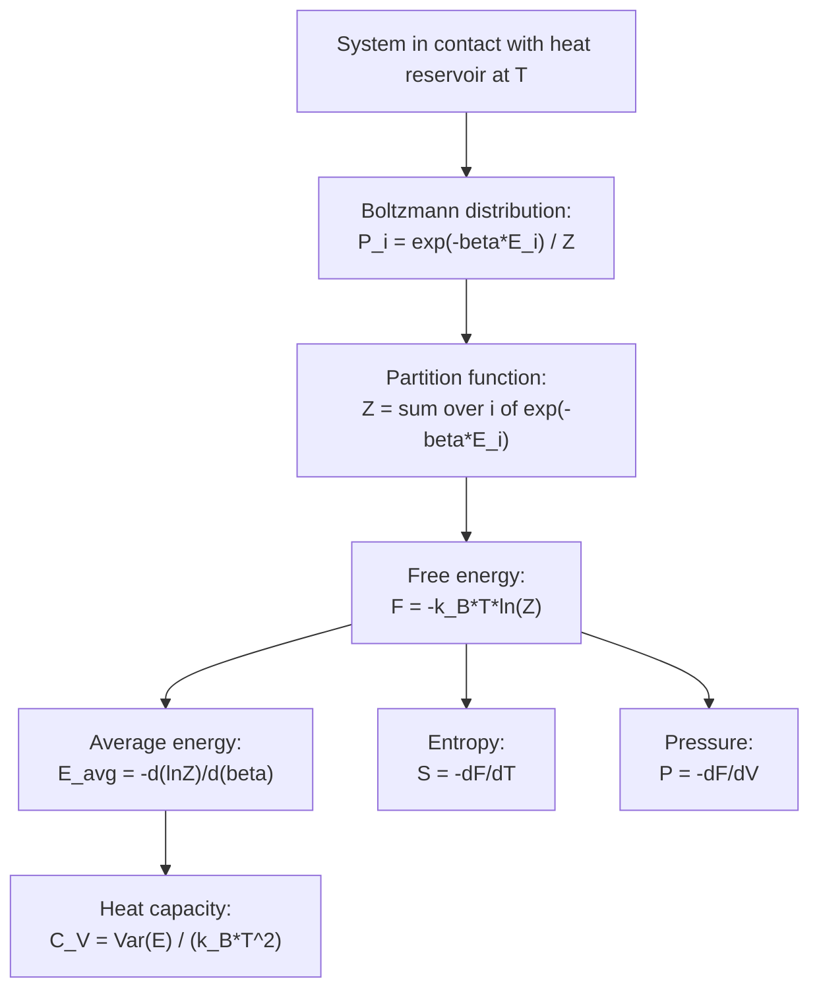

## The Canonical Ensemble

### Overview

The canonical ensemble describes a system in thermal equilibrium with a much larger heat reservoir at fixed temperature $T$, allowing energy exchange between system and reservoir while keeping particle number $N$ and volume $V$ fixed. Unlike the microcanonical ensemble (isolated system, fixed energy), the canonical ensemble treats energy as a fluctuating quantity, with the equilibrium distribution over microstates governed by the Boltzmann factor. It is the most widely used ensemble in statistical mechanics because most real systems interact thermally with their surroundings.

### Physical Setup

**Key Points**

- The system of interest is small compared to the reservoir, which acts as an infinite heat bath maintaining constant temperature $T$.
- Energy can flow freely between system and reservoir, but total energy of (system + reservoir) is conserved.
- $N$ (particle number) and $V$ (volume) of the system are held fixed — only $E$ fluctuates.
- The combined system-plus-reservoir is treated as an isolated system obeying microcanonical statistics, from which canonical statistics for the subsystem are derived.

### Derivation of the Boltzmann Distribution

Consider a system $S$ with possible microstates $i$ of energy $E_i$, in contact with a reservoir $R$. The total energy $E_{total} = E_i + E_R$ is fixed. By the microcanonical postulate of equal a priori probabilities, the probability of the system being in microstate $i$ is proportional to the number of microstates available to the reservoir at energy $E_R = E_{total} - E_i$:

$$P_i \propto \Omega_R(E_{total} - E_i)$$

Using the Boltzmann entropy relation $S_R = k_B\ln\Omega_R$, and expanding $S_R(E_{total}-E_i)$ in a Taylor series around $E_i = 0$ (valid since the reservoir is much larger than the system):

$$S_R(E_{total}-E_i) \approx S_R(E_{total}) - E_i\left(\frac{\partial S_R}{\partial E_R}\right) = S_R(E_{total}) - \frac{E_i}{T}$$

using the thermodynamic definition $\frac{1}{T} = \frac{\partial S}{\partial E}$. Therefore:

$$\Omega_R(E_{total}-E_i) = e^{S_R(E_{total}-E_i)/k_B} \propto e^{-E_i/k_BT}$$

This gives the central result:

$$P_i = \frac{e^{-E_i/k_BT}}{Z}$$

known as the **Boltzmann distribution**, where $Z$ is the normalization constant.

### The Partition Function

The **canonical partition function** is defined as the sum over all microstates of the Boltzmann factor:

$$Z = \sum_i e^{-E_i/k_BT} = \sum_i e^{-\beta E_i}$$

where $\beta \equiv \frac{1}{k_BT}$ is a convenient shorthand widely used in statistical mechanics.

**Key Points**

- $Z$ is dimensionless and acts as the normalization constant ensuring $\sum_i P_i = 1$.
- $Z$ encodes complete thermodynamic information about the system — nearly all macroscopic quantities can be derived from $Z$ or its derivatives.
- For continuous systems (classical phase space), the sum becomes an integral: $Z = \frac{1}{h^{3N}N!}\int e^{-\beta H(\mathbf{q},\mathbf{p})}\, d^{3N}q\, d^{3N}p$, where $H$ is the Hamiltonian, $h$ is Planck's constant (for correct dimensionality/phase-space cell counting), and $N!$ corrects for particle indistinguishability.

### Deriving Thermodynamic Quantities from Z

#### Average Energy

$$\langle E \rangle = -\frac{\partial \ln Z}{\partial \beta} = \frac{\sum_i E_i e^{-\beta E_i}}{Z}$$

#### Helmholtz Free Energy

$$F = -k_BT\ln Z$$

This is the central bridge equation connecting statistical mechanics ($Z$) to macroscopic thermodynamics ($F$). All other thermodynamic potentials follow from standard relations applied to $F$.

#### Entropy

$$S = -\frac{\partial F}{\partial T} = k_B\ln Z + \frac{\langle E\rangle}{T}$$

#### Pressure

$$P = -\left(\frac{\partial F}{\partial V}\right)_{T,N} = k_BT\left(\frac{\partial \ln Z}{\partial V}\right)_{T,N}$$

#### Heat Capacity (Energy Fluctuations)

$$C_V = \left(\frac{\partial \langle E\rangle}{\partial T}\right)_V = \frac{\langle E^2\rangle - \langle E\rangle^2}{k_BT^2} = \frac{\text{Var}(E)}{k_BT^2}$$

This equation directly relates a measurable macroscopic quantity ($C_V$) to microscopic energy fluctuations, illustrating the fluctuation-dissipation connection central to statistical mechanics.

### Mermaid Diagram: From Partition Function to Thermodynamics

### Energy Fluctuations and the Thermodynamic Limit

**Key Points**

- In the canonical ensemble, energy is not fixed but fluctuates around $\langle E\rangle$ with relative fluctuation $\frac{\Delta E}{\langle E\rangle} \sim \frac{1}{\sqrt{N}}$.
- For macroscopic systems ($N \sim 10^{23}$), relative fluctuations are vanishingly small, so canonical and microcanonical ensembles give essentially identical predictions for macroscopic observables — this is the basis of ensemble equivalence in the thermodynamic limit.
- [Inference] For small or mesoscopic systems (few particles, nanoscale systems), energy fluctuations become significant and the choice of ensemble can matter for correctly predicting measurable behavior.

### Worked Example: Two-State System (Paramagnetic Spins)

**Example**

Consider $N$ independent, non-interacting magnetic dipoles, each capable of two states: aligned with an external field (energy $-\mu B$) or anti-aligned (energy $+\mu B$). The single-particle partition function is:

$$z_1 = e^{\beta\mu B} + e^{-\beta\mu B} = 2\cosh(\beta\mu B)$$

Since the $N$ spins are independent and distinguishable (fixed lattice sites), the total partition function factorizes:

$$Z = z_1^N = \left[2\cosh(\beta\mu B)\right]^N$$

The average energy per particle is:

$$\langle \epsilon\rangle = -\frac{\partial \ln z_1}{\partial \beta} = -\mu B\tanh(\beta\mu B)$$

At high temperature ($\beta \to 0$), $\langle\epsilon\rangle \to 0$ (spins randomize); at low temperature ($\beta \to \infty$), $\langle\epsilon\rangle \to -\mu B$ (spins align with the field, minimizing energy) — this system is the standard model for paramagnetism and Curie's Law.

### Factorization for Independent Subsystems

**Key Points**

- If a system consists of $N$ independent, distinguishable, non-interacting subsystems, the total partition function factorizes: $Z_{total} = z_1^N$ (identical subsystems) or $Z_{total} = z_1 z_2 \cdots z_N$ (distinct subsystems).
- For indistinguishable particles (e.g., ideal gas molecules), an additional $\frac{1}{N!}$ correction factor is required to avoid overcounting: $Z_{total} = \frac{z_1^N}{N!}$.
- This factorization is what makes the partition function so computationally powerful — complex many-body problems often reduce to single-particle partition functions.

### Classical Ideal Gas via the Canonical Ensemble

**Example**

For a classical monatomic ideal gas of $N$ indistinguishable particles, the single-particle partition function (integrating the Maxwell-Boltzmann momentum distribution over volume $V$) is:

$$z_1 = \frac{V}{\lambda_{th}^3}, \quad \lambda_{th} = \sqrt{\frac{h^2}{2\pi m k_BT}}$$

where $\lambda_{th}$ is the thermal de Broglie wavelength. The full partition function is $Z = \frac{z_1^N}{N!}$, and using Stirling's approximation ($\ln N! \approx N\ln N - N$), the resulting free energy yields the ideal gas law $PV = Nk_BT$ and the Sackur-Tetrode entropy equation — demonstrating full consistency between the canonical ensemble framework and classical thermodynamics.

### Relation to Other Ensembles

**Key Points**

- **Microcanonical ensemble**: fixed $N$, $V$, $E$ (isolated system) — appropriate for strictly isolated systems; entropy is primary, computed as $S = k_B\ln\Omega(E)$.
- **Canonical ensemble**: fixed $N$, $V$, $T$ (system in contact with heat bath) — energy fluctuates; free energy $F$ is primary.
- **Grand canonical ensemble**: fixed $\mu$ (chemical potential), $V$, $T$ (system exchanges both energy and particles with reservoir) — both energy and particle number fluctuate; grand potential $\Omega_G = -k_BT\ln\mathcal{Z}$ is primary, using the grand partition function $\mathcal{Z} = \sum_{N}\sum_i e^{-\beta(E_i - \mu N)}$.
- All three ensembles yield identical predictions for macroscopic observables in the thermodynamic limit ($N \to \infty$), differing only in which variable is held exactly fixed versus allowed to fluctuate.

### Applications

**Key Points**

- Deriving equations of state for gases, solids, and magnetic systems.
- Computing heat capacities of solids (Einstein and Debye models of lattice vibrations use canonical ensemble partition functions for quantum harmonic oscillators).
- Chemical reaction equilibria and molecular partition functions (translational, rotational, vibrational, electronic contributions) in statistical thermodynamics.
- Foundation for Monte Carlo simulation methods (e.g., Metropolis algorithm) in computational statistical mechanics, which sample configurations according to the Boltzmann distribution.

### Conclusion

The canonical ensemble provides the statistical mechanical framework for systems at fixed temperature in contact with a heat reservoir, with the Boltzmann distribution and partition function $Z$ as its central mathematical objects. Through $Z$, all macroscopic thermodynamic quantities — free energy, entropy, pressure, heat capacity — can be systematically derived, making the canonical ensemble one of the most practically important tools in statistical physics, chemistry, and condensed matter theory.

**Related Topics**

- Microcanonical Ensemble and Boltzmann Entropy
- Grand Canonical Ensemble and Chemical Potential
- Partition Functions for Quantum Systems (Einstein/Debye Solids)
- Free Energy: Helmholtz and Gibbs
- Fluctuation-Dissipation Theorem
- Classical Ideal Gas Thermodynamics
- Monte Carlo Methods in Statistical Mechanics
- Paramagnetism and the Curie Law