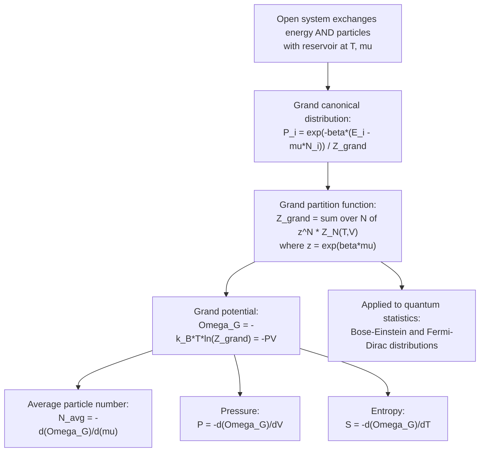

## The Grand Canonical Ensemble

### Overview

The grand canonical ensemble describes an open system in contact with a reservoir that can exchange both energy and particles, at fixed temperature $T$ and chemical potential $\mu$. It generalizes the canonical ensemble by allowing particle number $N$ to fluctuate in addition to energy $E$, making it the natural framework for systems where particle number is not conserved or not conveniently fixed — quantum gases, adsorption phenomena, chemical and phase equilibria, and open quantum systems.

### Physical Setup

**Key Points**

- The system exchanges both energy and particles with a much larger reservoir, which fixes the temperature $T$ and chemical potential $\mu$ of the system.
- Volume $V$ is held fixed; $N$ and $E$ both fluctuate.
- The chemical potential $\mu$ acts as the "cost" (in energy) of adding one particle to the system while keeping entropy and volume fixed: $\mu = \left(\frac{\partial E}{\partial N}\right)_{S,V}$.
- Especially suited to quantum statistical mechanics, where particle number for a given quantum state is naturally variable (occupation numbers).

### Derivation

Following the same logic as the canonical ensemble derivation, but now allowing the reservoir to exchange both energy and particles, the probability of the system being in a microstate $i$ with energy $E_i$ and particle number $N_i$ is proportional to the number of microstates available to the combined reservoir, expanded via entropy:

$$S_R \approx S_R(E_{total}, N_{total}) - \frac{E_i}{T} + \frac{\mu N_i}{T}$$

using $\frac{1}{T} = \left(\frac{\partial S}{\partial E}\right)_{N,V}$ and $-\frac{\mu}{T} = \left(\frac{\partial S}{\partial N}\right)_{E,V}$. This yields the **grand canonical probability distribution**:

$$P_i = \frac{e^{-\beta(E_i - \mu N_i)}}{\mathcal{Z}}$$

where $\beta = 1/k_BT$ and $\mathcal{Z}$ is the grand partition function.

### The Grand Partition Function

$$\mathcal{Z}(T, V, \mu) = \sum_{N=0}^{\infty}\sum_{i} e^{-\beta(E_{i,N} - \mu N)} = \sum_{N=0}^{\infty} z^N Z_N(T,V)$$

where $Z_N$ is the canonical partition function for exactly $N$ particles, and $z \equiv e^{\beta\mu}$ is called the **fugacity**.

**Key Points**

- $\mathcal{Z}$ sums over all possible particle numbers, unlike the canonical partition function $Z$ which fixes $N$.
- The grand partition function can be viewed as a generating function in the fugacity $z$, with $Z_N$ as the coefficients.
- For systems of independent particles/states, $\mathcal{Z}$ factorizes as a product over single-particle states, which is what makes it especially powerful for quantum statistics.

### The Grand Potential

$$\Omega_G = -k_BT\ln\mathcal{Z} = F - \mu N = -PV$$

This is the grand canonical analog of the Helmholtz free energy, serving as the central thermodynamic potential from which all other quantities are derived.

#### Key Derivatives

$$N = \langle N\rangle = -\left(\frac{\partial \Omega_G}{\partial \mu}\right)_{T,V} = k_BT\left(\frac{\partial \ln\mathcal{Z}}{\partial \mu}\right)_{T,V}$$

$$S = -\left(\frac{\partial \Omega_G}{\partial T}\right)_{V,\mu}$$

$$P = -\left(\frac{\partial \Omega_G}{\partial V}\right)_{T,\mu}$$

$$\langle E\rangle = -\left(\frac{\partial \ln\mathcal{Z}}{\partial \beta}\right)_{\beta\mu} + \mu\langle N\rangle$$

### Particle Number and Energy Fluctuations

$$\text{Var}(N) = \langle N^2\rangle - \langle N\rangle^2 = k_BT\left(\frac{\partial \langle N\rangle}{\partial \mu}\right)_{T,V}$$

**Key Points**

- This links measurable particle-number fluctuations to the compressibility of the system, forming a fluctuation-response relation analogous to the energy-heat capacity relation in the canonical ensemble.
- As with the canonical ensemble, relative fluctuations $\Delta N/\langle N\rangle \sim 1/\sqrt{\langle N\rangle}$ vanish in the thermodynamic limit, so canonical and grand canonical ensembles agree on macroscopic predictions.

### Mermaid Diagram: Grand Canonical Framework

### Application: Quantum Ideal Gases

The grand canonical ensemble is the natural and standard framework for deriving quantum statistics, because it treats each single-particle quantum state as an independent subsystem exchanging particles with the reservoir.

#### Fermi-Dirac Statistics

For fermions (obeying the Pauli exclusion principle, occupation number $n = 0$ or $1$ per state), the grand partition function for a single state of energy $\epsilon$ is:

$$\mathcal{Z}_\epsilon = 1 + e^{-\beta(\epsilon-\mu)}$$

giving the average occupation number (Fermi-Dirac distribution):

$$\langle n(\epsilon)\rangle = \frac{1}{e^{\beta(\epsilon-\mu)}+1}$$

#### Bose-Einstein Statistics

For bosons (unrestricted occupation number $n = 0, 1, 2, \ldots$), summing the geometric series gives:

$$\mathcal{Z}_\epsilon = \frac{1}{1-e^{-\beta(\epsilon-\mu)}}, \quad (\mu < \epsilon)$$

yielding the average occupation number (Bose-Einstein distribution):

$$\langle n(\epsilon)\rangle = \frac{1}{e^{\beta(\epsilon-\mu)}-1}$$

**Key Points**

- Both distributions reduce to the classical Maxwell-Boltzmann distribution $\langle n(\epsilon)\rangle \approx e^{-\beta(\epsilon-\mu)}$ in the limit $e^{\beta(\epsilon-\mu)} \gg 1$ (low density, high temperature, or large $\epsilon - \mu$) — this is the classical limit where quantum degeneracy effects vanish.
- For bosons, $\mu$ must always be less than the lowest single-particle energy to keep occupation numbers positive; when $\mu$ approaches this lowest energy, Bose-Einstein condensation occurs.
- Fermi-Dirac statistics underlie the electron gas model in metals and semiconductors, white dwarf and neutron star degeneracy pressure, and the electronic structure of atoms via the Pauli exclusion principle.

### Worked Example: Two-State Adsorption System

**Example**

Consider a surface with $M$ independent adsorption sites, each of which can be empty ($E=0$) or occupied by one gas molecule ($E = -\epsilon_0$, with $\epsilon_0 > 0$ binding energy), in equilibrium with a gas reservoir at chemical potential $\mu$. The grand partition function per site is:

$$\mathcal{Z}_1 = 1 + e^{\beta(\mu+\epsilon_0)}$$

The average fractional occupation (coverage) is:

$$\theta = \langle n\rangle = \frac{e^{\beta(\mu+\epsilon_0)}}{1+e^{\beta(\mu+\epsilon_0)}}$$

This is the **Langmuir isotherm**, a foundational result in surface physical chemistry describing gas adsorption onto a solid surface as a function of pressure (via $\mu$'s relation to gas pressure) and temperature.

### Relation to Other Ensembles

**Key Points**

- **Canonical ensemble** is recovered from the grand canonical ensemble in the limit of a sharply peaked $N$ distribution — mathematically, the canonical $Z_N$ is obtained from $\mathcal{Z}$ via an inverse Laplace-type transform (fixing $N$ exactly).
- **Microcanonical ensemble** is recovered similarly by fixing both $E$ and $N$ exactly.
- All three ensembles agree in the thermodynamic limit for macroscopic systems; the grand canonical ensemble is chosen for mathematical convenience whenever particle number is naturally variable (open systems, quantum field-like treatments, chemical reactions).
- The choice of ensemble does not reflect a different physical system — it reflects which constraints are held fixed versus allowed to fluctuate in the mathematical description.

### Applications

**Key Points**

- Quantum statistics: derivation of Bose-Einstein and Fermi-Dirac distributions, blackbody radiation (photon gas), electron gas in metals, Bose-Einstein condensation.
- Chemical and phase equilibria: since $\mu$ is the natural variable controlling particle exchange, the grand canonical ensemble is standard in analyzing systems with variable composition (osmotic equilibrium, multi-phase coexistence).
- Adsorption and surface physics (Langmuir isotherm and generalizations).
- Grand canonical Monte Carlo simulations, widely used in computational chemistry and materials science to study systems with variable particle number (e.g., fluid adsorption in porous materials).

### Validity and Limitations

**Key Points**

- Requires the system to be genuinely able to exchange particles with a reservoir — not appropriate for strictly closed, isolated systems (use microcanonical) or systems with fixed, conserved $N$ studied at fixed $T$ (canonical ensemble is often more direct, though results agree in the thermodynamic limit).
- [Inference] For very small systems, particle number fluctuations can become a significant fraction of $\langle N\rangle$, so the grand canonical description may predict qualitatively different fluctuation behavior compared to canonical or microcanonical treatments of the same physical setup, even though average quantities coincide.

### Conclusion

The grand canonical ensemble extends statistical mechanics to open systems that exchange both energy and particles with a reservoir, characterized by fixed temperature $T$ and chemical potential $\mu$. Its partition function $\mathcal{Z}$ and grand potential $\Omega_G = -PV$ provide the most natural and computationally convenient route to deriving quantum statistics (Bose-Einstein, Fermi-Dirac), phase equilibria, and adsorption phenomena, cementing its role as an essential tool across condensed matter physics, quantum statistical mechanics, and physical chemistry.

**Related Topics**

- Canonical Ensemble and the Boltzmann Distribution
- Fermi-Dirac and Bose-Einstein Statistics
- Chemical Potential and Phase Equilibria
- Bose-Einstein Condensation
- Blackbody Radiation and the Photon Gas
- Langmuir Adsorption Isotherm
- Fluctuation-Response Relations in Statistical Mechanics
- Grand Canonical Monte Carlo Methods