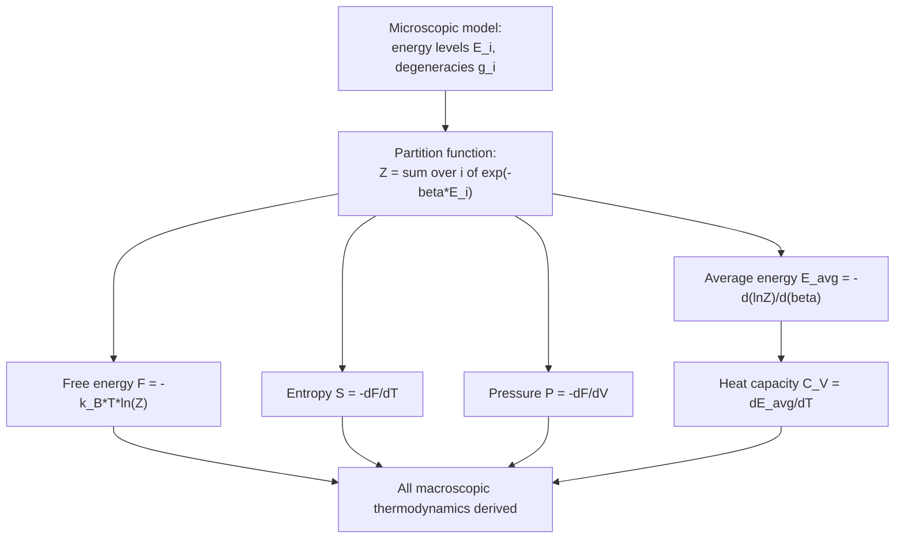

## Partition Functions

### Overview

The partition function is the central mathematical object in statistical mechanics, encoding complete thermodynamic information about a system in thermal equilibrium. It acts as a weighted sum over all accessible microstates, with each state weighted by its Boltzmann factor. Nearly every macroscopic thermodynamic quantity — energy, entropy, free energy, pressure, heat capacity — can be derived directly from the partition function, making it the essential "bridge" between microscopic quantum/classical mechanics and macroscopic thermodynamics.

### The Canonical Partition Function

#### Definition

For a system in the canonical ensemble (fixed $N$, $V$, $T$, in contact with a heat reservoir), the partition function is:

$$Z = \sum_i e^{-\beta E_i}$$

where the sum runs over all microstates $i$ of the system, $E_i$ is the energy of microstate $i$, and $\beta = 1/k_BT$.

**Key Points**

- $Z$ is dimensionless.
- It serves as the normalization constant for the Boltzmann probability distribution: $P_i = e^{-\beta E_i}/Z$.
- Degenerate states (multiple microstates sharing the same energy) can be grouped: $Z = \sum_{\text{levels}} g_j e^{-\beta \epsilon_j}$, where $g_j$ is the degeneracy of energy level $\epsilon_j$.

#### Classical Continuous Form

For classical systems described by continuous phase space coordinates $(\mathbf{q}, \mathbf{p})$, the sum becomes an integral over the Hamiltonian $H(\mathbf{q},\mathbf{p})$:

$$Z = \frac{1}{h^{3N}N!}\int e^{-\beta H(\mathbf{q},\mathbf{p})}\, d^{3N}q\, d^{3N}p$$

where $h$ is Planck's constant (providing the correct phase-space cell size for dimensional consistency and quantum correspondence) and $N!$ corrects for the indistinguishability of identical particles.

### Why the Partition Function Matters

**Key Points**

- All thermodynamic quantities are derivable from $\ln Z$ and its derivatives with respect to $\beta$, $T$, $V$, or other parameters — $Z$ is essentially a generating function for thermodynamics.
- Once $Z$ is computed for a given microscopic model (energy levels, degeneracies, interactions), the entire macroscopic thermodynamic behavior of the system follows without further physical input.
- Complex many-body problems are often reduced to computing a single-particle partition function, then combining via factorization rules.

### Thermodynamic Quantities from Z

$$F = -k_BT\ln Z \quad \text{(Helmholtz free energy)}$$

$$\langle E\rangle = -\frac{\partial \ln Z}{\partial \beta} \quad \text{(average energy)}$$

$$S = k_B\ln Z + \frac{\langle E\rangle}{T} = -\frac{\partial F}{\partial T} \quad \text{(entropy)}$$

$$P = k_BT\left(\frac{\partial \ln Z}{\partial V}\right)_{T,N} \quad \text{(pressure)}$$

$$C_V = \frac{\partial \langle E\rangle}{\partial T} = k_B\beta^2\left(\frac{\partial^2\ln Z}{\partial\beta^2}\right) = \frac{\text{Var}(E)}{k_BT^2} \quad \text{(heat capacity)}$$

$$\mu = -k_BT\left(\frac{\partial \ln Z}{\partial N}\right)_{T,V} \quad \text{(chemical potential)}$$

### Mermaid Diagram: Partition Function as Central Hub

### Factorization Rules

#### Independent, Distinguishable Subsystems

If a system decomposes into $N$ independent, non-interacting, distinguishable subsystems (e.g., localized spins on a lattice, distinguishable oscillators), the total partition function factorizes as a simple product:

$$Z_{total} = z_1 \cdot z_2 \cdots z_N$$

If all subsystems are identical: $Z_{total} = z_1^N$, where $z_1$ is the single-subsystem partition function.

#### Independent, Indistinguishable Particles

For indistinguishable particles (e.g., gas molecules), naive multiplication overcounts configurations that differ only by particle relabeling. The correction (valid in the classical, non-degenerate limit) is:

$$Z_{total} = \frac{z_1^N}{N!}$$

This correction resolves the Gibbs paradox and ensures entropy is properly extensive.

#### Separable Energy Contributions

When a single particle's energy decomposes into independent additive contributions (e.g., translational, rotational, vibrational, electronic), the single-particle partition function factorizes:

$$z_1 = z_{trans} \cdot z_{rot} \cdot z_{vib} \cdot z_{elec}$$

This decomposition is extensively used in molecular statistical thermodynamics to compute thermodynamic properties of gases from spectroscopic data.

### Worked Example: The Quantum Harmonic Oscillator

**Example**

A single quantum harmonic oscillator has energy levels $\epsilon_n = \hbar\omega\left(n+\frac{1}{2}\right)$, $n = 0, 1, 2, \ldots$. The partition function is:

$$z = \sum_{n=0}^{\infty} e^{-\beta\hbar\omega(n+1/2)} = e^{-\beta\hbar\omega/2}\sum_{n=0}^{\infty}e^{-\beta\hbar\omega n} = \frac{e^{-\beta\hbar\omega/2}}{1-e^{-\beta\hbar\omega}}$$

using the geometric series formula. This simplifies to:

$$z = \frac{1}{2\sinh(\beta\hbar\omega/2)}$$

The average energy is:

$$\langle\epsilon\rangle = \hbar\omega\left(\frac{1}{2} + \frac{1}{e^{\beta\hbar\omega}-1}\right)$$

This result is the microscopic basis for the **Einstein model of solids** (treating $N$ atoms as $3N$ independent quantum oscillators), which correctly predicts that heat capacity vanishes at $T \to 0$ (unlike the classical equipartition prediction of constant $C_V$), resolving a major historical discrepancy between classical and observed low-temperature heat capacities.

### Worked Example: The Two-Level System

**Example**

A single particle with two energy states, $0$ and $\epsilon$, has partition function:

$$z = 1 + e^{-\beta\epsilon}$$

Average energy: $\langle\epsilon\rangle = \dfrac{\epsilon\, e^{-\beta\epsilon}}{1+e^{-\beta\epsilon}} = \dfrac{\epsilon}{e^{\beta\epsilon}+1}$

Heat capacity (Schottky anomaly):

$$C_V = k_B(\beta\epsilon)^2 \frac{e^{\beta\epsilon}}{(e^{\beta\epsilon}+1)^2}$$

This produces a characteristic peak in $C_V$ vs. $T$ — the **Schottky anomaly** — observed experimentally in paramagnetic salts and other systems with a small number of accessible energy levels.

### Molecular Partition Functions (Ideal Gas)

For a diatomic ideal gas molecule, the total single-molecule partition function typically factorizes as:

$$z_1 = z_{trans}\cdot z_{rot}\cdot z_{vib}\cdot z_{elec}$$

- **Translational**: $z_{trans} = \dfrac{V}{\lambda_{th}^3}$, with thermal de Broglie wavelength $\lambda_{th} = \sqrt{h^2/2\pi mk_BT}$.
- **Rotational** (rigid rotor, high-T limit): $z_{rot} \approx \dfrac{T}{\sigma\,\Theta_{rot}}$, where $\Theta_{rot} = \hbar^2/2Ik_B$ is the rotational temperature ($I$ = moment of inertia) and $\sigma$ is a symmetry number.
- **Vibrational** (harmonic oscillator, per mode): $z_{vib} = \dfrac{1}{1-e^{-\Theta_{vib}/T}}$ (relative to the ground vibrational state), with $\Theta_{vib} = \hbar\omega/k_B$.
- **Electronic**: $z_{elec} = g_0 + g_1e^{-\Delta\epsilon/k_BT}+\cdots$, generally approximated by just the ground-state degeneracy $g_0$ if excited electronic states lie far above $k_BT$.

**Key Points**

- This factorization allows computation of gas-phase thermodynamic properties (entropy, heat capacity, equilibrium constants) directly from spectroscopic constants (bond lengths, vibrational frequencies) — a central technique in statistical thermodynamics and physical chemistry.
- The relative magnitudes of $\Theta_{rot}$ and $\Theta_{vib}$ compared to typical temperatures determine whether classical (equipartition) or quantum treatment is required for each degree of freedom.

### Partition Functions in Quantum Statistics

**Key Points**

- For a system of indistinguishable quantum particles (fermions or bosons), the grand canonical partition function is generally used instead, since fixed-$N$ combinatorics become complicated by quantum symmetrization/antisymmetrization requirements.
- For Fermi-Dirac and Bose-Einstein statistics, the grand partition function factorizes over single-particle states, each contributing $\mathcal{Z}_\epsilon = 1+e^{-\beta(\epsilon-\mu)}$ (fermions) or $\mathcal{Z}_\epsilon = [1-e^{-\beta(\epsilon-\mu)}]^{-1}$ (bosons).
- The classical partition function is recovered as the limiting case of both quantum statistics when quantum degeneracy is negligible (dilute, high-temperature limit).

### Relation Between Ensembles' Partition Functions

**Key Points**

- **Microcanonical**: characterized by $\Omega(E)$, the density/count of states at fixed energy — entropy $S = k_B\ln\Omega$ is primary.
- **Canonical**: characterized by $Z(T) = \sum_i e^{-\beta E_i}$ — related to $\Omega(E)$ via $Z = \int \Omega(E)e^{-\beta E}\,dE$, i.e., $Z$ is essentially the Laplace transform of the density of states.
- **Grand canonical**: characterized by $\mathcal{Z}(T,\mu) = \sum_N z^N Z_N(T)$ — related to $Z_N$ via a generating function in fugacity $z = e^{\beta\mu}$.
- This hierarchy (density of states → canonical partition function → grand partition function) reflects successive relaxations of constraints (fixed $E$ → fixed $T$ → fixed $\mu$), each connected by integral transform relationships.

### Practical Computation Strategies

**Key Points**

- **Exact enumeration**: feasible for simple systems with few discrete energy levels (two-level systems, small spin systems).
- **Factorization**: exploit independence of subsystems or of separable energy contributions (translational/rotational/vibrational/electronic) whenever the underlying Hamiltonian permits it.
- **Approximations**: high-temperature (classical/equipartition) limits, low-temperature (ground-state-dominated) limits, and semiclassical (Boltzmann) approximations to quantum statistics are standard simplifications.
- **Numerical/computational methods**: Monte Carlo sampling (e.g., Metropolis algorithm) and transfer matrix methods are used for complex interacting systems (e.g., the Ising model) where the partition function cannot be evaluated in closed form. [Inference] For strongly correlated or frustrated systems, computing $Z$ exactly can be computationally intractable (NP-hard in some cases), requiring approximate numerical techniques.

### Conclusion

The partition function is the unifying computational and conceptual tool of statistical mechanics, transforming a microscopic specification of energy levels into a complete macroscopic thermodynamic description via $\ln Z$ and its derivatives. Its factorization properties make otherwise intractable many-body problems solvable by decomposition into independent modes or degrees of freedom, and it underlies essentially all quantitative statistical thermodynamics — from ideal gases and solids to quantum statistics and chemical equilibrium.

**Related Topics**

- The Canonical and Grand Canonical Ensembles
- Boltzmann Entropy and Microstates
- Einstein and Debye Models of Solids
- Schottky Anomaly and Two-Level Systems
- Molecular Statistical Thermodynamics (Translational, Rotational, Vibrational Partition Functions)
- Fermi-Dirac and Bose-Einstein Statistics
- Density of States and the Microcanonical Ensemble
- Monte Carlo Methods and the Ising Model