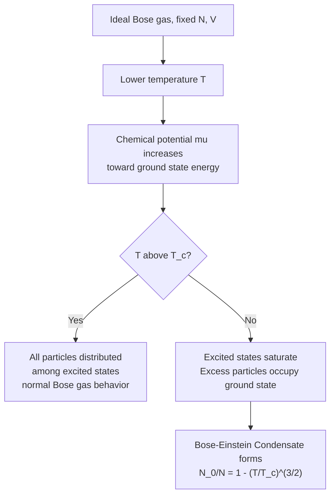

## Bose-Einstein Statistics

### Overview

Bose-Einstein statistics describes the distribution of identical, indistinguishable particles with integer spin (bosons) among available quantum energy states, with no restriction on the number of particles that can occupy a single state. Developed by Satyendra Nath Bose (1924) for photons and extended by Albert Einstein to massive particles, this framework is essential for understanding photon gases (blackbody radiation), phonons, superfluid helium, and Bose-Einstein condensation — phenomena with no classical analog.

### Bosons: Defining Characteristics

**Key Points**

- Bosons are particles with integer spin ($s = 0, 1, 2, \ldots$ in units of $\hbar$): photons ($s=1$), gluons, W/Z bosons, the Higgs boson ($s=0$), and composite particles like $^4$He atoms and Cooper pairs.
- The many-particle wavefunction of identical bosons is **symmetric** under exchange of any two particles: $\Psi(\ldots, \mathbf{r}_i, \ldots, \mathbf{r}_j, \ldots) = +\Psi(\ldots, \mathbf{r}_j, \ldots, \mathbf{r}_i, \ldots)$.
- Unlike fermions, bosons are not subject to the Pauli exclusion principle — arbitrarily many bosons can occupy the same single-particle quantum state.
- This tendency to "bunch" into the same state underlies phenomena such as laser light (photon bunching) and Bose-Einstein condensation.

### Derivation via the Grand Canonical Ensemble

Bose-Einstein statistics is most naturally derived using the grand canonical ensemble, treating each single-particle quantum state as an independent subsystem exchanging particles with a reservoir at temperature $T$ and chemical potential $\mu$.

For a single state of energy $\epsilon$, since occupation number $n$ can take any non-negative integer value ($n = 0, 1, 2, \ldots$), the grand partition function for that state is a geometric series:

$$\mathcal{Z}_\epsilon = \sum_{n=0}^{\infty} e^{-\beta n(\epsilon-\mu)} = \frac{1}{1-e^{-\beta(\epsilon-\mu)}}$$

valid only when $e^{-\beta(\epsilon-\mu)} < 1$, i.e., $\mu < \epsilon$ for all accessible states.

### The Bose-Einstein Distribution

The average occupation number of a single-particle state with energy $\epsilon$ is:

$$\langle n(\epsilon)\rangle = -\frac{1}{\beta}\frac{\partial \ln\mathcal{Z}_\epsilon}{\partial\mu} = \frac{1}{e^{\beta(\epsilon-\mu)}-1}$$

This is the **Bose-Einstein distribution function**, denoted $f_{BE}(\epsilon)$ or $\bar{n}(\epsilon)$.

**Key Points**

- Requires $\mu < \epsilon_0$, where $\epsilon_0$ is the lowest available single-particle energy, to keep $\langle n\rangle \geq 0$ for all states.
- As $\epsilon \to \mu$ from above, $\langle n(\epsilon)\rangle \to \infty$ — an arbitrarily large number of particles can accumulate in a state as its energy approaches $\mu$.
- As $T \to \infty$ or for $\epsilon - \mu \gg k_BT$, $e^{\beta(\epsilon-\mu)} \gg 1$, and the distribution reduces to the classical Maxwell-Boltzmann form: $\langle n(\epsilon)\rangle \approx e^{-\beta(\epsilon-\mu)}$.

### Comparison of Quantum Statistics (SVG Diagram)

<svg xmlns="http://www.w3.org/2000/svg" viewBox="0 0 600 380">
<text x="300" y="24" text-anchor="middle" font-size="16" font-family="sans-serif" font-weight="bold">Occupation Number vs. Energy (svg_diagram)</text>
<line x1="60" y1="320" x2="560" y2="320" stroke="black" stroke-width="2" />
<line x1="60" y1="320" x2="60" y2="50" stroke="black" stroke-width="2" />
<text x="560" y="345" text-anchor="end" font-size="13" font-family="sans-serif">Energy (epsilon)</text>
<text x="25" y="180" text-anchor="middle" font-size="13" font-family="sans-serif" transform="rotate(-90 25 180)">&lt;n(epsilon)&gt;</text>
<line x1="130" y1="50" x2="130" y2="320" stroke="#999" stroke-width="1" stroke-dasharray="4,4" />
<text x="130" y="45" text-anchor="middle" font-size="11" font-family="sans-serif">mu</text>

<path d="M 135,55 C 160,110 190,180 230,225 C 290,270 400,300 560,312" fill="none" stroke="`#cc3333`" stroke-width="2.5" />

<text x="220" y="120" font-size="12" fill="`#cc3333`" font-family="sans-serif">Bose-Einstein (diverges at mu)</text>

<path d="M 60,90 C 90,90 100,95 130,140 C 160,190 180,260 220,290 C 300,310 450,318 560,319" fill="none" stroke="`#2266cc`" stroke-width="2.5" />

<text x="330" y="270" font-size="12" fill="`#2266cc`" font-family="sans-serif">Fermi-Dirac (capped at 1)</text>

<path d="M 130,200 C 200,240 300,280 400,300 C 460,308 520,313 560,315" fill="none" stroke="`#22aa55`" stroke-width="2.5" />

<text x="350" y="235" font-size="12" fill="`#22aa55`" font-family="sans-serif">Maxwell-Boltzmann (classical limit)</text>

<text x="60" y="95" font-size="11" font-family="sans-serif" text-anchor="end">1</text>

<line x1="55" y1="90" x2="60" y2="90" stroke="black" />

</svg>

### Bose-Einstein Condensation

#### Physical Mechanism

**Key Points**

- As $T$ decreases at fixed particle density $n = N/V$, the chemical potential $\mu$ must increase toward the ground-state energy $\epsilon_0$ (often set to zero) to accommodate all particles.
- Below a critical temperature $T_c$, the excited states alone cannot hold all $N$ particles even as $\mu \to \epsilon_0$ — the "excess" particles macroscopically occupy the single ground state, forming a **Bose-Einstein condensate (BEC)**.
- This is a genuine phase transition, driven purely by quantum statistics (not interactions), occurring even for an ideal (non-interacting) Bose gas.

#### Critical Temperature

For a uniform 3D ideal Bose gas of mass $m$ and number density $n = N/V$:

$$T_c = \frac{2\pi\hbar^2}{mk_B}\left(\frac{n}{\zeta(3/2)}\right)^{2/3}$$

where $\zeta(3/2) \approx 2.612$ is the Riemann zeta function evaluated at $3/2$, arising from the integral over the density of states.

Below $T_c$, the condensate fraction follows:

$$\frac{N_0}{N} = 1-\left(\frac{T}{T_c}\right)^{3/2}$$

where $N_0$ is the number of particles in the ground state.

**Key Points**

- First experimentally realized in 1995 by Eric Cornell and Carl Wieman (rubidium-87) and independently by Wolfgang Ketterle (sodium-23), using laser cooling and magnetic/evaporative trapping — awarded the 2001 Nobel Prize in Physics.
- BEC requires extremely low temperatures (nanokelvin range) because $T_c$ for dilute atomic gases is very small due to low particle density compared to, e.g., liquid helium.
- [Inference] Superfluidity in liquid helium-4 below approximately 2.17 K (the lambda point) is closely related to Bose-Einstein condensation, though strong interparticle interactions in liquid helium make the connection more complex than the ideal-gas treatment.

### Mermaid Diagram: Path to Bose-Einstein Condensation

### Application: Blackbody Radiation (Photon Gas)

**Example**

Photons are massless bosons with $\mu = 0$ (photon number is not conserved — photons can be freely created/absorbed by the walls of a cavity). The Bose-Einstein distribution simplifies to:

$$\langle n(\omega)\rangle = \frac{1}{e^{\hbar\omega/k_BT}-1}$$

Combined with the density of photon states in a cavity, this yields **Planck's law** for blackbody spectral radiance:

$$u(\omega,T) = \frac{\hbar\omega^3}{\pi^2c^3}\cdot\frac{1}{e^{\hbar\omega/k_BT}-1}$$

Integrating over all frequencies gives the Stefan-Boltzmann law ($u_{total} \propto T^4$), and finding the peak via Wien's displacement law — both are direct macroscopic consequences of Bose-Einstein statistics applied to the photon gas, historically the first successful application of quantum statistics (predating even the full development of quantum mechanics).

### Application: Phonons in Solids

**Key Points**

- Lattice vibrations in solids are quantized as phonons, which obey Bose-Einstein statistics with $\mu = 0$ (like photons, phonon number is not conserved).
- This underlies the **Debye model** of solid heat capacity, which correctly predicts $C_V \propto T^3$ at low temperatures — a significant improvement over the Einstein model's exponential low-temperature behavior, matching experimental observations across a wider temperature range.

### High-Temperature / Classical Limit

**Key Points**

- When the thermal de Broglie wavelength $\lambda_{th} = \sqrt{2\pi\hbar^2/mk_BT}$ is much smaller than the interparticle spacing $n^{-1/3}$ (dilute gas, high temperature), quantum degeneracy effects are negligible, and Bose-Einstein statistics reduces smoothly to the classical Maxwell-Boltzmann distribution.
- The relevant dimensionless parameter is the **phase-space density** $n\lambda_{th}^3$; when this is much less than 1, classical statistics apply; when it approaches order unity, quantum statistics (and possibly BEC) become important.

### Comparison with Fermi-Dirac and Maxwell-Boltzmann

**Key Points**

- **Bose-Einstein**: integer spin, symmetric wavefunction, unlimited occupation per state, exhibits condensation at low $T$.
- **Fermi-Dirac**: half-integer spin, antisymmetric wavefunction, maximum occupation of 1 per state (Pauli exclusion), exhibits a Fermi sea/Fermi surface at low $T$.
- **Maxwell-Boltzmann**: classical limit of both quantum distributions, valid when quantum degeneracy is negligible; treats particles as distinguishable (with the $1/N!$ correction for proper classical indistinguishability bookkeeping).
- All three distributions share the same general Boltzmann-factor structure $e^{-\beta(\epsilon-\mu)}$ but differ in the denominator: $+1$ (Fermi-Dirac), $-1$ (Bose-Einstein), or absent (Maxwell-Boltzmann).

### Conclusion

Bose-Einstein statistics governs the distribution of indistinguishable, integer-spin particles across quantum states, permitting unlimited occupation of any single state — a fundamentally quantum phenomenon with no classical counterpart. It provides the theoretical foundation for blackbody radiation, the Debye model of solids, superfluidity, and Bose-Einstein condensation, and it reduces smoothly to classical Maxwell-Boltzmann statistics in the dilute, high-temperature limit, unifying quantum and classical descriptions of many-particle systems.

**Related Topics**

- Fermi-Dirac Statistics and the Pauli Exclusion Principle
- The Grand Canonical Ensemble
- Blackbody Radiation and Planck's Law
- Bose-Einstein Condensation
- Debye Model of Solid Heat Capacity
- Superfluidity in Liquid Helium
- Photon Gas Thermodynamics
- Classical Limit of Quantum Statistics