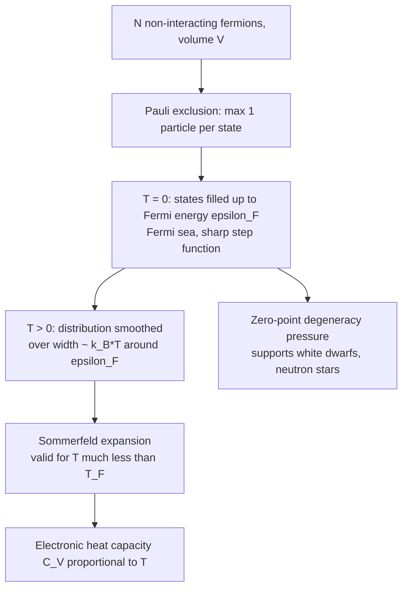

## Fermi-Dirac Statistics

### Overview

Fermi-Dirac statistics describes the distribution of identical, indistinguishable particles with half-integer spin (fermions) among available quantum energy states, subject to the Pauli exclusion principle, which limits occupation of any single quantum state to at most one particle. Developed by Enrico Fermi and Paul Dirac (1926), this framework is essential for understanding electron behavior in metals and semiconductors, white dwarf and neutron star structure, and the periodic table's electronic shell structure.

### Fermions: Defining Characteristics

**Key Points**

- Fermions have half-integer spin ($s = 1/2, 3/2, \ldots$ in units of $\hbar$): electrons, protons, neutrons, neutrinos, and quarks are all spin-1/2 fermions.
- The many-particle wavefunction of identical fermions is **antisymmetric** under exchange of any two particles: $\Psi(\ldots,\mathbf{r}_i,\ldots,\mathbf{r}_j,\ldots) = -\Psi(\ldots,\mathbf{r}_j,\ldots,\mathbf{r}_i,\ldots)$.
- This antisymmetry directly implies the **Pauli exclusion principle**: no two identical fermions can occupy the same quantum state (if $\mathbf{r}_i = \mathbf{r}_j$ with identical quantum numbers, $\Psi = -\Psi = 0$).
- This exclusion is responsible for the stability and structure of matter — electron shell filling in atoms, degeneracy pressure in dense stars, and the rigidity of solids.

### Derivation via the Grand Canonical Ensemble

Using the grand canonical ensemble, each single-particle quantum state is treated as an independent subsystem exchanging particles with a reservoir at temperature $T$ and chemical potential $\mu$. Because the Pauli principle restricts occupation number to $n = 0$ or $n = 1$ only, the grand partition function for a single state of energy $\epsilon$ is a two-term sum:

$$\mathcal{Z}_\epsilon = \sum_{n=0}^{1} e^{-\beta n(\epsilon-\mu)} = 1 + e^{-\beta(\epsilon-\mu)}$$

### The Fermi-Dirac Distribution

The average occupation number of a single-particle state with energy $\epsilon$ is:

$$\langle n(\epsilon)\rangle = -\frac{1}{\beta}\frac{\partial\ln\mathcal{Z}_\epsilon}{\partial\mu} = \frac{1}{e^{\beta(\epsilon-\mu)}+1}$$

This is the **Fermi-Dirac distribution function**, often written $f(\epsilon)$ or $f_{FD}(\epsilon)$.

**Key Points**

- $0 \leq \langle n(\epsilon)\rangle \leq 1$ for all energies and all temperatures, directly reflecting the Pauli exclusion principle.
- At $\epsilon = \mu$, $\langle n\rangle = 1/2$ exactly, at any temperature.
- No restriction on $\mu$ is required (unlike Bose-Einstein statistics) — $\mu$ can take any value, including energies within the range of occupied states.
- As $\epsilon - \mu \gg k_BT$, $\langle n(\epsilon)\rangle \to e^{-\beta(\epsilon-\mu)}$, reducing to the classical Maxwell-Boltzmann form (dilute, high-temperature/low-density limit).

### The Fermi Energy and Zero-Temperature Limit

#### Fermi Energy

At absolute zero ($T = 0$), the Fermi-Dirac distribution becomes a sharp step function:

$$\langle n(\epsilon)\rangle = \begin{cases} 1 & \epsilon < \epsilon_F \\ 0 & \epsilon > \epsilon_F \end{cases}$$

where $\epsilon_F$, the **Fermi energy**, is the chemical potential at $T=0$: $\mu(T=0) = \epsilon_F$. All states below $\epsilon_F$ are completely filled; all states above are completely empty — this is the **Fermi sea**.

**Key Points**

- Even at $T=0$, fermions possess substantial kinetic energy (unlike classical particles, which would have zero kinetic energy at $T=0$) — this is a direct quantum consequence of the Pauli exclusion principle forcing particles to fill successively higher energy states.
- This zero-point energy manifests macroscopically as **degeneracy pressure**, which does not vanish at $T = 0$ and is responsible for supporting white dwarf stars against gravitational collapse (electron degeneracy pressure) and neutron stars (neutron degeneracy pressure).

#### Fermi Energy for a Free Electron Gas (3D)

For a gas of $N$ non-interacting spin-1/2 electrons in volume $V$:

$$\epsilon_F = \frac{\hbar^2}{2m}\left(3\pi^2 n\right)^{2/3}$$

where $n = N/V$ is the number density. The corresponding **Fermi temperature** is $T_F = \epsilon_F/k_B$.

**Example**

For copper, the free-electron density is approximately $n \approx 8.5\times10^{28}\ \text{m}^{-3}$, giving $\epsilon_F \approx 7\ \text{eV}$ and $T_F \approx 8\times10^4\ \text{K}$. Since room temperature ($T \approx 300\ \text{K}$) is vastly smaller than $T_F$, the conduction electrons in copper are said to be highly **degenerate** — the Fermi-Dirac distribution deviates only slightly from its $T=0$ step-function form, a regime distinctly different from a classical ideal gas.

### The Fermi-Dirac Distribution at Finite Temperature (SVG Diagram)

<svg xmlns="http://www.w3.org/2000/svg" viewBox="0 0 600 340">
<text x="300" y="24" text-anchor="middle" font-size="16" font-family="sans-serif" font-weight="bold">Fermi-Dirac Distribution vs. Energy (svg_diagram)</text>
<line x1="60" y1="290" x2="560" y2="290" stroke="black" stroke-width="2" />
<line x1="60" y1="290" x2="60" y2="50" stroke="black" stroke-width="2" />
<text x="560" y="315" text-anchor="end" font-size="13" font-family="sans-serif">Energy (epsilon)</text>
<text x="25" y="170" text-anchor="middle" font-size="13" font-family="sans-serif" transform="rotate(-90 25 170)">&lt;n(epsilon)&gt;</text>
<line x1="310" y1="50" x2="310" y2="290" stroke="#999" stroke-width="1" stroke-dasharray="4,4" />
<text x="310" y="45" text-anchor="middle" font-size="11" font-family="sans-serif">epsilon_F</text>

<path d="M 60,70 L 310,70 L 310,270 L 560,270" fill="none" stroke="#2266cc" stroke-width="2.5" stroke-dasharray="2,2" />
<text x="120" y="60" font-size="12" fill="#2266cc" font-family="sans-serif">T = 0 (step function)</text>

<path d="M 60,72 C 200,72 260,80 285,110 C 300,140 320,200 335,230 C 360,260 420,268 560,269" fill="none" stroke="`#cc3333`" stroke-width="2.5" />

<text x="360" y="180" font-size="12" fill="`#cc3333`" font-family="sans-serif">T &gt; 0 (smoothed near epsilon_F)</text>

<text x="60" y="75" font-size="11" font-family="sans-serif" text-anchor="end">1</text>

</svg>

### Sommerfeld Expansion (Low-Temperature Corrections)

**Key Points**

- For a highly degenerate Fermi gas ($T \ll T_F$, the typical situation for metallic electrons at ordinary temperatures), thermodynamic quantities can be computed via a systematic low-temperature expansion known as the **Sommerfeld expansion**, treating $k_BT/\epsilon_F$ as a small parameter.
- This yields the electronic heat capacity result $C_V \propto T$ (linear in temperature), in contrast to the classical equipartition prediction of a constant, temperature-independent $C_V$ — a landmark early success of quantum statistics in resolving the "missing" electronic heat capacity puzzle in metals.
- The linear-in-$T$ electronic heat capacity coexists with the Debye $T^3$ phonon contribution, together giving the full low-temperature specific heat of metals: $C_V = \gamma T + AT^3$.

### Mermaid Diagram: Zero-Temperature to Finite-Temperature Fermi Gas

### Applications

#### Free Electron Model of Metals

**Key Points**

- Conduction electrons in metals are approximated as a free Fermi gas confined to the metal's volume, with the Fermi-Dirac distribution determining which electron states are occupied.
- Explains electrical and thermal conductivity trends, electronic heat capacity, and the general stability of metallic bonding when combined with band theory.

#### Semiconductor Physics

**Key Points**

- The Fermi-Dirac distribution determines electron occupation of conduction band states and hole occupation of valence band states in semiconductors, governing carrier concentration as a function of temperature and doping.
- The position of the Fermi level (chemical potential) relative to the band edges determines whether a semiconductor behaves as intrinsic, n-type, or p-type.

#### Degenerate Stellar Matter

**Key Points**

- **White dwarfs**: supported against gravitational collapse by electron degeneracy pressure, a direct consequence of the Pauli exclusion principle acting on a highly compressed, cold (relative to $T_F$) electron gas. The Chandrasekhar limit (~1.4 solar masses) marks where relativistic corrections to the degenerate electron gas cause this support to fail.
- **Neutron stars**: supported primarily by neutron degeneracy pressure, an analogous effect for the neutron Fermi gas at even higher densities.
- [Inference] Precise mass limits and structural details of these degenerate stars require relativistic corrections and equation-of-state refinements beyond the simple non-relativistic ideal Fermi gas treatment presented here.

### High-Temperature / Classical Limit

**Key Points**

- When $e^{\beta(\epsilon-\mu)} \gg 1$ for all relevant states (dilute gas, high temperature, or low density such that quantum degeneracy is negligible), the Fermi-Dirac distribution reduces to the classical Maxwell-Boltzmann distribution: $\langle n(\epsilon)\rangle \approx e^{-\beta(\epsilon-\mu)}$.
- The relevant criterion is again the phase-space density $n\lambda_{th}^3 \ll 1$, where $\lambda_{th}$ is the thermal de Broglie wavelength — the same criterion that governs the classical limit for Bose-Einstein statistics.

### Comparison with Bose-Einstein and Maxwell-Boltzmann

**Key Points**

- **Fermi-Dirac**: half-integer spin, antisymmetric wavefunction, occupation strictly $\leq 1$ per state, produces a Fermi sea and degeneracy pressure at low $T$, no phase transition analogous to BEC.
- **Bose-Einstein**: integer spin, symmetric wavefunction, unlimited occupation per state, exhibits Bose-Einstein condensation at low $T$.
- **Maxwell-Boltzmann**: the shared classical limit of both quantum distributions in the dilute, high-temperature regime.
- The structural difference — a $+1$ versus $-1$ in the distribution's denominator — has profound macroscopic consequences: matter's stability and structure (fermions) versus collective condensation phenomena (bosons).

### Conclusion

Fermi-Dirac statistics governs the distribution of indistinguishable, half-integer-spin particles subject to the Pauli exclusion principle, restricting occupation of each quantum state to at most one particle. This quantum constraint produces the Fermi sea and Fermi energy at low temperature, non-vanishing zero-point degeneracy pressure, and a linear-in-$T$ electronic heat capacity — results with direct consequences for metals, semiconductors, and the structural stability of white dwarfs and neutron stars. Like Bose-Einstein statistics, it reduces to the classical Maxwell-Boltzmann distribution in the dilute, high-temperature limit.

**Related Topics**

- Bose-Einstein Statistics and Condensation
- The Grand Canonical Ensemble
- Free Electron Model of Metals
- Sommerfeld Expansion and Electronic Heat Capacity
- Semiconductor Band Theory and Doping
- White Dwarf and Neutron Star Degeneracy Pressure
- Pauli Exclusion Principle and Atomic Shell Structure
- Classical Limit of Quantum Statistics