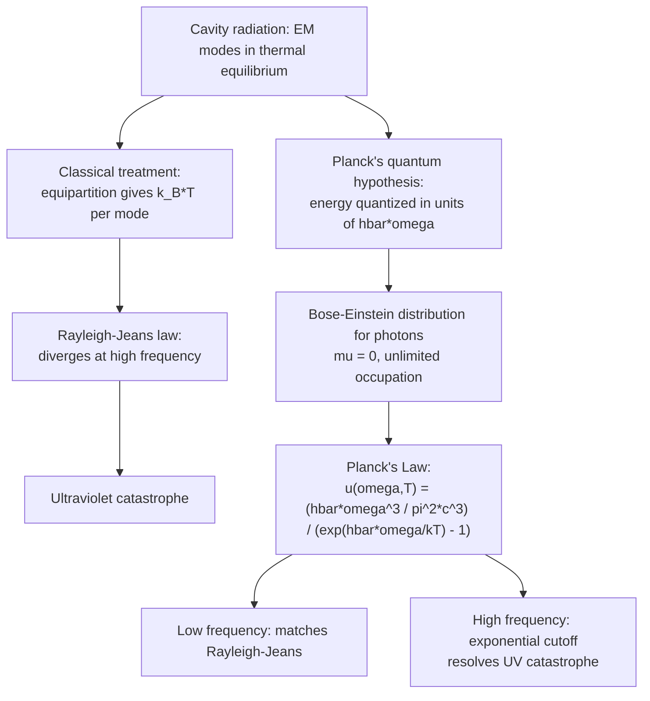

## Blackbody Radiation

### Overview

Blackbody radiation is the electromagnetic radiation emitted by an idealized object — a **blackbody** — that absorbs all incident radiation regardless of frequency or angle and re-emits energy purely as a function of its temperature. The study of blackbody radiation precipitated the birth of quantum mechanics: the failure of classical physics to explain its spectrum (the "ultraviolet catastrophe") led Max Planck to introduce energy quantization in 1900, and the statistical treatment of the photon gas remains a foundational application of Bose-Einstein statistics in statistical mechanics.

### The Ideal Blackbody

**Key Points**

- A blackbody absorbs 100% of incident electromagnetic radiation at every wavelength — it has emissivity $e = 1$ by definition.
- By Kirchhoff's law of thermal radiation, a good absorber is equally a good emitter; a blackbody emits the maximum possible thermal radiation at every wavelength for a given temperature.
- A practical laboratory approximation is a cavity with a small hole: radiation entering the hole undergoes many internal reflections and is effectively fully absorbed, while the hole itself emits a spectrum closely matching ideal blackbody radiation — this is the standard theoretical and experimental model (**cavity radiation**).
- The emitted spectrum depends only on temperature $T$, not on the material or shape of the blackbody.

### Historical Failure of Classical Physics: The Ultraviolet Catastrophe

#### The Rayleigh-Jeans Law

Classical electromagnetism and equipartition of energy predict that each electromagnetic mode in a cavity, treated as a classical harmonic oscillator, carries average energy $k_BT$ (equipartition). Combined with the density of electromagnetic modes in a cavity, this gives the **Rayleigh-Jeans law**:

$$u(\omega,T) = \frac{\omega^2}{\pi^2c^3}k_BT$$

**Key Points**

- This expression matches experimental blackbody spectra well at low frequencies (long wavelengths).
- It diverges as $\omega \to \infty$ (or $\lambda \to 0$), predicting infinite radiated energy at short wavelengths — the **ultraviolet catastrophe** — in stark contradiction with experimental observation, which shows the spectral intensity peaking and then decreasing at high frequency.
- This divergence signaled a fundamental breakdown of classical statistical mechanics applied to the electromagnetic field, motivating Planck's quantum hypothesis.

### Planck's Quantum Hypothesis and Planck's Law

#### Planck's Resolution

Planck postulated that electromagnetic energy in each cavity mode of frequency $\omega$ is quantized in discrete units of $\hbar\omega$, rather than being continuously variable as classical physics assumed. Treating each mode as a quantum harmonic oscillator (or equivalently, as a Bose-Einstein gas of photons with $\mu = 0$, since photon number is not conserved), the average energy per mode becomes:

$$\langle E(\omega)\rangle = \frac{\hbar\omega}{e^{\hbar\omega/k_BT}-1}$$

replacing the classical equipartition value $k_BT$.

#### Planck's Law (Spectral Energy Density)

Combining this with the density of electromagnetic modes in a cavity (accounting for two polarization states per mode) yields **Planck's law**:

$$u(\omega,T) = \frac{\hbar\omega^3}{\pi^2c^3}\cdot\frac{1}{e^{\hbar\omega/k_BT}-1}$$

Equivalently, in terms of wavelength $\lambda$:

$$u(\lambda,T) = \frac{8\pi hc}{\lambda^5}\cdot\frac{1}{e^{hc/\lambda k_BT}-1}$$

**Key Points**

- At low frequency ($\hbar\omega \ll k_BT$), $e^{\hbar\omega/k_BT}-1 \approx \hbar\omega/k_BT$, and Planck's law correctly reduces to the Rayleigh-Jeans law, matching classical behavior.
- At high frequency ($\hbar\omega \gg k_BT$), the exponential term dominates, causing $u(\omega,T)$ to decay exponentially rather than diverge — this resolves the ultraviolet catastrophe entirely.
- Planck's law was initially an empirical fit to data, with the underlying physical justification (quantization) developed afterward — a historically significant example of theory following observation.

### Statistical Mechanics Derivation via Bose-Einstein Statistics

**Key Points**

- Photons are massless, spin-1 bosons with chemical potential $\mu = 0$, because the number of photons in thermal equilibrium is not a conserved quantity — the cavity walls can freely emit and absorb photons to reach the equilibrium distribution.
- The Bose-Einstein distribution $\langle n(\epsilon)\rangle = 1/(e^{\beta\epsilon}-1)$, with $\epsilon = \hbar\omega$, gives the average photon occupation number per mode directly.
- Multiplying by the photon energy $\hbar\omega$ and the density of states for electromagnetic modes in a cavity (which scales as $\omega^2\,d\omega$ in 3D, from counting standing-wave modes) reproduces Planck's law exactly — this is the modern, rigorous derivation, historically preceded by Planck's more ad hoc oscillator quantization argument.

### Mermaid Diagram: From Classical Failure to Quantum Resolution

### Blackbody Spectrum Shape (SVG Diagram)

<svg xmlns="http://www.w3.org/2000/svg" viewBox="0 0 600 360">
<text x="300" y="24" text-anchor="middle" font-size="16" font-family="sans-serif" font-weight="bold">Blackbody Spectral Radiance (svg_diagram)</text>
<line x1="60" y1="300" x2="560" y2="300" stroke="black" stroke-width="2" />
<line x1="60" y1="300" x2="60" y2="50" stroke="black" stroke-width="2" />
<text x="560" y="325" text-anchor="end" font-size="13" font-family="sans-serif">Wavelength (lambda)</text>
<text x="25" y="175" text-anchor="middle" font-size="13" font-family="sans-serif" transform="rotate(-90 25 175)">u(lambda,T)</text>

<path d="M 560,290 C 450,270 350,220 260,140 C 220,100 190,60 165,50" fill="none" stroke="`#999999`" stroke-width="2" stroke-dasharray="5,4" />

<text x="380" y="150" font-size="11" fill="`#999999`" font-family="sans-serif">Rayleigh-Jeans (classical, diverges)</text>

<path d="M 60,295 C 150,295 200,270 260,220 C 310,175 350,160 400,175 C 460,195 520,250 560,285" fill="none" stroke="`#2266cc`" stroke-width="2.5" />

<text x="150" y="285" font-size="12" fill="`#2266cc`" font-family="sans-serif">Low T</text>

<path d="M 60,290 C 120,260 160,180 210,120 C 240,90 270,80 300,90 C 360,110 450,180 560,250" fill="none" stroke="`#cc3333`" stroke-width="2.5" />

<text x="220" y="75" font-size="12" fill="`#cc3333`" font-family="sans-serif">High T</text>

<text x="60" y="315" font-size="11" font-family="sans-serif" text-anchor="middle">0</text>

</svg>

### Integrated Quantities

#### Stefan-Boltzmann Law

Integrating Planck's law over all frequencies gives the total radiated power per unit area (radiant exitance):

$$j^\star = \sigma T^4$$

where $\sigma = \dfrac{2\pi^5k_B^4}{15h^3c^2} \approx 5.670\times10^{-8}\ \text{W m}^{-2}\text{K}^{-4}$ is the **Stefan-Boltzmann constant**. For a real (non-ideal) radiator with emissivity $e < 1$: $j = e\sigma T^4$.

**Key Points**

- The total radiated power scales dramatically with temperature — doubling absolute temperature increases total radiated power by a factor of 16.
- This law was established empirically by Josef Stefan (1879) and derived theoretically by Ludwig Boltzmann (1884) using classical thermodynamic arguments (before Planck's quantum treatment), and is fully consistent with (and derivable from) Planck's law.

#### Wien's Displacement Law

The wavelength at which the blackbody spectrum peaks is inversely proportional to temperature:

$$\lambda_{max}T = b$$

where $b \approx 2.898\times10^{-3}\ \text{m K}$ is **Wien's displacement constant**, found by maximizing Planck's law with respect to $\lambda$ at fixed $T$ (solving a transcendental equation numerically).

**Example**

The Sun's surface temperature is approximately $T \approx 5778\ \text{K}$. Applying Wien's law:

$$\lambda_{max} = \frac{b}{T} = \frac{2.898\times10^{-3}}{5778} \approx 5.0\times10^{-7}\ \text{m} = 500\ \text{nm}$$

This falls in the visible green-blue region of the spectrum, consistent with the Sun's observed peak emission and overall (nearly white, slightly yellow-tinted after atmospheric scattering) apparent color.

### Applications

**Key Points**

- **Astrophysics**: stellar surface temperatures are estimated from their blackbody-like spectra using Wien's law; total luminosity is estimated using the Stefan-Boltzmann law combined with stellar radius.
- **Cosmic Microwave Background**: the CMB is the most precisely measured blackbody spectrum in nature, with $T \approx 2.725\ \text{K}$, providing strong evidence for the hot Big Bang model.
- **Thermal imaging and pyrometry**: temperature of distant or inaccessible objects is inferred from their emitted thermal radiation spectrum.
- **Incandescent lighting**: tungsten filament bulbs approximate blackbody emitters at temperatures around 2500–3000 K, explaining their characteristic warm-white color and relative inefficiency (most emitted power is infrared, not visible).
- **Historical significance**: the resolution of the ultraviolet catastrophe via Planck's quantum hypothesis is widely regarded as the origin of quantum theory, subsequently extended by Einstein (photoelectric effect, 1905) and Bohr (atomic model, 1913).

### Photon Gas Thermodynamics

**Key Points**

- The photon gas is treated formally within the grand canonical ensemble with $\mu = 0$, since photon number is not separately conserved (only energy is fixed by temperature).
- Total photon number in a cavity at temperature $T$ scales as $N \propto T^3$, while total energy scales as $E \propto T^4$ (Stefan-Boltzmann), so average photon energy scales as $\langle\epsilon\rangle \propto T$, consistent with the characteristic photon energy $\hbar\omega \sim k_BT$.
- Photon gas entropy also scales as $S \propto T^3$, a result used in cosmology to relate the entropy of the early universe's radiation-dominated era to its temperature evolution.

### Limitations and Idealization

**Key Points**

- Real objects are not perfect blackbodies; emissivity $e(\lambda) < 1$ generally varies with wavelength, material, and surface properties (a "gray body" approximation uses a constant $e < 1$ across all wavelengths).
- [Inference] For most practical engineering and astrophysical estimates, treating an object as an approximate blackbody or gray body provides a reasonable first-order model, but precise spectroscopic analysis often reveals absorption/emission line features superimposed on the underlying blackbody-like continuum, arising from atomic and molecular transitions rather than pure thermal continuum radiation.

### Conclusion

Blackbody radiation describes the universal thermal emission spectrum of an idealized perfect absorber/emitter, fully determined by temperature alone. Its correct description required abandoning classical equipartition in favor of Planck's quantization hypothesis, marking the historical origin of quantum theory. Rigorously derived today via Bose-Einstein statistics applied to a zero-chemical-potential photon gas, blackbody radiation underlies the Stefan-Boltzmann and Wien laws and finds essential application across astrophysics, cosmology, and thermal engineering.

**Related Topics**

- Bose-Einstein Statistics and the Photon Gas
- Planck's Quantum Hypothesis and the Birth of Quantum Mechanics
- Stefan-Boltzmann Law and Wien's Displacement Law
- Cosmic Microwave Background Radiation
- Photoelectric Effect
- Density of States for Electromagnetic Modes
- Stellar Spectral Classification
- Kirchhoff's Law of Thermal Radiation