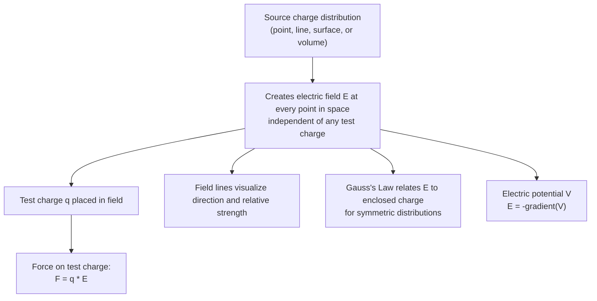

## The Electric Field

### Overview

The electric field is a vector field that describes the force per unit charge exerted on a stationary test charge at every point in space, arising from source charges. It reformulates the action-at-a-distance description of Coulomb's Law into a local field-theoretic picture, in which source charges create a field that permeates space, and other charges respond to the field at their location. This concept is foundational to all of classical electromagnetism and generalizes naturally to time-varying fields and electromagnetic radiation.

### Definition of the Electric Field

#### Operational Definition

The electric field $\vec{E}$ at a point in space is defined as the force per unit charge that would be experienced by a small, positive test charge $q_0$ placed at that point:

$$\vec{E} \equiv \lim_{q_0\to 0}\frac{\vec{F}}{q_0}$$

The limit $q_0 \to 0$ ensures the test charge is small enough not to disturb the source charge distribution creating the field.

**Key Points**

- $\vec{E}$ has SI units of newtons per coulomb (N/C), equivalent to volts per meter (V/m).
- The electric field exists at every point in space independent of whether a test charge is actually present — it is a property of the source charge distribution.
- The force on any charge $q$ placed in a field $\vec{E}$ is simply $\vec{F} = q\vec{E}$; the field direction is defined as the direction of force on a *positive* test charge.

### Electric Field of a Point Charge

From Coulomb's Law, the field created by a point charge $Q$ at distance $r$ is:

$$\vec{E} = k_e\frac{Q}{r^2}\hat{r}$$

where $\hat{r}$ points radially outward from $Q$ (for $Q>0$, the field points away from the charge; for $Q<0$, the field points toward it).

### Superposition of Electric Fields

**Key Points**

- The electric field due to multiple point charges is the vector sum of the individual fields: $\vec{E}_{net} = \sum_i \vec{E}_i = k_e\sum_i \dfrac{q_i}{r_i^2}\hat{r}_i$.
- This linearity follows directly from the linear superposition of Coulomb forces and is essential for computing fields of continuous or complex charge distributions.

### Electric Field Lines

**Key Points**

- Field lines are a visualization tool: the tangent to a field line at any point gives the direction of $\vec{E}$ there, and the density of field lines (lines per unit area) is proportional to field strength.
- Field lines originate on positive charges and terminate on negative charges (or extend to infinity for a net non-zero total charge).
- Field lines never cross (since $\vec{E}$ has a unique direction at each point) and are always perpendicular to the surface of a conductor in electrostatic equilibrium.
- The number of field lines emanating from a charge is proportional to the magnitude of that charge — this visual property is formalized quantitatively by Gauss's Law.

### Electric Field Line Patterns (SVG Diagram)

<svg xmlns="http://www.w3.org/2000/svg" viewBox="0 0 620 320">
<text x="310" y="24" text-anchor="middle" font-size="16" font-family="sans-serif" font-weight="bold">Electric Field Line Patterns (svg_diagram)</text>

<circle cx="130" cy="170" r="18" fill="#cc3333" />
<text x="130" y="176" text-anchor="middle" font-size="14" fill="white" font-family="sans-serif">+</text>
<g stroke="#2266cc" stroke-width="1.5" fill="none">
<line x1="130" y1="152" x2="130" y2="80" marker-end="url(#arr)" />
<line x1="130" y1="188" x2="130" y2="260" marker-end="url(#arr)" />
<line x1="148" y1="170" x2="220" y2="170" marker-end="url(#arr)" />
<line x1="112" y1="170" x2="40" y2="170" marker-end="url(#arr)" />
<line x1="143" y1="157" x2="195" y2="105" marker-end="url(#arr)" />
<line x1="117" y1="157" x2="65" y2="105" marker-end="url(#arr)" />
<line x1="143" y1="183" x2="195" y2="235" marker-end="url(#arr)" />
<line x1="117" y1="183" x2="65" y2="235" marker-end="url(#arr)" />
</g>
<text x="130" y="295" text-anchor="middle" font-size="12" font-family="sans-serif">Point charge (radial, outward)</text>

<circle cx="440" cy="170" r="16" fill="#cc3333" />
<text x="440" y="176" text-anchor="middle" font-size="13" fill="white" font-family="sans-serif">+</text>
<circle cx="540" cy="170" r="16" fill="#2266cc" />
<text x="540" y="176" text-anchor="middle" font-size="13" fill="white" font-family="sans-serif">-</text>
<path d="M 440,154 C 460,110 500,110 520,154" fill="none" stroke="#22aa55" stroke-width="1.5" marker-end="url(#arr)" />
<path d="M 440,186 C 460,230 500,230 520,186" fill="none" stroke="#22aa55" stroke-width="1.5" marker-end="url(#arr)" />
<line x1="456" y1="170" x2="524" y2="170" stroke="#22aa55" stroke-width="1.5" marker-end="url(#arr)" />
<path d="M 440,154 C 420,120 400,100 400,80" fill="none" stroke="#22aa55" stroke-width="1.5" />
<path d="M 540,154 C 560,120 580,100 580,80" fill="none" stroke="#22aa55" stroke-width="1.5" marker-end="url(#arr)" />
<text x="490" y="295" text-anchor="middle" font-size="12" font-family="sans-serif">Dipole (curved, + to -)</text>
</svg>

### Electric Field of Continuous Charge Distributions

For a continuous distribution, the field is computed by integrating the contribution of each infinitesimal charge element $dq$:

$$\vec{E} = k_e\int \frac{dq}{r^2}\hat{r}$$

#### Field of a Uniformly Charged Ring (on axis)

For a ring of radius $R$ and total charge $Q$, at distance $x$ along the central axis:

$$E_x = \frac{k_eQx}{(x^2+R^2)^{3/2}}$$

**Key Points**

- By symmetry, off-axis field components from opposite ring elements cancel, leaving only the axial component.
- At $x = 0$ (ring center), $E_x = 0$; at $x \gg R$, $E_x \to k_eQ/x^2$, correctly reducing to the point-charge result at large distance.

#### Field of an Infinite Charged Plane

For an infinite sheet with uniform surface charge density $\sigma$:

$$E = \frac{\sigma}{2\epsilon_0}$$

directed perpendicular to the plane, pointing away from it (for $\sigma > 0$), with the striking property that the field magnitude is **independent of distance** from the plane — a direct consequence of the plane's infinite extent and symmetry, most easily derived using Gauss's Law.

#### Field Between Parallel Plates (Capacitor)

For two oppositely charged infinite parallel plates with surface charge density $\pm\sigma$, the fields from each plate add between the plates and cancel outside:

$$E_{between} = \frac{\sigma}{\epsilon_0}, \qquad E_{outside} \approx 0$$

This uniform field configuration is the standard idealized model for a parallel-plate capacitor.

### Mermaid Diagram: Conceptual Structure of the Electric Field

### Worked Example: Field Due to Two Point Charges

**Example**

Find the electric field at the origin due to $q_1 = +4\ \mu\text{C}$ located at $x = -0.3\ \text{m}$ and $q_2 = -2\ \mu\text{C}$ located at $x = +0.2\ \text{m}$, both on the x-axis.

Field from $q_1$ at origin (distance 0.3 m, pointing away from $q_1$, i.e., in $+x$ direction since $q_1>0$):

$$E_1 = k_e\frac{q_1}{r_1^2} = (8.988\times10^9)\frac{4\times10^{-6}}{(0.3)^2} \approx 3.995\times10^5\ \text{N/C (in +x direction)}$$

Field from $q_2$ at origin (distance 0.2 m, pointing toward $q_2$ since $q_2<0$, i.e., in $+x$ direction, toward $q_2$ at $x=+0.2$):

$$E_2 = k_e\frac{|q_2|}{r_2^2} = (8.988\times10^9)\frac{2\times10^{-6}}{(0.2)^2} \approx 4.494\times10^5\ \text{N/C (in +x direction)}$$

Both fields point in the same direction at the origin, so:

$$E_{net} = E_1+E_2 \approx 8.489\times10^5\ \text{N/C, in the +x direction}$$

### Relation to Electric Potential

**Key Points**

- The electric field is related to the electric potential $V$ by $\vec{E} = -\nabla V$, i.e., the field points in the direction of steepest decrease of potential.
- Conversely, potential can be obtained from the field by integration: $V(\vec{r}) = -\int_{ref}^{\vec{r}} \vec{E}\cdot d\vec{l}$.
- This relationship makes potential (a scalar) often more convenient than the field (a vector) for calculations, with the field recovered afterward by differentiation.

### Electric Field and Conductors in Electrostatic Equilibrium

**Key Points**

- Inside a conductor in electrostatic equilibrium, $\vec{E} = 0$ — free charges redistribute until the internal field vanishes.
- Any net charge on an isolated conductor resides entirely on its outer surface.
- The field just outside a conductor's surface is perpendicular to the surface, with magnitude $E = \sigma/\epsilon_0$, where $\sigma$ is the local surface charge density.
- These properties underlie electrostatic shielding (the Faraday cage effect), where a conducting enclosure shields its interior from external electric fields.

### Motion of Charged Particles in Uniform Fields

**Key Points**

- A charge $q$ of mass $m$ in a uniform field $\vec{E}$ experiences constant force $\vec{F} = q\vec{E}$ and therefore constant acceleration $\vec{a} = q\vec{E}/m$, analogous to projectile motion under uniform gravity.
- This principle underlies devices such as cathode ray tubes (CRTs) and analytical instruments like mass spectrometers, where charged particles are deflected by controlled electric fields.

### Gauss's Law: Relating Field to Enclosed Charge

**Key Points**

- Gauss's Law states that the net electric flux through any closed surface is proportional to the enclosed charge: $\oint \vec{E}\cdot d\vec{A} = \dfrac{Q_{enc}}{\epsilon_0}$.
- For charge distributions with high symmetry (spherical, cylindrical, planar), Gauss's Law provides a far more efficient method for computing $\vec{E}$ than direct integration of Coulomb's Law.
- Gauss's Law is one of Maxwell's four equations and holds generally, even for time-varying fields, unlike the direct Coulomb's Law formula, which strictly applies only to static charge configurations.

### Validity and Limitations

**Key Points**

- The static electric field description here applies rigorously only to electrostatics (charges at rest, or in the quasi-static limit of slow motion).
- For time-varying charge distributions or currents, the electric field couples to a time-varying magnetic field (via Faraday's law and the Ampère-Maxwell law), requiring the full framework of Maxwell's equations rather than the static Coulomb-field picture alone.
- [Inference] At the quantum scale, the classical electric field concept is superseded by quantum electrodynamics, in which the electromagnetic interaction is mediated by virtual photon exchange; the classical field remains an excellent effective description at macroscopic scales and field strengths encountered in most laboratory and engineering contexts.

### Conclusion

The electric field reframes electrostatic interactions as a local, continuous vector field generated by source charges, with force on any test charge given simply by $\vec{F}=q\vec{E}$. This field-based perspective, supported by the superposition principle, field-line visualization, and Gauss's Law, provides the essential conceptual and mathematical foundation for calculating forces from complex charge distributions and for the subsequent development of electric potential, capacitance, and the full Maxwell's equations framework of electromagnetism.

**Related Topics**

- Coulomb's Law and Electric Charge
- Gauss's Law and Symmetric Charge Distributions
- Electric Potential and Potential Energy
- Conductors in Electrostatic Equilibrium
- Electric Dipoles and Dipole Moments
- Capacitance and Parallel-Plate Capacitors
- Continuous Charge Distributions
- Maxwell's Equations