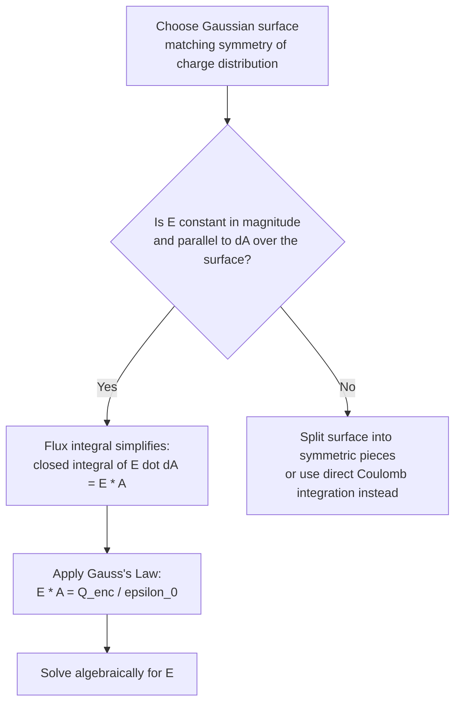

## Gauss's Law

### Overview

Gauss's Law relates the electric flux through any closed surface to the total electric charge enclosed within that surface. It is one of Maxwell's four equations, holding universally for both static and time-varying fields, and provides a powerful alternative to direct Coulomb's Law integration for calculating electric fields in problems possessing sufficient symmetry. Gauss's Law is fundamentally a statement about the geometric structure of the electric field sourced by charge.

### Electric Flux

#### Definition

Electric flux $\Phi_E$ through a surface quantifies the "amount" of electric field passing through that surface. For a uniform field $\vec{E}$ through a flat surface of area $\vec{A}$ (with direction defined by the outward normal):

$$\Phi_E = \vec{E}\cdot\vec{A} = EA\cos\theta$$

where $\theta$ is the angle between $\vec{E}$ and the surface normal $\hat{n}$.

For a non-uniform field or curved surface, flux is computed via a surface integral:

$$\Phi_E = \int \vec{E}\cdot d\vec{A}$$

**Key Points**

- Flux is a scalar quantity with SI units of N·m²/C (equivalently, V·m).
- Flux is maximized when $\vec{E}$ is parallel to the surface normal ($\theta=0$) and zero when $\vec{E}$ is parallel to the surface itself ($\theta=90°$).
- For a **closed** surface, the convention is that the outward normal is positive; flux is positive where field lines exit the surface and negative where they enter.

### Statement of Gauss's Law

$$\oint \vec{E}\cdot d\vec{A} = \frac{Q_{enc}}{\epsilon_0}$$

where the integral is taken over any closed surface (a **Gaussian surface**), $Q_{enc}$ is the total charge enclosed within that surface, and $\epsilon_0$ is the permittivity of free space.

**Key Points**

- The Gaussian surface is a mathematical construct, not a physical object — it can be any closed surface chosen for convenience.
- Only *enclosed* charge contributes to the net flux; charges outside the surface contribute zero net flux (their field lines enter and exit the surface an equal number of times, canceling in the flux integral).
- Gauss's Law is equivalent to Coulomb's Law for static charges but is more general, holding even when fields change in time, since it is one of Maxwell's four fundamental equations.

### Derivation from Coulomb's Law (Static Case)

For a single point charge $Q$ enclosed by a sphere of radius $r$ centered on the charge, the field is radially symmetric with magnitude $E = k_eQ/r^2$, everywhere parallel to $d\vec{A}$:

$$\oint \vec{E}\cdot d\vec{A} = E\cdot(4\pi r^2) = k_e\frac{Q}{r^2}\cdot 4\pi r^2 = 4\pi k_eQ = \frac{Q}{\epsilon_0}$$

using $k_e = 1/4\pi\epsilon_0$. Because flux through any closed surface enclosing $Q$ is independent of the surface's shape (field lines from a point charge either enter and exit an arbitrary Gaussian surface an even number of times, or exit exactly once if the surface encloses the charge), this result generalizes to arbitrary closed surfaces and, via superposition, to arbitrary charge distributions.

### Mermaid Diagram: Logical Structure of Gauss's Law

### Using Gauss's Law: General Strategy

**Key Points**

- **Step 1**: Identify the symmetry of the charge distribution (spherical, cylindrical, or planar).
- **Step 2**: Choose a Gaussian surface matching that symmetry (a sphere, cylinder, or pillbox, respectively) such that $\vec{E}$ is either constant in magnitude and parallel to $d\vec{A}$, or perpendicular to $d\vec{A}$ (contributing zero flux) over each piece of the surface.
- **Step 3**: Evaluate $Q_{enc}$, the charge enclosed by the chosen surface.
- **Step 4**: Solve $EA = Q_{enc}/\epsilon_0$ algebraically for $E$.
- This method is dramatically simpler than direct Coulomb's Law integration whenever sufficient symmetry exists, but provides no computational advantage for asymmetric distributions.

### Application: Field of a Uniformly Charged Sphere

#### Outside the Sphere ($r > R$, total charge $Q$)

Using a spherical Gaussian surface of radius $r$:

$$E(4\pi r^2) = \frac{Q}{\epsilon_0} \implies E = \frac{Q}{4\pi\epsilon_0r^2} = k_e\frac{Q}{r^2}$$

**Key Points**

- Outside a uniformly charged sphere, the field is identical to that of a point charge $Q$ located at the center — a direct analog of the shell theorem in gravitation.

#### Inside a Uniformly Charged Solid Sphere ($r < R$, uniform volume charge density $\rho$)

Only the charge within radius $r$ contributes: $Q_{enc} = Q\left(\dfrac{r}{R}\right)^3$ (since charge scales with enclosed volume for uniform $\rho$). Applying Gauss's Law:

$$E(4\pi r^2) = \frac{Q_{enc}}{\epsilon_0} = \frac{Q}{\epsilon_0}\left(\frac{r}{R}\right)^3 \implies E = \frac{Qr}{4\pi\epsilon_0R^3} = k_e\frac{Qr}{R^3}$$

**Key Points**

- Inside a uniformly charged solid sphere, the field grows **linearly** with distance from the center, reaching the surface value $E = k_eQ/R^2$ exactly at $r=R$, matching continuously with the exterior solution.
- For a hollow, uniformly charged spherical shell, the field inside ($r<R$) is exactly zero, since $Q_{enc}=0$ for any Gaussian surface entirely inside the shell.

### Application: Field of an Infinite Charged Line

For an infinite line of charge with linear density $\lambda$, using a cylindrical Gaussian surface of radius $r$ and length $L$ coaxial with the line (flux only through the curved side, since $\vec{E}$ is radial and parallel to the flat end-cap normals is zero contribution there):

$$E(2\pi rL) = \frac{\lambda L}{\epsilon_0} \implies E = \frac{\lambda}{2\pi\epsilon_0r}$$

**Key Points**

- The field falls off as $1/r$ (not $1/r^2$), reflecting the line's infinite (1D, not point-like) extent.
- This result underlies the field around long charged wires and, combined with the potential relation, the capacitance of coaxial cables.

### Application: Field of an Infinite Charged Plane

For an infinite plane with uniform surface charge density $\sigma$, using a "pillbox" Gaussian surface (a cylinder straddling the plane, with flat faces parallel to the plane):

$$2EA = \frac{\sigma A}{\epsilon_0} \implies E = \frac{\sigma}{2\epsilon_0}$$

**Key Points**

- The factor of 2 arises because flux exits through both flat faces of the pillbox symmetrically.
- The field magnitude is independent of distance from the plane, a hallmark result distinguishing infinite planar symmetry from point or line charge configurations.

### Worked Example: Field Between and Outside Charged Concentric Shells

**Example**

Consider two concentric spherical shells: an inner shell of radius $R_1$ carrying charge $+Q$, and an outer shell of radius $R_2 > R_1$ carrying charge $-2Q$.

**Region $r < R_1$** (inside both shells): $Q_{enc} = 0 \implies E = 0$.

**Region $R_1 < r < R_2$** (between shells): $Q_{enc} = +Q \implies E = k_eQ/r^2$, directed radially outward.

**Region $r > R_2$** (outside both shells): $Q_{enc} = Q + (-2Q) = -Q \implies E = k_eQ/r^2$, directed radially **inward** (since $Q_{enc}<0$).

This example demonstrates how Gauss's Law handles multiple nested charge distributions systematically, by simply tracking total enclosed charge at each radius.

### Gauss's Law and Conductors

**Key Points**

- Inside a conductor in electrostatic equilibrium, $\vec{E}=0$ everywhere, so by Gauss's Law, the net charge enclosed by any Gaussian surface drawn entirely within the conductor's bulk must be zero.
- Consequently, any net charge on an isolated conductor resides entirely on its outer surface.
- For a conductor with a cavity containing an enclosed charge $q$, Gauss's Law (applied to a surface within the conductor's bulk, surrounding the cavity) requires an induced charge $-q$ on the cavity wall, and correspondingly $+q$ appears on the conductor's outer surface (assuming the conductor is initially uncharged) — this is the basis of electrostatic shielding.
- The field immediately outside a conductor's surface is $E = \sigma/\epsilon_0$ (twice the infinite-sheet result, because inside the conductor $E=0$, so all flux exits through the outer pillbox face).

### Gauss's Law in Differential (Point) Form

Using the divergence theorem, the integral form of Gauss's Law can be converted to a local, differential form:

$$\nabla\cdot\vec{E} = \frac{\rho}{\epsilon_0}$$

where $\rho$ is the local volume charge density. This is one of Maxwell's four equations in differential form, expressing that electric field lines diverge from (positive) charge density at every point in space.

**Key Points**

- The differential form is a local statement, valid at every point, whereas the integral form relates a surface integral to total enclosed charge.
- This differential form is essential in advanced electromagnetism, electrodynamics, and the full Maxwell equation framework, including time-dependent fields.

### General Validity Beyond Electrostatics

**Key Points**

- Unlike Coulomb's Law (which strictly applies to static charges), Gauss's Law holds universally, including for time-varying fields and radiation, as one of Maxwell's four fundamental equations governing all classical electromagnetism.
- This generality makes Gauss's Law (along with its magnetic analog, which states the net magnetic flux through any closed surface is always zero, reflecting the absence of magnetic monopoles) a cornerstone of the full Maxwell equation system.

### Limitations of the Symmetry Method

**Key Points**

- Gauss's Law is always true, but it is only **useful for directly solving for $E$** when the charge distribution possesses sufficient symmetry (spherical, cylindrical, or planar) to make the flux integral tractable by inspection.
- For asymmetric or irregular charge distributions, Gauss's Law remains valid but does not simplify the calculation; direct integration of Coulomb's Law, numerical methods, or other techniques (e.g., solving Poisson's or Laplace's equation with boundary conditions) are required instead.

### Conclusion

Gauss's Law provides a powerful, symmetry-based method for computing electric fields by relating flux through a closed surface directly to enclosed charge, offering a dramatic simplification over Coulomb's Law integration for spherical, cylindrical, and planar charge distributions. As one of Maxwell's four equations, it holds with full generality beyond electrostatics, underlies key properties of conductors (surface charge localization, shielding), and, in differential form, expresses the local relationship between electric field divergence and charge density that is central to the complete theory of classical electromagnetism.

**Related Topics**

- Electric Field and Field Lines
- Coulomb's Law and Electric Charge
- Conductors in Electrostatic Equilibrium and Shielding
- Maxwell's Equations (Integral and Differential Forms)
- Electric Potential and Poisson's Equation
- Capacitance and Coaxial Cable Fields
- Divergence Theorem in Vector Calculus
- Magnetic Flux and Gauss's Law for Magnetism