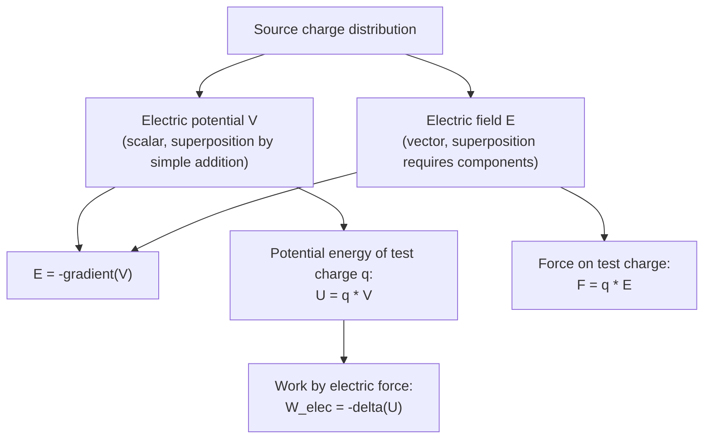

## Electric Potential and Potential Energy

### Overview

Electric potential and electric potential energy provide a scalar-based alternative to the vector electric field for analyzing electrostatic systems. Because the electrostatic force is conservative, it admits a potential energy description, and dividing potential energy by charge yields electric potential — a property of space itself, independent of any test charge. This scalar framework often dramatically simplifies electrostatic calculations and connects directly to circuit theory via the concept of voltage.

### Electric Potential Energy

#### Definition

The electric potential energy $U$ of a charge configuration is the work required to assemble that configuration by bringing charges from infinite separation (where $U=0$ by convention) to their final positions, against the electrostatic force.

For two point charges $q_1$ and $q_2$ separated by distance $r$:

$$U = k_e\frac{q_1q_2}{r}$$

**Key Points**

- $U$ has SI units of joules (J).
- $U > 0$ for like charges (positive work required to bring them together against repulsion); $U < 0$ for unlike charges (the system releases energy as they approach, since attraction does positive work on them).
- The work done by an external agent moving a charge quasi-statically against the electric force equals the change in potential energy: $W_{ext} = \Delta U$; the work done *by* the electric force is $W_{elec} = -\Delta U$.
- For a system of multiple point charges, total potential energy is the sum over all unique pairs: $U_{total} = k_e\sum_{i<j}\dfrac{q_iq_j}{r_{ij}}$.

#### Conservative Nature of the Electrostatic Force

**Key Points**

- The electrostatic force is conservative: the work done moving a charge between two points is independent of the path taken, depending only on the initial and final positions.
- This path-independence is what permits the definition of a scalar potential energy function in the first place — a defining property shared with gravity but not with non-conservative forces like friction.
- Mathematically, conservativeness is equivalent to the electric field being curl-free in electrostatics: $\nabla\times\vec{E} = 0$.

### Electric Potential

#### Definition

Electric potential $V$ at a point is defined as the potential energy per unit charge a test charge $q_0$ would have at that point:

$$V \equiv \frac{U}{q_0}$$

For a point charge $Q$, the potential at distance $r$ is:

$$V = k_e\frac{Q}{r}$$

**Key Points**

- $V$ has SI units of volts (V), where $1\ \text{V} = 1\ \text{J/C}$.
- Unlike potential energy, which depends on both the source charge and the test charge, potential $V$ is a property of the source charge distribution and position alone — analogous to how the electric field factors out the test charge from force.
- Potential is a scalar, making superposition arithmetic (simple addition) rather than vector addition, which simplifies many multi-charge problems considerably compared to computing $\vec{E}$ directly.
- By convention, $V=0$ is typically set at infinity for isolated charge distributions (though any reference point can be chosen, since only potential *differences* are physically meaningful).

#### Superposition of Potential

For multiple point charges, the net potential at a point is the algebraic (scalar) sum:

$$V = k_e\sum_i \frac{q_i}{r_i}$$

with each $q_i$ contributing according to its own sign, unlike vector field superposition which requires directional components.

### Relation Between Electric Field and Potential

$$\vec{E} = -\nabla V$$

In one dimension: $E_x = -\dfrac{dV}{dx}$. Conversely:

$$V_B - V_A = -\int_A^B \vec{E}\cdot d\vec{l}$$

**Key Points**

- The electric field points in the direction of steepest *decrease* of potential (the negative gradient), analogous to how gravitational field points "downhill" on a gravitational potential surface.
- Regions of closely spaced equipotential surfaces correspond to strong electric fields; widely spaced equipotentials correspond to weak fields.
- Field lines are always perpendicular to equipotential surfaces at every point.

### Equipotential Surfaces (SVG Diagram)

<svg xmlns="http://www.w3.org/2000/svg" viewBox="0 0 600 320">
<text x="300" y="24" text-anchor="middle" font-size="16" font-family="sans-serif" font-weight="bold">Equipotential Surfaces and Field Lines (svg_diagram)</text>
<circle cx="180" cy="170" r="16" fill="#cc3333" />
<text x="180" y="176" text-anchor="middle" font-size="13" fill="white" font-family="sans-serif">+</text>

<circle cx="180" cy="170" r="45" fill="none" stroke="#22aa55" stroke-width="1.5" stroke-dasharray="4,3" />
<circle cx="180" cy="170" r="80" fill="none" stroke="#22aa55" stroke-width="1.5" stroke-dasharray="4,3" />
<circle cx="180" cy="170" r="115" fill="none" stroke="#22aa55" stroke-width="1.5" stroke-dasharray="4,3" />

<g stroke="#2266cc" stroke-width="1.5" fill="none">
<line x1="196" y1="170" x2="290" y2="170" marker-end="url(#arrh)" />
<line x1="164" y1="170" x2="70" y2="170" marker-end="url(#arrh)" />
<line x1="180" y1="154" x2="180" y2="65" marker-end="url(#arrh)" />
<line x1="180" y1="186" x2="180" y2="275" marker-end="url(#arrh)" />
<line x1="191" y1="159" x2="255" y2="95" marker-end="url(#arrh)" />
<line x1="169" y1="159" x2="105" y2="95" marker-end="url(#arrh)" />
<line x1="191" y1="181" x2="255" y2="245" marker-end="url(#arrh)" />
<line x1="169" y1="181" x2="105" y2="245" marker-end="url(#arrh)" />
</g>
<text x="470" y="120" font-size="12" fill="`#22aa55`" font-family="sans-serif">Equipotentials (dashed)</text>

<text x="470" y="145" font-size="12" fill="`#2266cc`" font-family="sans-serif">Field lines (solid, perpendicular)</text>

</svg>

### Electric Potential of Continuous Charge Distributions

For a continuous charge distribution, potential is computed by integrating point-charge contributions (scalar integration, generally simpler than the vector integration required for $\vec{E}$):

$$V = k_e\int \frac{dq}{r}$$

#### Worked Example: Potential of a Uniformly Charged Ring

**Example**

For a ring of radius $R$ and total charge $Q$, at distance $x$ along the central axis, every charge element is equidistant ($r = \sqrt{x^2+R^2}$) from the field point, so the scalar integral is trivial:

$$V(x) = k_e\int\frac{dq}{\sqrt{x^2+R^2}} = \frac{k_eQ}{\sqrt{x^2+R^2}}$$

The axial field can then be recovered by differentiation: $E_x = -\dfrac{dV}{dx} = \dfrac{k_eQx}{(x^2+R^2)^{3/2}}$, matching the direct field calculation and illustrating the computational advantage of finding $V$ first when the geometry allows a simple scalar integral.

### Potential Energy of a System of Point Charges

**Example**

For three point charges $q_1=+2\ \mu\text{C}$, $q_2=+3\ \mu\text{C}$, $q_3=-1\ \mu\text{C}$ placed at the corners of an equilateral triangle with side length $0.1\ \text{m}$:

$$U = k_e\left(\frac{q_1q_2}{r} + \frac{q_1q_3}{r} + \frac{q_2q_3}{r}\right) = \frac{k_e}{0.1}\left[(2)(3)+(2)(-1)+(3)(-1)\right]\times10^{-12}$$

$$U = \frac{8.988\times10^9}{0.1}\times(6-2-3)\times10^{-12} = (8.988\times10^{10})(1\times10^{-12}) \approx 0.0899\ \text{J}$$

The positive result indicates net positive work was required to assemble this particular configuration.

### Mermaid Diagram: Relationships Among E, V, and U

### Equipotential Surfaces and Conductors

**Key Points**

- In electrostatic equilibrium, the entire surface (and interior) of a conductor is an equipotential — since $\vec{E}=0$ inside a conductor, no work is done moving charge within or along its surface, so $V$ is constant throughout.
- This property is essential for circuit analysis: a wire or conducting plate in electrostatic equilibrium is treated as a single-valued potential node.
- Because $\vec{E}$ is always perpendicular to equipotential surfaces, and conductor surfaces are equipotentials, the field must be perpendicular to a conductor's surface at every point — consistent with the earlier conductor field properties derived from Gauss's Law.

### Electron Volt as an Energy Unit

**Key Points**

- The **electron volt (eV)** is defined as the kinetic energy gained by a single electron accelerated through a potential difference of 1 volt: $1\ \text{eV} = 1.602\times10^{-19}\ \text{J}$.
- This unit is standard in atomic, nuclear, and particle physics, where the joule is inconveniently large for describing energies at the scale of individual particles.

### Worked Example: Accelerating a Charge Through a Potential Difference

**Example**

A proton (charge $+e$) is accelerated from rest through a potential difference of $\Delta V = 5000\ \text{V}$. By the work-energy theorem, the kinetic energy gained equals the work done by the electric force:

$$KE = q\Delta V = (1.602\times10^{-19}\ \text{C})(5000\ \text{V}) = 8.01\times10^{-16}\ \text{J} = 5000\ \text{eV} = 5\ \text{keV}$$

Solving for speed using $KE = \frac{1}{2}mv^2$ with $m_p \approx 1.673\times10^{-27}\ \text{kg}$:

$$v = \sqrt{\frac{2KE}{m_p}} = \sqrt{\frac{2(8.01\times10^{-16})}{1.673\times10^{-27}}} \approx 9.78\times10^5\ \text{m/s}$$

This calculation illustrates the standard technique used to determine particle speeds in accelerators and electron guns from applied accelerating voltages.

### Potential Due to Continuous Distributions: Charged Sphere

**Key Points**

- Outside a uniformly charged sphere ($r>R$, total charge $Q$): $V(r) = k_eQ/r$, identical to a point charge.
- On and inside a uniformly charged conducting sphere ($r \leq R$): $V(r) = k_eQ/R$ (constant, since the interior is an equipotential region for a conductor).
- For a uniformly charged *insulating* (non-conducting) sphere, the interior potential instead varies smoothly as $V(r) = \dfrac{k_eQ}{2R}\left(3-\dfrac{r^2}{R^2}\right)$ for $r < R$, consistent with the linearly increasing interior field found via Gauss's Law.

### Poisson's and Laplace's Equations

**Key Points**

- Combining $\vec{E}=-\nabla V$ with the differential form of Gauss's Law ($\nabla\cdot\vec{E}=\rho/\epsilon_0$) yields **Poisson's equation**: $\nabla^2V = -\rho/\epsilon_0$.
- In charge-free regions ($\rho=0$), this reduces to **Laplace's equation**: $\nabla^2V=0$.
- These partial differential equations, together with boundary conditions, form the general mathematical framework for solving electrostatic problems that lack the symmetry required for direct Gauss's Law or superposition-integral approaches, and are foundational to advanced electrostatics and boundary-value problems (e.g., capacitor geometries, conducting boundaries).

### Validity and Limitations

**Key Points**

- The scalar potential formulation as presented here (with $\vec{E}=-\nabla V$ and path-independent work) applies rigorously to electrostatics, where $\nabla\times\vec{E}=0$.
- In the presence of time-varying magnetic fields, Faraday's law introduces a curl into the electric field ($\nabla\times\vec{E} = -\partial\vec{B}/\partial t$), and the simple scalar potential description must be extended to include a vector potential contribution — the general electrodynamic case is handled by the full scalar-and-vector potential formalism.
- [Inference] For most introductory and many practical engineering electrostatics problems (steady charge distributions, capacitors, electrostatic shielding), the static scalar potential framework presented here is fully sufficient and widely used without modification.

### Conclusion

Electric potential and potential energy provide a scalar reformulation of electrostatics that exploits the conservative nature of the electric force, often simplifying calculations relative to direct vector field methods. The relationships $U=qV$, $\vec{E}=-\nabla V$, and the superposition of scalar potentials form an interconnected toolkit essential for analyzing charge configurations, conductors, and accelerated charged particles, and directly underlie the concept of voltage central to circuit theory and later topics in capacitance and electric current.

**Related Topics**

- The Electric Field and Field Lines
- Gauss's Law and Symmetric Charge Distributions
- Capacitance and Parallel-Plate Capacitors
- Conductors in Electrostatic Equilibrium
- Poisson's and Laplace's Equations
- Electric Dipoles and Dipole Potential
- Work-Energy Theorem in Electrostatics
- Circuits and Voltage (DC Circuit Analysis)