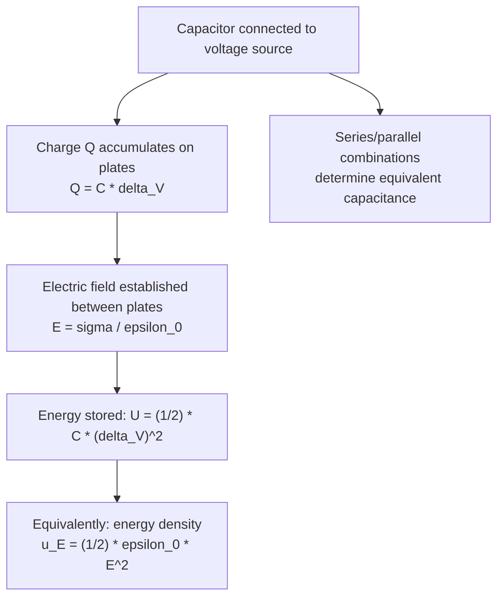

## Capacitance and Capacitors

### Overview

Capacitance quantifies a conductor system's ability to store electric charge (and thereby electrical potential energy) for a given applied potential difference. A capacitor is a device engineered specifically to exploit this property, consisting of two conductors separated by an insulating medium. Capacitors are fundamental components in electrical circuits, used for energy storage, filtering, timing, and signal coupling, and the concept of capacitance connects directly to the electrostatics of conductors, fields, and potential developed previously.

### Definition of Capacitance

For two conductors carrying equal and opposite charges $+Q$ and $-Q$, with potential difference $\Delta V$ between them, the **capacitance** is defined as:

$$C \equiv \frac{Q}{\Delta V}$$

**Key Points**

- $C$ has SI units of farads (F), where $1\ \text{F} = 1\ \text{C/V}$. A farad is a very large unit for typical laboratory capacitors; practical values are usually expressed in microfarads (µF, $10^{-6}$ F), nanofarads (nF, $10^{-9}$ F), or picofarads (pF, $10^{-12}$ F).
- $C$ is a positive quantity depending only on the geometry of the conductors (size, shape, separation) and the permittivity of the medium between them — it does not depend on $Q$ or $\Delta V$ individually, since both scale proportionally, leaving the ratio constant.
- Capacitance can be thought of as a measure of "storage capacity": larger $C$ means more charge can be stored for a given voltage.

### The Parallel-Plate Capacitor

#### Derivation

For two parallel conducting plates, each of area $A$, separated by distance $d$ (with $d$ small compared to plate dimensions, so edge effects are negligible), carrying charges $+Q$ and $-Q$:

The field between the plates (from Gauss's Law, as derived for oppositely charged infinite sheets) is $E = \sigma/\epsilon_0 = Q/(\epsilon_0A)$.

The potential difference is $\Delta V = Ed = \dfrac{Qd}{\epsilon_0A}$.

Therefore:

$$C = \frac{Q}{\Delta V} = \frac{\epsilon_0A}{d}$$

**Key Points**

- Capacitance increases with plate area $A$ (more surface to hold charge) and decreases with plate separation $d$ (closer plates create a stronger field for the same charge, meaning less voltage is needed, so more charge can be stored per volt).
- This formula assumes an idealized parallel-plate geometry with negligible fringing fields at the edges — a good approximation when $d \ll$ plate dimensions.

### Other Standard Capacitor Geometries

#### Cylindrical (Coaxial) Capacitor

For two coaxial conducting cylinders of length $L$, inner radius $a$, outer radius $b$ (with $L \gg b$):

$$C = \frac{2\pi\epsilon_0L}{\ln(b/a)}$$

#### Spherical Capacitor

For two concentric conducting spherical shells of radii $a$ (inner) and $b$ (outer):

$$C = 4\pi\epsilon_0\frac{ab}{b-a}$$

**Key Points**

- Taking $b \to \infty$ in the spherical capacitor formula gives $C = 4\pi\epsilon_0a$, the capacitance of a single isolated sphere of radius $a$ relative to a reference at infinity.
- Each geometry's derivation follows the same general method: find $\vec{E}$ via Gauss's Law, integrate to find $\Delta V$, then compute $C = Q/\Delta V$.

### Capacitors in Circuits: Series and Parallel Combinations

#### Parallel Combination

For capacitors connected in parallel (same voltage across each, charges add):

$$C_{eq} = C_1 + C_2 + C_3 + \cdots$$

#### Series Combination

For capacitors connected in series (same charge on each, voltages add):

$$\frac{1}{C_{eq}} = \frac{1}{C_1}+\frac{1}{C_2}+\frac{1}{C_3}+\cdots$$

**Key Points**

- Parallel combination always increases total capacitance (effectively increasing the total plate area).
- Series combination always decreases total capacitance below the smallest individual capacitance (effectively increasing the total separation).
- This behavior is structurally *opposite* to how resistors combine (resistors add directly in series, reciprocally in parallel) — a common point of confusion worth explicitly noting.

### Circuit Diagram: Series and Parallel Capacitors (SVG)

<svg xmlns="http://www.w3.org/2000/svg" viewBox="0 0 620 300">
<text x="310" y="24" text-anchor="middle" font-size="16" font-family="sans-serif" font-weight="bold">Capacitor Combinations (svg_diagram)</text>

<text x="150" y="55" text-anchor="middle" font-size="13" font-family="sans-serif" font-weight="bold">Parallel</text>

<line x1="60" y1="90" x2="60" y2="190" stroke="black" stroke-width="2" />

<line x1="240" y1="90" x2="240" y2="190" stroke="black" stroke-width="2" />

<line x1="60" y1="100" x2="110" y2="100" stroke="black" stroke-width="2" />

<line x1="110" y1="85" x2="110" y2="115" stroke="black" stroke-width="3" />

<line x1="130" y1="85" x2="130" y2="115" stroke="black" stroke-width="3" />

<line x1="130" y1="100" x2="240" y2="100" stroke="black" stroke-width="2" />

<line x1="60" y1="140" x2="110" y2="140" stroke="black" stroke-width="2" />

<line x1="110" y1="125" x2="110" y2="155" stroke="black" stroke-width="3" />

<line x1="130" y1="125" x2="130" y2="155" stroke="black" stroke-width="3" />

<line x1="130" y1="140" x2="240" y2="140" stroke="black" stroke-width="2" />

<line x1="60" y1="180" x2="110" y2="180" stroke="black" stroke-width="2" />

<line x1="110" y1="165" x2="110" y2="195" stroke="black" stroke-width="3" />

<line x1="130" y1="165" x2="130" y2="195" stroke="black" stroke-width="3" />

<line x1="130" y1="180" x2="240" y2="180" stroke="black" stroke-width="2" />

<text x="150" y="215" text-anchor="middle" font-size="11" font-family="sans-serif">C_eq = C1 + C2 + C3</text>

<text x="480" y="55" text-anchor="middle" font-size="13" font-family="sans-serif" font-weight="bold">Series</text>

<line x1="360" y1="130" x2="410" y2="130" stroke="black" stroke-width="2" />

<line x1="410" y1="115" x2="410" y2="145" stroke="black" stroke-width="3" />

<line x1="425" y1="115" x2="425" y2="145" stroke="black" stroke-width="3" />

<line x1="425" y1="130" x2="455" y2="130" stroke="black" stroke-width="2" />

<line x1="455" y1="115" x2="455" y2="145" stroke="black" stroke-width="3" />

<line x1="470" y1="115" x2="470" y2="145" stroke="black" stroke-width="3" />

<line x1="470" y1="130" x2="500" y2="130" stroke="black" stroke-width="2" />

<line x1="500" y1="115" x2="500" y2="145" stroke="black" stroke-width="3" />

<line x1="515" y1="115" x2="515" y2="145" stroke="black" stroke-width="3" />

<line x1="515" y1="130" x2="560" y2="130" stroke="black" stroke-width="2" />

<text x="460" y="215" text-anchor="middle" font-size="11" font-family="sans-serif">1/C_eq = 1/C1 + 1/C2 + 1/C3</text>

</svg>

### Energy Stored in a Capacitor

#### Derivation

The work required to charge a capacitor incrementally from 0 to final charge $Q$ (moving charge $dq$ against the increasing potential difference $v = q/C$) is:

$$U = \int_0^Q \frac{q}{C}\,dq = \frac{Q^2}{2C}$$

Using $Q = C\Delta V$, this can also be written:

$$U = \frac{1}{2}C(\Delta V)^2 = \frac{1}{2}Q\Delta V$$

**Key Points**

- The factor of $\frac{1}{2}$ arises because the voltage across the capacitor increases linearly from 0 to $\Delta V$ as it charges — the average voltage during charging is $\Delta V/2$, not the final value.
- This stored energy is genuine electrostatic potential energy, recoverable by discharging the capacitor through a circuit (e.g., to do work, produce light, or dissipate as heat in a resistor).

#### Energy Density in the Electric Field

For a parallel-plate capacitor, substituting $C = \epsilon_0A/d$ and $\Delta V = Ed$:

$$U = \frac{1}{2}\left(\frac{\epsilon_0A}{d}\right)(Ed)^2 = \frac{1}{2}\epsilon_0E^2(Ad)$$

Since $Ad$ is the volume between the plates, the **energy density** stored in the electric field is:

$$u_E = \frac{U}{\text{Volume}} = \frac{1}{2}\epsilon_0E^2$$

**Key Points**

- This result generalizes beyond capacitors: the electric field itself stores energy, with local energy density $u_E = \frac{1}{2}\epsilon_0E^2$ (J/m³) at every point in space where a field exists, independent of the specific source configuration.
- This field-energy perspective is essential in electrodynamics and underlies the energy carried by electromagnetic waves.

### Mermaid Diagram: Capacitor Charging and Energy Storage

### Dielectrics in Capacitors

#### Effect on Capacitance

Inserting an insulating dielectric material between the plates of a capacitor increases capacitance by a factor equal to the material's **dielectric constant** (relative permittivity) $\kappa$ (or $\epsilon_r$):

$$C = \kappa C_0 = \frac{\kappa\epsilon_0A}{d}$$

where $C_0$ is the vacuum (or air-gap) capacitance.

**Key Points**

- The dielectric's molecules polarize in response to the applied field, creating an internal field that partially opposes (and thus reduces) the net field for a given free charge — this allows more charge to be stored for the same voltage, increasing $C$.
- Common dielectric materials (with approximate $\kappa$ values): air ($\kappa\approx1.0006$), paper ($\kappa\approx3.5$), glass ($\kappa\approx4$–$10$), and various ceramics (often $\kappa > 100$, used in high-capacitance ceramic capacitors).
- Dielectrics also increase the capacitor's breakdown voltage (the maximum voltage before the insulator fails and current arcs through it) compared to a vacuum or air gap, and provide mechanical support keeping the plates precisely separated.

#### Energy Stored with Dielectric Present

For a capacitor charged at constant $Q$ (isolated, disconnected from a battery) and then filled with a dielectric, stored energy *decreases* by a factor of $\kappa$: $U = Q^2/(2\kappa C_0)$, since work is done *by* the field pulling the dielectric in. Conversely, for a capacitor held at constant $\Delta V$ (connected to a battery) while a dielectric is inserted, charge increases and stored energy *increases*: $U = \frac{1}{2}\kappa C_0(\Delta V)^2$, with the battery supplying the additional energy.

### Worked Example: Parallel-Plate Capacitor Calculation

**Example**

A parallel-plate capacitor has plates of area $A = 0.02\ \text{m}^2$ separated by $d = 1\ \text{mm}$ in vacuum, connected to a $12\ \text{V}$ battery.

$$C = \frac{\epsilon_0A}{d} = \frac{(8.854\times10^{-12})(0.02)}{1\times10^{-3}} \approx 1.771\times10^{-10}\ \text{F} = 177.1\ \text{pF}$$

$$Q = C\Delta V = (1.771\times10^{-10})(12) \approx 2.125\times10^{-9}\ \text{C} = 2.125\ \text{nC}$$

$$U = \frac{1}{2}C(\Delta V)^2 = \frac{1}{2}(1.771\times10^{-10})(12)^2 \approx 1.275\times10^{-8}\ \text{J} \approx 12.75\ \text{nJ}$$

If a dielectric with $\kappa = 5$ is inserted while still connected to the battery, capacitance and stored charge both increase fivefold ($C' = 885.5\ \text{pF}$, $Q' = 10.63\ \text{nC}$), and stored energy increases fivefold as well ($U' \approx 63.75\ \text{nJ}$), with the battery supplying the additional energy.

### Applications of Capacitors

**Key Points**

- **Energy storage**: capacitors store and rapidly release energy in applications like camera flashes, defibrillators, and power-supply filtering, where fast discharge (unlike batteries) is essential.
- **Filtering**: capacitors block DC while passing AC signals (or vice versa depending on circuit configuration), used extensively in signal processing and power supply smoothing.
- **Timing circuits**: RC (resistor-capacitor) circuits provide characteristic charge/discharge time constants $\tau = RC$, used in oscillators, timers, and pulse-shaping circuits.
- **Coupling and decoupling**: capacitors connect AC signal stages while blocking DC bias, and stabilize voltage supply lines against transient fluctuations in electronic circuits.
- **Touchscreens and sensors**: capacitive sensing exploits changes in capacitance (e.g., from a finger's proximity) to detect touch or position.

### RC Circuits: Charging and Discharging Behavior

**Key Points**

- When charging through a resistor $R$ from a battery of EMF $\varepsilon$, capacitor charge grows as $q(t) = C\varepsilon\left(1-e^{-t/RC}\right)$, approaching full charge asymptotically.
- When discharging through a resistor, charge decays as $q(t) = Q_0e^{-t/RC}$.
- The **time constant** $\tau = RC$ characterizes the characteristic timescale of charging/discharging — after one time constant, the capacitor reaches approximately 63.2% of its final charge (charging) or has decayed to approximately 36.8% of its initial charge (discharging).
- [Inference] Real capacitors exhibit non-ideal behavior at high frequency or high voltage (equivalent series resistance, leakage current, dielectric breakdown), which can affect circuit performance beyond the idealized model presented here, particularly in precision or high-frequency applications.

### Validity and Limitations

**Key Points**

- The idealized formulas presented here (parallel-plate, cylindrical, spherical) assume ideal geometries with negligible edge/fringing field effects; real capacitors deviate somewhat from these predictions, especially at plate edges or for non-ideal aspect ratios.
- Dielectric behavior is treated here in the linear, isotropic approximation (constant $\kappa$ independent of field strength); at sufficiently high fields, dielectric breakdown occurs, and near breakdown or for certain advanced materials, nonlinear dielectric response may become significant.

### Conclusion

Capacitance quantifies the charge-storing capability of a conductor configuration for a given potential difference, with capacitors serving as engineered devices built to exploit this property in countless electrical applications. Understanding capacitor geometry formulas, series/parallel combination rules, stored energy, and the role of dielectrics provides essential groundwork for circuit analysis, energy storage technology, and the broader field-energy perspective that connects electrostatics to the wider framework of electromagnetism.

**Related Topics**

- Electric Field and Gauss's Law
- Electric Potential and Potential Energy
- Dielectric Materials and Polarization
- RC Circuits: Charging and Discharging
- Energy Density in Electromagnetic Fields
- DC Circuit Analysis (Series and Parallel Combinations)
- Conductors in Electrostatic Equilibrium
- Applications: Defibrillators, Camera Flashes, and Signal Filtering