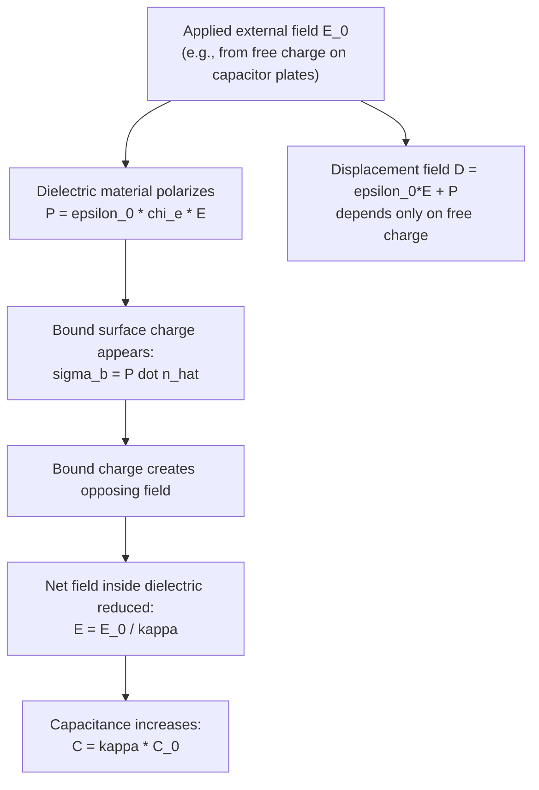

## Dielectrics and Polarization

### Overview

Dielectrics are insulating materials that, unlike conductors, do not have freely mobile charge carriers but instead respond to an applied electric field through polarization — a microscopic realignment or distortion of bound charge. This polarization produces an internal field that opposes the applied field, reducing the net field within the material and enhancing capacitance, energy storage, and dielectric strength. Understanding dielectrics extends the electrostatics framework beyond vacuum and conductors to encompass the vast majority of real insulating materials encountered in capacitors, cables, and everyday electrical insulation.

### Polarization Mechanisms

#### Microscopic Origin

**Key Points**

- Dielectric materials contain bound charges (electrons tightly attached to atoms/molecules) that cannot move freely through the material, in contrast to a conductor's free electrons.
- When an external electric field is applied, these bound charges shift slightly from their equilibrium positions, creating countless microscopic electric dipoles aligned (partially) with the applied field.
- The macroscopic sum of these aligned microscopic dipoles constitutes the material's **polarization**.

#### Types of Polarization

- **Electronic polarization**: the electron cloud of each atom shifts relative to its nucleus under the applied field, occurring in all materials and responding essentially instantaneously (relevant even at optical frequencies).
- **Ionic polarization**: in ionic crystals, positive and negative ions shift in opposite directions relative to their lattice positions.
- **Orientational (dipolar) polarization**: molecules with a permanent dipole moment (e.g., water, $\text{H}_2\text{O}$) partially align with the applied field, competing against thermal randomization — this mechanism is strongly temperature-dependent, since higher temperature increases thermal disorder opposing alignment.

**Key Points**

- Different polarization mechanisms respond on different timescales, which is why a material's dielectric constant can vary significantly with the frequency of an applied AC field — electronic polarization persists to very high (optical) frequencies, while orientational polarization becomes ineffective at frequencies too fast for molecules to physically reorient.

### The Polarization Vector

#### Definition

The **polarization** $\vec{P}$ is defined as the electric dipole moment per unit volume of the material:

$$\vec{P} = \frac{\sum \vec{p}_i}{\text{Volume}}$$

where $\vec{p}_i$ are the individual microscopic dipole moments. For a linear, isotropic dielectric:

$$\vec{P} = \epsilon_0\chi_e\vec{E}$$

where $\chi_e$ is the material's **electric susceptibility**, a dimensionless quantity characterizing how readily the material polarizes in response to an applied field.

**Key Points**

- $\vec{P}$ has the same SI units as electric field times permittivity: C/m².
- $\chi_e \geq 0$ for typical dielectrics (polarization aligns with, and is proportional to, the applied field in the linear regime).
- $\vec{P}$ points in the direction of the applied field (for linear, isotropic materials), from the negative to positive bound charge within each microscopic dipole.

### Bound Charge

**Key Points**

- Polarization produces **bound surface charge** on the dielectric's surfaces where polarization is discontinuous (e.g., at the boundary with vacuum or a conductor), with surface bound charge density $\sigma_b = \vec{P}\cdot\hat{n}$.
- For non-uniform polarization, **bound volume charge** also appears, with density $\rho_b = -\nabla\cdot\vec{P}$.
- These bound charges are real, physical charges (not fictitious mathematical constructs) that produce their own electric field, which is what opposes and reduces the net field inside the dielectric — however, unlike free charge, bound charge cannot be removed from the material or made to flow as current.

### Dielectric Diagram: Polarization and Bound Charge (SVG)

<svg xmlns="http://www.w3.org/2000/svg" viewBox="0 0 600 300">
<text x="300" y="24" text-anchor="middle" font-size="16" font-family="sans-serif" font-weight="bold">Dielectric Polarization Between Plates (svg_diagram)</text>

<rect x="100" y="60" width="10" height="200" fill="#333333" />
<rect x="490" y="60" width="10" height="200" fill="#333333" />
<text x="105" y="50" text-anchor="middle" font-size="12" font-family="sans-serif">+</text>
<text x="495" y="50" text-anchor="middle" font-size="12" font-family="sans-serif">-</text>

<rect x="150" y="70" width="300" height="180" fill="#eef4ff" stroke="#88aadd" stroke-width="1.5" />

<g font-family="sans-serif" font-size="10">
<line x1="190" y1="110" x2="210" y2="110" stroke="black" stroke-width="1.5" marker-end="url(#dipArrow)" />
<line x1="190" y1="150" x2="210" y2="150" stroke="black" stroke-width="1.5" marker-end="url(#dipArrow)" />
<line x1="190" y1="190" x2="210" y2="190" stroke="black" stroke-width="1.5" marker-end="url(#dipArrow)" />
<line x1="250" y1="110" x2="270" y2="110" stroke="black" stroke-width="1.5" marker-end="url(#dipArrow)" />
<line x1="250" y1="150" x2="270" y2="150" stroke="black" stroke-width="1.5" marker-end="url(#dipArrow)" />
<line x1="250" y1="190" x2="270" y2="190" stroke="black" stroke-width="1.5" marker-end="url(#dipArrow)" />
<line x1="310" y1="110" x2="330" y2="110" stroke="black" stroke-width="1.5" marker-end="url(#dipArrow)" />
<line x1="310" y1="150" x2="330" y2="150" stroke="black" stroke-width="1.5" marker-end="url(#dipArrow)" />
<line x1="310" y1="190" x2="330" y2="190" stroke="black" stroke-width="1.5" marker-end="url(#dipArrow)" />
<line x1="370" y1="110" x2="390" y2="110" stroke="black" stroke-width="1.5" marker-end="url(#dipArrow)" />
<line x1="370" y1="150" x2="390" y2="150" stroke="black" stroke-width="1.5" marker-end="url(#dipArrow)" />
<line x1="370" y1="190" x2="390" y2="190" stroke="black" stroke-width="1.5" marker-end="url(#dipArrow)" />
</g>
<text x="163" y="160" font-size="18" fill="`#cc3333`" font-family="sans-serif">-</text>

<text x="435" y="160" font-size="18" fill="`#2266cc`" font-family="sans-serif">+</text>

<text x="300" y="280" text-anchor="middle" font-size="12" font-family="sans-serif">Aligned dipoles produce bound surface charge (opposing applied field)</text>

</svg>

### Electric Displacement Field

To separate the effects of free charge (which can be controlled experimentally) from bound charge (a material response), the **electric displacement field** $\vec{D}$ is introduced:

$$\vec{D} \equiv \epsilon_0\vec{E} + \vec{P}$$

For linear dielectrics, this simplifies to:

$$\vec{D} = \epsilon_0(1+\chi_e)\vec{E} = \epsilon_0\epsilon_r\vec{E} = \epsilon\vec{E}$$

where $\epsilon_r = 1+\chi_e$ is the **relative permittivity** (equivalent to the **dielectric constant** $\kappa$ used in capacitor formulas), and $\epsilon = \epsilon_0\epsilon_r$ is the material's absolute permittivity.

#### Gauss's Law for D

$$\oint \vec{D}\cdot d\vec{A} = Q_{free,enc}$$

**Key Points**

- Gauss's Law written in terms of $\vec{D}$ involves only *free* charge, making it especially convenient for problems involving dielectrics, since bound charge (which is generally unknown a priori) is automatically accounted for.
- $\vec{D}$ has the same units as $\vec{P}$ (C/m²) and is sometimes loosely visualized as tracking "free" field lines, while $\vec{E}$ tracks the true net field including the dielectric's reduction effect.

### Mermaid Diagram: Relationship Among E, P, and D

### Effect on Field Inside the Dielectric

For a dielectric filling the space between capacitor plates carrying free surface charge density $\sigma_f$, the field within the dielectric is reduced compared to vacuum:

$$E = \frac{E_0}{\kappa} = \frac{\sigma_f}{\kappa\epsilon_0}$$

where $E_0 = \sigma_f/\epsilon_0$ is the field that would exist in vacuum with the same free charge, and $\kappa = \epsilon_r$ is the dielectric constant.

**Key Points**

- The reduction factor $\kappa$ directly explains the capacitance enhancement $C = \kappa C_0$ derived in the capacitor topic: for the same free charge, a smaller field means a smaller potential difference $\Delta V = Ed$, and since $C = Q/\Delta V$, a smaller $\Delta V$ for the same $Q$ means larger $C$.
- This reduction arises because the bound surface charge on the dielectric's faces (negative charge facing the positive plate, positive charge facing the negative plate) creates its own field that partially cancels the free-charge field within the material.

### Worked Example: Bound Charge Calculation

**Example**

A parallel-plate capacitor with plate area $A = 0.01\ \text{m}^2$ is filled with a dielectric of $\kappa = 4$, carrying free surface charge density $\sigma_f = 2\times10^{-6}\ \text{C/m}^2$.

The polarization magnitude is found from $\vec{D} = \epsilon_0\vec{E}+\vec{P}$ and $D = \sigma_f$ (from Gauss's Law for $\vec{D}$), combined with $E = \sigma_f/(\kappa\epsilon_0)$:

$$P = D - \epsilon_0E = \sigma_f - \frac{\sigma_f}{\kappa} = \sigma_f\left(1-\frac{1}{\kappa}\right) = (2\times10^{-6})\left(1-\frac{1}{4}\right) = 1.5\times10^{-6}\ \text{C/m}^2$$

Since for a uniform slab $\sigma_b = P$ (at the surface where $\hat{n}$ aligns with $\vec{P}$):

$$\sigma_b = 1.5\times10^{-6}\ \text{C/m}^2$$

The bound charge is 75% of the free charge in this case, illustrating how a substantial fraction of the field reduction comes directly from the induced bound charge opposing the free charge's field.

### Dielectric Breakdown

**Key Points**

- Every dielectric material has a maximum field strength, the **dielectric strength**, beyond which the material's bound charges are torn free (ionization occurs), and the material begins to conduct — this is **dielectric breakdown**, often destructive (e.g., visible arcing, physical damage, or permanent loss of insulating properties).
- Typical dielectric strengths vary widely by material: air breaks down around $3\times10^6\ \text{V/m}$ (3 MV/m), while engineered solid dielectrics used in capacitors and cables can withstand fields of $10$–$100$ times higher.
- Capacitor manufacturers specify a maximum rated voltage based on the dielectric strength and thickness of the insulating material used, since exceeding this rating risks breakdown and capacitor failure.

### Common Dielectric Materials and Approximate Constants

**Key Points**

- Vacuum: $\kappa = 1$ (exact, by definition).
- Air: $\kappa \approx 1.0006$ (very close to vacuum under normal conditions).
- Paper: $\kappa \approx 3.5$.
- Glass: $\kappa \approx 4$–$10$ (varies by composition).
- Mica: $\kappa \approx 3$–$6$.
- Water (liquid, strongly polar): $\kappa \approx 80$ at room temperature, reflecting strong orientational polarization of the polar water molecule.
- Various ceramics (e.g., barium titanate-based): $\kappa$ can exceed $1000$–$10{,}000$, used in high-capacitance ceramic capacitors.
- [Unverified] Exact dielectric constant values depend on temperature, frequency, purity, and measurement conditions; the figures above are representative approximate values, and precise engineering applications require consulting manufacturer datasheets or material-specific references.

### Applications of Dielectrics

**Key Points**

- **Capacitor manufacturing**: dielectrics increase capacitance, increase breakdown voltage rating, and provide mechanical support/spacing between plates, enabling compact, high-capacitance, and reliable capacitor designs.
- **High-voltage insulation**: dielectric materials insulate power lines, transformers, and high-voltage equipment, preventing unwanted current flow and arcing.
- **Piezoelectric and ferroelectric materials**: certain crystalline dielectrics exhibit polarization even without an applied field (ferroelectrics) or produce polarization in response to mechanical stress (piezoelectrics), enabling sensors, actuators, and non-volatile memory applications.
- **Radio-frequency and microwave engineering**: dielectric properties (including frequency-dependent behavior and dielectric loss) are critical in designing antennas, waveguides, and circuit substrates.

### Frequency Dependence and Dielectric Loss

**Key Points**

- At sufficiently high AC frequencies, orientational polarization mechanisms cannot keep pace with the rapidly oscillating field, causing the effective dielectric constant to decrease and introducing **dielectric loss** (energy dissipated as heat due to the lag between polarization and field, often modeled via a complex-valued permittivity).
- [Inference] This frequency-dependent behavior is central to microwave heating (e.g., in microwave ovens, where water's orientational polarization lag at microwave frequencies produces significant heating) and to signal loss considerations in high-frequency circuit and cable design, though detailed quantitative treatment requires the complex permittivity formalism beyond the scope of basic electrostatics.

### Validity and Limitations

**Key Points**

- The linear dielectric relation $\vec{P}=\epsilon_0\chi_e\vec{E}$ assumes small applied fields and an isotropic, homogeneous material; many real materials exhibit this behavior well within normal operating field strengths, but deviations occur near dielectric breakdown or in anisotropic crystalline materials (where $\chi_e$ becomes a tensor rather than a scalar).
- Ferroelectric materials exhibit inherently nonlinear and hysteretic polarization behavior (polarization depends on field history, not just instantaneous field), falling outside the simple linear dielectric model presented here.

### Conclusion

Dielectrics respond to applied electric fields through polarization — the microscopic alignment or distortion of bound charge — producing bound surface and volume charges that reduce the net internal field and thereby enhance a capacitor's charge-storage capacity. The displacement field $\vec{D}$ elegantly separates free-charge effects from material response, and dielectric properties (permittivity, dielectric strength, frequency response) are central to capacitor design, high-voltage insulation, and a wide range of applications spanning sensors, RF engineering, and advanced materials science.

**Related Topics**

- Capacitance and Capacitors
- Electric Field and Gauss's Law
- Electric Dipoles and Dipole Moments
- Ferroelectric and Piezoelectric Materials
- Dielectric Breakdown and High-Voltage Insulation
- Complex Permittivity and Dielectric Loss
- Displacement Current and Maxwell's Equations
- Polarization in AC Fields and Frequency-Dependent Permittivity