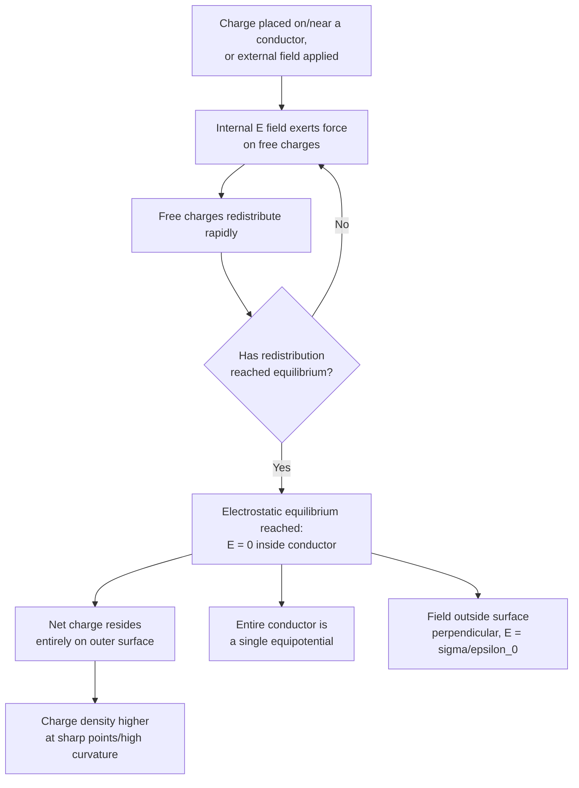

## Conductors in Electrostatic Equilibrium

### Overview

A conductor in electrostatic equilibrium is a conducting material in which all free charges have stopped moving, having redistributed themselves so that no net electrostatic force acts on them anywhere within or on the material. This equilibrium condition gives rise to a set of precise, general properties — zero internal field, surface-localized charge, equipotential behavior, and field concentration at sharp points — that are foundational to understanding electrostatic shielding, capacitor behavior, and practical conductor-based devices.

### Defining Electrostatic Equilibrium

**Key Points**

- A conductor contains a large number of free (mobile) charge carriers — typically electrons in metals — that can move in response to any internal electric field.
- If an external field is applied or nearby charges are present, free charges redistribute rapidly (on timescales of femtoseconds to nanoseconds for typical metals) until the internal configuration produces zero net force on every free charge.
- "Electrostatic equilibrium" means this redistribution has completed and no further macroscopic charge motion occurs — a steady-state condition, not the absence of microscopic thermal motion.

### Property 1: Zero Electric Field Inside a Conductor

**Key Points**

- In electrostatic equilibrium, $\vec{E} = 0$ everywhere inside the bulk of a conductor.
- If a nonzero internal field existed, it would exert a force on the free charges, causing them to continue moving — contradicting the assumption of equilibrium. Charge redistributes precisely until this internal field is canceled.
- This holds regardless of the conductor's shape, the amount of net charge it carries, or the presence of external fields — it is a universal consequence of the definition of equilibrium for a material with free charge carriers.

#### Consequence: Cavities Inside Conductors

**Key Points**

- If a conductor contains an empty (charge-free) internal cavity, the field within that cavity is also exactly zero, regardless of the conductor's external shape or any external fields applied to it — this follows because the cavity boundary, being part of the conductor's interior region where $\vec{E}=0$, has no field driving any charge redistribution on the cavity wall, and Gauss's Law applied to a surface within the conductor surrounding the cavity confirms zero enclosed charge (assuming no charge was placed inside the cavity).
- If a charge $q$ is placed inside such a cavity (not touching the conductor), an induced charge $-q$ appears on the cavity's inner wall, and correspondingly $+q$ appears on the conductor's outer surface (for an initially uncharged conductor), while the field within the conductor's bulk material remains zero.

### Property 2: Net Charge Resides on the Surface

**Key Points**

- Since $\vec{E}=0$ throughout the conductor's interior, applying Gauss's Law to any closed surface drawn entirely within the conductor's bulk gives zero net flux, and therefore zero net enclosed charge.
- Because this holds for a Gaussian surface arbitrarily close to (but just inside) the actual outer surface, any net charge on an isolated conductor must reside entirely on its outer surface — none can exist within the bulk material.
- This surface-localization is a direct and general consequence of Gauss's Law combined with the zero-internal-field property, holding for conductors of any shape.

### Property 3: The Conductor's Surface Is an Equipotential

**Key Points**

- Since $\vec{E}=0$ inside the conductor, no work is required to move a charge from any point inside the conductor to any other point inside it (or on its surface): $\Delta V = -\int\vec{E}\cdot d\vec{l} = 0$ along any internal path.
- Therefore, the entire conductor — its interior and its surface — is at a single, uniform potential in electrostatic equilibrium.
- This holds even for conductors of irregular shape, and even in the presence of a cavity: since the field is zero throughout the connected conducting material, potential is constant everywhere within it.

### Property 4: Field Just Outside the Surface Is Perpendicular to It

**Key Points**

- If the electric field just outside a conductor's surface had any component tangent to (parallel with) the surface, it would drive surface charges to move along the surface, again contradicting equilibrium.
- Therefore, in equilibrium, the field immediately outside a conductor's surface is always perpendicular (normal) to the local surface.
- Using a small pillbox Gaussian surface straddling the conductor's surface (with $\vec{E}=0$ contributing no flux from the interior face), the field magnitude just outside the surface is:

$$E = \frac{\sigma}{\epsilon_0}$$

where $\sigma$ is the local surface charge density — twice the value found for an isolated infinite sheet of charge, since here all flux exits through only the outer face of the pillbox.

### Conductor Field Properties (SVG Diagram)

<svg xmlns="http://www.w3.org/2000/svg" viewBox="0 0 600 320">
<text x="300" y="24" text-anchor="middle" font-size="16" font-family="sans-serif" font-weight="bold">Field Around an Irregular Conductor (svg_diagram)</text>

<path d="M 180,120 C 220,80 280,70 320,90 C 380,60 430,90 420,140 C 460,160 450,210 400,220 C 380,260 300,270 260,240 C 200,250 160,210 170,170 C 150,150 155,130 180,120 Z" fill="`#cccccc`" stroke="`#666666`" stroke-width="2" />

<text x="300" y="165" text-anchor="middle" font-size="12" font-family="sans-serif">E = 0 (interior)</text>

<path d="M 380,60 L 420,20" stroke="#666666" stroke-width="2" fill="none" />
<g stroke="#2266cc" stroke-width="1.5" fill="none">
<line x1="410" y1="30" x2="440" y2="5" marker-end="url(#fa)" />
<line x1="395" y1="40" x2="415" y2="10" marker-end="url(#fa)" />
<line x1="420" y1="45" x2="460" y2="25" marker-end="url(#fa)" />
</g>
<text x="470" y="30" font-size="11" fill="#2266cc" font-family="sans-serif">Concentrated field (sharp point)</text>

<line x1="270" y1="250" x2="270" y2="290" stroke="#2266cc" stroke-width="1.5" marker-end="url(#fa)" />
<line x1="310" y1="255" x2="310" y2="295" stroke="#2266cc" stroke-width="1.5" marker-end="url(#fa)" />
<text x="290" y="310" text-anchor="middle" font-size="11" fill="#2266cc" font-family="sans-serif">Field perpendicular, sparser (flat region)</text>
</svg>

### Charge Density and Curvature: Field Concentration at Sharp Points

**Key Points**

- For an irregularly shaped conductor, surface charge density $\sigma$ is generally not uniform — it tends to be higher in regions of greater surface curvature (sharper points or edges) and lower in regions of smaller curvature (flatter areas).
- Since the field just outside the surface is $E=\sigma/\epsilon_0$, this means the electric field is strongly concentrated near sharp points, edges, or protrusions — a qualitative result often summarized as "charge accumulates and field concentrates at points."
- [Inference] This concentration effect can be understood qualitatively by analogy with two isolated spheres of different radii held at the same potential: the smaller sphere, with less surface area, requires a proportionally higher charge density to reach that same potential, and correspondingly the field just outside the smaller sphere's surface is higher.

### Mermaid Diagram: Establishing Electrostatic Equilibrium

### Electrostatic Shielding: The Faraday Cage Effect

**Key Points**

- Because the field inside a conductor's bulk and within any enclosed cavity (free of internal charge) is zero regardless of external field configurations, a conducting enclosure shields its interior from external electrostatic fields — this is the **Faraday cage** effect.
- Charge on the outer surface of the enclosure rearranges to exactly cancel the external field's influence within the cavity, protecting sensitive equipment, occupants, or experiments inside from external electric fields.
- This principle applies even to enclosures with small holes or gaps, provided the hole dimensions are small compared to the wavelength of any time-varying field being shielded against (for genuinely static or slowly varying fields, even modest mesh conductors provide substantial shielding).
- [Inference] For rapidly time-varying (high-frequency) fields, shielding effectiveness depends additionally on skin depth and enclosure geometry, extending beyond the purely electrostatic treatment presented here into the domain of electrodynamic shielding theory.

### Worked Example: Induced Charge Near a Point Charge

**Example**

A point charge $q = +5\ \mu\text{C}$ is brought near (but not touching) a large, initially neutral conducting plate. In electrostatic equilibrium:

- Free electrons in the conductor are attracted toward the region nearest $q$, leaving that near-surface region with net negative induced charge and the far surface with net positive induced charge (for a finite conductor) or, for an effectively infinite grounded plate, an induced negative charge distribution mirroring the point charge's influence (the basis of the image charge method).
- The field inside the conducting plate remains exactly zero throughout this process.
- The conductor's entire surface remains at a single equipotential, even though the induced surface charge density is highly non-uniform, concentrated near the region closest to $q$.

This scenario is the physical basis of the **method of images**, a powerful mathematical technique for solving conductor boundary-value problems by replacing the induced charge distribution with a fictitious "image charge" that reproduces the correct boundary conditions.

### Conductors with a Cavity Containing Charge: Worked Example

**Example**

A neutral, isolated conducting spherical shell has a charge $q_{cav} = +3\ \mu\text{C}$ suspended at its center within an internal cavity (not touching the shell), and the shell itself carries no net charge.

Applying Gauss's Law to a spherical surface drawn within the conductor's bulk (surrounding the cavity), and using $\vec{E}=0$ there, requires the enclosed charge to be zero. Since $+3\ \mu\text{C}$ sits in the cavity, an induced charge of $-3\ \mu\text{C}$ must appear on the cavity's inner wall. Because the shell is overall neutral, charge conservation requires the outer surface to carry $+3\ \mu\text{C}$, distributed uniformly (by symmetry, for a spherical shell) over the outer surface — reproducing, outside the shell, the field of a point charge $+3\ \mu\text{C}$ at the shell's center, entirely independent of the exact position of the charge within the cavity (as long as it remains inside and doesn't touch the shell).

### Grounding

**Key Points**

- Connecting a conductor to the Earth ("ground," an effectively infinite reservoir of charge at $V=0$ by convention) allows charge to flow freely to or from the conductor until the conductor reaches ground potential ($V=0$).
- Grounding a conductor is a standard technique for removing excess charge (e.g., in electrostatic induction charging procedures) or for defining a fixed reference potential in circuit analysis.
- A grounded conductor's charge is not necessarily zero — it adjusts to whatever value is required to maintain $V=0$, which depends on the presence of any nearby charges or fields.

### Applications

**Key Points**

- **Electrostatic shielding**: Faraday cages protect sensitive electronics, shield coaxial cables, and are used in vehicles and aircraft as partial protection against lightning strikes.
- **Van de Graaff generators**: exploit the property that charge added to the inside of a hollow conductor migrates entirely to the outer surface, allowing continuous charge accumulation to very high potentials.
- **Lightning rods**: exploit field concentration at sharp points to preferentially initiate and safely channel lightning strikes to ground, protecting surrounding structures.
- **Capacitor and circuit design**: the equipotential property of conductors underlies the treatment of wires and plates as single-valued nodes in circuit analysis.

### Validity and Limitations

**Key Points**

- These properties strictly describe **electrostatic equilibrium** — a static, steady-state condition. Conductors carrying steady currents (electrodynamic, not electrostatic, situations) generally have small but nonzero internal fields (driving the current against resistance), so $\vec{E}=0$ does not hold exactly in that context.
- Real conductors have finite (though typically very small) resistivity and a finite (though extremely fast, often picosecond to nanosecond timescale) relaxation time to reach equilibrium after a perturbation; the idealized instantaneous-equilibrium picture is an excellent approximation for essentially all electrostatics problems at macroscopic timescales.
- [Inference] At very high frequencies or for superconducting materials, additional effects (skin depth, Meissner effect) modify the simple electrostatic-equilibrium picture, requiring more advanced treatments beyond basic electrostatics.

### Conclusion

Conductors in electrostatic equilibrium exhibit a precise and general set of properties — zero internal field, surface-localized net charge, uniform potential throughout, and a perpendicular external field with magnitude $\sigma/\epsilon_0$ — all following directly from the requirement that free charges experience no net force once equilibrium is reached. These properties, combined with the tendency for charge and field to concentrate at sharp points, underlie essential technologies including electrostatic shielding, lightning protection, and high-voltage charge generation, and provide the conceptual foundation for the method of images and conductor-based circuit analysis.

**Related Topics**

- Gauss's Law and Symmetric Charge Distributions
- Electric Potential and Equipotential Surfaces
- The Method of Images
- Capacitance and Capacitors
- Faraday Cages and Electrostatic Shielding
- Van de Graaff Generators
- Grounding and Charge Induction
- Lightning Rods and Field Concentration at Sharp Points