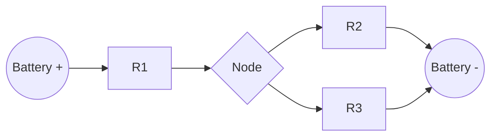
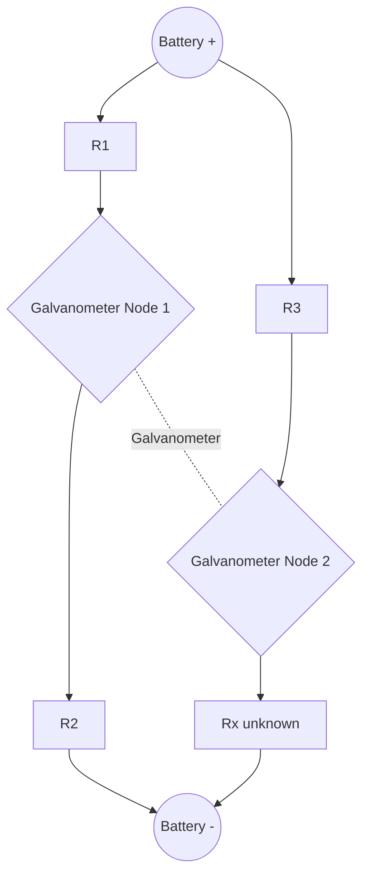

## Electric Current and Resistance

### Definition of Electric Current

Electric current is the rate of flow of electric charge through a conductor's cross-section.

$$I = \frac{dQ}{dt}$$

Where $I$ is current in amperes (A), $Q$ is charge in coulombs (C), and $t$ is time in seconds (s). One ampere equals one coulomb per second.

**Key Points**

- Conventional current direction is defined as the direction of positive charge flow, opposite to actual electron drift in metallic conductors
- Current is a scalar quantity, though it is often assigned a direction of flow for circuit analysis
- For steady (DC) current, $I = Q/t$

### Microscopic Model of Current

In a conductor, free electrons drift under an applied electric field, superimposed on their random thermal motion.

$$I = nAvq$$

Where $n$ is the number density of charge carriers (per m³), $A$ is the cross-sectional area (m²), $v$ is the drift velocity (m/s), and $q$ is the charge per carrier (C).

**Example**

A copper wire has a free-electron density $n \approx 8.5 \times 10^{28}\, \text{m}^{-3}$, cross-sectional area $A = 1 \times 10^{-6}\, \text{m}^2$, carrying $I = 1\,\text{A}$. Solving for drift velocity:

$$v = \frac{I}{nAq} = \frac{1}{(8.5\times10^{28})(1\times10^{-6})(1.6\times10^{-19})} \approx 7.4 \times 10^{-5}\, \text{m/s}$$

This illustrates that drift velocity is extremely small, even though the electrical signal itself propagates at close to the speed of light through the field.

### Current Density

Current density $J$ describes current per unit cross-sectional area, useful for non-uniform conductors or fields.

$$J = \frac{I}{A} = nvq$$

$J$ is a vector quantity pointing in the direction of conventional current flow.

### Ohm's Law

Ohm's Law states that the current through many conductors is directly proportional to the applied voltage, at constant temperature.

$$V = IR$$

Where $V$ is potential difference (volts), $I$ is current (amperes), and $R$ is resistance (ohms, $\Omega$).

**Key Points**

- Materials obeying $V = IR$ with constant $R$ are called **ohmic**; examples include most metals over moderate temperature ranges
- **Non-ohmic** materials (diodes, thermistors, filament lamps) have resistance that varies with voltage or current — [Inference: the degree of non-linearity depends on the specific material and operating regime]
- Ohm's Law is an empirical relationship, not a fundamental law like Maxwell's equations

### Resistance and Resistivity

Resistance depends on a conductor's geometry and material:

$$R = \rho \frac{L}{A}$$

Where $\rho$ is resistivity ($\Omega \cdot \text{m}$), $L$ is length (m), and $A$ is cross-sectional area (m²).

**Key Points**

- Resistivity $\rho$ is an intrinsic material property; resistance $R$ depends additionally on shape and size
- Conductivity $\sigma = 1/\rho$ is the reciprocal of resistivity
- Doubling the length doubles resistance; doubling the cross-sectional area halves resistance

### Temperature Dependence of Resistance

For most conductors, resistivity increases with temperature approximately linearly over moderate ranges:

$$\rho(T) = \rho_0 [1 + \alpha (T - T_0)]$$

Where $\alpha$ is the temperature coefficient of resistivity, and $\rho_0$ is resistivity at reference temperature $T_0$.

**Key Points**

- Metals: $\alpha > 0$ (resistance increases with temperature) due to increased lattice vibration scattering electrons
- Semiconductors: $\alpha < 0$ typically (resistance decreases with temperature) as more charge carriers are thermally liberated
- Superconductors exhibit zero resistance below a critical temperature $T_c$ — [Unverified: exact $T_c$ values and mechanisms vary by material class, e.g., conventional BCS superconductors versus high-$T_c$ cuprates]

### Resistivity SVG Comparison (svg_diagram)

<svg xmlns="http://www.w3.org/2000/svg" viewBox="0 0 640 320">
<text x="320" y="25" text-anchor="middle" font-size="16" font-weight="bold" fill="#222">Resistivity vs Temperature (svg_diagram)</text>
<line x1="70" y1="270" x2="600" y2="270" stroke="#333" stroke-width="2" />
<line x1="70" y1="270" x2="70" y2="50" stroke="#333" stroke-width="2" />
<text x="335" y="300" text-anchor="middle" font-size="13" fill="#333">Temperature (T)</text>
<text x="30" y="160" text-anchor="middle" font-size="13" fill="#333" transform="rotate(-90 30 160)">Resistivity (ρ)</text>
<polyline points="80,240 200,190 320,150 440,110 560,70" fill="none" stroke="#c0392b" stroke-width="3" />
<text x="565" y="65" font-size="12" fill="#c0392b">Metal</text>
<polyline points="80,80 200,150 320,195 440,225 560,245" fill="none" stroke="#2980b9" stroke-width="3" />
<text x="500" y="255" font-size="12" fill="#2980b9">Semiconductor</text>
<line x1="150" y1="270" x2="150" y2="255" stroke="#27ae60" stroke-width="3" />
<text x="150" y="290" text-anchor="middle" font-size="11" fill="#27ae60">Tc (superconductor drop)</text>
</svg>

### Superconductivity

Below a critical temperature, certain materials exhibit exactly zero electrical resistance and expel magnetic fields (the Meissner effect).

**Key Points**

- Conventional superconductivity is explained by BCS theory, involving Cooper pairs of electrons mediated by lattice phonon interactions
- High-temperature superconductors (e.g., cuprates) achieve superconductivity at higher $T_c$ through mechanisms not fully explained by BCS theory alone — [Speculation: the precise pairing mechanism in cuprates remains an active area of theoretical research]
- Applications include MRI magnets, maglev trains, and superconducting quantum interference devices (SQUIDs)

### Power Dissipation in Resistors

Electrical power dissipated as heat in a resistor (Joule heating):

$$P = IV = I^2R = \frac{V^2}{R}$$

**Example**

A $10\,\Omega$ resistor carries a current of $2\,\text{A}$.

$$P = I^2 R = (2)^2(10) = 40\,\text{W}$$

Over 1 minute (60 s), the total energy dissipated as heat is:

$$E = Pt = 40 \times 60 = 2400\,\text{J}$$

### Resistors in Series and Parallel

**Series combination:**

$$R_{eq} = R_1 + R_2 + \cdots + R_n$$

Current is identical through each series resistor; voltage divides proportionally to resistance.

**Parallel combination:**

$$\frac{1}{R_{eq}} = \frac{1}{R_1} + \frac{1}{R_2} + \cdots + \frac{1}{R_n}$$

Voltage is identical across each parallel branch; current divides inversely proportional to resistance.

### Series-Parallel Circuit Diagram

R1 is in series with the parallel combination of R2 and R3.

**Example**

Given $R_1 = 4\,\Omega$ in series with a parallel pair $R_2 = 6\,\Omega$ and $R_3 = 3\,\Omega$:

$$R_{23} = \left(\frac{1}{6} + \frac{1}{3}\right)^{-1} = \left(\frac{1}{6} + \frac{2}{6}\right)^{-1} = \left(\frac{3}{6}\right)^{-1} = 2\,\Omega$$

$$R_{eq} = R_1 + R_{23} = 4 + 2 = 6\,\Omega$$

### Measuring Current and Resistance

- **Ammeter**: connected in series in a circuit; ideally has zero internal resistance to avoid disturbing current flow
- **Voltmeter**: connected in parallel across a component; ideally has infinite internal resistance to draw negligible current
- **Ohmmeter**: measures resistance by applying a known small voltage/current to a de-energized component and computing $R = V/I$
- **Wheatstone bridge**: a precision method for measuring unknown resistance by balancing a bridge circuit until galvanometer current is zero

### Wheatstone Bridge Diagram

At balance, no current flows through the galvanometer, and:

$$\frac{R_1}{R_2} = \frac{R_3}{R_x}$$

### Drift Velocity vs Signal Speed (Conceptual Distinction)

**Key Points**

- Drift velocity of electrons is on the order of $10^{-4}$ to $10^{-5}\,\text{m/s}$
- The electric field that initiates current flow propagates through the conductor at a speed close to the speed of light in that medium — [Inference: the exact propagation speed depends on the medium's permittivity and permeability]
- This explains why a light bulb turns on almost instantly even though individual electrons move slowly

### Non-Ohmic Devices

**Key Points**

- **Diodes**: current flows predominantly in one direction; the $I$-$V$ curve is exponential, following the ideal diode equation $I = I_0 (e^{qV/kT} - 1)$
- **Filament lamps**: resistance increases with temperature as filament heats under current, producing a curved $I$-$V$ characteristic
- **Thermistors**: resistance strongly and predictably decreases (NTC type) or increases (PTC type) with temperature, used in temperature sensing

### Worked Problem: Combined Circuit Analysis

**Example**

A $12\,\text{V}$ battery (negligible internal resistance) drives a circuit with $R_1 = 2\,\Omega$ in series with a parallel combination of $R_2 = 4\,\Omega$ and $R_3 = 4\,\Omega$. Find total current and power dissipated in $R_1$.

Step 1 — Equivalent resistance of parallel pair:

$$R_{23} = \left(\frac{1}{4}+\frac{1}{4}\right)^{-1} = 2\,\Omega$$

Step 2 — Total resistance:

$$R_{total} = R_1 + R_{23} = 2 + 2 = 4\,\Omega$$

Step 3 — Total current:

$$I = \frac{V}{R_{total}} = \frac{12}{4} = 3\,\text{A}$$

Step 4 — Power dissipated in $R_1$:

$$P_1 = I^2 R_1 = (3)^2(2) = 18\,\text{W}$$

### Practical Considerations and Limitations

- Real ammeters and voltmeters have finite, non-ideal internal resistances, introducing small measurement errors — [Inference: the magnitude of this error depends on the specific instrument's design and the circuit's impedance levels]
- Temperature rise from Joule heating in a resistor can itself alter resistance during operation, creating nonlinear behavior in high-power applications
- Real-world conductors may deviate from Ohm's Law under extreme conditions (very high current densities, very low temperatures)

**Next Steps**

- Kirchhoff's Voltage and Current Laws
- Electromotive Force and Internal Resistance
- RC Circuits and Capacitor Charging/Discharging
- Electrical Power and Energy in Circuits
- Semiconductor Devices and Band Theory
- Superconductivity and BCS Theory
- Alternating Current and Impedance