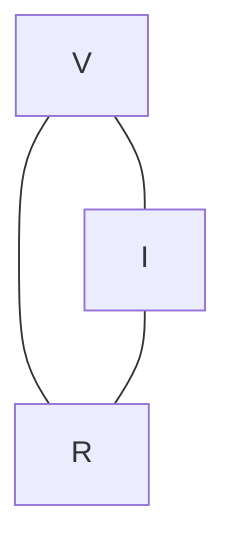
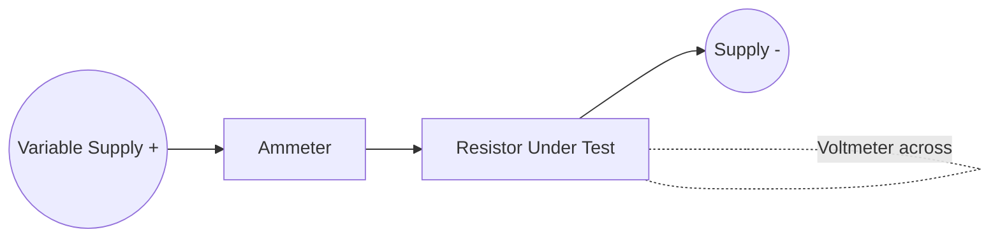

## Ohm's Law

### Statement of Ohm's Law

Ohm's Law states that the current flowing through a conductor between two points is directly proportional to the potential difference across those two points, provided physical conditions (especially temperature) remain constant.

$$V = IR$$

Where $V$ is potential difference in volts (V), $I$ is current in amperes (A), and $R$ is resistance in ohms ($\Omega$).

**Key Points**

- Ohm's Law is empirical, discovered by Georg Simon Ohm in 1827 through experimentation, not derived from more fundamental principles
- It applies to a specific class of materials called ohmic conductors
- The three equivalent forms are $V = IR$, $I = V/R$, and $R = V/I$

### The Ohm's Law Triangle

A common mnemonic device for rearranging the three variables:

Covering the desired variable reveals its formula: cover $V$ to get $I \times R$; cover $I$ to get $V/R$; cover $R$ to get $V/I$.

### Microscopic Basis of Ohm's Law

At the microscopic level, Ohm's Law arises from the relationship between current density and electric field:

$$J = \sigma E$$

Where $J$ is current density (A/m²), $\sigma$ is conductivity (S/m), and $E$ is electric field strength (V/m). This is often called the "point form" or "local form" of Ohm's Law.

**Key Points**

- This microscopic form holds even in situations where geometry makes the macroscopic $V = IR$ form less convenient to apply directly
- Conductivity $\sigma$ relates to the density of free charge carriers and their mobility: $\sigma = nq\mu$, where $\mu$ is charge carrier mobility
- Derivation from the Drude model treats electrons as classical particles undergoing collisions with a mean free time $\tau$ between scattering events, giving $\sigma = \dfrac{nq^2\tau}{m}$ — [Inference: the Drude model is a simplified classical approximation; a full quantum mechanical treatment refines these predictions for real materials]

### Graphical Representation

For an ohmic conductor, plotting $V$ against $I$ produces a straight line through the origin, with resistance as the slope.

### V-I Characteristic Curve (svg_diagram)

<svg xmlns="http://www.w3.org/2000/svg" viewBox="0 0 600 320">
<text x="300" y="25" text-anchor="middle" font-size="16" font-weight="bold" fill="#222">V-I Characteristics (svg_diagram)</text>
<line x1="80" y1="270" x2="560" y2="270" stroke="#333" stroke-width="2" />
<line x1="80" y1="270" x2="80" y2="40" stroke="#333" stroke-width="2" />
<text x="320" y="300" text-anchor="middle" font-size="13" fill="#333">Current, I</text>
<text x="35" y="155" text-anchor="middle" font-size="13" fill="#333" transform="rotate(-90 35 155)">Voltage, V</text>
<line x1="80" y1="270" x2="480" y2="70" stroke="#c0392b" stroke-width="3" />
<text x="490" y="65" font-size="12" fill="#c0392b">Ohmic (linear)</text>
<path d="M80,270 Q200,260 300,220 T480,110" fill="none" stroke="#2980b9" stroke-width="3" />
<text x="400" y="150" font-size="12" fill="#2980b9">Non-ohmic (e.g. diode)</text>
</svg>

**Key Points**

- The slope of a $V$ vs $I$ line equals resistance $R$; a steeper slope indicates higher resistance
- A curved characteristic indicates a non-ohmic device, where $R$ varies with operating point
- The slope at any point on a non-linear curve gives the **dynamic (differential) resistance**: $r = dV/dI$, distinct from the static resistance $V/I$ at that point

### Ohmic vs Non-Ohmic Conductors

| Property | Ohmic Conductor | Non-Ohmic Conductor |
| --- | --- | --- |
| $V$-$I$ relationship | Linear, through origin | Non-linear |
| Resistance | Constant (at fixed temperature) | Varies with $V$ or $I$ |
| Examples | Fixed resistors, nichrome wire (moderate range) | Diodes, transistors, filament lamps, thermistors |
| Reversibility | Same $R$ for reversed current direction | May be direction-dependent (e.g., diodes) |

**Key Points**

- Filament lamps deviate from Ohm's Law because resistive heating raises filament temperature, increasing resistivity as current increases
- Diodes conduct asymmetrically due to the p-n junction's built-in potential barrier
- [Inference: no real conductor is perfectly ohmic across all conditions; ohmic behavior is typically an approximation valid within a limited range of voltage, current, and temperature]

### Experimental Verification of Ohm's Law

A basic laboratory setup uses a variable power supply, ammeter, voltmeter, and a resistor under test.

**Key Points**

- The ammeter is connected in series to measure current through the resistor
- The voltmeter is connected in parallel across the resistor to measure potential difference
- Varying the supply voltage and recording corresponding current values allows plotting the $V$-$I$ graph to test linearity

### Worked Example: Applying Ohm's Law

**Example**

A resistor is connected to a $9\,\text{V}$ battery, and an ammeter reads $0.3\,\text{A}$ of current. Find the resistance.

$$R = \frac{V}{I} = \frac{9}{0.3} = 30\,\Omega$$

If the same resistor is instead connected to a $15\,\text{V}$ source, the resulting current is:

$$I = \frac{V}{R} = \frac{15}{30} = 0.5\,\text{A}$$

This linear scaling confirms ohmic behavior, assuming resistance remains constant.

### Ohm's Law in Circuit Analysis

Ohm's Law underlies most fundamental circuit analysis techniques:

**Key Points**

- Combined with Kirchhoff's Voltage Law (KVL) and Kirchhoff's Current Law (KCL), Ohm's Law allows full analysis of resistive networks
- Voltage divider and current divider formulas are direct applications of Ohm's Law across series and parallel resistances
- In AC circuits, an analogous relationship holds using impedance: $V = IZ$, where $Z$ is a complex quantity accounting for resistance, capacitive reactance, and inductive reactance — [Inference: the direct proportionality of magnitudes holds only for a fixed frequency, since reactance is frequency-dependent]

### Voltage Divider Application

For two resistors in series across a voltage source $V_s$:

$$V_1 = V_s \cdot \frac{R_1}{R_1 + R_2}$$

**Example**

A $12\,\text{V}$ source connects to $R_1 = 3\,\Omega$ and $R_2 = 9\,\Omega$ in series.

$$V_1 = 12 \times \frac{3}{3+9} = 12 \times 0.25 = 3\,\text{V}$$

$$V_2 = 12 \times \frac{9}{12} = 9\,\text{V}$$

Verification: $V_1 + V_2 = 3 + 9 = 12\,\text{V} = V_s$, consistent with Kirchhoff's Voltage Law.

### Limitations of Ohm's Law

**Key Points**

- Ohm's Law fails for non-ohmic components where charge carrier behavior depends non-linearly on applied field (semiconductors, gas discharge tubes, electrolytes under certain conditions)
- At very high electric fields or current densities, some ohmic materials exhibit deviations due to heating effects or saturation of drift velocity
- Superconductors below their critical temperature exhibit zero resistance, meaning $V = 0$ for any finite $I$, which is a limiting case outside the standard formulation of the law
- Ohm's Law does not account for the direction-dependent, non-linear behavior of active or non-linear circuit elements found in electronics

**Next Steps**

- Resistivity and Temperature Dependence
- Kirchhoff's Voltage and Current Laws
- Series and Parallel Resistor Networks
- Non-Ohmic Devices and Diode Characteristics
- AC Circuits and Impedance
- Power Dissipation in Resistive Circuits