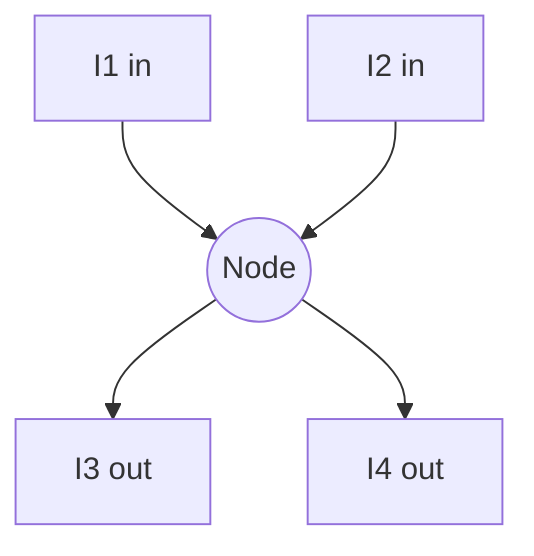
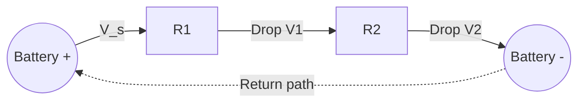

## Kirchhoff's Circuit Laws

### Overview

Kirchhoff's Circuit Laws, formulated by Gustav Kirchhoff in 1845, comprise two fundamental principles for analyzing electrical circuits: the Current Law (conservation of charge) and the Voltage Law (conservation of energy). Together they enable systematic analysis of arbitrarily complex resistive and reactive networks.

**Key Points**

- Both laws are consequences of more fundamental conservation principles in physics, not independent postulates
- They apply to lumped-element circuits, where circuit dimensions are small relative to the wavelength of signals involved — [Inference: at very high frequencies or with distributed elements, transmission line effects require modified analysis beyond simple KCL/KVL]
- These laws form the basis for nodal analysis and mesh analysis, the two primary systematic circuit-solving techniques

### Kirchhoff's Current Law (KCL)

KCL states that the total current entering a node (junction) equals the total current leaving that node.

$$\sum_{k=1}^{n} I_k = 0$$

Where currents entering the node are taken as positive and currents leaving as negative (or vice versa, by consistent convention).

**Key Points**

- KCL is a direct consequence of the conservation of electric charge; charge cannot accumulate indefinitely at a node under steady-state conditions
- Applies at every node in a circuit, including nodes with more than two connected branches
- Valid for both DC and AC circuits, including with complex (phasor) currents in AC analysis

### KCL Node Diagram

At this node: $I_1 + I_2 = I_3 + I_4$

**Example**

At a node, two currents enter: $I_1 = 5\,\text{A}$ and $I_2 = 3\,\text{A}$. Three branches leave the node, with $I_3 = 2\,\text{A}$ and $I_4 = 4\,\text{A}$ known. Find $I_5$.

$$I_1 + I_2 = I_3 + I_4 + I_5$$

$$5 + 3 = 2 + 4 + I_5$$

$$I_5 = 8 - 6 = 2\,\text{A}$$

### Kirchhoff's Voltage Law (KVL)

KVL states that the sum of all potential differences (voltage drops and rises) around any closed loop in a circuit equals zero.

$$\sum_{k=1}^{n} V_k = 0$$

**Key Points**

- KVL follows from conservation of energy: the net work done moving a unit charge around a closed loop and back to its starting point is zero, since the electric field in a static or quasi-static circuit is conservative
- Sign conventions matter: voltage drops across resistors (in the direction of assumed current flow) are typically taken as negative, while voltage rises (e.g., across a battery from - to +) are taken as positive, or vice versa — consistency is essential
- Applies to any closed loop within a circuit, whether it corresponds to a single physical loop or an imagined path through multiple branches

### KVL Loop Diagram

Around this loop: $V_s - V_1 - V_2 = 0$, so $V_s = V_1 + V_2$.

**Example**

A single loop circuit has a $20\,\text{V}$ battery and two series resistors $R_1 = 4\,\Omega$ and $R_2 = 6\,\Omega$. Applying KVL:

$$V_s = I R_1 + I R_2$$

$$20 = I(4 + 6) = 10I$$

$$I = 2\,\text{A}$$

Voltage drops: $V_1 = IR_1 = 2 \times 4 = 8\,\text{V}$, $V_2 = IR_2 = 2 \times 6 = 12\,\text{V}$. Check: $8 + 12 = 20\,\text{V}$, consistent with the source voltage.

### Sign Convention Details

**Key Points**

- When traversing a loop in the direction of assumed current through a resistor, record a voltage drop (negative contribution): $-IR$
- When traversing a loop from the negative to positive terminal of a source, record a voltage rise (positive contribution): $+V$
- If an assumed current direction turns out to be incorrect after solving, the current value will simply be negative, indicating the actual flow is opposite to the assumed direction — this is a normal and valid outcome, not an error

### Systematic Application: Nodal Analysis

Nodal analysis applies KCL at each non-reference node, expressing branch currents in terms of node voltages via Ohm's Law, then solves the resulting system of equations.

**Key Points**

- One node is designated the reference (ground) node, typically assigned $0\,\text{V}$
- For a circuit with $n$ nodes, this yields $n-1$ independent equations
- Particularly efficient for circuits with many parallel branches sharing common nodes

### Systematic Application: Mesh Analysis

Mesh analysis applies KVL around each independent loop (mesh), defining mesh currents and solving the resulting system.

**Key Points**

- Applicable strictly to planar circuits (those that can be drawn on a plane without crossing wires) — [Inference: for non-planar circuits, generalized loop analysis techniques are required instead of standard mesh analysis]
- For a circuit with $b$ branches and $n$ nodes, the number of independent meshes is $b - n + 1$
- Each mesh current is treated as circulating around its loop; branch currents shared between adjacent meshes are found by superposition of the relevant mesh currents

### Worked Example: Two-Loop Circuit

**Example**

Consider a circuit with two loops sharing a common branch containing resistor $R_3$. Loop 1 has source $V_1 = 10\,\text{V}$ and resistor $R_1 = 2\,\Omega$; loop 2 has source $V_2 = 5\,\text{V}$ and resistor $R_2 = 3\,\Omega$; the shared branch has $R_3 = 4\,\Omega$. Using mesh currents $I_a$ (loop 1) and $I_b$ (loop 2), both assumed clockwise:

$$\text{Loop 1: } 10 = I_a(R_1 + R_3) - I_b R_3 = I_a(6) - 4I_b$$

$$\text{Loop 2: } -5 = I_b(R_2 + R_3) - I_a R_3 = I_b(7) - 4I_a$$

Solving this system of two equations:

From the first equation: $I_a = \dfrac{10 + 4I_b}{6}$

Substituting into the second:

$$-5 = 7I_b - 4\left(\frac{10+4I_b}{6}\right)$$

$$-5 = 7I_b - \frac{40 + 16I_b}{6}$$

$$-30 = 42I_b - 40 - 16I_b$$

$$-30 = 26I_b - 40$$

$$I_b = \frac{10}{26} \approx 0.385\,\text{A}$$

$$I_a = \frac{10 + 4(0.385)}{6} \approx \frac{11.54}{6} \approx 1.923\,\text{A}$$

Current through the shared resistor $R_3$: $I_a - I_b \approx 1.538\,\text{A}$.

### Application to AC Circuits

**Key Points**

- In AC circuits, KCL and KVL apply to phasor (complex) currents and voltages rather than instantaneous real values
- Impedance $Z$ replaces resistance $R$ in Ohm's Law applications within KVL equations: $V = IZ$
- The laws remain valid at every instant in time for instantaneous values as well, since they derive from charge and energy conservation, which hold regardless of waveform

### Limitations and Extensions

**Key Points**

- Standard Kirchhoff's Laws assume quasi-static conditions, where electromagnetic wave propagation delays across the circuit are negligible; at high frequencies or with long transmission lines, this assumption breaks down and full electromagnetic (transmission line or Maxwell's equations) analysis is needed — [Inference: the specific frequency threshold depends on the physical dimensions of the circuit relative to signal wavelength]
- KCL's assumption of no charge accumulation at a node does not hold for circuit elements that inherently store charge internally (e.g., analyzing the plates of a capacitor as a "node" requires careful treatment, though the connecting wire nodes still obey KCL)
- Both laws assume idealized lumped circuit elements with no parasitic effects; real-world components require additional modeling for stray capacitance, inductance, and resistance in high-precision applications

**Related Topics**

- Ohm's Law and Resistivity
- Nodal and Mesh Analysis Techniques
- Thevenin's and Norton's Theorems
- Superposition Theorem in Circuit Analysis
- AC Circuit Analysis and Phasors
- RLC Circuits and Resonance