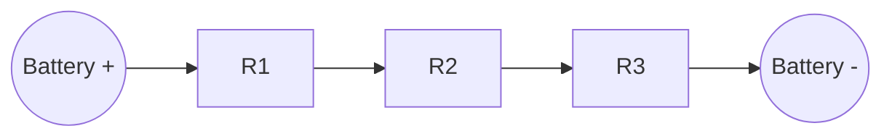
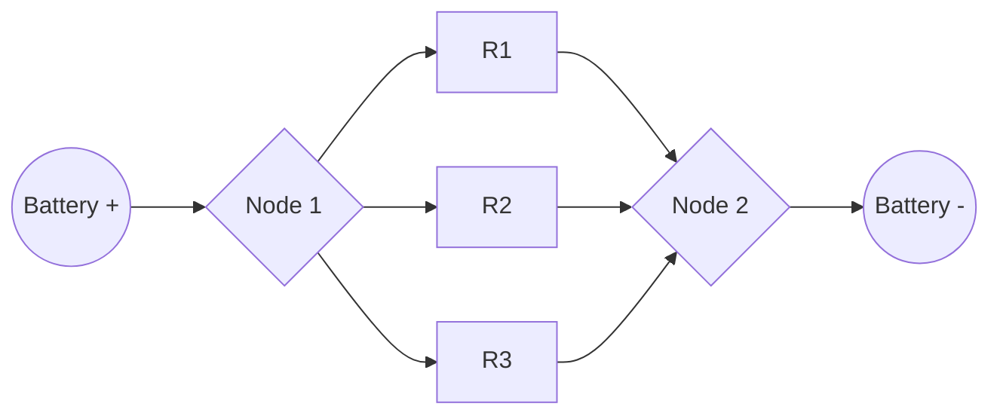
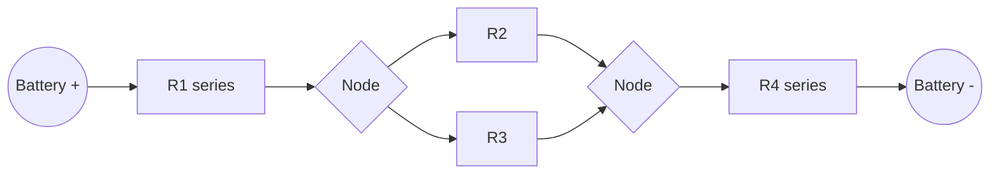

## Series and Parallel Circuits

### Overview

Series and parallel configurations are the two fundamental ways of connecting circuit components, forming the basis for analyzing more complex networks. Most real circuits are combinations of both configurations.

**Key Points**

- In a **series** circuit, components are connected end-to-end along a single path, so the same current flows through each component
- In a **parallel** circuit, components are connected across common nodes, so the same voltage appears across each component
- Combination (series-parallel) circuits contain both configurations and require systematic simplification for analysis

### Series Circuits

In a series circuit, all components share a single current path with no branching.

**Key Points**

- Current is identical through every component: $I = I_1 = I_2 = I_3 = \cdots$
- Total voltage equals the sum of individual voltage drops: $V_{total} = V_1 + V_2 + V_3 + \cdots$
- If any single component fails open-circuit, the entire circuit stops conducting

### Equivalent Resistance in Series

$$R_{eq} = R_1 + R_2 + R_3 + \cdots + R_n$$

**Example**

Three resistors $R_1 = 5\,\Omega$, $R_2 = 10\,\Omega$, $R_3 = 15\,\Omega$ are connected in series across a $30\,\text{V}$ source.

$$R_{eq} = 5 + 10 + 15 = 30\,\Omega$$

$$I = \frac{V}{R_{eq}} = \frac{30}{30} = 1\,\text{A}$$

Voltage across each resistor: $V_1 = IR_1 = 5\,\text{V}$, $V_2 = IR_2 = 10\,\text{V}$, $V_3 = IR_3 = 15\,\text{V}$. Sum check: $5+10+15 = 30\,\text{V}$, matching the source.

### Parallel Circuits

In a parallel circuit, components are connected between the same two nodes, providing multiple current paths.

**Key Points**

- Voltage is identical across every parallel branch: $V = V_1 = V_2 = V_3 = \cdots$
- Total current equals the sum of branch currents: $I_{total} = I_1 + I_2 + I_3 + \cdots$
- If one branch fails open-circuit, current continues flowing through the remaining branches

### Equivalent Resistance in Parallel

$$\frac{1}{R_{eq}} = \frac{1}{R_1} + \frac{1}{R_2} + \cdots + \frac{1}{R_n}$$

For exactly two resistors, this simplifies to the "product over sum" form:

$$R_{eq} = \frac{R_1 R_2}{R_1 + R_2}$$

**Example**

Two resistors $R_1 = 6\,\Omega$ and $R_2 = 3\,\Omega$ are connected in parallel across a $12\,\text{V}$ source.

$$R_{eq} = \frac{6 \times 3}{6+3} = \frac{18}{9} = 2\,\Omega$$

$$I_{total} = \frac{V}{R_{eq}} = \frac{12}{2} = 6\,\text{A}$$

Branch currents: $I_1 = V/R_1 = 12/6 = 2\,\text{A}$, $I_2 = V/R_2 = 12/3 = 4\,\text{A}$. Sum check: $2+4 = 6\,\text{A}$, matching total current.

**Key Points**

- The equivalent resistance of a parallel combination is always less than the smallest individual resistance in the combination
- Adding more parallel branches always decreases the overall equivalent resistance
- For $n$ identical resistors of value $R$ in parallel: $R_{eq} = R/n$

### Comparison Table

| Property | Series | Parallel |
| --- | --- | --- |
| Current | Same through all components | Divides among branches |
| Voltage | Divides among components | Same across all branches |
| Equivalent Resistance | Always greater than largest individual resistor | Always less than smallest individual resistor |
| Effect of component failure (open) | Breaks entire circuit | Other branches continue functioning |
| Common use case | Voltage division, current limiting | Maintaining constant voltage to multiple loads |

### Voltage Divider Rule

In a series circuit, voltage divides in proportion to resistance:

$$V_i = V_{total} \cdot \frac{R_i}{R_{eq}}$$

**Example**

A $9\,\text{V}$ battery supplies a series combination of $R_1 = 2\,\Omega$ and $R_2 = 7\,\Omega$.

$$V_1 = 9 \times \frac{2}{9} = 2\,\text{V}$$

$$V_2 = 9 \times \frac{7}{9} = 7\,\text{V}$$

### Current Divider Rule

In a parallel circuit with two branches, current divides inversely with resistance:

$$I_1 = I_{total} \cdot \frac{R_2}{R_1 + R_2}, \quad I_2 = I_{total} \cdot \frac{R_1}{R_1 + R_2}$$

**Example**

A total current of $10\,\text{A}$ enters a parallel combination of $R_1 = 2\,\Omega$ and $R_2 = 8\,\Omega$.

$$I_1 = 10 \times \frac{8}{2+8} = 10 \times 0.8 = 8\,\text{A}$$

$$I_2 = 10 \times \frac{2}{10} = 2\,\text{A}$$

Note that the smaller resistor carries the larger share of current, since current preferentially flows through the path of least resistance.

### Series-Parallel Combination Circuits

Most practical circuits combine both configurations. The general strategy is to reduce the circuit step-by-step: identify purely series or purely parallel sub-groups, collapse them into single equivalent resistances, and repeat until a single equivalent resistance remains.

**Example**

Given $R_1 = 3\,\Omega$ in series, followed by a parallel pair $R_2 = 6\,\Omega$ and $R_3 = 12\,\Omega$, followed by $R_4 = 5\,\Omega$ in series, across a $20\,\text{V}$ source:

Step 1 — Combine the parallel pair:

$$R_{23} = \frac{6 \times 12}{6+12} = \frac{72}{18} = 4\,\Omega$$

Step 2 — Combine all series elements:

$$R_{eq} = R_1 + R_{23} + R_4 = 3 + 4 + 5 = 12\,\Omega$$

Step 3 — Total current:

$$I = \frac{V}{R_{eq}} = \frac{20}{12} \approx 1.667\,\text{A}$$

Step 4 — Voltage across the parallel section:

$$V_{23} = I \times R_{23} = 1.667 \times 4 \approx 6.67\,\text{V}$$

Step 5 — Individual branch currents in the parallel section:

$$I_2 = \frac{V_{23}}{R_2} = \frac{6.67}{6} \approx 1.11\,\text{A}, \quad I_3 = \frac{V_{23}}{R_3} = \frac{6.67}{12} \approx 0.556\,\text{A}$$

Check: $I_2 + I_3 \approx 1.11 + 0.556 \approx 1.667\,\text{A}$, matching total current.

### Series and Parallel Capacitors (Contrast)

**Key Points**

- Capacitors combine oppositely to resistors: in series, $\dfrac{1}{C_{eq}} = \dfrac{1}{C_1}+\dfrac{1}{C_2}+\cdots$; in parallel, $C_{eq} = C_1+C_2+\cdots$
- This inversion occurs because capacitance depends on charge storage geometry rather than dissipative flow, and the underlying physical constraint (equal charge in series, equal voltage in parallel) applies oppositely to $C = Q/V$ compared to $R = V/I$
- This is a common point of confusion for learners transitioning from resistive to capacitive network analysis

### Practical Applications

**Key Points**

- **Series**: used in string lights (older designs), current-limiting resistor placement with LEDs, and voltage-divider sensor circuits
- **Parallel**: used in household electrical wiring, so that each appliance receives full line voltage independently and can operate or fail without affecting others
- **Combination circuits**: found in virtually all practical electronics, including amplifier biasing networks, sensor bridge circuits, and power distribution systems

### Common Pitfalls

**Key Points**

- Incorrectly assuming components are in series or parallel without carefully tracing the circuit topology and identifying shared nodes
- Forgetting that a component's "parallel partner" must share both of its connection nodes, not just one
- Applying the series or parallel resistance formula to a mixed configuration without first correctly identifying and reducing sub-networks in the proper order

**Next Steps**

- Kirchhoff's Circuit Laws
- Voltage and Current Divider Applications
- Thevenin's and Norton's Equivalent Circuits
- Wheatstone Bridge Circuits
- Capacitors and Capacitive Networks
- Star-Delta (Wye-Delta) Transformations