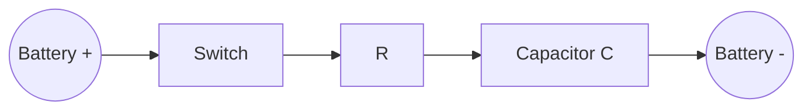
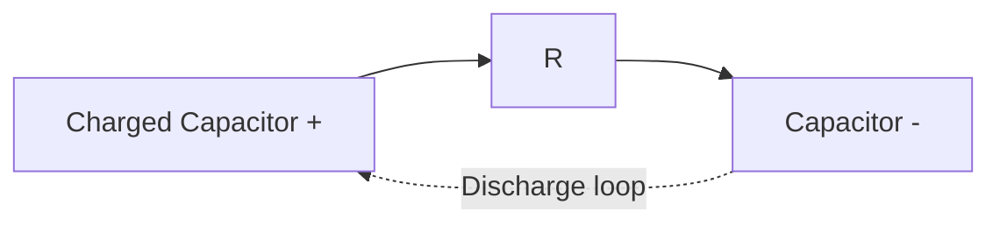
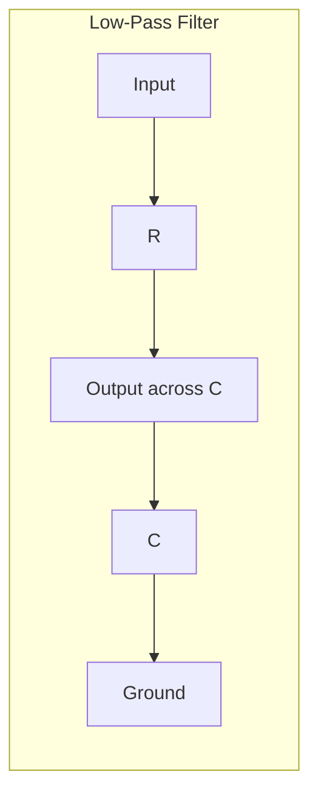
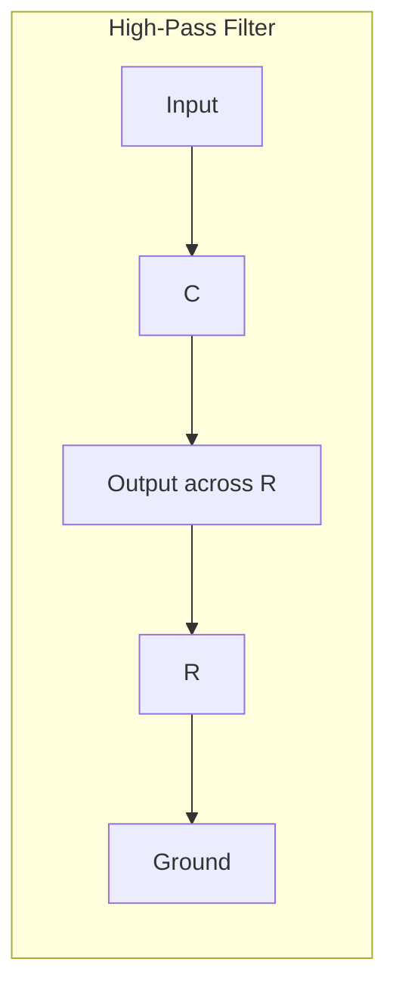

## RC Circuits and Transients

### Overview

RC circuits combine a resistor and capacitor, exhibiting time-dependent (transient) behavior rather than the instantaneous response of purely resistive circuits. They form the basis for timing circuits, filters, and signal-shaping applications.

**Key Points**

- The defining feature of an RC circuit is the capacitor's inability to change voltage instantaneously, since doing so would require infinite current
- Transient response describes the circuit's behavior as it transitions between steady states, typically following a source voltage change
- The characteristic time constant $\tau = RC$ governs the speed of this transition

### Capacitor Fundamentals Recap

$$Q = CV, \quad I = C\frac{dV}{dt}$$

Where $Q$ is charge (C), $C$ is capacitance (F), $V$ is voltage (V), and $I$ is current (A).

**Key Points**

- A capacitor stores energy in the electric field between its plates: $E = \frac{1}{2}CV^2$
- At the instant of switching, a capacitor's voltage cannot jump discontinuously (in an idealized circuit with finite resistance limiting current)
- An initially uncharged capacitor acts momentarily like a short circuit (zero voltage); a fully charged capacitor in steady state acts like an open circuit (zero current)

### RC Charging Circuit

Applying KVL to a series RC circuit with source $V_s$, switch closed at $t=0$:

$$V_s = IR + V_C$$

Since $I = C\dfrac{dV_C}{dt}$, this becomes a first-order linear differential equation:

$$V_s = RC\frac{dV_C}{dt} + V_C$$

Solving with initial condition $V_C(0) = 0$:

$$V_C(t) = V_s\left(1 - e^{-t/RC}\right)$$

$$I(t) = \frac{V_s}{R} e^{-t/RC}$$

**Key Points**

- $V_C(t)$ rises exponentially from 0 toward $V_s$, while $I(t)$ decays exponentially from its initial maximum $V_s/R$ toward zero
- The exponential charging curve asymptotically approaches but mathematically never exactly reaches $V_s$; in practice, it is considered "fully charged" after about $5\tau$
- The voltage across the resistor is $V_R(t) = V_s - V_C(t) = V_s e^{-t/RC}$, mirroring the current's decay shape

### The Time Constant

$$\tau = RC$$

Where $R$ is in ohms and $C$ is in farads, giving $\tau$ in seconds.

**Key Points**

- $\tau$ represents the time for the capacitor voltage to reach approximately 63.2% of its final value during charging (or to fall to 36.8% of its initial value during discharging)
- After $1\tau$: 63.2% charged; after $2\tau$: 86.5%; after $3\tau$: 95.0%; after $4\tau$: 98.2%; after $5\tau$: 99.3% — commonly treated as "fully charged" for practical purposes
- A larger $R$ or $C$ produces a slower (longer) transient response; smaller values produce faster transients

### Charging Curve (svg_diagram)

<svg xmlns="http://www.w3.org/2000/svg" viewBox="0 0 600 320">
<text x="300" y="25" text-anchor="middle" font-size="16" font-weight="bold" fill="#222">RC Charging Curve (svg_diagram)</text>
<line x1="80" y1="270" x2="560" y2="270" stroke="#333" stroke-width="2" />
<line x1="80" y1="270" x2="80" y2="40" stroke="#333" stroke-width="2" />
<text x="320" y="300" text-anchor="middle" font-size="13" fill="#333">Time (t)</text>
<text x="35" y="155" text-anchor="middle" font-size="13" fill="#333" transform="rotate(-90 35 155)">Vc(t)</text>
<line x1="80" y1="70" x2="560" y2="70" stroke="#999" stroke-dasharray="4,4" />
<text x="565" y="75" font-size="11" fill="#999">Vs</text>
<path d="M80,270 C150,120 250,80 560,72" fill="none" stroke="#c0392b" stroke-width="3" />
<line x1="180" y1="270" x2="180" y2="180" stroke="#2980b9" stroke-dasharray="3,3" />
<text x="185" y="195" font-size="11" fill="#2980b9">τ (63.2%)</text>
</svg>

### RC Discharging Circuit

With the capacitor initially charged to $V_0$ and no source in the loop (switch disconnects source, connects to a closed loop through $R$):

$$V_C(t) = V_0 e^{-t/RC}$$

$$I(t) = \frac{V_0}{R} e^{-t/RC}$$

**Key Points**

- Both voltage and current decay exponentially from their initial values toward zero
- The current direction during discharge is opposite to the direction during charging, since the capacitor now acts as the source driving current through $R$
- Energy stored in the capacitor is dissipated as heat in the resistor during discharge, following $P(t) = I(t)^2 R$

### Worked Example: Charging Circuit Calculation

**Example**

A $100\,\mu\text{F}$ capacitor charges through a $2\,\text{k}\Omega$ resistor from a $10\,\text{V}$ source. Find the time constant and the capacitor voltage at $t = 0.3\,\text{s}$.

$$\tau = RC = (2000)(100 \times 10^{-6}) = 0.2\,\text{s}$$

$$V_C(0.3) = 10\left(1 - e^{-0.3/0.2}\right) = 10\left(1 - e^{-1.5}\right)$$

$$e^{-1.5} \approx 0.2231$$

$$V_C(0.3) \approx 10(1 - 0.2231) = 7.77\,\text{V}$$

### Worked Example: Discharging Circuit Calculation

**Example**

The same capacitor, now charged to $10\,\text{V}$, discharges through the same $2\,\text{k}\Omega$ resistor. Find the current at $t = 0.4\,\text{s}$.

$$I(0.4) = \frac{10}{2000} e^{-0.4/0.2} = 0.005 \times e^{-2}$$

$$e^{-2} \approx 0.1353$$

$$I(0.4) \approx 0.005 \times 0.1353 \approx 6.77 \times 10^{-4}\,\text{A} = 0.677\,\text{mA}$$

### Energy Considerations During Charging

**Key Points**

- Total energy supplied by the source during charging: $W_{source} = \int_0^\infty V_s I\, dt = C V_s^2$
- Final energy stored in the capacitor: $W_C = \frac{1}{2}CV_s^2$
- The remaining half of the supplied energy, $\frac{1}{2}CV_s^2$, is dissipated as heat in the resistor regardless of the resistor's specific value — [Inference: this 50% energy loss is a general result of this idealized charging process and does not depend on $R$, though the rate of dissipation does]

### RC Circuits as Filters

**Key Points**

- A **low-pass RC filter** (output taken across the capacitor) attenuates high-frequency signals while passing low frequencies, with cutoff frequency $f_c = \dfrac{1}{2\pi RC}$
- A **high-pass RC filter** (output taken across the resistor) attenuates low-frequency signals while passing high frequencies, using the same cutoff formula
- At the cutoff frequency, output amplitude is reduced to $1/\sqrt{2} \approx 70.7\%$ of input amplitude (the "-3 dB point")

### RC Filter Diagrams

### Applications of RC Transients

**Key Points**

- **Timing circuits**: RC networks control timing intervals in oscillators, timers (e.g., the classic 555 timer IC), and debounce circuits for mechanical switches
- **Camera flash circuits**: a capacitor charges slowly through a resistor from a battery, then discharges rapidly through the flash tube
- **Signal coupling and decoupling**: high-pass RC filters (coupling capacitors) block DC bias while passing AC signals between amplifier stages; low-pass filters smooth power supply ripple
- **Defibrillators**: store energy in a large capacitor over a charging period, then discharge rapidly through the patient via a controlled RC-like discharge path — [Unverified: actual medical defibrillator circuits include additional components such as inductors for waveform shaping beyond a simple RC model]

### Multiple Time Constant Circuits

**Key Points**

- Circuits with multiple resistors and one capacitor can often be reduced to an equivalent single-resistor RC circuit using Thevenin's theorem, with $R_{Th}$ replacing $R$ in the time constant formula
- Circuits with multiple capacitors and one resistor may require combining capacitors into an equivalent capacitance first (series/parallel capacitor rules), then applying the standard RC formulas
- More complex networks with multiple independent energy storage elements require solving higher-order differential equations, extending beyond single-time-constant behavior

### Common Pitfalls

**Key Points**

- Assuming a capacitor is "fully" charged or discharged after exactly one time constant, when in fact roughly 63% (charging) or 37% remaining (discharging) is reached at that point, not 100%
- Neglecting that the resistor's voltage and the capacitor's voltage sum to the source voltage at every instant (per KVL), which provides a useful check on transient calculations
- Confusing the algebraic sign or exponential direction between charging (approaching $V_s$) and discharging (approaching zero) equations

**Next Steps**

- Kirchhoff's Circuit Laws
- Capacitors and Capacitive Networks
- RL Circuits and Inductive Transients
- RLC Circuits and Resonance
- Frequency Response and Bode Plots
- AC Circuit Analysis and Phasors