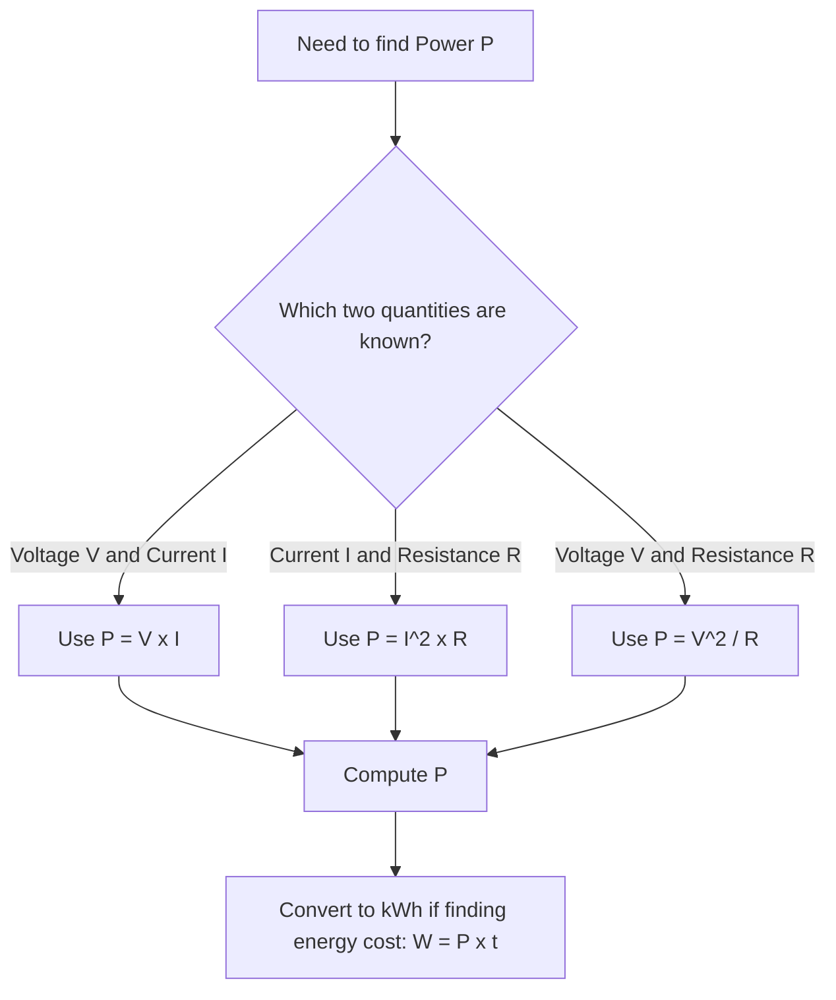

## Electrical Power and Energy

### Definition and Physical Meaning

**Electrical power** is the rate at which electrical energy is converted into another form (heat, light, mechanical work, etc.) or the rate at which work is done by an electric circuit. It is a scalar quantity measured in watts (W), where $1\text{ W} = 1\text{ J/s}$.

**Electrical energy** is the total work done or heat dissipated over a time interval, measured in joules (J) in SI units, though in practical/commercial contexts it is measured in kilowatt-hours (kWh).

### Core Formulas

The fundamental relationship between power, energy, and time:

$$P = \frac{W}{t}$$

where $P$ is power (W), $W$ is energy/work (J), and $t$ is time (s).

Rearranged for energy:

$$W = Pt$$

**Power in terms of circuit quantities**

Since power is the rate of doing electrical work, and $V = W/q$ (voltage is work per unit charge) while $I = q/t$ (current is charge per unit time):

$$P = VI$$

Using Ohm's Law ($V = IR$), this can be expressed in two additional equivalent forms:

$$P = I^2 R$$

$$P = \frac{V^2}{R}$$

These three forms ($P = VI$, $P = I^2R$, $P = V^2/R$) are interchangeable and should be chosen based on which quantities are known in a given problem.

### Derivation Walkthrough

Starting from the definitions of current and voltage:

- Current: $I = \dfrac{q}{t}$, so $q = It$
- Voltage: $V = \dfrac{W}{q}$, so $W = Vq$

Substituting $q = It$ into $W = Vq$:

$$W = V(It) = VIt$$

Dividing by time to get power:

$$P = \frac{W}{t} = VI$$

Substituting $V = IR$ (Ohm's Law) gives $P = (IR)I = I^2R$. Substituting $I = V/R$ gives $P = V\left(\dfrac{V}{R}\right) = \dfrac{V^2}{R}$.

### Units and Conversions

| Quantity | SI Unit | Common Practical Unit |
| --- | --- | --- |
| Power | Watt (W) | Kilowatt (kW), Horsepower (hp) |
| Energy | Joule (J) | Kilowatt-hour (kWh) |
| Time | Second (s) | Hour (h) |

**Key conversions:**

$$1\text{ kWh} = 1000\text{ W} \times 3600\text{ s} = 3.6 \times 10^6\text{ J}$$

$$1\text{ hp} \approx 746\text{ W}$$

The kilowatt-hour is the standard billing unit used by electric utility companies because joules are impractically small for household-scale energy consumption over time.

### Electric Power in Circuit Elements

**Resistors (pure dissipative loads):**

All electrical power delivered to an ideal resistor is converted to heat. This is called **Joule heating** or **resistive dissipation**, governed by $P = I^2R$.

**Sources (batteries, generators):**

A source delivers power given by $P = VI$, where $V$ is the terminal voltage and $I$ is the current supplied. Part of this power may be dissipated internally due to internal resistance $r$:

$$P_{\text{delivered}} = \varepsilon I - I^2 r$$

where $\varepsilon$ is the EMF (electromotive force).

**Series and Parallel Circuits — Power Distribution**

- In a **series circuit**, current $I$ is the same through all elements, so power dissipated is proportional to resistance: $P \propto R$ (larger resistors dissipate more power).
- In a **parallel circuit**, voltage $V$ is the same across all branches, so power dissipated is inversely proportional to resistance: $P \propto 1/R$ (smaller resistors dissipate more power).

Total power in any combination circuit equals the sum of power dissipated in each individual component:

$$P_{\text{total}} = P_1 + P_2 + P_3 + \cdots$$

This follows directly from conservation of energy.

### Worked Example 1: Basic Power Calculation

**Example**

A resistor of $R = 20\ \Omega$ has a current of $I = 3\text{ A}$ flowing through it. Find the power dissipated.

Using $P = I^2R$:

$$P = (3)^2 (20) = 9 \times 20 = 180\text{ W}$$

### Worked Example 2: Energy Consumption and Cost

**Example**

A 1500 W electric heater operates for 4 hours per day. Calculate (a) the energy consumed per day in kWh, and (b) the cost over 30 days if electricity costs ₱11.50 per kWh.

**(a) Energy per day:**

$$W = Pt = 1.5\text{ kW} \times 4\text{ h} = 6\text{ kWh}$$

**(b) Cost over 30 days:**

$$\text{Total energy} = 6\text{ kWh/day} \times 30\text{ days} = 180\text{ kWh}$$

$$\text{Cost} = 180\text{ kWh} \times ₱11.50/\text{kWh} = ₱2{,}070$$

### Worked Example 3: Choosing the Correct Power Formula

**Example**

A $100\ \Omega$ resistor is connected to a $20\text{ V}$ source. Find the power dissipated using $P = V^2/R$, and verify using $P = VI$.

Using $P = V^2/R$:

$$P = \frac{(20)^2}{100} = \frac{400}{100} = 4\text{ W}$$

Verification: First find current via Ohm's Law: $I = V/R = 20/100 = 0.2\text{ A}$

Then: $P = VI = (20)(0.2) = 4\text{ W}$ ✓ Both methods agree.

### Power Rating and Practical Devices

Electrical appliances are labeled with a **power rating** (e.g., "60 W bulb," "1000 W microwave") indicating the rate of energy consumption at rated voltage. This rating allows calculation of:

- **Operating current**: $I = P/V$
- **Effective resistance**: $R = V^2/P$
- **Energy cost**: using $W = Pt$

[Inference] Real appliances may draw slightly different power than their nameplate rating due to voltage fluctuations, component tolerances, or non-resistive (reactive) loads such as motors and transformers, since nameplate ratings typically assume ideal rated-voltage conditions.

### Fuses, Wiring, and Safety Implications

Because $P = I^2R$, power dissipation in wires increases with the **square** of current. This is why:

- Wires are rated for maximum current-carrying capacity (ampacity) to prevent overheating
- Fuses and circuit breakers are sized based on current, not voltage, since resistive heating scales with $I^2$
- High-current appliances require thicker gauge wiring to keep $I^2R$ losses (and associated heat) within safe limits

This principle also explains **transmission line efficiency**: power companies transmit electricity at high voltage and low current ($P = VI$, so for fixed $P$, increasing $V$ decreases $I$), minimizing $I^2R$ losses over long transmission distances.

### Diagram: Power Relationships in a Simple Circuit (svg_diagram)

<svg xmlns="http://www.w3.org/2000/svg" viewBox="0 0 620 300">
<text x="310" y="25" font-size="16" font-weight="bold" text-anchor="middle" fill="#1a1a1a">Power Dissipation in a Series Circuit (svg_diagram)</text>

<line x1="60" y1="120" x2="60" y2="180" stroke="#1a1a1a" stroke-width="3" />
<line x1="50" y1="130" x2="50" y2="170" stroke="#1a1a1a" stroke-width="2" />
<line x1="70" y1="140" x2="70" y2="160" stroke="#1a1a1a" stroke-width="4" />
<text x="35" y="155" font-size="14" fill="#1a1a1a">V</text>

<line x1="60" y1="120" x2="60" y2="60" stroke="#1a1a1a" stroke-width="2" />
<line x1="60" y1="60" x2="250" y2="60" stroke="#1a1a1a" stroke-width="2" />

<rect x="250" y="45" width="80" height="30" fill="none" stroke="#c0392b" stroke-width="2" />
<text x="290" y="40" font-size="13" text-anchor="middle" fill="#c0392b">R1</text>
<line x1="330" y1="60" x2="420" y2="60" stroke="#1a1a1a" stroke-width="2" />

<rect x="420" y="45" width="80" height="30" fill="none" stroke="#2980b9" stroke-width="2" />
<text x="460" y="40" font-size="13" text-anchor="middle" fill="#2980b9">R2</text>
<line x1="500" y1="60" x2="560" y2="60" stroke="#1a1a1a" stroke-width="2" />

<line x1="560" y1="60" x2="560" y2="180" stroke="#1a1a1a" stroke-width="2" />
<line x1="560" y1="180" x2="70" y2="180" stroke="#1a1a1a" stroke-width="2" />

<polygon points="150,55 165,60 150,65" fill="#27ae60" />
<text x="150" y="45" font-size="12" fill="#27ae60">I</text>

<text x="290" y="95" font-size="12" text-anchor="middle" fill="`#c0392b`">P1 = I²R1</text>

<text x="460" y="95" font-size="12" text-anchor="middle" fill="`#2980b9`">P2 = I²R2</text>

<text x="310" y="230" font-size="13" text-anchor="middle" fill="`#1a1a1a`">Same current I through both resistors</text>

<text x="310" y="250" font-size="13" text-anchor="middle" fill="`#1a1a1a`">Total power: P_total = P1 + P2 = I²(R1 + R2)</text>

<text x="310" y="270" font-size="13" text-anchor="middle" fill="`#1a1a1a`">Larger resistance dissipates more power (series)</text>

</svg>

### Diagram: Decision Flow for Choosing a Power Formula

### Common Misconceptions

- **Confusing power and energy**: Power ($P$) is an instantaneous rate; energy ($W$) is power accumulated over time. A high-power device used briefly may consume less total energy than a low-power device used continuously.
- **Assuming $P = VI$ only applies to sources**: This formula applies universally to any circuit element, not just batteries or generators.
- **Ignoring internal resistance**: Students often compute source power using only $\varepsilon I$ instead of accounting for internal losses ($I^2r$) when internal resistance is given.
- **Unit confusion between kW and kWh**: kW measures power (rate); kWh measures energy (total amount). A "1000 kWh bill" is not a power rating.

### Conclusion

Electrical power and energy describe, respectively, the rate and total amount of electrical work converted in a circuit. The three equivalent power formulas ($P=VI$, $P=I^2R$, $P=V^2/R$) allow flexible problem-solving depending on known variables, while the relationship $W = Pt$ bridges power to real-world energy consumption and billing. These concepts underpin practical engineering decisions, from appliance ratings to wire gauge selection and long-distance power transmission design.

**Related Topics**

- Ohm's Law and resistor networks (series/parallel)
- Joule heating and thermal effects of current
- Electromotive force (EMF) and internal resistance
- Kirchhoff's Voltage and Current Laws
- AC power: real, reactive, and apparent power
- Power transmission and transformer efficiency
- Electrical safety: fuses, circuit breakers, and grounding