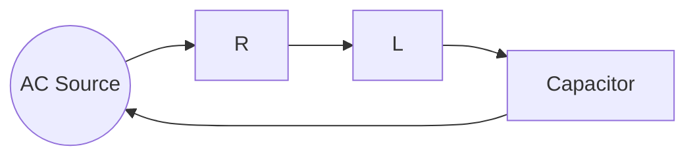
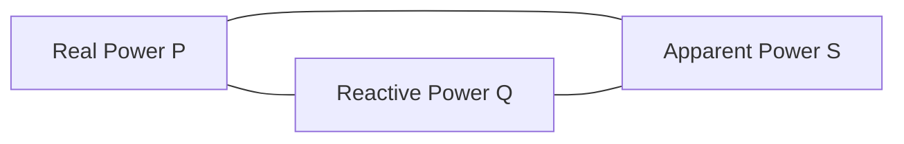

## Alternating Current and Impedance

### Overview

Alternating current (AC) periodically reverses direction, in contrast to the unidirectional flow of direct current (DC). Impedance generalizes the concept of resistance to AC circuits, accounting for the phase-shifting effects of capacitors and inductors.

**Key Points**

- Most power distribution worldwide uses AC due to the ease of voltage transformation via transformers, which only function with changing (not constant) current
- AC quantities are typically sinusoidal, described by amplitude, frequency, and phase
- Impedance $Z$ is a complex quantity combining resistance (real part) and reactance (imaginary part)

### Sinusoidal AC Waveforms

$$v(t) = V_m \sin(\omega t + \phi)$$

Where $V_m$ is peak amplitude, $\omega = 2\pi f$ is angular frequency (rad/s), $f$ is frequency (Hz), and $\phi$ is phase angle.

**Key Points**

- Period $T = 1/f$ is the time for one complete cycle
- Standard mains frequency is $60\,\text{Hz}$ in North America and much of the Americas, and $50\,\text{Hz}$ in Europe, Asia, Africa, and Australia — [Unverified: some countries and specific applications use other standard frequencies, such as $400\,\text{Hz}$ in aircraft systems]
- Phase angle $\phi$ describes the horizontal shift of the waveform relative to a reference (commonly $t=0$)

### RMS Values

Root-mean-square (RMS) value represents the equivalent DC value that would deliver the same average power to a resistive load.

$$V_{rms} = \frac{V_m}{\sqrt{2}} \approx 0.707\,V_m$$

$$I_{rms} = \frac{I_m}{\sqrt{2}}$$

**Key Points**

- RMS values are what voltmeters and ammeters typically display for AC measurements, and what is meant by household voltage ratings (e.g., "120V" or "230V" mains)
- Average power in a resistive AC circuit: $P_{avg} = V_{rms} I_{rms} = I_{rms}^2 R = \dfrac{V_{rms}^2}{R}$
- The factor $\sqrt{2}$ applies specifically to sinusoidal waveforms; other waveform shapes (square, triangular) have different RMS-to-peak ratios

### Resistors, Capacitors, and Inductors in AC

**Key Points**

- **Resistors**: voltage and current remain in phase; opposition to current is simply resistance $R$, independent of frequency
- **Capacitors**: current leads voltage by $90°$; opposition to current is capacitive reactance $X_C = \dfrac{1}{\omega C} = \dfrac{1}{2\pi f C}$, decreasing with increasing frequency
- **Inductors**: voltage leads current by $90°$; opposition to current is inductive reactance $X_L = \omega L = 2\pi f L$, increasing with increasing frequency

### Phase Relationships Diagram (svg_diagram)

<svg xmlns="http://www.w3.org/2000/svg" viewBox="0 0 600 300">
<text x="300" y="25" text-anchor="middle" font-size="16" font-weight="bold" fill="#222">Voltage-Current Phase Relationships (svg_diagram)</text>
<line x1="60" y1="90" x2="560" y2="90" stroke="#ccc" stroke-width="1" />
<path d="M60,90 Q110,40 160,90 T260,90 T360,90 T460,90 T560,90" fill="none" stroke="#c0392b" stroke-width="2" />
<path d="M60,90 Q110,40 160,90 T260,90 T360,90 T460,90 T560,90" fill="none" stroke="#2980b9" stroke-width="2" stroke-dasharray="5,3" />
<text x="65" y="55" font-size="11" fill="#333">Resistor: V, I in phase</text>
<line x1="60" y1="180" x2="560" y2="180" stroke="#ccc" stroke-width="1" />
<path d="M60,180 Q110,130 160,180 T260,180 T360,180 T460,180 T560,180" fill="none" stroke="#c0392b" stroke-width="2" />
<path d="M110,180 Q160,130 210,180 T310,180 T410,180 T510,180" fill="none" stroke="#2980b9" stroke-width="2" stroke-dasharray="5,3" />
<text x="65" y="145" font-size="11" fill="#333">Capacitor: I leads V by 90°</text>
<line x1="60" y1="260" x2="560" y2="260" stroke="#ccc" stroke-width="1" />
<path d="M60,260 Q110,210 160,260 T260,260 T360,260 T460,260 T560,260" fill="none" stroke="#c0392b" stroke-width="2" />
<path d="M10,260 Q60,210 110,260 T210,260 T310,260 T410,260 T510,260" fill="none" stroke="#2980b9" stroke-width="2" stroke-dasharray="5,3" />
<text x="65" y="225" font-size="11" fill="#333">Inductor: V leads I by 90°</text>
</svg>

### Impedance

Impedance combines resistance and reactance into a single complex quantity:

$$Z = R + jX$$

Where $X = X_L - X_C$ is net reactance (inductive minus capacitive), and $j = \sqrt{-1}$.

$$|Z| = \sqrt{R^2 + X^2}, \quad \theta = \tan^{-1}\left(\frac{X}{R}\right)$$

**Key Points**

- $|Z|$ gives the magnitude relationship between voltage and current amplitudes: $V_m = I_m |Z|$
- $\theta$ gives the phase angle between voltage and current
- Positive $X$ (net inductive) means voltage leads current; negative $X$ (net capacitive) means current leads voltage

### Ohm's Law for AC Circuits

$$\tilde{V} = \tilde{I} Z$$

Using phasor notation, where $\tilde{V}$ and $\tilde{I}$ are complex representations of the sinusoidal voltage and current.

**Key Points**

- Phasors represent sinusoidal quantities as complex numbers, encoding both amplitude and phase, simplifying AC analysis to algebra rather than differential equations
- This generalized Ohm's Law reduces to the standard DC form when $X = 0$ (purely resistive circuit)
- Impedances combine in series and parallel using the same formulas as resistance, but with complex arithmetic

### Series RLC Impedance

For a resistor, inductor, and capacitor in series:

$$Z = R + j\left(\omega L - \frac{1}{\omega C}\right)$$

**Example**

A series RLC circuit has $R = 30\,\Omega$, $L = 0.2\,\text{H}$, $C = 40\,\mu\text{F}$, driven at $f = 60\,\text{Hz}$.

$$\omega = 2\pi f = 2\pi(60) \approx 376.99\,\text{rad/s}$$

$$X_L = \omega L = 376.99 \times 0.2 \approx 75.4\,\Omega$$

$$X_C = \frac{1}{\omega C} = \frac{1}{376.99 \times 40\times10^{-6}} \approx 66.3\,\Omega$$

$$X = X_L - X_C \approx 75.4 - 66.3 = 9.1\,\Omega$$

$$|Z| = \sqrt{30^2 + 9.1^2} = \sqrt{900 + 82.8} \approx \sqrt{982.8} \approx 31.3\,\Omega$$

$$\theta = \tan^{-1}\left(\frac{9.1}{30}\right) \approx 16.9°$$

Since $X$ is positive, the circuit is net inductive, and voltage leads current by approximately $16.9°$.

### Resonance in RLC Circuits

Resonance occurs when $X_L = X_C$, causing net reactance to vanish and impedance to reach its minimum value (purely resistive) in a series circuit.

$$\omega_0 = \frac{1}{\sqrt{LC}}, \quad f_0 = \frac{1}{2\pi\sqrt{LC}}$$

**Key Points**

- At resonance, current amplitude reaches a maximum for a given voltage in a series RLC circuit, since $|Z| = R$ is minimized
- Below resonance, the circuit behaves capacitively (current leads voltage); above resonance, it behaves inductively (voltage leads current)
- Resonant circuits are used in radio tuning, filters, and oscillators — [Inference: the sharpness of resonance, quantified by the quality factor $Q$, depends on the specific $R$, $L$, and $C$ values relative to each other]

### Power in AC Circuits

**Key Points**

- **Real power** $P = V_{rms}I_{rms}\cos\theta$ (watts, W) — the actual power dissipated as work or heat
- **Reactive power** $Q = V_{rms}I_{rms}\sin\theta$ (volt-amperes reactive, VAR) — power oscillating between source and reactive components without net dissipation
- **Apparent power** $S = V_{rms}I_{rms}$ (volt-amperes, VA) — the product of RMS voltage and current magnitudes, related by $S = \sqrt{P^2+Q^2}$
- **Power factor** $\cos\theta = P/S$ — indicates how effectively current is converted into useful work; a power factor of 1 (purely resistive) is ideal, while low power factors indicate significant reactive loading

### Power Triangle Diagram

The three quantities form a right triangle, with $S$ as the hypotenuse, $P$ as the adjacent side, and $Q$ as the opposite side relative to angle $\theta$.

### Worked Example: Power Factor Calculation

**Example**

An AC load draws $V_{rms} = 230\,\text{V}$ and $I_{rms} = 10\,\text{A}$, with a phase angle of $\theta = 25°$ between voltage and current.

$$S = V_{rms}I_{rms} = 230 \times 10 = 2300\,\text{VA}$$

$$P = S\cos\theta = 2300 \times \cos(25°) \approx 2300 \times 0.9063 \approx 2084.5\,\text{W}$$

$$Q = S\sin\theta = 2300 \times \sin(25°) \approx 2300 \times 0.4226 \approx 972\,\text{VAR}$$

Power factor: $\cos\theta \approx 0.906$, indicating a reasonably efficient but not purely resistive load.

### Parallel RLC Circuits

For components in parallel, it is often more convenient to work with admittance $Y = 1/Z$:

$$Y = G + jB$$

Where $G$ is conductance and $B$ is susceptance.

**Key Points**

- Total admittance of parallel components adds directly: $Y_{total} = Y_1 + Y_2 + \cdots$, mirroring how parallel conductances add in DC circuits
- At resonance in a parallel RLC circuit, impedance reaches a maximum (current from the source is minimized) — the opposite behavior compared to series resonance
- Converting between impedance and admittance requires complex reciprocal calculation: $Y = 1/Z = \dfrac{R - jX}{R^2+X^2}$

### Applications

**Key Points**

- **Power transmission**: AC enables efficient long-distance transmission via step-up/step-down transformers, minimizing resistive losses
- **Filters**: reactance's frequency dependence enables designing frequency-selective circuits (low-pass, high-pass, band-pass, band-stop)
- **Power factor correction**: capacitor banks are added to inductive industrial loads (motors, transformers) to offset lagging power factor, reducing apparent power and associated transmission losses
- **Impedance matching**: critical in RF and audio systems to maximize power transfer between source and load and minimize signal reflection

### Common Pitfalls

**Key Points**

- Confusing peak, RMS, and average values of AC quantities — average value of a full sine wave over a complete cycle is zero, distinct from RMS
- Adding impedance magnitudes directly instead of using complex (phasor) addition, which is only valid for purely resistive elements
- Forgetting that reactance is frequency-dependent, so a circuit's behavior (and resonance condition) changes with the driving frequency

**Next Steps**

- Electrical Power and Energy
- RLC Circuit Resonance and Quality Factor
- Transformers and Power Transmission
- Filters and Frequency Response
- Phasor Diagrams and Complex Impedance
- Three-Phase AC Systems