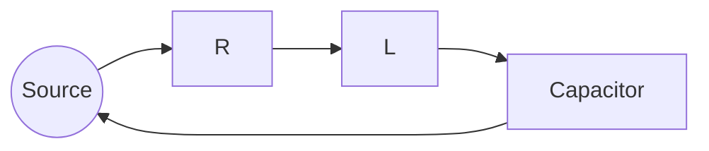
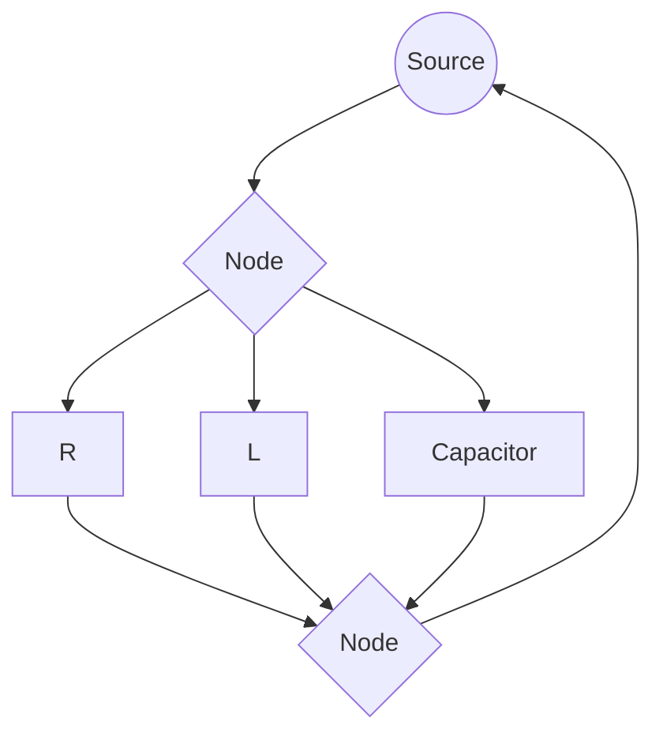

## RLC Circuits and Resonance

### Overview

RLC circuits contain resistors, inductors, and capacitors together, exhibiting rich dynamic behavior including oscillation, damping, and resonance. They serve as the foundation for filters, oscillators, and tuning circuits.

**Key Points**

- RLC circuits can be analyzed in two contexts: **transient response** (natural behavior following a disturbance, e.g., a switch closing) and **steady-state AC response** (behavior under continuous sinusoidal excitation)
- The interaction between inductive and capacitive reactance produces frequency-dependent behavior not present in simpler RC or RL circuits
- Resonance is the condition where the circuit's natural oscillatory tendency aligns with (or is driven at) a specific characteristic frequency

### Series RLC Circuit — Governing Equation

Applying KVL to a series RLC circuit:

$$V_s = IR + L\frac{dI}{dt} + \frac{1}{C}\int I\, dt$$

Differentiating and expressing in terms of charge $Q$ (since $I = dQ/dt$):

$$L\frac{d^2Q}{dt^2} + R\frac{dQ}{dt} + \frac{Q}{C} = V_s(t)$$

**Key Points**

- This is a second-order linear differential equation, analogous in form to a damped mechanical oscillator (mass-spring-damper system)
- $L$ plays the role of mass (inertia), $R$ plays the role of damping, and $1/C$ plays the role of spring stiffness
- The natural (undriven) response depends on the roots of the characteristic equation, which determine whether the circuit is overdamped, critically damped, or underdamped

### Natural (Transient) Response Regimes

The characteristic equation is:

$$L s^2 + Rs + \frac{1}{C} = 0$$

With roots:

$$s = \frac{-R \pm \sqrt{R^2 - 4L/C}}{2L}$$

**Key Points**

- **Overdamped** ($R^2 > 4L/C$): two distinct real roots; the response decays without oscillation, returning to equilibrium relatively slowly
- **Critically damped** ($R^2 = 4L/C$): repeated real root; the response returns to equilibrium in the fastest possible time without oscillating
- **Underdamped** ($R^2 < 4L/C$): complex conjugate roots; the response oscillates with exponentially decaying amplitude

### Underdamped Response

For the underdamped case, the solution takes the form:

$$Q(t) = e^{-\alpha t}\left[A\cos(\omega_d t) + B\sin(\omega_d t)\right]$$

Where the damping coefficient and damped natural frequency are:

$$\alpha = \frac{R}{2L}, \quad \omega_d = \sqrt{\omega_0^2 - \alpha^2}, \quad \omega_0 = \frac{1}{\sqrt{LC}}$$

**Key Points**

- $\omega_0$ is the undamped natural (resonant) angular frequency — the frequency at which the circuit would oscillate with zero resistance
- $\omega_d$ is the actual damped oscillation frequency, always slightly lower than $\omega_0$ when damping is present
- As $R \to 0$, damping vanishes and the circuit approaches ideal, undamped oscillation at $\omega_0$ indefinitely — [Inference: a real circuit always has some finite resistance, so purely undamped oscillation is an idealization]

### Damping Regimes Diagram (svg_diagram)

<svg xmlns="http://www.w3.org/2000/svg" viewBox="0 0 600 320">
<text x="300" y="25" text-anchor="middle" font-size="16" font-weight="bold" fill="#222">RLC Transient Damping Regimes (svg_diagram)</text>
<line x1="70" y1="270" x2="580" y2="270" stroke="#333" stroke-width="2" />
<line x1="70" y1="270" x2="70" y2="50" stroke="#333" stroke-width="2" />
<text x="325" y="300" text-anchor="middle" font-size="13" fill="#333">Time (t)</text>
<path d="M70,80 Q150,90 220,140 Q290,180 350,215 Q420,240 580,255" fill="none" stroke="#8e44ad" stroke-width="3" />
<text x="400" y="245" font-size="11" fill="#8e44ad">Overdamped</text>
<path d="M70,80 Q140,110 200,180 Q250,225 340,255" fill="none" stroke="#27ae60" stroke-width="3" />
<text x="230" y="215" font-size="11" fill="#27ae60">Critically Damped</text>
<path d="M70,80 Q110,180 150,240 Q190,270 220,235 Q250,200 280,225 Q310,250 335,235 Q355,222 370,232" fill="none" stroke="#c0392b" stroke-width="3" />
<text x="380" y="150" font-size="11" fill="#c0392b">Underdamped (oscillating)</text>
</svg>

### Series Resonance

Resonance occurs when the driving frequency matches the natural frequency, causing inductive and capacitive reactances to cancel exactly.

$$\omega_0 = \frac{1}{\sqrt{LC}}, \quad f_0 = \frac{1}{2\pi\sqrt{LC}}$$

**Key Points**

- At resonance, impedance is purely resistive and at its minimum value: $Z = R$
- Current amplitude is maximized at resonance for a given source voltage, since $|Z|$ is minimized
- Voltage and current are in phase at resonance ($\theta = 0$), even though the individual voltages across $L$ and $C$ can be much larger than the source voltage (voltage magnification)

### Quality Factor (Q)

The quality factor characterizes the sharpness of resonance and the degree of energy storage relative to dissipation.

$$Q = \frac{\omega_0 L}{R} = \frac{1}{R}\sqrt{\frac{L}{C}} = \frac{1}{R\omega_0 C}$$

**Key Points**

- Higher $Q$ indicates a sharper resonance peak, lower energy loss per cycle, and greater voltage magnification across $L$ and $C$ at resonance
- $Q$ can also be defined as $2\pi$ times the ratio of energy stored to energy dissipated per cycle: $Q = 2\pi \dfrac{\text{Energy stored}}{\text{Energy dissipated per cycle}}$
- Voltage magnification at resonance: $V_L = V_C = Q \times V_s$ — [Inference: this magnification factor assumes the standard series RLC configuration at exact resonance and can be very large for high-Q circuits, requiring appropriate component voltage ratings]

### Bandwidth and Resonance Sharpness

$$\text{BW} = \frac{f_0}{Q} = f_2 - f_1$$

Where $f_1$ and $f_2$ are the half-power (−3 dB) frequencies, at which power delivered to $R$ falls to half its resonant-peak value.

**Key Points**

- A high-$Q$ circuit has a narrow bandwidth, providing sharp frequency selectivity — useful for radio tuning where distinguishing closely spaced stations matters
- A low-$Q$ circuit has a wide bandwidth, useful for broadband applications where a range of frequencies must be passed
- The half-power frequencies correspond to points where current amplitude falls to $1/\sqrt{2} \approx 70.7\%$ of its resonant peak value

### Resonance Curve Diagram (svg_diagram)

<svg xmlns="http://www.w3.org/2000/svg" viewBox="0 0 600 320">
<text x="300" y="25" text-anchor="middle" font-size="16" font-weight="bold" fill="#222">Series RLC Resonance Curve (svg_diagram)</text>
<line x1="70" y1="270" x2="580" y2="270" stroke="#333" stroke-width="2" />
<line x1="70" y1="270" x2="70" y2="40" stroke="#333" stroke-width="2" />
<text x="325" y="300" text-anchor="middle" font-size="13" fill="#333">Frequency (f)</text>
<text x="30" y="155" text-anchor="middle" font-size="13" fill="#333" transform="rotate(-90 30 155)">Current I</text>
<path d="M80,260 Q200,250 280,90 Q325,55 370,90 Q450,250 570,260" fill="none" stroke="#c0392b" stroke-width="3" />
<text x="380" y="200" font-size="12" fill="#c0392b">High Q (narrow)</text>
<path d="M80,260 Q200,240 280,150 Q325,120 370,150 Q450,240 570,260" fill="none" stroke="#2980b9" stroke-width="3" stroke-dasharray="6,3" />
<text x="420" y="235" font-size="12" fill="#2980b9">Low Q (wide)</text>
<line x1="325" y1="270" x2="325" y2="55" stroke="#999" stroke-dasharray="3,3" />
<text x="330" y="290" font-size="11" fill="#333">f0</text>
</svg>

### Worked Example: Resonance Calculation

**Example**

A series RLC circuit has $R = 15\,\Omega$, $L = 0.1\,\text{H}$, $C = 10\,\mu\text{F}$.

Resonant frequency:

$$\omega_0 = \frac{1}{\sqrt{LC}} = \frac{1}{\sqrt{(0.1)(10\times10^{-6})}} = \frac{1}{\sqrt{10^{-6}}} = \frac{1}{10^{-3}} = 1000\,\text{rad/s}$$

$$f_0 = \frac{\omega_0}{2\pi} \approx 159.15\,\text{Hz}$$

Quality factor:

$$Q = \frac{\omega_0 L}{R} = \frac{1000 \times 0.1}{15} \approx 6.67$$

Bandwidth:

$$\text{BW} = \frac{f_0}{Q} = \frac{159.15}{6.67} \approx 23.86\,\text{Hz}$$

If the source voltage is $V_s = 10\,\text{V}$, voltage magnification at resonance:

$$V_L = V_C = Q \times V_s \approx 6.67 \times 10 = 66.7\,\text{V}$$

This substantially exceeds the source voltage, illustrating the potentially significant voltage stress on individual components at resonance in high-Q circuits.

### Parallel RLC Circuits and Resonance

**Key Points**

- In an ideal parallel RLC circuit driven by a current source, resonance occurs at the same $\omega_0 = 1/\sqrt{LC}$, but impedance is **maximized** (rather than minimized) at resonance
- At parallel resonance, current drawn from the source is minimized, while circulating current between $L$ and $C$ can be large — analogous to voltage magnification in the series case
- Quality factor for parallel RLC: $Q = R\sqrt{C/L} = \dfrac{R}{\omega_0 L}$ — note this is inverted relative to the series case, since increasing $R$ increases $Q$ in parallel configurations, unlike in series

### Comparison: Series vs Parallel Resonance

| Property | Series RLC | Parallel RLC |
| --- | --- | --- |
| Impedance at resonance | Minimum ($Z=R$) | Maximum |
| Current at resonance | Maximum | Minimum (from source) |
| Effect of increasing $R$ on $Q$ | Decreases $Q$ | Increases $Q$ |
| Magnified quantity at resonance | Voltage across $L$, $C$ | Circulating current between $L$, $C$ |

### Applications of RLC Resonance

**Key Points**

- **Radio and television tuning**: a variable capacitor adjusts resonant frequency to select a desired broadcast frequency while rejecting others
- **Band-pass and band-stop filters**: RLC networks selectively pass or block frequency ranges centered on resonance
- **Induction heating and wireless power transfer**: resonant coupling between circuits improves energy transfer efficiency at matched resonant frequencies — [Inference: practical implementations often involve additional coupling considerations beyond simple single-loop RLC resonance theory]
- **Oscillator circuits**: RLC tank circuits (particularly parallel configurations) form the frequency-determining element in many oscillator designs

### Energy Exchange at Resonance

**Key Points**

- At resonance, energy oscillates between the magnetic field of the inductor and the electric field of the capacitor, with the resistor continuously dissipating energy supplied by the source to sustain the oscillation
- In an idealized lossless ($R=0$) LC circuit, energy would oscillate indefinitely between $L$ and $C$ without external input, at frequency $\omega_0$
- The rate of energy dissipation relative to energy stored directly determines $Q$, linking the transient decay behavior and the steady-state resonance sharpness

### Common Pitfalls

**Key Points**

- Confusing the resonant frequency formula, which is identical for series and parallel configurations, with the very different impedance behavior each exhibits at that frequency
- Assuming voltage or current magnification only occurs in high-$Q$ circuits — while magnification is more dramatic at high $Q$, some degree of reactive voltage/current exceeding the source value can occur even at moderate $Q$
- Neglecting that real inductors have internal resistance, which must be included in $R$ for accurate resonance and $Q$ calculations, rather than treating $L$ as ideal

**Related Topics**

- Alternating Current and Impedance
- RC Circuits and Transients
- RL Circuits and Inductive Transients
- Filters and Frequency Response
- Damped Harmonic Oscillators (Mechanical Analogy)
- Transformers and Mutual Inductance