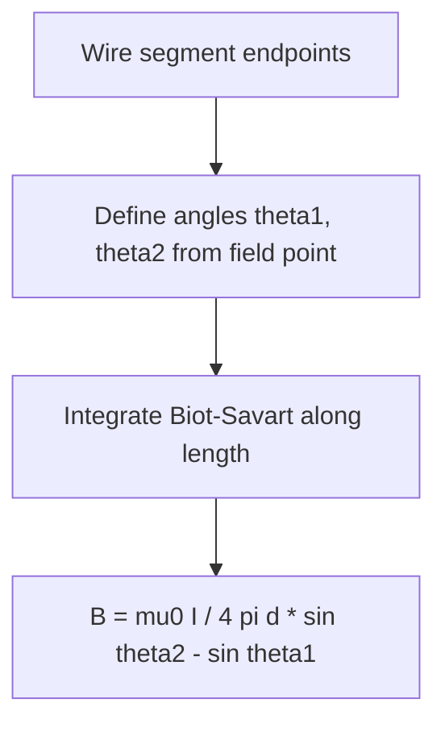

## The Biot-Savart Law

### Statement of the Law

The Biot-Savart Law gives the magnetic field produced at a point in space by a small segment of current-carrying wire.

$$d\vec{B} = \frac{\mu_0}{4\pi} \frac{I\, d\vec{l} \times \hat{r}}{r^2}$$

Where $\mu_0$ is the permeability of free space, $I$ is current, $d\vec{l}$ is a differential length element of the wire (in the direction of current flow), $\hat{r}$ is the unit vector from the current element to the field point, and $r$ is the distance between them.

**Key Points**

- $\mu_0 = 4\pi \times 10^{-7}\,\text{T}\cdot\text{m/A}$ is an exact defined constant in the older SI convention, though its value is now derived from the defined fine-structure constant and elementary charge in the current SI system — [Unverified: the precise numerical status of $\mu_0$ depends on which version of the SI unit definitions is being referenced]
- The total magnetic field from an extended current distribution is found by integrating over the entire current path: $\vec{B} = \dfrac{\mu_0}{4\pi}\displaystyle\int \dfrac{I\,d\vec{l}\times\hat{r}}{r^2}$
- The law is the magnetic analog of Coulomb's Law for electric fields, though it involves a cross product rather than a simple radial direction, reflecting the vector (rather than scalar) nature of the source (current direction matters)

### Direction of the Magnetic Field

**Key Points**

- The direction of $d\vec{B}$ is given by the right-hand rule applied to $d\vec{l} \times \hat{r}$: point fingers along current direction, curl toward the field point direction, thumb gives field direction
- For a straight wire, this results in magnetic field lines forming concentric circles around the wire, perpendicular to the wire's length
- The field is always perpendicular to both the current element and the line connecting the element to the field point

### Biot-Savart Geometry Diagram (svg_diagram)

<svg xmlns="http://www.w3.org/2000/svg" viewBox="0 0 500 350">
<text x="250" y="25" text-anchor="middle" font-size="16" font-weight="bold" fill="#222">Biot-Savart Law Geometry (svg_diagram)</text>
<line x1="80" y1="180" x2="420" y2="180" stroke="#333" stroke-width="3" />
<polygon points="420,180 405,172 405,188" fill="#333" />
<text x="250" y="200" text-anchor="middle" font-size="12" fill="#333">Current I, element dl</text>
<circle cx="250" cy="180" r="4" fill="#c0392b" />
<line x1="250" y1="180" x2="350" y2="90" stroke="#2980b9" stroke-width="2" stroke-dasharray="4,2" />
<text x="360" y="85" font-size="13" fill="#2980b9">r̂</text>
<circle cx="350" cy="90" r="4" fill="#27ae60" />
<text x="360" y="105" font-size="12" fill="#27ae60">Field point P</text>
<circle cx="350" cy="90" r="15" fill="none" stroke="#8e44ad" stroke-width="2" />
<text x="380" y="60" font-size="12" fill="#8e44ad">dB (into page)</text>
</svg>

### Magnetic Field of a Straight Wire (Derivation Result)

Integrating the Biot-Savart Law over an infinitely long straight wire yields:

$$B = \frac{\mu_0 I}{2\pi d}$$

Where $d$ is the perpendicular distance from the wire.

**Key Points**

- The field magnitude decreases as $1/d$, in contrast to the $1/r^2$ dependence of a point source, because the field is being integrated over an extended (infinite) line of current
- Field lines form concentric circles around the wire, with direction given by the right-hand rule: thumb along current direction, fingers curl in the direction of $\vec{B}$
- For a finite wire segment, the result generalizes to $B = \dfrac{\mu_0 I}{4\pi d}(\sin\theta_2 - \sin\theta_1)$, where $\theta_1$ and $\theta_2$ are angles subtended by the ends of the wire relative to the field point

### Worked Example: Field Near a Long Straight Wire

**Example**

A long straight wire carries $I = 10\,\text{A}$. Find the magnetic field at a perpendicular distance of $d = 0.05\,\text{m}$.

$$B = \frac{\mu_0 I}{2\pi d} = \frac{(4\pi\times10^{-7})(10)}{2\pi(0.05)}$$

$$B = \frac{4\times10^{-7}\times10}{2\times0.05} = \frac{4\times10^{-6}}{0.1} = 4\times10^{-5}\,\text{T}$$

This is $40\,\mu\text{T}$, comparable in order of magnitude to Earth's natural magnetic field (approximately $25$–$65\,\mu\text{T}$ depending on location) — [Unverified: exact local values of Earth's field vary by geographic location and depend on current geomagnetic conditions].

### Magnetic Field at the Center of a Circular Loop

For a circular loop of radius $R$ carrying current $I$, integrating the Biot-Savart Law over the full loop gives the field at the center:

$$B_{center} = \frac{\mu_0 I}{2R}$$

**Key Points**

- Every current element on the loop contributes a field in the same direction at the center (perpendicular to the loop plane), which is why the vector integral simplifies to a straightforward magnitude sum
- Direction follows the right-hand rule: curl fingers in the direction of current flow around the loop, thumb points in the direction of $\vec{B}$ at the center
- For $N$ turns of wire (a coil) rather than a single loop, the field multiplies proportionally: $B_{center} = \dfrac{\mu_0 N I}{2R}$

### Magnetic Field on the Axis of a Circular Loop

At a point on the axis, a distance $x$ from the center of the loop:

$$B_{axis} = \frac{\mu_0 I R^2}{2(R^2+x^2)^{3/2}}$$

**Key Points**

- This reduces to $B_{center} = \dfrac{\mu_0 I}{2R}$ when $x = 0$, consistent with the center-field formula
- For $x \gg R$, the loop behaves approximately like a magnetic dipole, with field falling off as $1/x^3$: $B_{axis} \approx \dfrac{\mu_0 I R^2}{2x^3}$
- This axial field formula is foundational to analyzing Helmholtz coil configurations, which use paired loops to create a highly uniform field region between them

### Worked Example: On-Axis Field of a Loop

**Example**

A circular loop of radius $R = 0.1\,\text{m}$ carries $I = 5\,\text{A}$. Find the magnetic field at a point on the axis $x = 0.1\,\text{m}$ from the center.

$$B = \frac{\mu_0 I R^2}{2(R^2+x^2)^{3/2}} = \frac{(4\pi\times10^{-7})(5)(0.1)^2}{2[(0.1)^2+(0.1)^2]^{3/2}}$$

$$= \frac{(4\pi\times10^{-7})(5)(0.01)}{2(0.02)^{3/2}}$$

$$(0.02)^{3/2} \approx 0.002828$$

$$B \approx \frac{6.283\times10^{-8}}{0.005657} \approx 1.11\times10^{-5}\,\text{T} \approx 11.1\,\mu\text{T}$$

### Field Due to a Finite Straight Wire Segment

**Key Points**

- This finite-wire formula is essential for analyzing practical circuits (e.g., rectangular loops), where each side is a finite segment rather than an infinite wire
- As the wire length approaches infinity in both directions ($\theta_1 \to -90°$, $\theta_2 \to 90°$), the formula correctly reduces to the infinite-wire result $B = \mu_0 I/(2\pi d)$
- Superposition applies: the total field from a composite current path (e.g., a rectangular loop) is the vector sum of contributions from each straight segment

### Comparison with Ampère's Law

| Aspect | Biot-Savart Law | Ampère's Law |
| --- | --- | --- |
| Applicability | Any current distribution, always valid | Most useful for highly symmetric current distributions |
| Method | Direct integration over current elements | Line integral of $\vec{B}$ around a chosen closed path |
| Computational complexity | Can be complex for arbitrary geometries | Simple for symmetric cases (straight wire, solenoid, toroid) |
| Relationship | More fundamental, general form | Derivable from Biot-Savart Law combined with vector calculus identities for steady currents |

**Key Points**

- Ampère's Law is generally easier to apply when high symmetry exists (cylindrical, planar, or toroidal), while Biot-Savart is more broadly applicable but often requires more involved integration
- Both laws give identical results for steady (time-independent) currents; they are mathematically consistent formulations of the same underlying magnetostatic physics
- For time-varying currents, Ampère's Law requires the addition of the displacement current term (Ampère-Maxwell Law) to remain valid, whereas the Biot-Savart Law in its basic form is strictly a magnetostatic result — [Inference: a generalized time-dependent version of Biot-Savart exists in the context of retarded potentials, but this extends beyond the basic magnetostatic formulation]

### Applications of the Biot-Savart Law

**Key Points**

- **Solenoid and coil design**: calculating fields from finite coils, Helmholtz coil pairs, and other custom winding geometries where symmetry is insufficient for simple Ampère's Law application
- **Magnetic field mapping**: computational modeling of magnetic fields from arbitrary current-carrying conductors in engineering design (motors, transformers, MRI magnets)
- **Historical significance**: originally formulated by Jean-Baptiste Biot and Félix Savart in 1820, based on experiments studying the deflection of compass needles near current-carrying wires, shortly after Ørsted's discovery of electromagnetism
- **Numerical/computational electromagnetics**: forms the basis for numerical field-solving algorithms when analytical symmetry is unavailable, discretizing complex conductors into small current elements and summing contributions

### Common Pitfalls

**Key Points**

- Forgetting the cross product nature of the law — the direction of $d\vec{B}$ depends on both the current direction and the position vector to the field point, not simply the current direction alone
- Applying the infinite-wire formula ($B = \mu_0 I/2\pi d$) to finite-length wires without accounting for end effects, leading to overestimated field magnitudes near the ends of short conductors
- Confusing $\mu_0$ with $\epsilon_0$ (permittivity of free space) or misremembering the exponent/order of magnitude when calculating fields numerically

**Next Steps**

- Ampère's Law and Applications
- Magnetic Fields of Solenoids and Toroids
- Magnetic Dipoles and Dipole Moments
- Electromagnetic Induction and Faraday's Law
- Maxwell's Equations
- Magnetic Materials and Magnetization