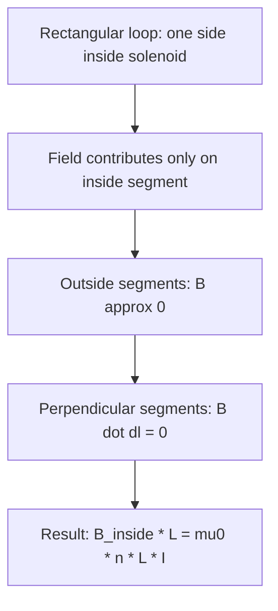

## Ampère's Law

### Statement of the Law

Ampère's Law relates the line integral of the magnetic field around a closed loop to the total current enclosed by that loop.

$$\oint \vec{B} \cdot d\vec{l} = \mu_0 I_{enc}$$

Where the integral is taken around any closed path (an "Amperian loop"), and $I_{enc}$ is the net current passing through the surface bounded by that loop.

**Key Points**

- The direction of positive current is determined by the right-hand rule relative to the direction of traversal around the loop: curl the fingers of the right hand in the direction of the path traversal, and the thumb indicates the positive current direction
- Currents flowing in the opposite sense are counted as negative, and $I_{enc}$ is the algebraic (signed) sum of all currents piercing the surface
- The Amperian loop is a mathematical construct chosen for convenience; it does not need to correspond to any physical boundary or conductor

### Choosing an Amperian Loop

**Key Points**

- Ampère's Law holds for any closed path, but it is only practically useful for calculating $\vec{B}$ when a loop can be chosen such that $\vec{B}$ is either constant in magnitude and parallel to $d\vec{l}$, or perpendicular to $d\vec{l}$ (contributing zero), along each segment
- This requires the current distribution to possess sufficient symmetry: cylindrical (straight wire), planar (infinite sheet), or toroidal/solenoidal symmetry are the classic cases where Ampère's Law simplifies significantly
- Without adequate symmetry, $\vec{B}$ cannot be factored out of the integral, and Ampère's Law—while still true—becomes impractical for direct calculation of the field

### Application: Magnetic Field of a Long Straight Wire

For an infinite straight wire carrying current $I$, choosing a circular Amperian loop of radius $d$ centered on the wire (in the plane perpendicular to the wire):

$$\oint \vec{B}\cdot d\vec{l} = B(2\pi d) = \mu_0 I$$

$$B = \frac{\mu_0 I}{2\pi d}$$

**Key Points**

- By symmetry, $\vec{B}$ has constant magnitude everywhere on the circular loop and is everywhere tangent to the loop (parallel to $d\vec{l}$), allowing $B$ to be pulled outside the integral
- This result matches the field obtained via direct Biot-Savart integration, confirming the consistency of the two approaches for this geometry
- The field direction circles the wire according to the right-hand rule: thumb along current direction, fingers curl in the direction of $\vec{B}$

### Amperian Loop for a Straight Wire (svg_diagram)

<svg xmlns="http://www.w3.org/2000/svg" viewBox="0 0 400 400">
<text x="200" y="25" text-anchor="middle" font-size="16" font-weight="bold" fill="#222">Amperian Loop: Straight Wire (svg_diagram)</text>
<line x1="200" y1="360" x2="200" y2="60" stroke="#333" stroke-width="4" />
<polygon points="200,60 192,80 208,80" fill="#333" />
<text x="215" y="75" font-size="13" fill="#333">I</text>
<circle cx="200" cy="200" r="100" fill="none" stroke="#2980b9" stroke-width="2" stroke-dasharray="6,3" />
<text x="270" y="130" font-size="12" fill="#2980b9">Amperian loop</text>
<polygon points="300,200 285,192 285,208" fill="#c0392b" transform="rotate(90 300 200)" />
<text x="310" y="215" font-size="12" fill="#c0392b">B direction</text>
</svg>

### Application: Magnetic Field Inside a Solenoid

For an ideal (long) solenoid with $n$ turns per unit length carrying current $I$, using a rectangular Amperian loop straddling the solenoid wall:

$$B_{inside} = \mu_0 n I$$

**Key Points**

- Only the portion of the rectangular loop inside the solenoid contributes to the line integral, since the field outside an ideal long solenoid is approximately zero, and the perpendicular loop segments contribute nothing (as $\vec{B} \perp d\vec{l}$ there)
- The field inside is uniform and parallel to the solenoid axis, independent of position within the solenoid's cross-section, for an idealized infinitely long solenoid
- Real (finite) solenoids show field weakening and non-uniformity near the ends — [Inference: the approximation of a perfectly uniform interior field improves as the solenoid's length-to-diameter ratio increases]

### Solenoid Amperian Loop Diagram

### Worked Example: Solenoid Field Calculation

**Example**

A solenoid has $2000$ turns wound uniformly over a length of $0.4\,\text{m}$, carrying a current of $3\,\text{A}$. Find the magnetic field inside.

$$n = \frac{N}{L} = \frac{2000}{0.4} = 5000\,\text{turns/m}$$

$$B = \mu_0 n I = (4\pi\times10^{-7})(5000)(3)$$

$$B \approx (1.2566\times10^{-6})(5000)(3) \approx 0.01885\,\text{T} \approx 18.85\,\text{mT}$$

### Application: Magnetic Field of a Toroid

For a toroid (a solenoid bent into a donut shape) with $N$ total turns carrying current $I$, using a circular Amperian loop of radius $r$ concentric with the toroid's axis:

$$B = \frac{\mu_0 N I}{2\pi r}$$

**Key Points**

- The field exists only inside the toroid's core and varies with radial position $r$ within the core, unlike the uniform field of an ideal straight solenoid
- Outside the toroid (both inside the central hole and outside the outer radius), the enclosed current is either zero or the loop encloses equal and opposite contributions, giving $B = 0$
- Toroidal geometry confines the magnetic field entirely within the core, making it useful in applications such as tokamak fusion reactors and toroidal transformers where field containment is important

### Displacement Current and the Ampère-Maxwell Law

Ampère's Law in its original form is valid only for steady (time-independent) currents. Maxwell identified a missing term needed for consistency with charge conservation in time-varying situations:

$$\oint \vec{B}\cdot d\vec{l} = \mu_0 I_{enc} + \mu_0\epsilon_0 \frac{d\Phi_E}{dt}$$

Where $\Phi_E$ is the electric flux through the surface bounded by the loop, and $\mu_0\epsilon_0 \dfrac{d\Phi_E}{dt}$ is the **displacement current** term.

**Key Points**

- The displacement current is not an actual flow of charge, but a changing electric flux that produces a magnetic field in the same way a real current does
- This correction was essential for resolving an inconsistency in the original Ampère's Law when applied to circuits containing capacitors, where current appears to be discontinuous (charge builds up on capacitor plates rather than flowing through the gap)
- The Ampère-Maxwell Law is one of Maxwell's four equations and is essential for predicting the existence and propagation of electromagnetic waves

### Illustrating the Need for Displacement Current: Charging Capacitor

**Key Points**

- Consider an Amperian loop around a wire charging a capacitor: if the bounding surface is chosen as a flat disk intersecting the wire, $I_{enc} = I$; but if instead a curved surface is chosen that passes between the capacitor plates (intersecting no wire), $I_{enc} = 0$ — an apparent contradiction in the original law
- The displacement current term resolves this: between the plates, the changing electric field (as the capacitor charges) produces a displacement current equal to the conduction current in the wire, making both surface choices give consistent results
- This thought experiment, due to Maxwell, was pivotal in establishing the symmetry between changing electric and magnetic fields that underlies electromagnetic wave theory

### Comparison: Ampère's Law vs Gauss's Law

| Aspect | Ampère's Law | Gauss's Law |
| --- | --- | --- |
| Relates | Line integral of $\vec{B}$ to enclosed current | Surface integral (flux) of $\vec{E}$ to enclosed charge |
| Symmetry needed | Cylindrical, planar, toroidal/solenoidal | Spherical, cylindrical, planar |
| Source term | Current $I_{enc}$ | Charge $Q_{enc}$ |
| Extended form | Includes displacement current (Ampère-Maxwell) | Gauss's Law for magnetism has no magnetic monopole term (always zero) |

**Key Points**

- Both laws are integral forms of Maxwell's equations and rely on choosing a surface or loop with matching symmetry to the source distribution for practical calculation
- Both are always true regardless of symmetry, but are only computationally useful for calculating fields directly in highly symmetric cases
- Together with Faraday's Law and Gauss's Law for magnetism, these four equations comprise the complete set of Maxwell's equations governing classical electromagnetism

### Applications of Ampère's Law

**Key Points**

- **Solenoid and electromagnet design**: predicting and designing magnetic field strength inside coils for applications ranging from relays to MRI magnets
- **Toroidal inductors and transformers**: calculating field confinement and inductance in toroidal core designs used in power electronics
- **Coaxial cable field analysis**: Ampère's Law readily gives the field in the region between conductors and outside a coaxial cable, relevant to cable shielding and electromagnetic compatibility
- **Theoretical foundation for electromagnetic wave propagation**: the Ampère-Maxwell Law, combined with Faraday's Law, leads directly to the wave equation for electromagnetic fields, predicting the existence of light as an electromagnetic phenomenon

### Common Pitfalls

**Key Points**

- Attempting to apply Ampère's Law to calculate $\vec{B}$ for a geometry lacking sufficient symmetry — the law remains true, but is not solvable for $B$ without additional information or numerical methods
- Forgetting to account for the sign of current contributions when multiple currents pass through the Amperian loop in different directions
- Neglecting the displacement current term when analyzing circuits with time-varying fields, particularly in situations involving capacitors or changing electric flux, leading to inconsistent or incorrect results

**Next Steps**

- The Biot-Savart Law
- Solenoids, Toroids, and Inductors
- Electromagnetic Induction and Faraday's Law
- Maxwell's Equations
- Electromagnetic Wave Propagation
- Magnetic Materials and Magnetization