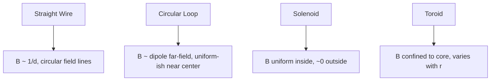

## Magnetic Fields of Current-Carrying Conductors

### Overview

This topic consolidates the magnetic field results for the standard conductor geometries encountered in circuit and device analysis, drawing on the Biot-Savart Law and Ampère's Law as the underlying tools.

**Key Points**

- Every result below can be derived either by direct Biot-Savart integration or, where symmetry permits, more efficiently via Ampère's Law
- Field direction in every case follows a right-hand rule convention: the specific form of the rule depends on the conductor's geometry (straight wire vs. loop vs. coil)
- Superposition applies throughout: the field from a composite conductor arrangement (e.g., multiple wires, or a wire plus a loop) is the vector sum of the individual contributions

### Summary Table of Standard Results

| Conductor Geometry | Field Formula | Location |
| --- | --- | --- |
| Infinite straight wire | $B = \dfrac{\mu_0 I}{2\pi d}$ | Perpendicular distance $d$ from wire |
| Center of circular loop (radius $R$) | $B = \dfrac{\mu_0 I}{2R}$ | At the loop's center |
| On-axis of circular loop | $B = \dfrac{\mu_0 I R^2}{2(R^2+x^2)^{3/2}}$ | Distance $x$ along the axis |
| Ideal long solenoid ($n$ turns/length) | $B = \mu_0 n I$ | Interior, away from ends |
| Toroid ($N$ turns) | $B = \dfrac{\mu_0 N I}{2\pi r}$ | Interior of core, radius $r$ |
| Coil of $N$ loops (center) | $B = \dfrac{\mu_0 N I}{2R}$ | At the coil's center |

### Field of a Straight Wire

$$B = \frac{\mu_0 I}{2\pi d}$$

**Key Points**

- Field lines are concentric circles around the wire; magnitude falls off as $1/d$
- Direction: point right-hand thumb along current direction, fingers curl in the direction of $\vec{B}$
- Valid exactly for an infinite wire; a good approximation near the midpoint of a long finite wire, away from its ends

### Field of a Circular Current Loop

$$B_{center} = \frac{\mu_0 I}{2R}, \qquad B_{axis} = \frac{\mu_0 I R^2}{2(R^2+x^2)^{3/2}}$$

**Key Points**

- At the loop's center, the field is perpendicular to the plane of the loop; direction follows the right-hand rule curling fingers along current flow around the loop
- Far from the loop along its axis ($x \gg R$), the field approximates a magnetic dipole field, falling off as $1/x^3$
- A loop's magnetic dipole moment is defined as $\vec{m} = I A \hat{n}$, where $A$ is the loop's area and $\hat{n}$ is the normal direction given by the right-hand rule — this framework generalizes to any planar current loop, not just circular ones

### Field of a Solenoid

$$B_{inside} = \mu_0 n I, \qquad B_{outside} \approx 0$$

**Key Points**

- The solenoid produces a highly uniform interior field, closely analogous to the field between capacitor plates in electrostatics (uniform, contained field created by a specific geometric arrangement)
- Field lines inside run parallel to the solenoid's axis; outside, they return via widely spread paths resembling a bar magnet's external field
- Practical solenoids show reduced and non-uniform field near their ends, deviating from the ideal infinite-solenoid approximation used in the formula

### Field of a Toroid

$$B = \frac{\mu_0 N I}{2\pi r}$$

**Key Points**

- Unlike the solenoid, the toroid's field is confined entirely within its core, with essentially zero field outside (both in the central hole and beyond the outer radius)
- Field magnitude varies with radial position inside the core, being slightly stronger on the inner radius than the outer radius (unlike the solenoid's uniform interior field)
- This confinement property makes toroidal geometry attractive for minimizing stray field effects in transformers and certain magnetic confinement applications

### Conductor Geometries Comparison Diagram

### Worked Example: Comparing Field Strengths

**Example**

Compare the magnetic field strength produced by (a) a long straight wire carrying $I=10\,\text{A}$ at $d=0.02\,\text{m}$, and (b) a solenoid with $n = 2000\,\text{turns/m}$ carrying the same current.

**(a) Straight wire:**

$$B = \frac{\mu_0 I}{2\pi d} = \frac{(4\pi\times10^{-7})(10)}{2\pi(0.02)} = \frac{4\times10^{-6}}{0.02} = 2\times10^{-4}\,\text{T} = 0.2\,\text{mT}$$

**(b) Solenoid:**

$$B = \mu_0 n I = (4\pi\times10^{-7})(2000)(10) \approx 0.02513\,\text{T} \approx 25.1\,\text{mT}$$

The solenoid produces a field roughly 125 times stronger than the wire at this distance, illustrating why coiled geometries are far more effective than single straight conductors for generating strong, controllable magnetic fields.

### Superposition of Multiple Conductors

**Key Points**

- When several current-carrying conductors are present, the net field at any point is the vector sum of the fields due to each conductor individually, computed as if the others were absent
- Careful attention to direction (via the right-hand rule for each conductor separately) is essential, since fields from different conductors may partially cancel or reinforce depending on relative current directions and geometry
- This principle underlies the analysis of practical multi-wire systems: twisted pairs, coaxial cables, and busbar arrangements in power systems

### Worked Example: Field Between Two Parallel Wires

**Example**

Two long parallel wires separated by $0.1\,\text{m}$ carry currents of $I_1 = 5\,\text{A}$ and $I_2 = 5\,\text{A}$ in the same direction. Find the net field at the midpoint between them.

At the midpoint, each wire is $d = 0.05\,\text{m}$ away. Since the currents are parallel (same direction), the fields at the midpoint from each wire point in opposite directions (by the right-hand rule, applied on opposite sides of each wire), and being equal in magnitude, they cancel:

$$B_1 = \frac{\mu_0 I_1}{2\pi(0.05)} = \frac{(4\pi\times10^{-7})(5)}{2\pi(0.05)} = 2\times10^{-5}\,\text{T}$$

$$B_{net} = B_1 - B_2 = 2\times10^{-5} - 2\times10^{-5} = 0\,\text{T}$$

This cancellation at the midpoint is a direct consequence of the symmetric, equal-current, same-direction configuration.

### Force Between Parallel Current-Carrying Wires

As a related consequence, two current-carrying wires exert magnetic forces on each other:

$$\frac{F}{L} = \frac{\mu_0 I_1 I_2}{2\pi d}$$

**Key Points**

- Parallel currents in the **same** direction attract; parallel currents in **opposite** directions repel — a direct consequence of combining the Biot-Savart field of one wire with the Lorentz force on the other
- This force relationship was historically used to define the ampere in the older SI system, prior to the 2019 redefinition of SI base units based on fixed fundamental constants — [Unverified: readers should confirm current official definitions, as unit definitions are subject to periodic international revision]
- This principle underlies busbar spacing requirements in high-current power systems, where large currents can produce substantial mechanical forces between conductors

### Applications Summary

**Key Points**

- **Electromagnets**: solenoid and toroid geometries are the basis for controllable electromagnets used in relays, MRI machines, particle accelerators, and industrial lifting equipment
- **Inductors**: coiled conductors (solenoid-like) store energy in their magnetic field, forming a core passive component in AC circuits and power supplies
- **Transformers**: toroidal and other coil geometries enable efficient magnetic coupling between primary and secondary windings
- **Current sensing**: the known relationship between conductor geometry and field allows non-contact current measurement via nearby field sensors (e.g., current clamps using the straight-wire field formula)

### Common Pitfalls

**Key Points**

- Applying the straight-wire or solenoid formulas outside their valid approximation regimes (e.g., using the infinite-solenoid formula near the solenoid's actual physical ends, where the field is significantly weaker and non-uniform)
- Forgetting that force between parallel wires depends on relative current direction (attraction vs. repulsion), which is a common source of sign errors
- Neglecting vector superposition when multiple conductors are present, instead incorrectly adding field magnitudes directly without accounting for direction

**Related Topics**

- The Biot-Savart Law
- Ampère's Law and Applications
- Magnetic Dipoles and Dipole Moments
- Inductors and Inductance
- Electromagnetic Induction and Faraday's Law
- Transformers and Mutual Inductance