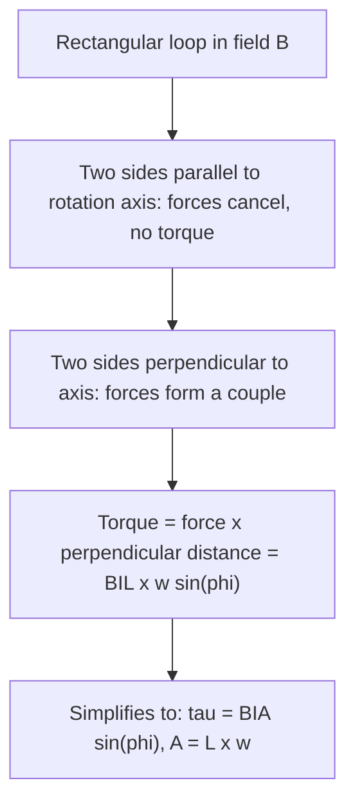

## Force on Current-Carrying Conductors

### Basic Force Law

A current-carrying conductor placed in a magnetic field experiences a force given by:

$$\vec{F} = I\vec{L} \times \vec{B}, \qquad F = BIL\sin\theta$$

Where $I$ is current, $\vec{L}$ is a vector along the wire (in the direction of current flow) with magnitude equal to the length in the field, and $\theta$ is the angle between $\vec{L}$ and $\vec{B}$.

**Key Points**

- This result follows from summing the Lorentz force ($q\vec{v}\times\vec{B}$) over all moving charge carriers in the conductor
- Maximum force occurs when the wire is perpendicular to the field ($\theta=90°$); zero force occurs when parallel ($\theta=0°$)
- Direction follows the right-hand rule: fingers point along current direction, curl toward $\vec{B}$, thumb gives force direction

### Force on an Arbitrarily Shaped Wire

For a wire of arbitrary shape carrying current $I$ through a uniform field, the total force is found by integrating over the wire's length:

$$\vec{F} = I\int d\vec{l} \times \vec{B}$$

**Key Points**

- For a uniform field, this integral simplifies remarkably: the net force depends only on the vector connecting the two endpoints of the wire, not the specific path taken between them
- This means a curved wire and a straight wire connecting the same two endpoints, carrying the same current in the same uniform field, experience identical net force
- For a closed loop of any shape in a uniform field, the net force is always exactly zero, since the "vector connecting the endpoints" collapses to zero for a closed path

### Torque on a Current Loop

While the net force on a closed current loop in a uniform field is zero, the loop generally experiences a net torque:

$$\vec{\tau} = \vec{m} \times \vec{B}, \qquad \tau = mB\sin\phi$$

Where $\vec{m} = IA\hat{n}$ is the magnetic dipole moment of the loop ($A$ is the loop's area, $\hat{n}$ the normal direction by the right-hand rule), and $\phi$ is the angle between $\vec{m}$ and $\vec{B}$.

**Key Points**

- Torque is maximum when the loop's plane is parallel to $\vec{B}$ (i.e., $\vec{m}$ perpendicular to $\vec{B}$, $\phi=90°$), and zero when the loop's plane is perpendicular to $\vec{B}$ ($\phi=0°$)
- This torque tends to rotate the loop toward alignment where $\vec{m}$ is parallel to $\vec{B}$, which is the loop's stable equilibrium orientation (minimum potential energy)
- For a coil of $N$ turns, the torque scales proportionally: $\tau = NIAB\sin\phi$

### Torque on a Rectangular Loop — Derivation Sketch

**Key Points**

- Two sides of the loop (parallel to the rotation axis) experience forces that pass through the axis and produce no torque, or cancel if they don't align with the axis
- The other two sides experience forces forming a couple (equal, opposite, offset forces), which is the source of the net torque
- This derivation directly motivates the general dipole moment formula $\tau = mB\sin\phi$, independent of loop shape when expressed in terms of area $A$

### Worked Example: Torque on a Rectangular Coil

**Example**

A rectangular coil with $N = 50$ turns, dimensions $0.1\,\text{m} \times 0.05\,\text{m}$, carries $I = 2\,\text{A}$ in a field $B = 0.3\,\text{T}$. The coil's plane makes a $30°$ angle with the field (so $\phi = 60°$ between $\vec{m}$ and $\vec{B}$).

$$A = 0.1 \times 0.05 = 0.005\,\text{m}^2$$

$$\tau = NIAB\sin\phi = (50)(2)(0.005)(0.3)\sin(60°)$$

$$\tau = 0.15 \times 0.866 \approx 0.13\,\text{N}\cdot\text{m}$$

### The DC Motor: Applying Torque for Continuous Rotation

**Key Points**

- A simple DC motor uses a current loop (armature) in a magnetic field; as the loop rotates toward alignment with $\vec{B}$, a **commutator** reverses the current direction at the point of alignment, reversing the torque direction and sustaining continuous rotation rather than allowing the loop to settle at equilibrium
- Without the commutator, the loop would oscillate and settle at $\phi = 0$ (aligned with the field) rather than rotating continuously
- Real motors use multiple coils and commutator segments to produce smoother, more continuous torque output rather than the pulsating torque of a single-loop idealization — [Inference: specific motor designs, such as brushed vs. brushless configurations, achieve this smoothing through different practical mechanisms]

### DC Motor Diagram

### Force Between Parallel Conductors (Recap and Extension)

$$\frac{F}{L} = \frac{\mu_0 I_1 I_2}{2\pi d}$$

**Key Points**

- Parallel currents in the same direction attract; antiparallel currents repel
- This force is mutual and equal in magnitude on both wires, consistent with Newton's third law
- In high-current applications (busbars, rail systems, large transformer windings), this force can become mechanically significant and must be accounted for in structural design

### Application: The Railgun

A railgun uses the force on a current-carrying conductor (a sliding armature or projectile) between two parallel conducting rails to achieve high-velocity projectile launch.

**Key Points**

- Current flows up one rail, across the armature, and back down the other rail; the magnetic field generated by the rails themselves interacts with the current in the armature (via $F = IL \times B$) to produce a strong accelerating force
- Force scales with the square of the current for a fixed geometry, since both the field (proportional to $I$) and the force on the armature (proportional to $I \times B$) depend on current — [Inference: precise scaling depends on the specific rail geometry and inductance gradient, a detail typically captured in the "inductance gradient" $L'$ parameter in railgun design equations]
- Practical railguns face significant engineering challenges including rail erosion, extremely high current requirements, and thermal management — [Unverified: specific operational railgun systems and their performance parameters are subject to ongoing military and research development and may not reflect current publicly available capabilities]

### Application: Loudspeakers

**Key Points**

- A loudspeaker uses a coil of wire (the voice coil) attached to a diaphragm, placed within a permanent magnet's radial field
- Audio signal current through the coil produces a force ($F = BIL$) proportional to the instantaneous current, driving the diaphragm back and forth to produce sound waves
- The radial magnetic field geometry ensures the force remains axial (along the direction of diaphragm motion) regardless of the coil's rotational position, maximizing conversion efficiency

### Application: Galvanometers and Analog Meters

**Key Points**

- A galvanometer uses the torque on a small current-carrying coil suspended in a magnetic field, balanced against a restoring spring, to produce a needle deflection proportional to current
- This same torque principle, scaled and calibrated appropriately, underlies analog ammeters and voltmeters (voltmeters incorporate a large series resistance to limit current through the galvanometer movement)
- Modern digital meters have largely replaced galvanometer-based analog meters in most applications, though the underlying physical principle remains pedagogically important — [Inference: analog galvanometer-based meters may still be preferred in some specific niche or legacy applications]

### Energy and Work Considerations

**Key Points**

- The magnetic force itself does no work on individual charge carriers (being always perpendicular to their velocity), yet a current-carrying wire can do macroscopic work (e.g., lifting a mechanical load in a motor) — this apparent paradox is resolved because the work is done by the electric field within the wire that maintains the current against the internal forces arising from the charge carriers' constrained motion within the conductor lattice — [Inference: a fully rigorous resolution of this point involves detailed consideration of the internal mechanics of the conductor and is a known subtlety in introductory electromagnetism]
- Potential energy of a magnetic dipole in a field: $U = -\vec{m}\cdot\vec{B} = -mB\cos\phi$, minimized when $\vec{m}$ aligns with $\vec{B}$
- The work done by an external agent to rotate a current loop against the magnetic torque equals the change in this potential energy

### Common Pitfalls

**Key Points**

- Confusing the direction conventions in $\vec{F} = I\vec{L}\times\vec{B}$ — the vector $\vec{L}$ points in the direction of conventional current flow, not simply "along the wire" without regard to direction
- Assuming a closed current loop experiences a net force in a uniform field — it does not; only non-uniform fields can produce a net force on a closed loop, while uniform fields produce only torque
- Forgetting that torque on a current loop depends on $\sin\phi$ (angle between $\vec{m}$ and $\vec{B}$), which is easy to confuse with $\cos\phi$ from the related potential energy formula

**Related Topics**

- Magnetic Force on Moving Charges
- Magnetic Fields of Current-Carrying Conductors
- Electromagnetic Induction and Faraday's Law
- Motors and Generators
- Magnetic Dipoles and Dipole Moments
- The Hall Effect