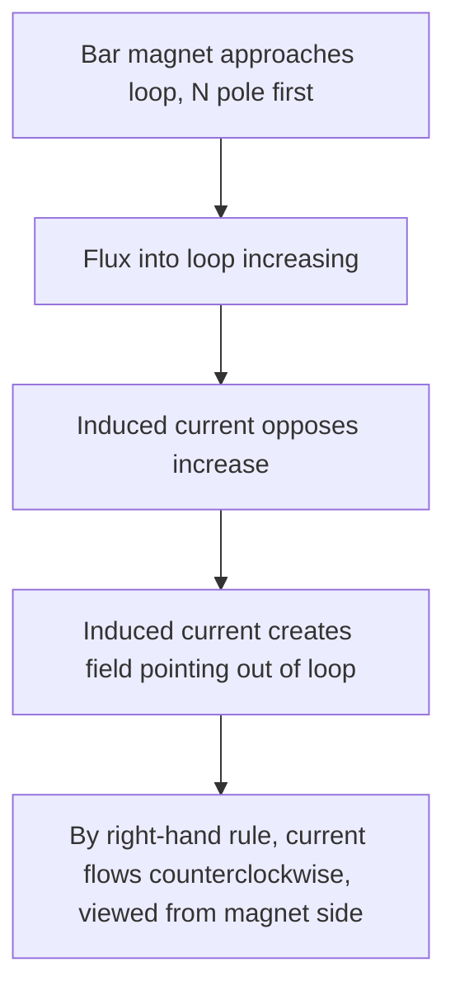
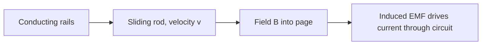

## Faraday's Law of Induction

### Statement of the Law

Faraday's Law states that a changing magnetic flux through a circuit induces an electromotive force (EMF) in that circuit.

$$\mathcal{E} = -\frac{d\Phi_B}{dt}$$

Where $\mathcal{E}$ is the induced EMF (volts), and $\Phi_B$ is the magnetic flux (webers, Wb) through the circuit.

**Key Points**

- The induced EMF drives a current if the circuit is closed, but the EMF exists regardless of whether the circuit is closed, since it arises from the changing flux itself
- The negative sign encodes Lenz's Law: the induced EMF opposes the change in flux that produced it
- For a coil of $N$ turns, the induced EMF multiplies proportionally: $\mathcal{E} = -N\dfrac{d\Phi_B}{dt}$

### Magnetic Flux

$$\Phi_B = \int \vec{B}\cdot d\vec{A}$$

For a uniform field and flat surface: $\Phi_B = BA\cos\theta$, where $\theta$ is the angle between $\vec{B}$ and the surface normal.

**Key Points**

- Flux is a scalar quantity measured in webers ($1\,\text{Wb} = 1\,\text{T}\cdot\text{m}^2$)
- Flux can change due to a change in field magnitude $B$, a change in area $A$, or a change in the relative orientation angle $\theta$ — any of these changes induces an EMF
- Flux is maximized when the field is perpendicular to the surface ($\theta = 0°$) and zero when the field lies entirely in the plane of the surface ($\theta = 90°$)

### Three Ways to Change Flux

**Key Points**

- **Changing field magnitude**: e.g., a stationary loop near a solenoid whose current (and thus field) is increasing or decreasing over time
- **Changing area**: e.g., a conducting rod sliding along rails in a uniform field, changing the enclosed circuit area
- **Changing orientation**: e.g., a rotating loop in a uniform field, as in an AC generator, where $\theta$ varies continuously with time

### Lenz's Law

Lenz's Law provides the physical reasoning behind the negative sign in Faraday's Law: the induced current flows in the direction that opposes the change in flux that created it.

**Key Points**

- If flux through a loop is increasing, the induced current creates its own magnetic field opposing the increase (via the right-hand rule applied to the induced current's direction)
- If flux is decreasing, the induced current flows in the direction that attempts to sustain the original flux
- Lenz's Law is fundamentally a statement of energy conservation: if induced current instead reinforced the change in flux, it would create a runaway positive feedback loop generating energy from nothing, violating conservation of energy

### Lenz's Law Direction Diagram

### Worked Example: Changing Field Magnitude

**Example**

A circular loop of radius $0.1\,\text{m}$ lies perpendicular to a magnetic field that increases uniformly from $0.2\,\text{T}$ to $0.8\,\text{T}$ over $0.5\,\text{s}$. Find the induced EMF.

$$A = \pi r^2 = \pi(0.1)^2 \approx 0.0314\,\text{m}^2$$

$$\frac{d\Phi_B}{dt} = A\frac{dB}{dt} = (0.0314)\left(\frac{0.8-0.2}{0.5}\right) = (0.0314)(1.2) \approx 0.0377\,\text{Wb/s}$$

$$\mathcal{E} = -\frac{d\Phi_B}{dt} \approx -0.0377\,\text{V}$$

The magnitude of the induced EMF is approximately $37.7\,\text{mV}$; the negative sign indicates the direction is such as to oppose the increasing flux, per Lenz's Law.

### Motional EMF: Changing Area

When a conducting rod moves through a magnetic field, completing a circuit, the changing enclosed area induces an EMF, equivalently understood as a direct consequence of the magnetic force on charge carriers within the moving rod.

$$\mathcal{E} = BLv$$

Where $L$ is the rod's length (perpendicular to both velocity and field), and $v$ is the rod's speed.

**Key Points**

- This can be derived either via Faraday's Law ($\mathcal{E} = -d\Phi_B/dt = -B\,dA/dt = -BLv$) or via the direct Lorentz force on charge carriers in the moving rod ($F = qvB$, producing an effective electric field $E = vB$ along the rod, and thus $\mathcal{E} = EL = BLv$) — both approaches yield identical results, illustrating the deep consistency between the flux-rule and force-based perspectives
- The direction of induced current follows from applying the right-hand rule to the force on positive charge carriers within the moving rod: $\vec{F} = q\vec{v}\times\vec{B}$
- As the induced current flows through the rod (now in the field), it experiences a retarding force opposing the rod's motion, consistent with Lenz's Law and requiring an external agent to do work to maintain constant velocity

### Worked Example: Motional EMF

**Example**

A rod of length $0.3\,\text{m}$ slides at $v = 4\,\text{m/s}$ along rails in a field $B = 0.5\,\text{T}$, perpendicular to both the rod and its velocity.

$$\mathcal{E} = BLv = (0.5)(0.3)(4) = 0.6\,\text{V}$$

If the circuit's total resistance is $2\,\Omega$, the induced current is:

$$I = \frac{\mathcal{E}}{R} = \frac{0.6}{2} = 0.3\,\text{A}$$

The retarding force on the rod due to this current: $F = BIL = (0.5)(0.3)(0.3) = 0.045\,\text{N}$, opposing the rod's motion.

### Generators: Changing Orientation

A generator produces an alternating EMF by rotating a coil within a magnetic field (or equivalently, rotating the field around a stationary coil).

$$\Phi_B = BA\cos(\omega t), \qquad \mathcal{E} = -N\frac{d\Phi_B}{dt} = NBA\omega\sin(\omega t)$$

Where $\omega$ is the angular velocity of rotation.

**Key Points**

- The induced EMF is sinusoidal, forming the basis of AC power generation; peak EMF is $\mathcal{E}_0 = NBA\omega$
- Maximum EMF occurs when the coil's plane is parallel to $\vec{B}$ (flux changing fastest, rate of change maximal), and zero EMF occurs when the coil's plane is perpendicular to $\vec{B}$ (flux at its extremum, momentarily not changing)
- This same principle, in reverse, forms the basis of motor operation — a deep symmetry exists between generators (mechanical energy to electrical) and motors (electrical energy to mechanical)

### Generator EMF Waveform (svg_diagram)

<svg xmlns="http://www.w3.org/2000/svg" viewBox="0 0 600 300">
<text x="300" y="25" text-anchor="middle" font-size="16" font-weight="bold" fill="#222">Generator Induced EMF (svg_diagram)</text>
<line x1="60" y1="160" x2="560" y2="160" stroke="#333" stroke-width="2" />
<line x1="60" y1="260" x2="60" y2="60" stroke="#333" stroke-width="2" />
<text x="300" y="285" text-anchor="middle" font-size="13" fill="#333">Time (t)</text>
<text x="30" y="160" text-anchor="middle" font-size="13" fill="#333" transform="rotate(-90 30 160)">EMF</text>
<path d="M60,160 Q110,70 160,160 T260,160 T360,160 T460,160 T560,160" fill="none" stroke="#c0392b" stroke-width="3" />
<text x="150" y="55" font-size="12" fill="#c0392b">Coil plane || B: max EMF</text>
<circle cx="110" cy="70" r="3" fill="#333" />
<circle cx="210" cy="250" r="3" fill="#333" />
<text x="180" y="270" font-size="11" fill="#333">Coil plane ⊥ B: zero EMF crossing</text>
</svg>

### Worked Example: AC Generator Calculation

**Example**

A generator coil has $N = 100$ turns, area $A = 0.02\,\text{m}^2$, rotating at $f = 60\,\text{Hz}$ in a field $B = 0.4\,\text{T}$. Find the peak EMF.

$$\omega = 2\pi f = 2\pi(60) \approx 376.99\,\text{rad/s}$$

$$\mathcal{E}_0 = NBA\omega = (100)(0.4)(0.02)(376.99)$$

$$\mathcal{E}_0 \approx 100 \times 0.4 \times 0.02 \times 376.99 \approx 301.6\,\text{V}$$

### Eddy Currents

Faraday's Law applies not only to defined circuits but to any conducting material experiencing changing flux, inducing circulating "eddy currents" within the bulk material.

**Key Points**

- Eddy currents dissipate energy as heat (via resistive $I^2R$ losses within the conductor) and create magnetic fields that oppose the change producing them, per Lenz's Law
- Applications include electromagnetic braking (eddy current brakes use this dissipative opposing force to slow moving conductors without physical contact) and induction heating (rapidly alternating fields induce strong eddy currents for controlled, contactless heating of conductive materials)
- Eddy currents are generally undesirable in transformer and motor cores (representing energy loss), which is why these cores are typically laminated to increase resistance to circulating currents, as noted in the context of magnetic materials

### Self-Inductance (Preview)

**Key Points**

- A changing current in a circuit induces a changing flux through that same circuit, inducing a "back EMF" that opposes the change in current — this self-induced effect is quantified by the inductance $L$: $\mathcal{E} = -L\dfrac{dI}{dt}$
- Self-inductance is a direct consequence of Faraday's Law applied to a circuit's own changing flux, and underlies the behavior of inductors in circuits (RL and RLC circuit transient and AC behavior)
- This topic is developed in full detail separately, as it merits its own dedicated treatment

### Faraday's Law in Integral (Field) Form

$$\oint \vec{E}\cdot d\vec{l} = -\frac{d\Phi_B}{dt}$$

**Key Points**

- This form expresses Faraday's Law directly in terms of the electric field induced by a changing magnetic flux, independent of whether an actual physical circuit is present
- This reveals a profound result: a changing magnetic field creates a genuine electric field with closed field lines (non-conservative, unlike the electric fields produced by static charges), rather than merely driving current in a pre-existing wire
- This field-theoretic form is one of Maxwell's four equations and is essential to the theoretical description of electromagnetic wave propagation, alongside the Ampère-Maxwell Law

### Applications of Faraday's Law

**Key Points**

- **Electric generators and alternators**: convert mechanical rotational energy into electrical energy via changing orientation flux (power plants, wind turbines, bicycle dynamos)
- **Transformers**: use mutual induction (a changing current in a primary coil inducing an EMF in an adjacent secondary coil) to step voltage up or down for power transmission and distribution
- **Induction cooktops**: use rapidly alternating magnetic fields to induce eddy currents directly in ferromagnetic cookware, heating it without an open flame or resistive heating element
- **Wireless charging and inductive power transfer**: use coupled coils and time-varying flux to transfer electrical energy across a gap without direct electrical contact
- **Metal detectors and induction sensors**: detect changes in eddy currents or induced fields caused by nearby conductive objects

### Common Pitfalls

**Key Points**

- Forgetting that EMF depends on the *rate of change* of flux, not the flux itself — a large but constant flux induces no EMF, while a rapidly changing small flux can induce a substantial EMF
- Misapplying Lenz's Law by predicting the direction of induced current based on the *existing* flux direction rather than the direction that would oppose its *change*
- Confusing the motional EMF formula ($\mathcal{E}=BLv$, valid for a specific rod-on-rails geometry with mutually perpendicular $B$, $L$, $v$) with the general flux-rule formula, which must be applied carefully when these vectors are not mutually perpendicular

**Next Steps**

- Lenz's Law and Direction of Induced Current
- Self-Inductance and Inductors
- Mutual Inductance and Transformers
- Eddy Currents and Applications
- Maxwell's Equations
- Electromagnetic Wave Propagation