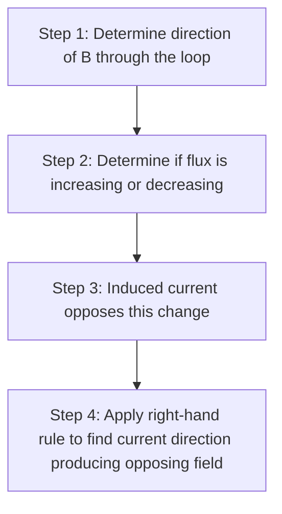
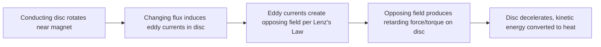

## Lenz's Law

### Statement of the Law

Lenz's Law states that the direction of an induced current is always such as to oppose the change in magnetic flux that produced it.

**Key Points**

- Formulated by Heinrich Lenz in 1834, this law provides the physical direction-determining content behind the negative sign in Faraday's Law: $\mathcal{E} = -N\dfrac{d\Phi_B}{dt}$
- Lenz's Law is not an independent physical law but a direct consequence of the conservation of energy applied to electromagnetic induction
- It applies universally to all induction phenomena: changing field magnitude, changing area, or changing orientation

### The Energy Conservation Argument

**Key Points**

- If induced current instead flowed in the direction that *reinforced* the change in flux, that reinforcement would further increase the induced current, which would further increase the flux change, in an unstable runaway feedback loop
- Such a scenario would generate electrical energy from nothing, violating the first law of thermodynamics — the induced current must instead do work against the change, converting some other form of energy (mechanical, in most practical cases) into electrical energy
- This connects induction directly to real-world energy transfer: mechanical work done against the opposing induced force is the source of the electrical energy delivered by a generator

### A Systematic Method for Determining Induced Current Direction

**Key Points**

- Step 1 requires identifying the reference direction of the external field relative to the loop's surface
- Step 2 requires assessing whether the magnitude of flux in that direction is growing or shrinking (not merely whether the field itself is growing, since orientation and area changes matter too)
- Step 4 uses the right-hand rule in reverse: since the desired induced field direction is known (opposing the change), curling the fingers to match that field direction shows the current direction needed to produce it

### Worked Example: Approaching Bar Magnet

**Example**

A bar magnet's north pole approaches a stationary conducting loop, field lines pointing into the loop and increasing in strength as the magnet gets closer.

Step 1: Field direction through the loop is "into the page" (away from the observer, toward the loop from the magnet's north pole).

Step 2: Flux into the page is increasing as the magnet approaches.

Step 3: Induced current must oppose this increase, meaning it must create a field pointing *out of* the page, inside the loop.

Step 4: By the right-hand rule, a counterclockwise current (viewed from the magnet's side) produces a field pointing out of the page.

**Result**: The induced current flows counterclockwise, viewed from the approaching magnet's perspective, creating a magnetic field that repels the approaching north pole — consistent with the intuitive notion that the loop "resists" the magnet's approach.

### Worked Example: Receding Bar Magnet

**Example**

The same bar magnet, now moving away from the loop, with its north pole still facing the loop.

Step 1: Field direction through the loop remains "into the page."

Step 2: Flux into the page is now decreasing as the magnet recedes.

Step 3: Induced current must oppose this decrease, meaning it must create a field also pointing *into* the page (to help sustain the flux), inside the loop.

Step 4: By the right-hand rule, a clockwise current (viewed from the magnet's side) produces a field pointing into the page.

**Result**: The induced current flows clockwise, creating a field that attracts the receding north pole, again resisting the change — this time resisting the magnet's departure rather than its approach.

### Force Opposition and Mechanical Consequences

**Key Points**

- Because the induced current creates a field opposing the change, it also produces a mechanical force opposing the relative motion causing that change — Lenz's Law can be equivalently stated in terms of opposing relative motion, not just opposing flux change directly
- This opposing force means that moving a conductor relative to a magnetic field (or vice versa) to induce a current always requires an external agent to do positive work against this retarding force
- The work done against this opposing force is precisely what is converted into the electrical energy delivered to the circuit — quantitatively consistent with the motional EMF and induced-force calculations covered under Faraday's Law and force on current-carrying conductors

### Eddy Current Braking

Lenz's Law manifests dramatically in eddy current braking, where a conductor moving through (or near) a magnetic field experiences a retarding force due to induced eddy currents.

**Key Points**

- Unlike friction brakes, eddy current brakes involve no physical contact between the braking mechanism and the moving conductor, reducing mechanical wear
- The braking force is velocity-dependent (generally increasing with speed), meaning eddy current brakes are typically most effective at higher speeds and less effective as the object slows — [Inference: exact force-velocity relationships depend on the specific geometry and conductivity of the braking system]
- Applications include braking systems in some trains and roller coasters, and damping mechanisms in sensitive measuring instruments (e.g., older analog galvanometers and balances) to prevent oscillation

### Demonstration: Magnet Falling Through a Conducting Tube

A classic demonstration of Lenz's Law involves dropping a magnet through a vertical conducting (non-magnetic) tube, such as copper or aluminum.

**Key Points**

- As the magnet falls, its changing flux induces eddy currents in the tube walls both ahead of and behind the magnet's position
- By Lenz's Law, the induced currents ahead of the magnet oppose its approach (repelling it, slowing its descent), while those behind oppose its departure (attracting it, also slowing its descent) — both effects act to decelerate the magnet
- The magnet falls noticeably slower through a conducting tube than through an insulating tube of the same dimensions, providing a striking visual and tactile demonstration of induced eddy current opposition — [Inference: the specific terminal velocity reached depends on the tube's conductivity, wall thickness, and the magnet's strength and dimensions]

### Lenz's Law and Superconductors

**Key Points**

- In a superconductor (zero resistance), any induced current persists indefinitely rather than decaying, since there is no resistive dissipation
- This means a superconductor placed near a changing or approaching magnetic field will generate persistent opposing currents strong enough to completely exclude the field from its interior — the Meissner effect
- This perfect diamagnetic response can be understood as an extreme, lossless limit of Lenz's Law opposition, where the induced currents perfectly and permanently cancel the internal field change

### Lenz's Law in AC Circuits and Transformers

**Key Points**

- In a transformer, the changing current in the primary coil induces a changing flux, which in turn induces an opposing EMF (back-EMF) in the primary coil itself, in accordance with Lenz's Law applied to self-inductance
- This back-EMF limits the rate at which current can change in an inductive circuit, a principle central to understanding inductor behavior in RL and RLC circuits
- In the secondary coil of a transformer, the induced current (when the secondary circuit is closed) creates its own flux opposing the change in the primary's flux, which is the mechanism by which "reflected" load effects propagate back to affect the primary current

### Common Pitfalls

**Key Points**

- Confusing "opposing the flux" with "opposing the field" — the induced current opposes the *change* in flux, meaning it can create a field in the *same* direction as the external field if that flux is decreasing (as in the receding magnet example)
- Applying the right-hand rule incorrectly by determining the induced current direction directly from the external field's direction, rather than from the required *opposing* field direction
- Forgetting that Lenz's Law describes direction only; the magnitude of induced EMF and current still requires Faraday's Law (and Ohm's Law for current) for quantitative calculation

**Related Topics**

- Faraday's Law of Induction
- Self-Inductance and Inductors
- Eddy Currents and Applications
- Motional EMF and Generators
- Superconductivity
- Transformers and Mutual Inductance