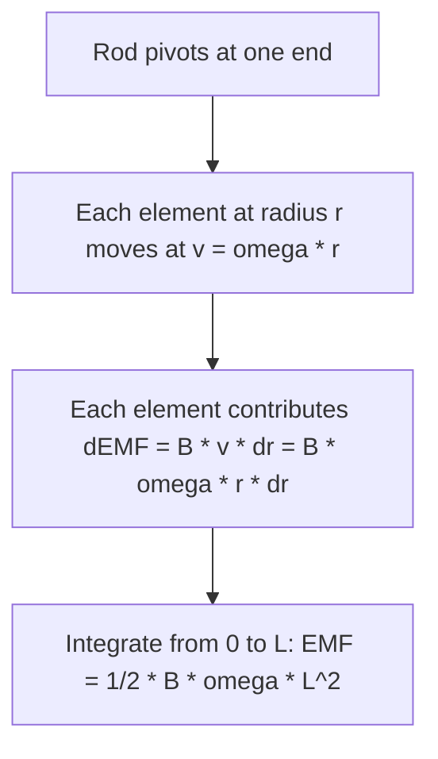

## Motional EMF

### Recap: Basic Motional EMF

For a straight conductor of length $L$ moving at velocity $v$ perpendicular to a uniform field $B$, with $v$, $L$, and $B$ mutually perpendicular:

$$\mathcal{E} = BLv$$

**Key Points**

- This result is equivalent whether derived from Faraday's flux rule or directly from the Lorentz force on charge carriers within the moving conductor — see Faraday's Law of Induction for both derivations
- This section extends the concept to more general geometries and situations where the simple mutually-perpendicular formula does not directly apply
- Motional EMF is a special case of electromagnetic induction, distinguished by having a genuinely moving conductor, rather than a stationary conductor in a time-varying field

### General Vector Formula

For a conductor of arbitrary orientation moving with velocity $\vec{v}$ through a field $\vec{B}$, the motional EMF between two points along the conductor is:

$$\mathcal{E} = \int (\vec{v}\times\vec{B})\cdot d\vec{l}$$

**Key Points**

- This integral form reduces to the simple $\mathcal{E} = BLv$ result when $\vec{v}$, $\vec{B}$, and the conductor's length direction $d\vec{l}$ are all mutually perpendicular
- $(\vec{v}\times\vec{B})$ plays the role of an effective electric field acting on charge carriers within the moving conductor, sometimes called the "motional electric field"
- This general formula applies to any moving conductor shape, not just straight rods — it can be integrated along curved paths, rotating rods, or arbitrarily oriented segments

### Motional EMF for a Non-Perpendicular Orientation

**Key Points**

- If the rod's length makes an angle $\phi$ with the direction of $\vec{v}\times\vec{B}$, the effective EMF becomes $\mathcal{E} = (vB\sin\alpha)L\cos\phi$, where $\alpha$ is the angle between $\vec{v}$ and $\vec{B}$ themselves
- If $\vec{v}$ and $\vec{B}$ are parallel (or antiparallel), $\vec{v}\times\vec{B} = 0$ regardless of the rod's orientation, and no motional EMF is produced, since there is no effective force on the charge carriers
- Maximum EMF for a given speed and field strength occurs when $\vec{v} \perp \vec{B}$ and the rod is aligned along the direction of $\vec{v}\times\vec{B}$, recovering the simple $BLv$ case

### Worked Example: Angled Rod

**Example**

A rod of length $0.4\,\text{m}$ moves at $v = 3\,\text{m/s}$ perpendicular to a field $B = 0.6\,\text{T}$, but the rod itself is oriented at $\phi = 40°$ relative to the direction of $\vec{v}\times\vec{B}$ (rather than aligned with it).

$$\mathcal{E} = BvL\cos\phi = (0.6)(3)(0.4)\cos(40°)$$

$$\mathcal{E} \approx 0.72 \times 0.766 \approx 0.551\,\text{V}$$

This is less than the maximum possible EMF ($BvL = 0.72\,\text{V}$ if fully aligned), illustrating how misalignment between the rod and the effective force direction reduces the induced EMF.

### Rotating Rod in a Magnetic Field

Consider a rod of length $L$ rotating with angular velocity $\omega$ about one end, in a uniform field $B$ perpendicular to the plane of rotation.

Integrating the contribution of each infinitesimal element along the rod's length:

$$\mathcal{E} = \int_0^L B\omega r\, dr = \frac{1}{2}B\omega L^2$$

**Key Points**

- Unlike a rod in pure translation, different points along a rotating rod move at different speeds ($v = \omega r$), so the EMF contribution must be integrated along the rod's length rather than computed as a single $BLv$ term
- This rotating-rod configuration is directly relevant to historical experiments (e.g., the Faraday disc, an early homopolar generator) and to understanding EMF generation in rotating machinery more generally
- The quadratic dependence on $L$ (rather than linear, as in the simple translating case) reflects the fact that both the "length element" and the "speed of that element" increase with distance from the pivot

### Worked Example: Rotating Rod EMF

**Example**

A rod of length $0.25\,\text{m}$ rotates at $\omega = 20\,\text{rad/s}$ about one end, in a field $B = 0.5\,\text{T}$ perpendicular to the plane of rotation.

$$\mathcal{E} = \frac{1}{2}B\omega L^2 = \frac{1}{2}(0.5)(20)(0.25)^2$$

$$\mathcal{E} = \frac{1}{2}(0.5)(20)(0.0625) \approx 0.3125\,\text{V}$$

### The Faraday Disc (Homopolar Generator)

**Key Points**

- A conducting disc rotating in a uniform axial magnetic field develops a radial EMF between its center and rim, following the same rotating-rod integration principle applied around the full disc
- Unlike conventional AC generators, the Faraday disc produces a steady (DC) EMF, since the geometry does not change with rotational position (radial symmetry means no time-varying flux orientation effect)
- Practical homopolar generators face significant challenges related to collecting current from a rotating disc at low voltage and very high current, limiting them mostly to specialized applications (e.g., railgun power supplies, some high-current industrial processes) — [Unverified: the scope of current practical and research applications may have evolved, and specific operational details are best confirmed against current technical literature]

### Energy and Power Balance in Motional EMF

**Key Points**

- The mechanical power required to move a conductor against the induced retarding force exactly equals the electrical power delivered to the circuit, in the idealized case of no additional mechanical losses: $P_{mech} = Fv = (BIL)v = \mathcal{E}I = P_{elec}$
- This equality is a direct and quantitative manifestation of energy conservation underlying Lenz's Law: the work done by whatever agent maintains the conductor's motion is fully converted into electrical energy delivered to the circuit (assuming no other losses)
- In practice, additional mechanical losses (friction, air resistance) mean that real generators require more mechanical input power than the electrical output alone would suggest, with efficiency capturing the ratio of useful electrical output to total mechanical input — [Inference: typical efficiency figures vary substantially by generator design, scale, and operating conditions]

### Worked Example: Power Balance Verification

**Example**

Returning to a sliding rod example: $\mathcal{E} = 0.6\,\text{V}$, $R = 2\,\Omega$, giving $I = 0.3\,\text{A}$, and retarding force $F = 0.045\,\text{N}$ at velocity $v = 4\,\text{m/s}$.

Mechanical power input required to maintain constant velocity:

$$P_{mech} = Fv = (0.045)(4) = 0.18\,\text{W}$$

Electrical power delivered to the circuit:

$$P_{elec} = \mathcal{E}I = (0.6)(0.3) = 0.18\,\text{W}$$

The two values match exactly, confirming energy conservation in this idealized (lossless) scenario.

### Motional EMF from Earth's Magnetic Field

**Key Points**

- A conductor moving through Earth's magnetic field (e.g., an aircraft wing, a moving vehicle, or a length of wire) experiences a motional EMF, though typically very small due to Earth's weak field (tens of microtesla)
- Historically, this effect was investigated as a potential (though ultimately impractical at meaningful scale) method for generating usable power from vehicle motion, and remains relevant in specialized contexts such as oceanographic current measurement using motional EMF induced by seawater flow through Earth's field — [Inference: specific measurement techniques and their precision depend on the particular application and instrumentation used]
- The extremely small magnitude of Earth's field means motional EMF from typical everyday-scale motion is far too small for practical power generation, though it can be a relevant and measurable effect in sensitive scientific instrumentation

### Common Pitfalls

**Key Points**

- Applying the simple $\mathcal{E} = BLv$ formula to rotating conductors, where different points move at different speeds, without integrating properly along the conductor's length
- Assuming motional EMF exists whenever a conductor moves in a field, without checking whether $\vec{v}$ and $\vec{B}$ are actually non-parallel — if they are parallel, no motional EMF is produced regardless of speed
- Neglecting that the general vector formula $\mathcal{E} = \int(\vec{v}\times\vec{B})\cdot d\vec{l}$ is the correct starting point for any non-standard geometry, rather than attempting to force-fit the simplified perpendicular-case formula

**Related Topics**

- Faraday's Law of Induction
- Lenz's Law
- Generators and Alternators
- Force on Current-Carrying Conductors
- Self-Inductance and Inductors
- The Hall Effect