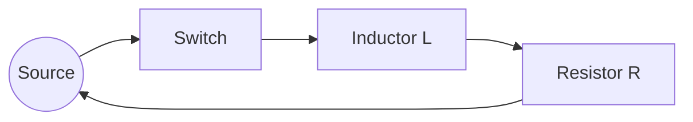

## Self-Inductance and Inductors

### Definition of Self-Inductance

Self-inductance quantifies a circuit's tendency to oppose changes in its own current, due to the changing magnetic flux that current produces through itself.

$$L = \frac{N\Phi_B}{I}$$

Where $L$ is inductance (henries, H), $N$ is the number of turns, $\Phi_B$ is flux through one turn, and $I$ is the current producing that flux.

**Key Points**

- One henry equals one weber-turn per ampere: $1\,\text{H} = 1\,\dfrac{\text{Wb}}{\text{A}} = 1\,\dfrac{\text{V}\cdot\text{s}}{\text{A}}$
- Inductance is a purely geometric property of a coil or circuit, depending on its shape, size, number of turns, and the permeability of any core material — it does not depend on the current or voltage present, analogous to how capacitance and resistance are geometric properties
- Self-inductance exists in any current-carrying conductor, including straight wires, though it is generally much more significant for coiled geometries

### Induced EMF Due to Self-Inductance

Combining the inductance definition with Faraday's Law:

$$\mathcal{E} = -L\frac{dI}{dt}$$

**Key Points**

- This is often called the "back-EMF," since it opposes the change in current that produces it, consistent with Lenz's Law
- The back-EMF is proportional to the *rate of change* of current, not the current itself — a steady DC current, however large, produces no self-induced EMF
- This relationship is the inductor's defining circuit equation, analogous to $V=IR$ for resistors and $I=C\,dV/dt$ for capacitors

### Inductance of a Solenoid

For an ideal long solenoid with $N$ turns, length $\ell$, and cross-sectional area $A$:

$$L = \frac{\mu_0 N^2 A}{\ell}$$

**Key Points**

- This is derived by combining the solenoid's field formula ($B = \mu_0 nI$, where $n=N/\ell$) with the flux and inductance definitions: $\Phi_B = BA$, $L = N\Phi_B/I$
- Inductance scales with the *square* of the number of turns, since each turn both contributes to the field and captures flux from all other turns
- Inserting a ferromagnetic core multiplies the inductance by the core's relative permeability $\mu_r$: $L = \mu_r\mu_0 N^2 A/\ell$, providing a practical method for achieving high inductance in a compact device

### Worked Example: Solenoid Inductance Calculation

**Example**

A solenoid has $N = 800$ turns, length $\ell = 0.3\,\text{m}$, and cross-sectional area $A = 0.001\,\text{m}^2$ (air core).

$$L = \frac{\mu_0 N^2 A}{\ell} = \frac{(4\pi\times10^{-7})(800)^2(0.001)}{0.3}$$

$$L = \frac{(1.2566\times10^{-6})(640000)(0.001)}{0.3} = \frac{0.8042}{0.3} \approx 2.68\times10^{-3}\,\text{H} \approx 2.68\,\text{mH}$$

### Circuit Symbol and Basic Behavior

**Key Points**

- An inductor opposes sudden changes in current, behaving momentarily like an open circuit when current is first applied (since $dI/dt$ is large, producing large opposing back-EMF), and like a short circuit (zero voltage drop) once current reaches a steady DC value ($dI/dt = 0$)
- This is the electrical dual of a capacitor: a capacitor opposes sudden changes in *voltage*, while an inductor opposes sudden changes in *current*
- Current through an inductor cannot change instantaneously without requiring infinite voltage, mirroring the constraint that a capacitor's voltage cannot change instantaneously without requiring infinite current

### RL Circuit: Current Growth

For a series RL circuit with a switch closed at $t=0$, connecting a source $V_s$:

$$V_s = IR + L\frac{dI}{dt}$$

Solving this first-order differential equation with initial condition $I(0)=0$:

$$I(t) = \frac{V_s}{R}\left(1-e^{-t/\tau}\right), \qquad \tau = \frac{L}{R}$$

**Key Points**

- $\tau = L/R$ is the inductive time constant, playing the same mathematical role as $\tau=RC$ in RC circuits, but governing current growth/decay rather than voltage
- Current rises exponentially toward its final steady-state value $V_s/R$ (at which point the inductor behaves as a short circuit, dropping no voltage)
- Voltage across the inductor decays exponentially from its initial maximum $V_s$ toward zero: $V_L(t) = V_s e^{-t/\tau}$, mirroring the resistor voltage's growth toward $V_s$

### RL Circuit: Current Decay

When the source is removed and the circuit shorted through $R$ (with the inductor initially carrying current $I_0$):

$$I(t) = I_0 e^{-t/\tau}$$

**Key Points**

- The inductor acts as a source during decay, driving current through $R$ using its stored magnetic energy, in a manner directly analogous to a capacitor discharging through a resistor
- Current decays exponentially from $I_0$ toward zero, with the same time constant $\tau = L/R$
- A sudden attempt to fully interrupt current through an inductor (e.g., opening a switch abruptly) can produce a very large induced voltage spike, since $dI/dt$ becomes extremely large over a very short interruption time — a practical hazard requiring protective circuit design (e.g., flyback diodes in relay and solenoid driver circuits)

### RL Current Growth Curve (svg_diagram)

<svg xmlns="http://www.w3.org/2000/svg" viewBox="0 0 600 320">
<text x="300" y="25" text-anchor="middle" font-size="16" font-weight="bold" fill="#222">RL Current Growth (svg_diagram)</text>
<line x1="80" y1="270" x2="560" y2="270" stroke="#333" stroke-width="2" />
<line x1="80" y1="270" x2="80" y2="40" stroke="#333" stroke-width="2" />
<text x="320" y="300" text-anchor="middle" font-size="13" fill="#333">Time (t)</text>
<text x="35" y="155" text-anchor="middle" font-size="13" fill="#333" transform="rotate(-90 35 155)">I(t)</text>
<line x1="80" y1="70" x2="560" y2="70" stroke="#999" stroke-dasharray="4,4" />
<text x="565" y="75" font-size="11" fill="#999">Vs/R</text>
<path d="M80,270 C150,120 250,80 560,72" fill="none" stroke="#c0392b" stroke-width="3" />
<line x1="180" y1="270" x2="180" y2="180" stroke="#2980b9" stroke-dasharray="3,3" />
<text x="185" y="195" font-size="11" fill="#2980b9">τ = L/R (63.2%)</text>
</svg>

### Worked Example: RL Time Constant Calculation

**Example**

An RL circuit has $L = 0.5\,\text{H}$ and $R = 25\,\Omega$, connected to a $10\,\text{V}$ source. Find the time constant and the current at $t = 0.03\,\text{s}$.

$$\tau = \frac{L}{R} = \frac{0.5}{25} = 0.02\,\text{s}$$

$$I(0.03) = \frac{10}{25}\left(1-e^{-0.03/0.02}\right) = 0.4\left(1-e^{-1.5}\right)$$

$$e^{-1.5} \approx 0.2231$$

$$I(0.03) \approx 0.4(1-0.2231) \approx 0.4 \times 0.7769 \approx 0.311\,\text{A}$$

### Energy Stored in an Inductor

$$U_L = \frac{1}{2}LI^2$$

**Key Points**

- This energy is stored in the magnetic field surrounding the inductor's coils, analogous to how a capacitor stores energy in its electric field ($U_C = \frac{1}{2}CV^2$)
- This energy is released back into the circuit when current decreases, consistent with the RL decay behavior described above, where the inductor acts as a temporary energy source
- Magnetic energy density in a region of field $B$ (in vacuum) is $u = \dfrac{B^2}{2\mu_0}$, allowing calculation of stored energy by integrating over the field's spatial extent, an approach particularly useful for non-simple geometries

### Worked Example: Energy Storage Calculation

**Example**

An inductor of $L = 0.2\,\text{H}$ carries a steady current of $I = 3\,\text{A}$.

$$U_L = \frac{1}{2}LI^2 = \frac{1}{2}(0.2)(3)^2 = \frac{1}{2}(0.2)(9) = 0.9\,\text{J}$$

### Inductors in Series and Parallel

**Key Points**

- For inductors with no mutual coupling (negligible shared flux), series and parallel combination formulas mirror those for resistors: $L_{series} = L_1+L_2+\cdots$, and $\dfrac{1}{L_{parallel}} = \dfrac{1}{L_1}+\dfrac{1}{L_2}+\cdots$
- When mutual inductance $M$ exists between coupled inductors (e.g., coils wound on a shared core), the combination formulas must include additional terms accounting for the mutual flux linkage, and the sign of the mutual term depends on the relative winding orientation (aiding or opposing configurations)
- Practical inductor networks in circuit boards or transformer-adjacent components often require careful attention to potential unwanted mutual coupling between physically close inductors

### Inductive Reactance in AC Circuits

$$X_L = \omega L = 2\pi f L$$

**Key Points**

- Inductive reactance increases linearly with frequency, meaning inductors increasingly oppose current flow at higher frequencies, in contrast to capacitive reactance's inverse relationship
- At DC ($f=0$), $X_L=0$, consistent with an inductor behaving as a short circuit under steady current
- In an AC circuit with only an inductor, voltage leads current by exactly $90°$, a direct consequence of the $\mathcal{E}=-L\,dI/dt$ relationship applied to sinusoidal current

### Practical Inductor Considerations

**Key Points**

- Real inductors possess parasitic resistance (from the wire itself) and parasitic capacitance (between adjacent windings), causing deviation from ideal inductor behavior, particularly at high frequencies where these parasitic effects become significant — [Inference: the specific frequency at which parasitic effects dominate depends on the inductor's construction and intended operating range]
- Core material selection significantly affects performance: air cores avoid saturation and core losses but achieve lower inductance for a given size; ferromagnetic cores achieve much higher inductance but introduce core losses (hysteresis and eddy currents) and can saturate at high current, reducing effective inductance
- Inductor saturation occurs when the core material's magnetization approaches its maximum value, causing inductance to drop sharply and potentially leading to excessive current in circuits not designed to accommodate this nonlinear behavior

### Applications of Inductors

**Key Points**

- **Filtering**: inductors block high-frequency signals while passing DC or low-frequency signals, used in power supply filtering and noise suppression (choke inductors)
- **Energy storage in switching converters**: buck, boost, and other switch-mode power supply topologies rely on inductors to store and transfer energy each switching cycle
- **Transformers**: mutually coupled inductors form the basis of transformer operation, covered separately as mutual inductance
- **RF and tuning circuits**: inductors combined with capacitors form resonant LC and RLC circuits used in radio tuning, oscillators, and filters
- **Flyback protection**: diodes placed across inductive loads (relay coils, motor windings) provide a path for current to safely decay when a switch opens, protecting against damaging induced voltage spikes

### Common Pitfalls

**Key Points**

- Assuming an inductor "resists current" the way a resistor does — an inductor opposes only *changes* in current, not steady current itself, and drops zero voltage under constant DC current in the ideal case
- Forgetting the quadratic dependence of both stored energy ($\frac{1}{2}LI^2$) and inductance itself on turns count ($N^2$ in the solenoid formula), leading to underestimation of how quickly these quantities scale with coil design changes
- Neglecting the dangers of abruptly interrupting inductive current, which can produce damaging voltage spikes in real circuits absent proper protective design (flyback diodes or snubber circuits)

**Next Steps**

- Mutual Inductance and Transformers
- RL Circuits (Extended Analysis)
- RLC Circuits and Resonance
- Energy in Magnetic Fields
- Faraday's Law of Induction
- Switch-Mode Power Supply Topologies