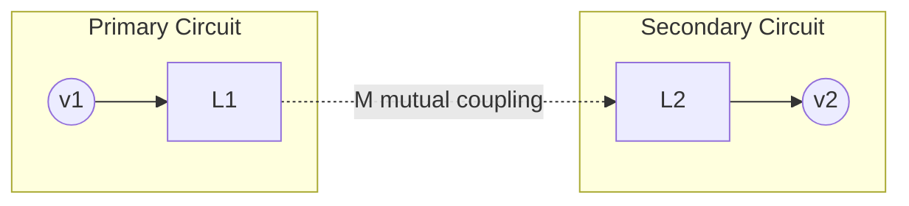

## Mutual Inductance

### Definition

Mutual inductance is the property by which a changing current in one coil (the primary) induces an electromotive force (EMF) in a nearby coil (the secondary), due to the shared magnetic flux linking both circuits. It quantifies the coupling between two circuits through their common magnetic field.

The mutual inductance $M$ between two circuits is defined as the ratio of the flux linkage in one circuit produced by the current in the other:

$$M_{21} = \frac{N_2 \Phi_{21}}{I_1}$$

where $N_2\Phi_{21}$ is the total flux linkage through coil 2 due to current $I_1$ in coil 1. The SI unit of mutual inductance is the henry (H), where 1 H = 1 Wb/A = 1 V·s/A.

A key theorem, provable from Maxwell's equations (Neumann's formula), states that the mutual inductance is symmetric:

$$M_{12} = M_{21} = M$$

This means the flux linked in coil 2 per unit current in coil 1 equals the flux linked in coil 1 per unit current in coil 2, regardless of coil geometry, size, or turns ratio — a non-obvious but exact result.

### Faraday's Law and Induced EMF

When current $I_1$ in the primary coil changes with time, the induced EMF in the secondary coil is:

$$\varepsilon_2 = -M \frac{dI_1}{dt}$$

The negative sign follows Lenz's law: the induced EMF opposes the change in flux that produced it. Symmetrically, a changing current in coil 2 induces an EMF in coil 1:

$$\varepsilon_1 = -M \frac{dI_2}{dt}$$

### Neumann's Formula

For two arbitrary closed loops $C_1$ and $C_2$ in free space, the mutual inductance is given by the double line integral:

$$M = \frac{\mu_0}{4\pi} \oint_{C_1} \oint_{C_2} \frac{d\vec{l}_1 \cdot d\vec{l}_2}{|\vec{r}_1 - \vec{r}_2|}$$

This expression is purely geometric — it depends only on the shapes, sizes, relative orientation, and separation of the two loops, not on the current magnitude. It confirms $M_{12} = M_{21}$ by inspection, since the integral is symmetric under exchange of the loop labels.

### Mutual Inductance of Coupled Solenoids

**Example**

Consider a long solenoid of length $l$, cross-sectional area $A$, and $N_1$ turns, with a second coil of $N_2$ turns wound tightly around its middle section (or a smaller coil inside it sharing the same axis).

The magnetic field inside the primary solenoid carrying current $I_1$ is:

$$B_1 = \mu_0 n_1 I_1 = \mu_0 \frac{N_1}{l} I_1$$

Assuming all of this flux links the secondary coil (tight coupling), the flux through one turn of the secondary is $\Phi_{21} = B_1 A$. The total flux linkage is $N_2 \Phi_{21}$, giving:

$$M = \frac{N_2 \Phi_{21}}{I_1} = \frac{\mu_0 N_1 N_2 A}{l}$$

This result highlights that $M$ depends on geometric factors ($N_1$, $N_2$, $A$, $l$) and the medium's permeability, not on the current or its rate of change.

### Coupling Coefficient

In practice, not all magnetic flux from one coil links the other due to leakage flux. The coupling coefficient $k$ (dimensionless, $0 \le k \le 1$) quantifies this:

$$M = k\sqrt{L_1 L_2}$$

where $L_1$ and $L_2$ are the self-inductances of the individual coils.

- $k = 1$: perfect coupling (ideal transformer, all flux shared)
- $k = 0$: no coupling (coils magnetically isolated)
- Typical air-core coils: $k \approx 0.1$–$0.8$ depending on geometry and spacing
- Iron-core transformers: $k$ close to 1 (often 0.95–0.99) due to the high-permeability core confining flux

### Energy Stored in Coupled Circuits

For two coupled inductors carrying currents $I_1$ and $I_2$, the total magnetic energy stored is:

$$U = \frac{1}{2}L_1 I_1^2 + \frac{1}{2}L_2 I_2^2 + M I_1 I_2$$

The sign of the mutual inductance term depends on the relative winding direction and current reference directions (dot convention). For this energy to be physically valid (non-negative for all current combinations), the following constraint must hold:

$$M \le \sqrt{L_1 L_2}$$

This is precisely the condition $k \le 1$ from the coupling coefficient definition, and it's a direct consequence of energy conservation — $M$ cannot exceed the geometric mean of the self-inductances.

### Dot Convention

**Key Points**

- A dot is placed at one terminal of each coil to indicate winding polarity relative to the mutual flux.
- Current entering the dotted terminal of one coil induces an EMF that drives current out of the dotted terminal of the other coil (in an external circuit sense) — i.e., the induced voltage is positive at the dotted terminal.
- This convention avoids needing to know the physical winding direction from a circuit diagram alone.
- When both currents are defined as entering their respective dotted terminals, the mutual term in the energy and voltage equations is positive (+M); if one current is defined as entering the undotted terminal, the mutual term becomes negative (−M).

### Circuit Equations for Coupled Inductors

For two inductors with mutual inductance $M$, both currents referenced into the dotted terminals:

$$v_1 = L_1 \frac{dI_1}{dt} + M \frac{dI_2}{dt}$$

$$v_2 = L_2 \frac{dI_2}{dt} + M \frac{dI_1}{dt}$$

This pair of coupled first-order differential equations governs transformer circuits, coupled resonant circuits, and inductively coupled power transfer systems.

### Equivalent Circuit Diagram

### Series-Connected Coupled Coils

When two coupled coils are connected in series, the total inductance depends on whether the coils are aiding (fluxes add) or opposing (fluxes subtract):

**Series aiding** (dots on the same side, current flows into both dotted terminals):

$$L_{total} = L_1 + L_2 + 2M$$

**Series opposing** (current flows into the dotted terminal of one and out of the dotted terminal of the other):

$$L_{total} = L_1 + L_2 - 2M$$

This principle enables experimental determination of $M$: measure $L_{aiding}$ and $L_{opposing}$ independently, then:

$$M = \frac{L_{aiding} - L_{opposing}}{4}$$

### Application: The Ideal Transformer

Mutual inductance is the fundamental mechanism behind transformer action. For an ideal transformer with negligible leakage flux and coupling coefficient $k \approx 1$, the turns ratio relates primary and secondary voltages:

$$\frac{v_2}{v_1} = \frac{N_2}{N_1}$$

For a real transformer, the mutual inductance directly enters the coupled voltage equations above, and leakage inductance (flux not shared between windings) is modeled as $L_1(1-k)$ and $L_2(1-k)$ in series with an ideal mutually-coupled core.

### Application: Wireless Power Transfer and Inductive Sensing

**Example**

In resonant inductive wireless charging (e.g., Qi-standard phone chargers), a transmitter coil and receiver coil are magnetically coupled with a typically low coupling coefficient ($k \approx 0.2$–$0.5$) due to air gap separation. Efficient power transfer requires tuning both circuits to resonance at the same frequency, since a low $k$ alone would result in poor coupling; resonance compensates by boosting the effective coupled impedance. [Inference] The exact efficiency achieved depends heavily on coil alignment, gap distance, and load matching in a given implementation, so specific efficiency figures are design-dependent rather than a fixed physical constant.

### Mutual Inductance vs. Self-Inductance

| Property | Self-Inductance ($L$) | Mutual Inductance ($M$) |
| --- | --- | --- |
| Involves | Single circuit | Two circuits |
| Defined by | Flux linkage from own current | Flux linkage from the other circuit's current |
| Formula | $L = N\Phi/I$ | $M = N_2\Phi_{21}/I_1$ |
| Sign | Always positive | Can be positive or negative depending on reference/winding convention |
| Constraint | — | $M \le \sqrt{L_1 L_2}$ |

### Measurement Techniques

**Key Points**

- **Series aiding/opposing method**: as derived above, using an LCR meter or bridge circuit.
- **Bridge methods**: Maxwell-Wien or Campbell bridge circuits null-balance mutual inductance against known standard inductors/capacitors.
- **Direct method**: apply a known sinusoidal current $I_1 = I_0\sin(\omega t)$ to the primary, measure open-circuit secondary voltage amplitude $V_2$, then compute $M = V_2/(\omega I_0)$.

### Worked Numerical Example

**Example**

Two coils have self-inductances $L_1 = 4\ \text{mH}$ and $L_2 = 9\ \text{mH}$, with a coupling coefficient $k = 0.6$.

Step 1 — Compute $M$:

$$M = k\sqrt{L_1 L_2} = 0.6\sqrt{(4)(9)}\ \text{mH} = 0.6 \times 6\ \text{mH} = 3.6\ \text{mH}$$

Step 2 — If $I_1(t) = 0.5\sin(1000t)$ A, the induced EMF in coil 2:

$$\varepsilon_2 = -M\frac{dI_1}{dt} = -(3.6\times10^{-3})(0.5)(1000)\cos(1000t) = -1.8\cos(1000t)\ \text{V}$$

Peak induced EMF magnitude is 1.8 V.

### Physical Coupling Illustration (svg_diagram)

<svg xmlns="http://www.w3.org/2000/svg" viewBox="0 0 500 260">
<text x="250" y="24" font-size="16" text-anchor="middle" fill="#222">Mutual Inductance Between Two Coils (svg_diagram)</text>
<ellipse cx="150" cy="140" rx="30" ry="70" fill="none" stroke="#1a5276" stroke-width="4" />
<line x1="120" y1="90" x2="180" y2="90" stroke="#1a5276" stroke-width="3" />
<line x1="120" y1="120" x2="180" y2="120" stroke="#1a5276" stroke-width="3" />
<line x1="120" y1="150" x2="180" y2="150" stroke="#1a5276" stroke-width="3" />
<line x1="120" y1="180" x2="180" y2="180" stroke="#1a5276" stroke-width="3" />
<text x="150" y="230" font-size="14" text-anchor="middle" fill="#1a5276">Primary Coil (I₁, N₁)</text>
<ellipse cx="350" cy="140" rx="30" ry="70" fill="none" stroke="#a04000" stroke-width="4" />
<line x1="320" y1="95" x2="380" y2="95" stroke="#a04000" stroke-width="3" />
<line x1="320" y1="125" x2="380" y2="125" stroke="#a04000" stroke-width="3" />
<line x1="320" y1="155" x2="380" y2="155" stroke="#a04000" stroke-width="3" />
<line x1="320" y1="185" x2="380" y2="185" stroke="#a04000" stroke-width="3" />
<text x="350" y="230" font-size="14" text-anchor="middle" fill="#a04000">Secondary Coil (N₂)</text>
<path d="M 180 100 C 230 60, 270 60, 320 100" fill="none" stroke="#27ae60" stroke-width="2" stroke-dasharray="6,4" marker-end="url(#arrow)" />
<path d="M 180 140 C 230 130, 270 130, 320 140" fill="none" stroke="#27ae60" stroke-width="2" stroke-dasharray="6,4" marker-end="url(#arrow)" />
<path d="M 180 180 C 230 220, 270 220, 320 180" fill="none" stroke="#27ae60" stroke-width="2" stroke-dasharray="6,4" marker-end="url(#arrow)" />
<text x="250" y="50" font-size="13" text-anchor="middle" fill="#27ae60">Shared flux Φ₂₁ (coupling M)</text>
</svg>

### Common Pitfalls

**Key Points**

- Confusing $M$ with $L$: mutual inductance requires two distinct circuits; self-inductance is a single-circuit property.
- Forgetting the dot convention sign when writing loop equations for coupled coils in circuit analysis — this is a frequent source of sign errors in transformer and coupled-coil problems.
- Assuming $k=1$ for loosely wound or air-core coils, which leads to significant overestimation of transferred EMF or power.
- Neglecting that $M$ depends only on geometry (in linear, non-ferromagnetic media) — it does not depend on the currents themselves, only on their time derivatives entering the EMF equation.

**Next Steps**

- Self-Inductance and the Inductor as a Circuit Element
- Transformers: Ideal vs. Real Models, Leakage Inductance
- Faraday's Law of Electromagnetic Induction
- Lenz's Law and Direction of Induced Currents
- Coupled-Circuit Differential Equations and Laplace-Domain Analysis
- Resonant Inductive Coupling and Wireless Power Transfer
- Maxwell-Wien and Campbell Bridge Measurement Circuits
- Eddy Currents and Core Losses in Coupled Magnetic Systems