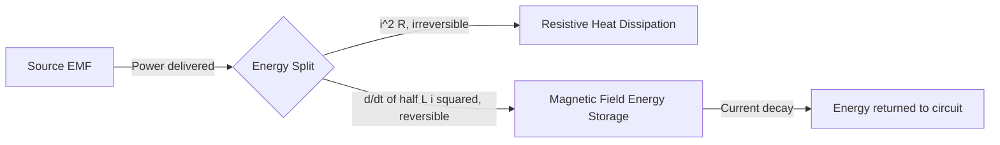

## Energy Stored in Magnetic Fields

### Definition

When an inductor is energized, the source performs work against the back-EMF induced by the growing current. This work is not dissipated but stored as potential energy in the magnetic field established in and around the inductor. This stored magnetic energy can later be recovered — released back into the circuit when the current decreases, as occurs in RL circuits, transformers, and switching power converters.

### Derivation from Circuit Work

Consider an inductor $L$ carrying current $i(t)$ that increases from 0 to $I$. The instantaneous power delivered to the inductor by the source is:

$$P(t) = v(t)\,i(t) = L\frac{di}{dt}\,i(t)$$

The total energy delivered (and stored) as the current rises from 0 to $I$ is obtained by integrating power over time:

$$U = \int_0^T P(t)\,dt = \int_0^T L\frac{di}{dt}\,i\,dt = L\int_0^I i\,di$$

$$\boxed{U = \frac{1}{2}LI^2}$$

This is the fundamental expression for energy stored in an inductor carrying current $I$, analogous to $U = \frac{1}{2}CV^2$ for a capacitor's electric field energy.

**Key Points**

- Energy stored depends only on the final current $I$, not on the path or rate at which the current was established — consistent with $U$ being a state function (a form of potential energy).
- Units: with $L$ in henries and $I$ in amperes, $U$ is in joules.
- Because $U \propto I^2$, doubling the current quadruples the stored energy.

### Energy Density of the Magnetic Field

The energy stored in an inductor can be re-expressed in terms of the magnetic field itself, revealing that magnetic energy resides in the field occupying space, not merely "in the wire." For a long solenoid of length $l$, cross-sectional area $A$, and $n$ turns per unit length, the self-inductance is:

$$L = \mu_0 n^2 A l$$

and the interior magnetic field is $B = \mu_0 n I$, so $I = B/(\mu_0 n)$. Substituting into $U = \frac{1}{2}LI^2$:

$$U = \frac{1}{2}(\mu_0 n^2 A l)\left(\frac{B}{\mu_0 n}\right)^2 = \frac{B^2}{2\mu_0}(Al)$$

Since $Al$ is the volume of the solenoid's interior (where the field is essentially uniform and confined), the energy per unit volume — the **magnetic energy density** — is:

$$u_B = \frac{U}{Al} = \frac{B^2}{2\mu_0}$$

**Key Points**

- Although derived for a solenoid, $u_B = B^2/(2\mu_0)$ is a general result valid for any magnetic field configuration in vacuum or non-magnetic linear media (a consequence of Maxwell's equations and Poynting's theorem, not specific to solenoid geometry).
- In a linear magnetic material with permeability $\mu = \mu_r\mu_0$, the density generalizes to $u_B = B^2/(2\mu)$, or equivalently $u_B = \frac{1}{2}\vec{B}\cdot\vec{H}$.
- This mirrors the electric field energy density $u_E = \frac{1}{2}\epsilon_0 E^2$, reinforcing the symmetric treatment of electric and magnetic fields as energy-storing entities in electromagnetic theory.

### Total Field Energy via Volume Integration

For a magnetic field that varies over space, the total stored energy is found by integrating the energy density over all space where the field exists:

$$U = \int u_B \, dV = \int \frac{B^2}{2\mu_0}\,dV$$

This formulation is essential when the field is non-uniform, such as around a finite solenoid, a toroid with fringing fields, or two mutually coupled coils — situations where the simple $\frac{1}{2}LI^2$ formula still gives the total energy correctly, but does not directly reveal its spatial distribution.

### Energy in Coupled Circuits (Mutual Inductance)

For two magnetically coupled inductors with self-inductances $L_1$, $L_2$, currents $I_1$, $I_2$, and mutual inductance $M$, the total stored energy is:

$$U = \frac{1}{2}L_1I_1^2 + \frac{1}{2}L_2I_2^2 + MI_1I_2$$

The sign of the mutual term depends on the relative current directions and winding polarities (dot convention). Requiring $U \ge 0$ for all possible current combinations places the physical constraint:

$$M \le \sqrt{L_1L_2}$$

### Worked Example: Solenoid Energy Calculation

**Example**

An air-core solenoid has $n = 2000$ turns/m, cross-sectional area $A = 5\times10^{-4}\ \text{m}^2$, length $l = 0.3\ \text{m}$, and carries a steady current $I = 4\ \text{A}$.

Step 1 — Compute inductance:

$$L = \mu_0 n^2 A l = (4\pi\times10^{-7})(2000)^2(5\times10^{-4})(0.3)$$

$$L = (4\pi\times10^{-7})(4\times10^6)(1.5\times10^{-4}) \approx 7.54\times10^{-4}\ \text{H}$$

Step 2 — Compute stored energy:

$$U = \frac{1}{2}LI^2 = \frac{1}{2}(7.54\times10^{-4})(4)^2 \approx 6.03\times10^{-3}\ \text{J}$$

Step 3 — Verify via field energy density: $B = \mu_0 nI = (4\pi\times10^{-7})(2000)(4) \approx 1.005\times10^{-2}\ \text{T}$

$$u_B = \frac{B^2}{2\mu_0} = \frac{(1.005\times10^{-2})^2}{2(4\pi\times10^{-7})} \approx 40.2\ \text{J/m}^3$$

Volume $= Al = (5\times10^{-4})(0.3) = 1.5\times10^{-4}\ \text{m}^3$, so $U = u_B \times \text{Volume} \approx 40.2 \times 1.5\times10^{-4} \approx 6.03\times10^{-3}\ \text{J}$ — matching Step 2, confirming consistency between the circuit and field approaches.

### Energy Dynamics in RL Circuits

**Example**

In a series RL circuit with a battery of EMF $\varepsilon$, resistance $R$, and inductance $L$, applying Kirchhoff's voltage law and multiplying through by current $i$ gives the energy balance:

$$\varepsilon i = i^2R + Li\frac{di}{dt}$$

This states that the power delivered by the source ($\varepsilon i$) splits into power dissipated as heat in the resistor ($i^2R$, irreversible, per Joule heating) and power stored in the magnetic field ($Li\,di/dt = d/dt\left(\frac{1}{2}Li^2\right)$, reversible). During current decay (switch opened, source removed), the stored energy $\frac{1}{2}LI_0^2$ is entirely dissipated in the resistance as the current decays exponentially, since with no source the energy has nowhere else to go:

$$\int_0^\infty i^2R\,dt = \frac{1}{2}LI_0^2$$

This identity can be verified directly using $i(t) = I_0e^{-Rt/L}$, providing a consistency check between the circuit-based and field-based views of stored energy.

### Comparison: Electric vs. Magnetic Field Energy

| Property | Electric Field (Capacitor) | Magnetic Field (Inductor) |
| --- | --- | --- |
| Stored energy | $U = \frac{1}{2}CV^2$ | $U = \frac{1}{2}LI^2$ |
| Energy density | $u_E = \frac{1}{2}\epsilon_0 E^2$ | $u_B = \frac{B^2}{2\mu_0}$ |
| Field source | Separated charge | Moving charge (current) |
| Circuit element | Capacitor | Inductor |
| Governing law | Gauss's law | Ampère's law / Faraday's law |
| Energy recovery | Discharge through circuit | Current decay through circuit |

### Energy Flow Diagram

### Magnetic Field Energy Distribution (svg_diagram)

<svg xmlns="http://www.w3.org/2000/svg" viewBox="0 0 500 260">
<text x="250" y="24" font-size="16" text-anchor="middle" fill="#222">Energy Density Around a Solenoid (svg_diagram)</text>
<rect x="150" y="60" width="200" height="140" fill="none" stroke="#1a5276" stroke-width="4" />
<line x1="150" y1="75" x2="350" y2="75" stroke="#1a5276" stroke-width="2" />
<line x1="150" y1="100" x2="350" y2="100" stroke="#1a5276" stroke-width="2" />
<line x1="150" y1="125" x2="350" y2="125" stroke="#1a5276" stroke-width="2" />
<line x1="150" y1="150" x2="350" y2="150" stroke="#1a5276" stroke-width="2" />
<line x1="150" y1="175" x2="350" y2="175" stroke="#1a5276" stroke-width="2" />
<rect x="170" y="80" width="160" height="100" fill="#f9e79f" opacity="0.6" />
<text x="250" y="135" font-size="13" text-anchor="middle" fill="#7d6608">u_B = B²/(2μ₀)</text>
<text x="250" y="155" font-size="12" text-anchor="middle" fill="#7d6608">(uniform, high density)</text>
<text x="250" y="225" font-size="13" text-anchor="middle" fill="#1a5276">Interior: strong uniform B, energy concentrated</text>
<text x="90" y="130" font-size="11" text-anchor="middle" fill="#909497">Weak fringing</text>
<text x="90" y="145" font-size="11" text-anchor="middle" fill="#909497">field, low u_B</text>
<text x="410" y="130" font-size="11" text-anchor="middle" fill="#909497">Weak fringing</text>
<text x="410" y="145" font-size="11" text-anchor="middle" fill="#909497">field, low u_B</text>
</svg>

### Applications

**Key Points**

- **Switching power supplies (buck/boost converters)**: inductors store energy during the "on" phase of the switching cycle and release it to the load during the "off" phase, enabling efficient DC-DC voltage conversion.
- **Magnetic energy storage systems (SMES)**: superconducting coils store energy in persistent circulating currents with very low resistive losses, enabling near-lossless long-term storage — used in grid stabilization and pulsed power applications.
- **Relay and solenoid actuators**: the energy $\frac{1}{2}LI^2$ released upon de-energization produces the characteristic voltage spike, which must be managed with flyback diodes or snubber circuits to prevent damage to switching components.
- **Electromagnetic launchers (railguns/coilguns)**: rely on rapid release of stored magnetic energy to accelerate a projectile.

### Common Pitfalls

**Key Points**

- Confusing the reversible magnetic energy storage term ($Li\,di/dt$) with the irreversible resistive dissipation term ($i^2R$) when analyzing RL circuit power balance.
- Forgetting that $U = \frac{1}{2}LI^2$ gives *total* stored energy, not energy density — the two are related only by the volume over which the field is significant.
- Applying the solenoid-derived energy density formula without recognizing it is a general field result, leading to unnecessary re-derivation for other geometries.
- Neglecting that stored magnetic energy causes an inductor to resist sudden current changes — attempting to instantaneously interrupt current in an ideal inductor implies infinite voltage, which is why real circuits with inductive loads need protective switching elements.

**Next Steps**

- Self-Inductance and the Inductor as a Circuit Element
- Mutual Inductance and Coupled Circuits
- RL Circuit Transient Analysis (Charging and Discharging)
- Poynting's Theorem and Electromagnetic Energy Flow
- Maxwell's Equations in Integral and Differential Form
- LC and RLC Oscillatory Circuits
- Superconducting Magnetic Energy Storage (SMES) Systems
- Switching Power Converter Topologies (Buck, Boost, Flyback)